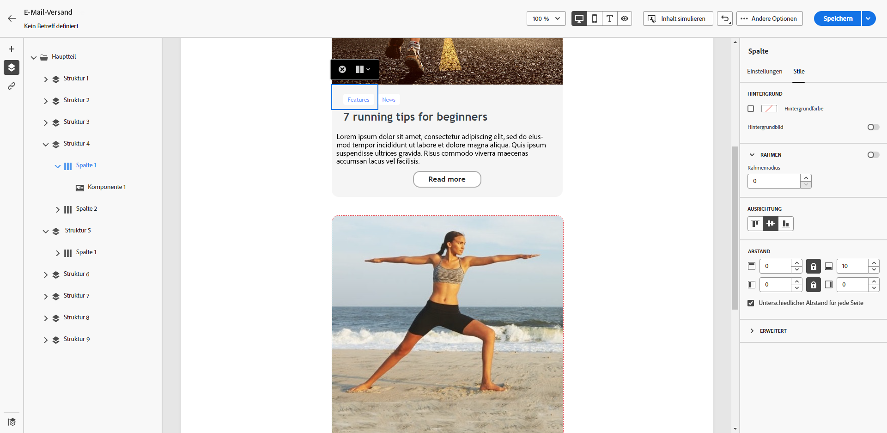
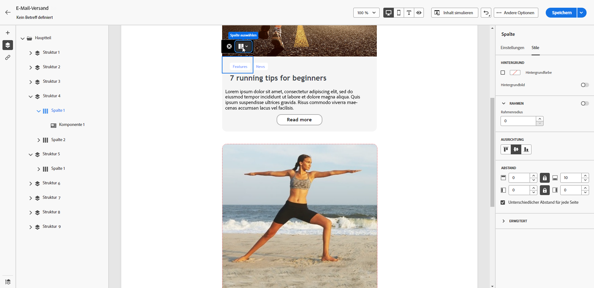
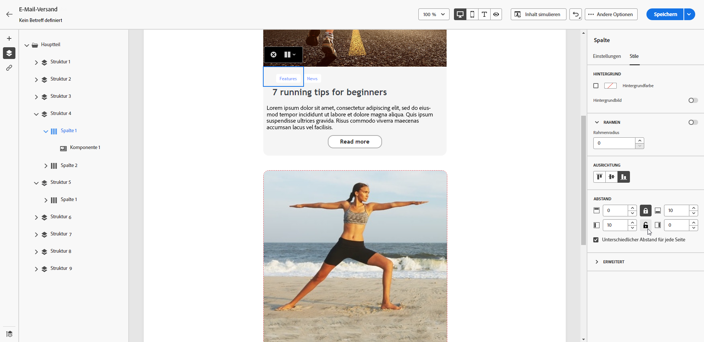

# Anpassen der senkrechten Ausrichtung und des Abstands {#alignment-and-padding}

Passen Sie in diesem Beispiel den Abstand und die vertikale Ausrichtung innerhalb einer Strukturkomponente an, die aus drei Spalten besteht.

1. Wählen Sie eine Strukturkomponente direkt in der E-Mail aus oder verwenden Sie den **[!UICONTROL Navigationsbaum]** der im linken Bereich verfügbar ist.

   {zoomable="yes"}

1. Klicken Sie in der kontextuellen Symbolleiste auf **[!UICONTROL Spalte auswählen]** und wählen Sie die Spalte aus, die Sie bearbeiten möchten. Sie können sie auch im Strukturbaum auf der linken Seite auswählen.

   {zoomable="yes"}

1. Die bearbeitbaren Parameter für die ausgewählte Spalte werden auf der Registerkarte **[!UICONTROL Stile]** angezeigt. Passen Sie die **[!UICONTROL Ausrichtung]** im entsprechenden Abschnitt an.

   {zoomable="yes"}

   Wählen Sie beispielsweise **[!UICONTROL Unten]**. Die Inhaltskomponente wird an den unteren Rand der Spalte verschoben.

1. Definieren Sie unter **[!UICONTROL Abstand]** den oberen Abstand innerhalb der Spalte und legen Sie den linken und rechten Abstand für diese Spalte fest.

   >[!NOTE]
   >
   >Klicken Sie auf das Schlosssymbol, um die Synchronisierung zwischen dem oberen und unteren bzw. linken und rechten Abstand aufzuheben.

   {zoomable="yes"}

1. Passen Sie die Ausrichtung und den Abstand für die anderen Spalten auf die gleiche Weise an.

1. Speichern Sie die Änderungen.