# Anwenden von Designs auf Ihren E-Mail-Inhalt {#apply-email-themes}

>[!CONTEXTUALHELP]
>id="acw_homepage_welcome_rn2"
>title="Designs in der E-Mail Designer (LA)"
>abstract="Wenden Sie wiederverwendbare Design-Stile und -Variablen an, um den E-Mail-Inhalt mit Ihrer Marke konsistent zu halten. Diese Funktion ist nur für ausgewählte Organisationen verfügbar (eingeschränkte Verfügbarkeit)"
>additional-url="https://experienceleague.adobe.com/docs/campaign-web/v8/release-notes/release-notes.html?lang=de" text="Siehe Versionshinweise"

>[!CONTEXTUALHELP]
>id="acw_email_apply_theme"
>title="Anwenden eines Designs auf Ihre E-Mail"
>abstract="Wählen Sie ein Design für Ihre E-Mail aus, um schnell einen bestimmten Stil anzuwenden, der zu Ihrer Marke und Ihrem Design passt."

>[!AVAILABILITY]
>
>Diese Funktion ist nur eingeschränkt verfügbar. Wenden Sie sich an den Adobe-Support, um Zugang zu erhalten.

Mit Designs können technisch nicht versierte Benutzende wiederverwendbare Inhalte erstellen, die zu einer bestimmten Marke und Designsprache passen, indem sie zusätzlich zu den Standardvorlagen benutzerdefinierte Stile hinzufügen<!-- to achieve brand specific results-->.

Diese Funktion ermöglicht es Marketing-Experten, visuell ansprechende, markenkonsistente E-Mails schneller und mit weniger Aufwand zu nutzen und gleichzeitig erweiterte Anpassungsoptionen für individuelle Design-Anforderungen bereitzustellen.

## Schutzmechanismen und Einschränkungen {#themes-guardrails}

* Wenn Sie eine E-Mail von Grund auf neu erstellen, können Sie mit der Erstellung Ihres Inhalts beginnen, indem Sie ein Design verwenden, um schnell einen bestimmten Stil anzuwenden, der zu Ihrer Marke und Ihrem Design passt.

  Wenn Sie den Modus Manuelle Formatierung wählen, können Sie keine Designs anwenden, es sei denn, Sie setzen Ihre E-Mail zurück.

* [Fragmente](../content/fragments.md) sind zwischen den Modi Verwenden von Designs und Manueller Stil nicht kreuzkompatibel.

   * Themenfragmente sind nicht in E-Mail-Inhalten verfügbar, die ohne die Verwendung von Designs erstellt wurden.

   * Um ein [Fragment](../content/fragments.md) in einem Design-Inhalt zu nutzen, muss dieses Fragment selbst mithilfe von Designs erstellt worden sein. [Weitere Informationen](#leverage-themes-fragment)

   * Wenn Sie ein Fragment im E-Mail-Inhalt verwenden, stellen Sie sicher, dass Sie ein Design anwenden, das Sie für dieses Fragment definiert haben. Andernfalls kann es zu Anzeigeproblemen kommen, insbesondere in Outlook 2021 und früheren Versionen. [Weitere Informationen](#leverage-themes-fragment)

* Wenn Sie einen in HTML erstellten Inhalt verwenden, befinden Sie sich im [Kompatibilitätsmodus](existing-content.md) und Sie können keine Designs direkt auf diesen Inhalt anwenden.

   * Um Designs anzuwenden, müssen Sie zunächst den importierten Inhalt [als neue Vorlage](../content/create-email-templates.md#save-as-template) speichern und diese Vorlage dann in einen Design-kompatiblen Inhalt konvertieren. Anschließend können Sie diese Vorlage verwenden, um E-Mail-Inhalte zu erstellen. In diesem Abschnitt erfahren Sie, wie Sie eine mit manuellem Stil erstellte [&#x200B; konvertieren](#theme-convertor).

   * Sie können auch weiterhin Ihre importierten HTML-Inhalte konvertieren. [Weitere Informationen](existing-content.md)

  <!--To fully leverage all the capabilities of the Email Designer, including themes, you must either create a new content in Use Themes mode, or convert your imported HTML content. [Learn more](existing-content.md)-->

* Wenn Sie benutzerdefinierte Web-Schriftarten (einschließlich Google-Schriftarten) in Ihren Designs verwenden, beachten Sie, dass viele E-Mail-Clients sie nicht unterstützen. Definieren Sie immer geeignete Ersatzschriftarten in Ihrem Design, um die Lesbarkeit für alle E-Mail-Clients sicherzustellen.

   * Gmail und Yahoo! Laden Sie keine externen Web-Schriftarten und greifen Sie auf die Systemschriftarten zurück, unabhängig von der in Ihrem HTML/CSS angegebenen Schriftfamilie.
   * Die einzigen von Gmail unterstützten Google-Schriftarten sind Roboto und Google Sans.
   * E-Mail-Clients *die* Webfonts unterstützen, sind unter anderem Apple Mail, iOS Mail, Android Mail, Thunderbird und Outlook für macOS.

<!--If you apply a theme to a content using a [fragment](../content/fragments.md) created with Manual Styling mode, the rendering may not be optimal.-->

## Design erstellen {#create-and-edit-themes}

Gehen Sie wie folgt vor, um ein Design zu definieren, das Sie in künftigen E-Mail-Inhalten nutzen können.

1. Erstellen Sie zunächst eine neue [Inhaltsvorlage](../content/create-email-templates.md).

1. Wählen Sie die **[!UICONTROL Erstellen oder Bearbeiten von Designs]** aus.

   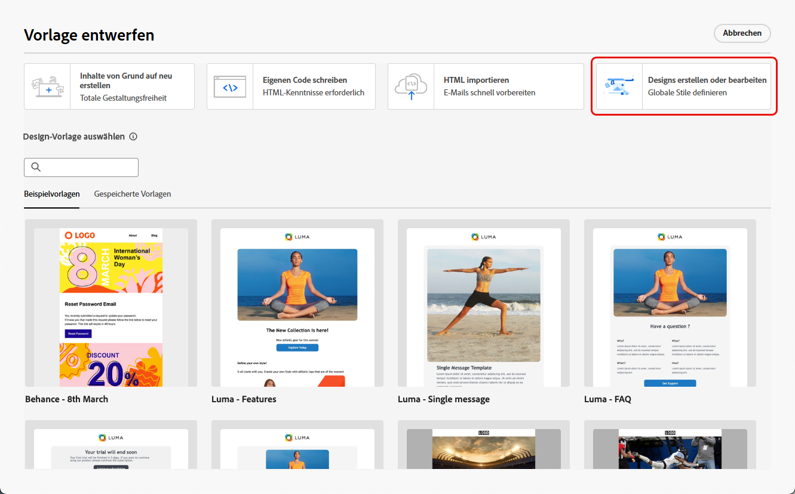

1. Adobe-Design auswählen. Wählen Sie in diesem Beispiel &quot;**[!UICONTROL &quot; aus]** klicken Sie auf **[!UICONTROL Erstellen]**.

   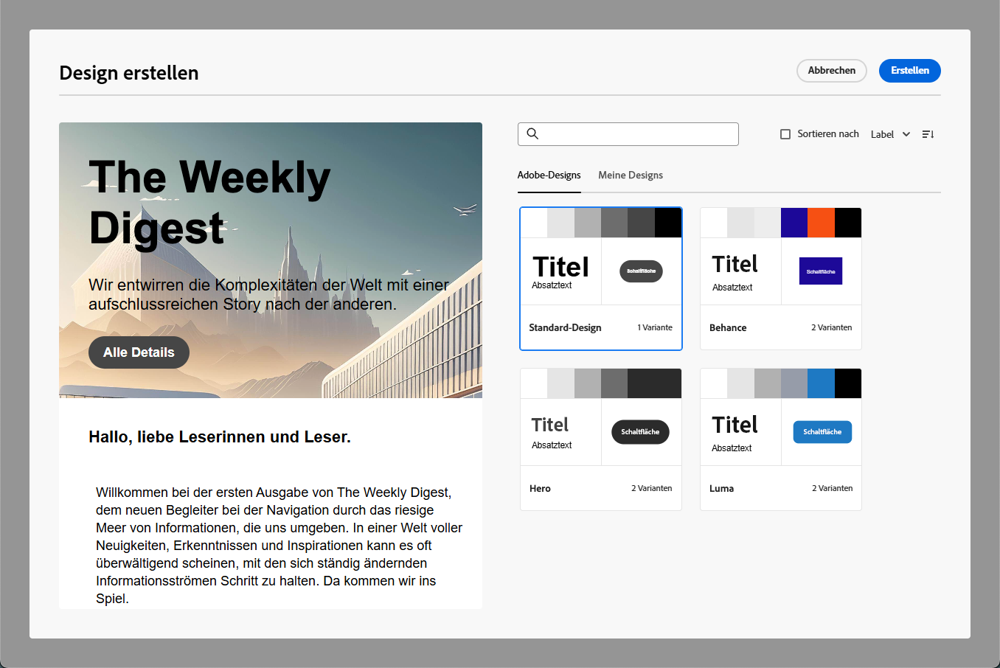

1. Sie können auch eine benutzerdefinierte Vorlage auf der Registerkarte **[!UICONTROL Meine Designs]** auswählen und auf **[!UICONTROL Bearbeiten]** klicken, um sie zu aktualisieren.

   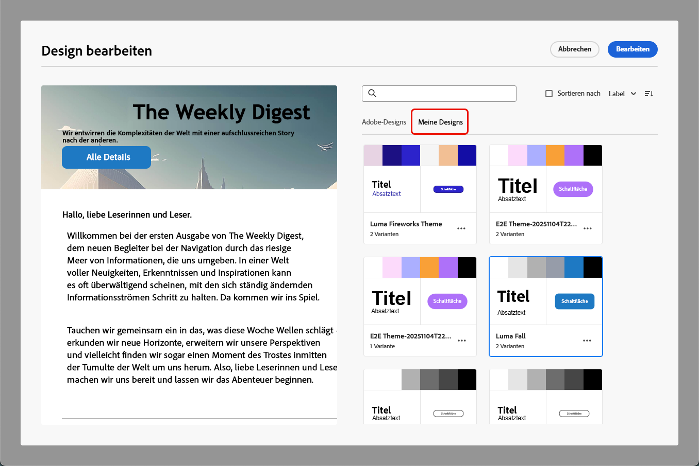

1. Beginnen Sie auf **[!UICONTROL Registerkarte]** Allgemeine Einstellungen“ mit der Definition Ihres Designs, indem Sie ihm einen bestimmten Namen geben, der zu Ihrer Marke passt. Sie können die standardmäßige Darstellungsfeldbreite für Ihre E-Mails <!--and also export the current theme for reuse-->.

   <!--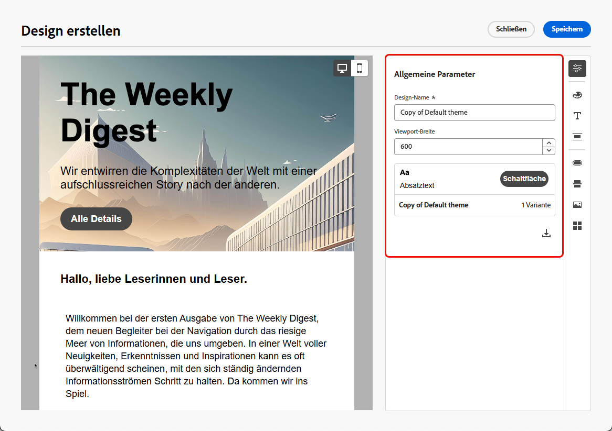-->

1. Verwenden Sie die Leiste rechts, um durch die verschiedenen Registerkarten zu navigieren und Ihre Designeinstellungen zu aktualisieren.

   

1. Auf der Registerkarte **[!UICONTROL Farben]**:

   * Verwenden Sie die **[!UICONTROL Bearbeiten]**, um eine **[!UICONTROL Farbpalette]** mit Standardfarben für Ihre Marke einzurichten. Wählen Sie **[!UICONTROL Vorgabe]** aus, um schnell ein Farbschema zu erstellen oder jede Farbe Ihres Designs individuell anzupassen. Sie können auch eine Kombination aus beiden verwenden.

     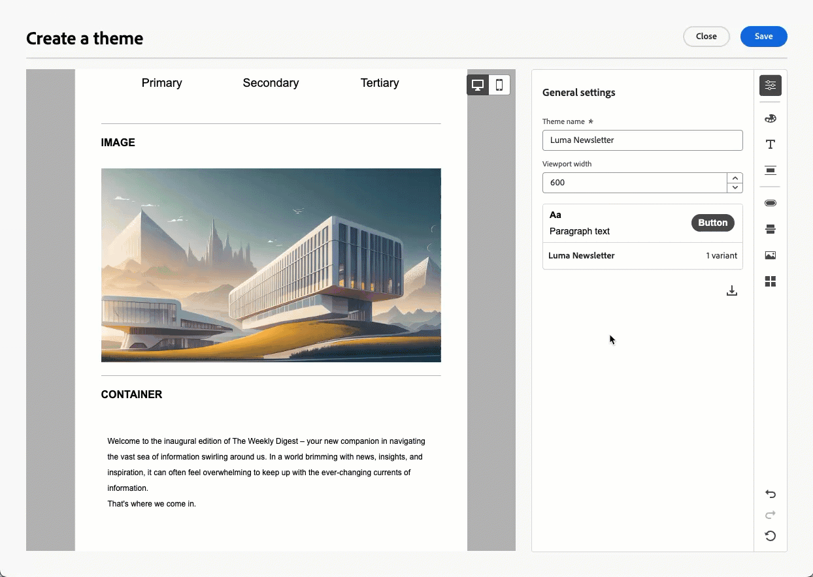

   * Klicken Sie **[!UICONTROL Variante hinzufügen]**, um mehrere Farbvarianten zu erstellen, z. B. den Hell- und Dunkelmodus, wobei jede Variante Ihres Designs über eine eigene Farbpalette und Nuancensteuerelemente verfügt.

     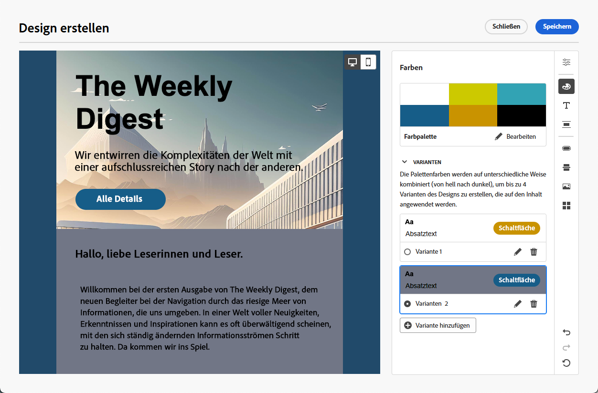

   * Klicken Sie für jede Variante auf das Symbol **[!UICONTROL Bearbeiten]**, um ein einzelnes Element zu bearbeiten. Sie können die von Ihnen erstellte Standardpalette oder beliebige benutzerdefinierte Farben verwenden.

     

1. In den **[!UICONTROL Texteinstellungen]** können Sie die globale Schriftart festlegen, die Sie für Ihr gesamtes Design verwenden möchten. Für ein detaillierteres Steuerelement können Sie auch jede Überschrift und jeden Absatztyp bearbeiten, um die Schriftart, die Größe, den Stil usw. anzupassen.

   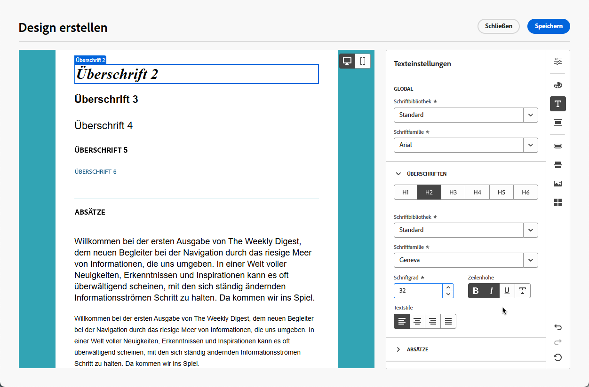

   >[!NOTE]
   >
   >Beachten Sie bei der Auswahl benutzerdefinierter Web-Schriftarten, dass viele E-Mail-Clients wie Gmail und Yahoo! Externe Web-Schriftarten werden nicht unterstützt, sondern es wird auf die Systemschriftarten zurückgegriffen. Erwägen Sie die Verwendung von Ersatzschriftarten, um sicherzustellen, dass Ihr Inhalt auf allen E-Mail-Clients korrekt angezeigt wird. [Weitere Informationen](#themes-guardrails)

1. Wählen Sie auf der Registerkarte **[!UICONTROL Abstand]** ein einzelnes Element aus der Liste aus, um es ordnungsgemäß zwischen den verschiedenen Komponenten aufzuteilen.

   <!--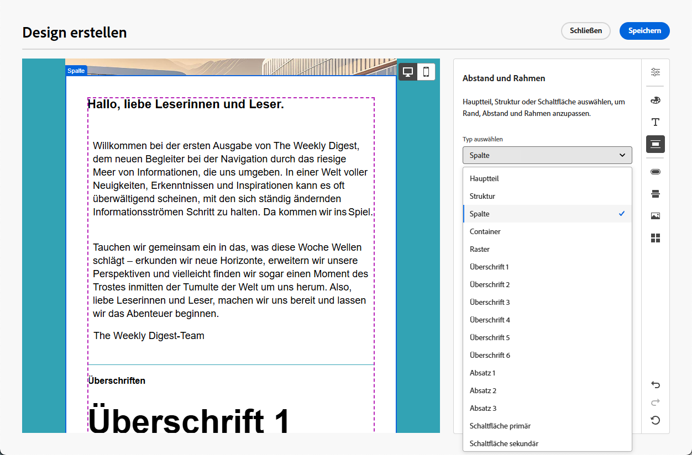-->

1. Mit den anderen Registerkarten auf der rechten Seite können Sie jedes Schaltflächenelement, jede Trennlinie, zusätzliche Bildformatierung und den Rasterlayoutabstand für dieses Design separat verwalten.

   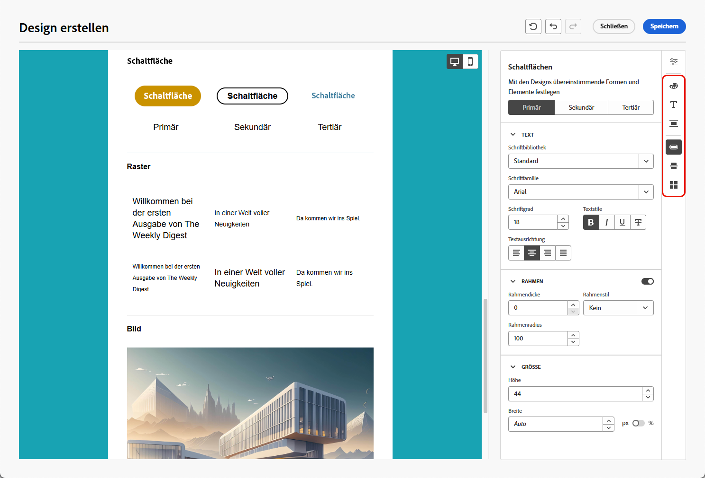

1. Klicken Sie **[!UICONTROL Speichern]**, um dieses Design für die zukünftige Verwendung zu speichern. Sie wird jetzt auf der Registerkarte **[!UICONTROL Meine Designs]** angezeigt.

<!--A little strange upon hitting Save, because once the theme is created, you need to hit Close to go back to Design your template screen, then click Cancel if you don't want to proceed with template creation.-->

## Anwenden von Designs auf E-Mail-Inhalte {#apply-themes-email}

Gehen Sie wie folgt vor, um standardmäßige oder benutzerdefinierte Stildesigns auf eine Inhaltsvorlage oder eine E-Mail anzuwenden.

1. Erstellen Sie [!DNL Adobe Campaign] [E-Mail-Versand](create-email.md) oder verwenden Sie einen vorhandenen Versand oder erstellen Sie eine E-Mail [Inhaltsvorlage](../content/create-email-templates.md#create-template-from-scratch) und [&#x200B; Sie den E-Mail-Inhalt](get-started-email-designer.md#start-authoring).

1. Sie können eine der folgenden Aktionen auswählen:

   * Wählen Sie eine integrierte [E-Mail-Vorlage](../content/use-email-templates.md) aus, um die E-Mail-Designer zu öffnen. Ein für jede Vorlage spezifisches Standarddesign wird automatisch angewendet.

   * Entwerfen Sie [neuen Inhalt von Grund auf](create-email-content.md) und wählen Sie **[!UICONTROL Verwenden von Designs]**, um mit einem vordefinierten Stildesign zu beginnen.

     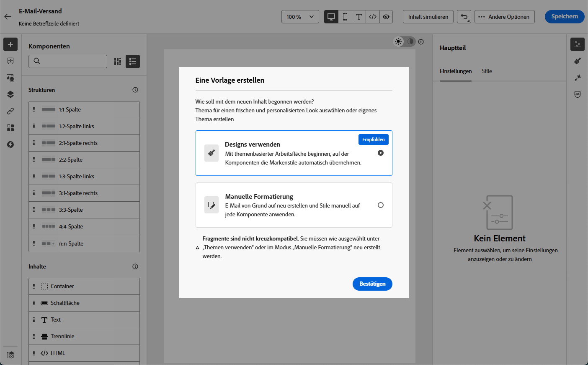

     >[!CAUTION]
     >
     >Wenn Sie den manuellen Stilmodus auswählen, können Sie keine Designs anwenden, es sei denn, Sie haben den Entwurf zurückgesetzt.
     >
     >Um ein [Fragment](../content/fragments.md) in einem Design-Inhalt zu nutzen, muss dieses Fragment selbst mithilfe von Designs erstellt worden sein. [Weitere Informationen](#leverage-themes-fragment)

1. Klicken Sie in der E-Mail-Designer in der rechten Leiste auf **[!UICONTROL Designs]**-Schaltfläche. Das Standarddesign oder das Design der Vorlage wird angezeigt. Sie können zwischen den beiden Farbvarianten für dieses Design wechseln.

   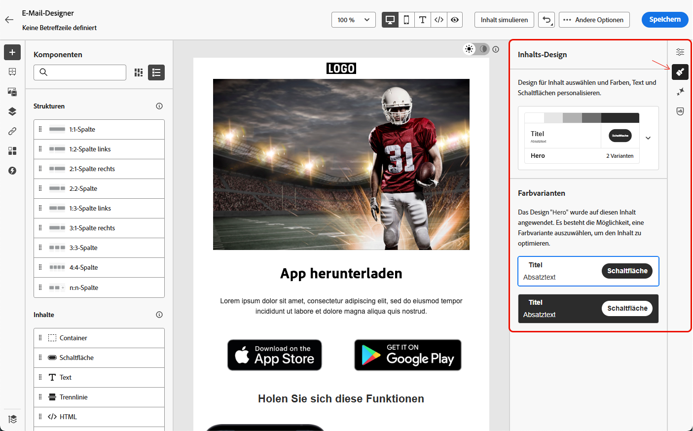

1. Klicken Sie auf den Pfeil neben dem aktuell verwendeten Design. Die Liste der verfügbaren benutzerdefinierten und Adobe-Designs wird angezeigt.

   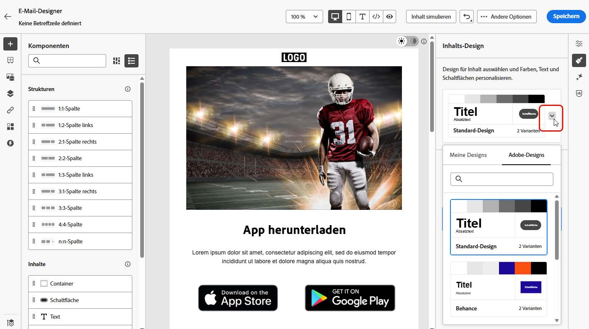

1. Klicken Sie **[!UICONTROL Meine Designs]** und wählen Sie das von Ihnen erstellte Design aus.

   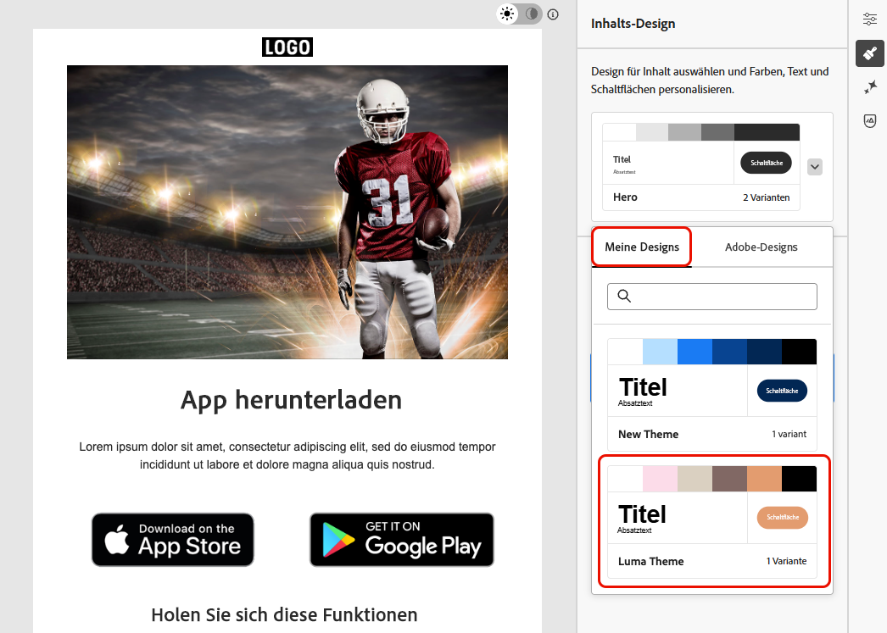

1. Klicken Sie außerhalb der Dropdown-Liste. Das neu ausgewählte benutzerdefinierte Design wendet seine Stile automatisch auf alle E-Mail-Komponenten an. Sie können zwischen den Farbvarianten wechseln, falls vorhanden.

1. Wenn ein Design in einer Inhaltsvorlage ausgewählt ist, können Sie auf die Schaltfläche **[!UICONTROL Design bearbeiten]** klicken, um es zu aktualisieren. [Weitere Informationen](#create-and-edit-themes)

   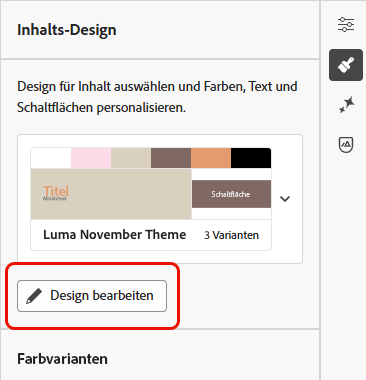{width="40%"}

   >[!NOTE]
   >
   >Diese Option ist nicht verfügbar, wenn Designs im E-Mail-Inhalt verwendet werden.

1. Wenn Sie ein Design mit mehreren Farbvarianten verwenden, können Sie eine bestimmte Variante für eine bestimmte Strukturkomponente auswählen. Auf diese Weise können Sie eine Farbvariante für den gesamten Inhalt definieren und eine andere Variante für nur eine bestimmte Struktur verwenden.

   >[!NOTE]
   >
   >Diese Aktion kann nicht für Inhaltskomponenten ausgeführt werden.

   Wählen Sie dazu eine Strukturkomponente aus, klicken Sie auf der Registerkarte **[!UICONTROL Stile]** rechts auf die Option **[!UICONTROL Variante eines bestimmten Designs verwenden]** und wenden Sie die gewünschte Variante auf diese Struktur an.

   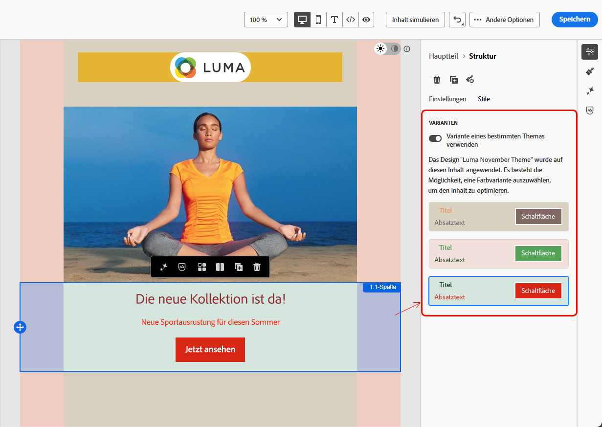

   In diesem Beispiel wird die erste Farbvariante des aktuellen Designs auf den gesamten E-Mail-Inhalt angewendet, aber die dritte Farbvariante wird auf die ausgewählte Struktur angewendet. Sie können sehen, dass sich die Hintergrundfarben des Textkörpers und des Ansichtsfensters für diese spezifische Struktur vom Rest des Inhalts unterscheiden.

Sie können jederzeit zwischen Designs wechseln. Der E-Mail-Inhalt bleibt unverändert, aber die Stile werden aktualisiert, um das neue Design widerzuspiegeln.

### Entsperren von Stilen {#unlocking-styles}

Wenn eine Komponente ausgewählt ist, können Sie den Stil mithilfe des entsprechenden Symbols auf der Registerkarte **[!UICONTROL Stile]** entsperren.

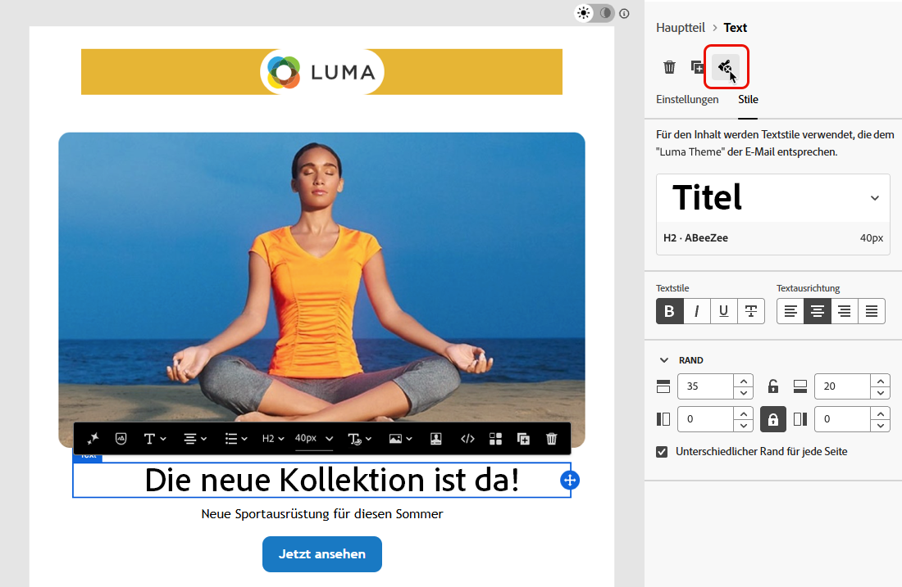{width="90%"}

Das ausgewählte Design wird weiterhin auf diese Komponente angewendet, Sie können jedoch die Stilelemente überschreiben. Wenn Sie Designs ändern, wird das neue Design nur auf die Stilelemente angewendet, die nicht überschrieben wurden.<!--can you revert this action?-->

Wenn Sie beispielsweise eine Textkomponente entsperren, können Sie <!--the font size from 11 to 14 and -->die Schriftfarbe von schwarz auf rot:

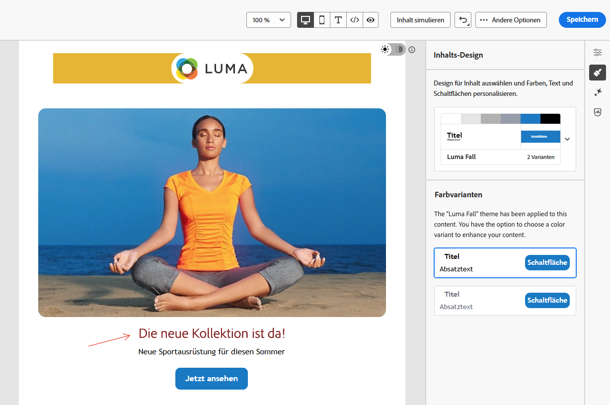{width="80%" align="center" zoomable="yes"}

Wenn Sie Designs ändern, <!--the font size is still 14 and -->die Schriftfarbe für diese Komponente weiterhin rot, aber die Hintergrundfarbe für diese Komponente ändert sich mit dem neuen Design:

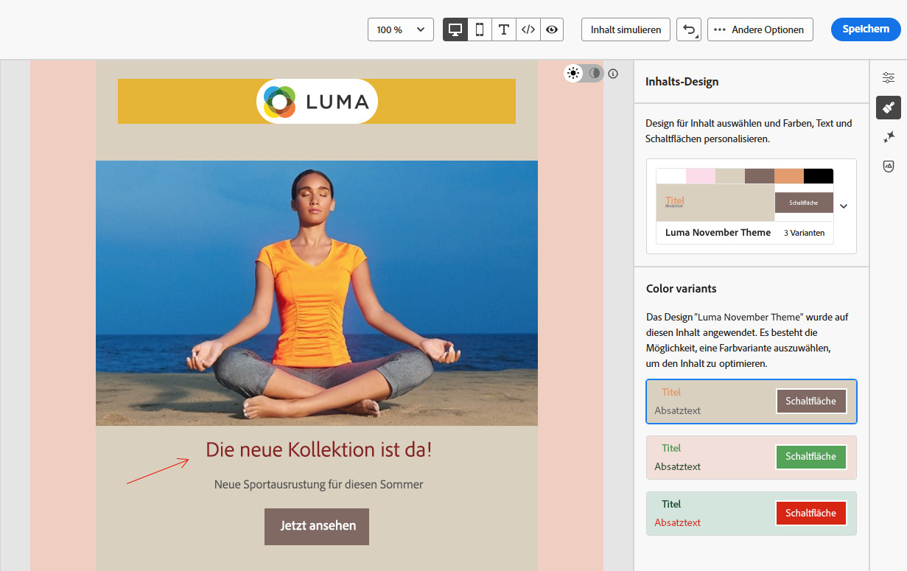{width="80%"}

## Verwenden von Designs in einem Fragment {#leverage-themes-fragment}

Um ein Fragment in einer Vorlage oder E-Mail mit [angewendeten Designs](#apply-themes-email) zu nutzen, muss dieses Fragment selbst mithilfe von Designs erstellt worden sein. Andernfalls können Sie dieses Fragment nicht in Ihrem Design-Inhalt verwenden.

Gehen Sie wie folgt vor, um ein mit Designs kompatibles Fragment zu erstellen.

1. Erstellen Sie [!DNL Adobe Campaign] ein visuelles Fragment und klicken Sie auf **[!UICONTROL Erstellen]**, um den Inhalt Ihres Fragments zu entwerfen. [Weitere Informationen](../content/create-fragment.md#create-from-scratch)

1. Wählen Sie **[!UICONTROL Verwenden von Designs]**, um mit einem vordefinierten Stildesign zu beginnen.

   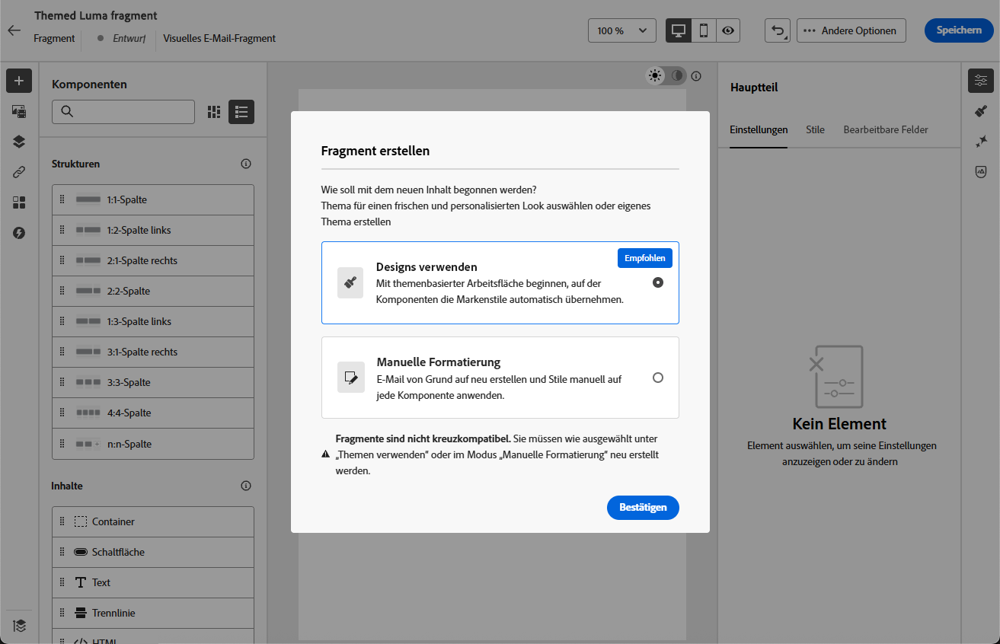{width="100%"}

   >[!CAUTION]
   >
   >Wenn Sie den Modus „Manueller Stil“ wählen, können Sie keine Designs anwenden, es sei denn, Sie setzen Ihr Fragmentdesign zurück.

1. Sobald Sie die E-Mail-Designer geöffnet haben, können Sie mit der Erstellung Ihres Fragments beginnen.

1. Klicken Sie in der rechten Leiste auf **[!UICONTROL Designs]**-Schaltfläche. Das Standarddesign wird angezeigt. Sie können zwischen den verschiedenen Farbvarianten für dieses Design wechseln.

   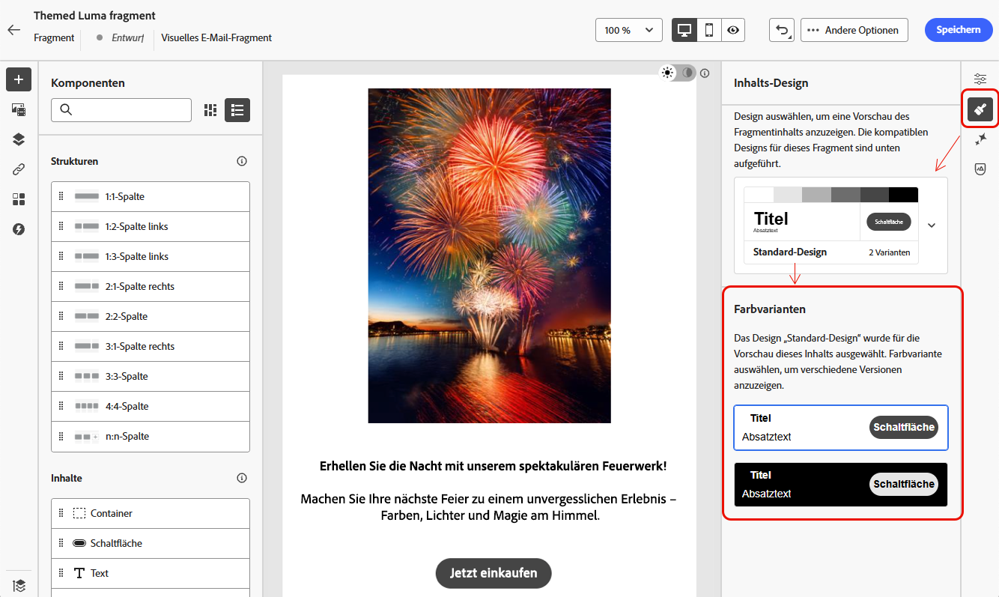{width="100%" align="center" zoomable="yes"}

1. Sie können andere Designs auswählen, um eine Vorschau Ihres Fragmentinhalts anzuzeigen. Wählen Sie dazu den Pfeil neben dem Standarddesign aus und klicken Sie auf **[!UICONTROL Designs auswählen]**.

   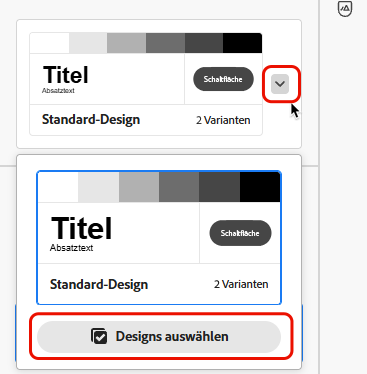{width="40%"}

1. Sie können zwischen den Registerkarten **[!UICONTROL Adobe]** und **[!UICONTROL Meine Designs]** navigieren und bis zu fünf kompatible Designs (aus beiden Registerkarten) für Ihr Fragment auswählen.

   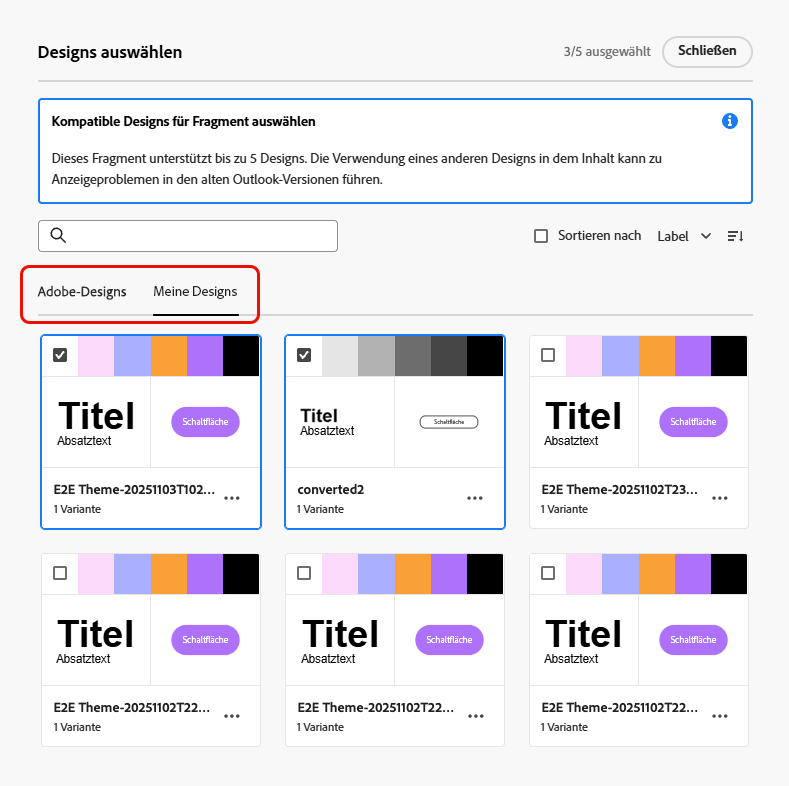{width=70%}

   >[!CAUTION]
   >
   >Wenn Sie das Fragment in einem E-Mail-Inhalt verwenden[&#x200B; stellen Sie sicher, dass Sie (](#apply-themes-email) Design anwenden), das Sie für dieses Fragment definiert haben. Andernfalls kann es zu Anzeigeproblemen kommen, insbesondere in Outlook 2021 und früheren Versionen.

1. Klicken Sie auf **[!UICONTROL Schließen]**.

1. Klicken Sie erneut auf den Pfeil neben **[!UICONTROL Standarddesign]**. Sie können jetzt zwischen den verschiedenen Designs wechseln, die Sie gerade ausgewählt haben, um jedes Stil-Rendering in der Vorschau anzuzeigen.

   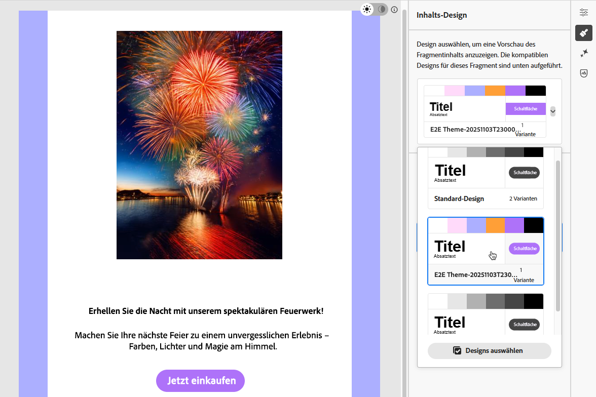{width=90%}

1. Klicken Sie **[!UICONTROL erneut auf]** Designs auswählen“, um weitere Designs hinzuzufügen oder Ihre Auswahl zu ändern.

## Erstellen einer Vorlage mit Designs {#theme-convertor}

[!DNL Adobe Campaign] können Sie eine mit manuellem Stil erstellte Vorlage in einen Design-kompatiblen Inhalt konvertieren. Dies kann besonders dann nützlich sein, wenn Sie Inhaltsvorlagen erstellt haben, bevor Designs in [!DNL Adobe Campaign] eingeführt wurden, oder wenn Sie externe Inhalte importieren.

>[!NOTE]
>
> Nur **E-Mail** Vorlagen können konvertiert werden, damit sie mit Designs kompatibel sind. Einzelne E-Mails können nicht konvertiert werden. Sie müssen Ihren Inhalt zuerst als Vorlage speichern.

1. Öffnen Sie eine E[Mail (Inhaltsvorlage](../content/create-email-templates.md) und bearbeiten Sie ihren Inhalt mit der E-Mail-Designer.

1. Wählen Sie das Symbol **[!UICONTROL Designs]** in der rechten Leiste aus und klicken Sie auf die Schaltfläche **[!UICONTROL Design aus Inhalt generieren]**.

   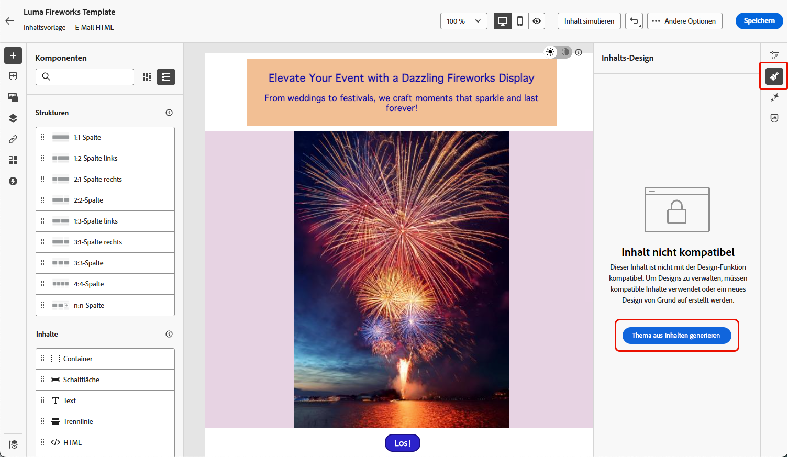{width=100%}

1. Das **[!UICONTROL Erstellen eines Designs]** wird geöffnet. [!DNL Adobe Campaign] erkennt die Stilelemente automatisch und konsolidiert sie in einem neuen Design.

   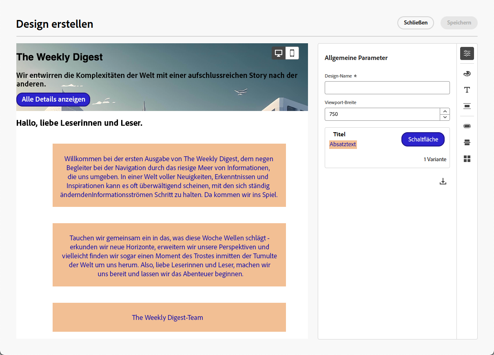{width=90%}

1. Geben Sie einen Namen für Ihr Design an.

1. Nehmen Sie Ihre eigenen Anpassungen vor, wie Sie es tun, wenn Sie ein Design von Grund auf neu erstellen, z. B. eine Farbvariante hinzufügen oder Schriftarten bearbeiten. [Weitere Informationen](#create-and-edit-themes)

   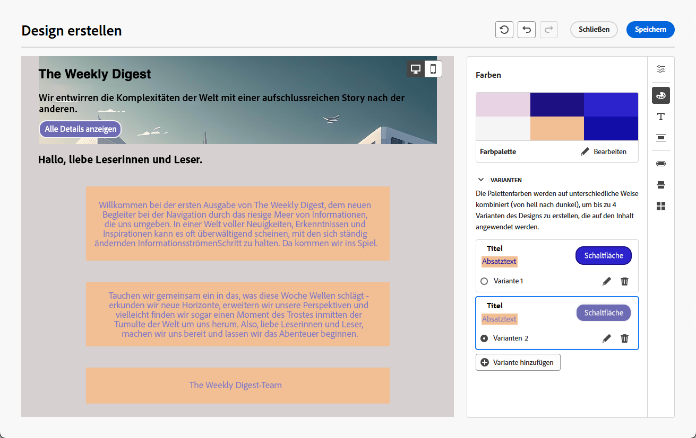{width=90%}

1. Klicken Sie **[!UICONTROL Speichern]**, um dieses neue Design zur Wiederverwendung zu speichern. Sie können dieses Design nun wie jedes andere Design auf Ihre Inhalte anwenden. [Weitere Informationen](#apply-themes-email)
