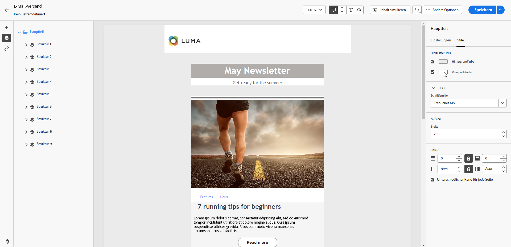
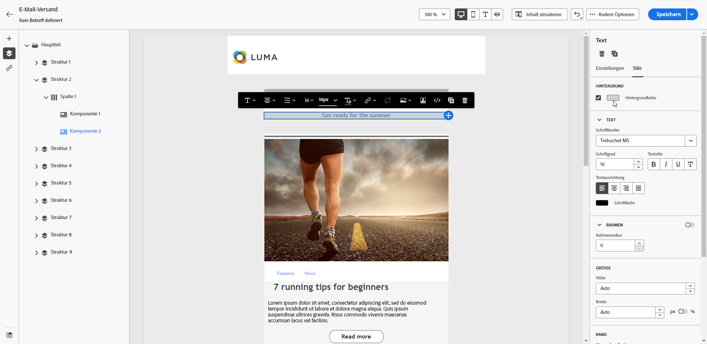
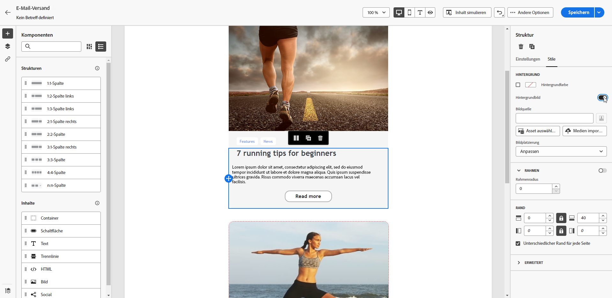
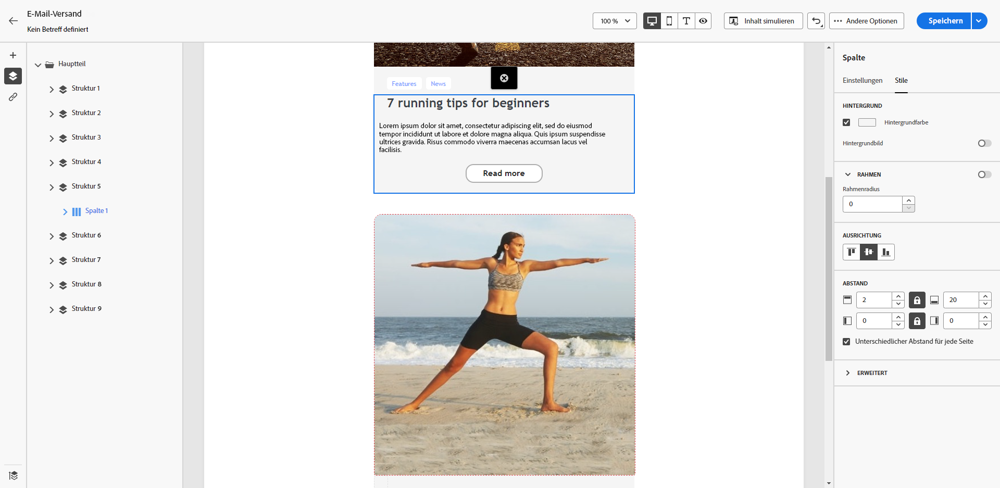

# Personalisieren Ihres E-Mail-Hintergrunds {#backgrounds}

>[!CONTEXTUALHELP]
>id="ac_edition_backgroundimage"
>title="Hintergrundeinstellungen"
>abstract="Sie können die Hintergrundfarbe oder das Hintergrundbild für Ihren Inhalt personalisieren. Beachten Sie, dass Hintergrundbilder nicht von allen E-Mail-Clients unterstützt werden."

Für die Einstellung von Hintergründen mit dem E-Mail-Designer empfiehlt Adobe Folgendes:

1. Wenden Sie eine Hintergrundfarbe auf den Hauptteil Ihrer E-Mail an, wenn das Design es so verlangt.
1. Legen Sie in den meisten Fällen Hintergrundfarben auf Spaltenebene fest.
1. Vermeiden Sie es, Hintergrundfarben für Bilder oder Textkomponenten zu verwenden, da sie schwierig zu handhaben sind.

Unten finden Sie die verfügbaren Einstellungen für den Hintergrund:

* Legen Sie eine **[!UICONTROL Hintergrundfarbe]** für die gesamte E-Mail fest. Wählen Sie die Einstellungen für den Hauptteil im Navigationsbaum aus, auf den Sie über den linken Bereich zugreifen können.

  [Festlegen der Hintergrundfarbe für den gesamten E-Mail-Hauptteil, auf den über den Navigationsbaum zugegriffen werden kann]\
  {zoomable="yes"}

* Legen Sie dieselbe Hintergrundfarbe für alle Strukturkomponenten fest, indem Sie **[!UICONTROL Viewport-Hintergrundfarbe auswählen]**. Mit dieser Option können Sie eine andere Einstellung als die Hintergrundfarbe auswählen.

  [Festlegen einer einheitlichen Hintergrundfarben für alle Strukturkomponenten mit der Option „Viewport-Hintergrundfarbe“]\
  {zoomable="yes"}

* Legen Sie für jede Strukturkomponente eine andere Hintergrundfarbe fest. Wählen Sie im linken Bereich eine Struktur im Navigationsbaum aus, um eine bestimmte Hintergrundfarbe nur dieser Struktur zuzuweisen.

  [Anwenden eindeutiger Hintergrundfarben auf einzelne Strukturkomponenten über den Navigationsbaum]\
  {zoomable="yes"}

  >[!NOTE]
  >\
  >Wählen Sie aber keine Viewport-Hintergrundfarbe aus, da diese die Struktur-Hintergrundfarben verdecken könnte.

* Legen Sie für den Inhalt einer Strukturkomponente ein **[!UICONTROL Hintergrundbild]** fest.

  [Hinzufügen eines Hintergrundbilds zum Inhalt einer bestimmten Strukturkomponente]\
  {zoomable="yes"}

  >[!NOTE]
  >\
  >Manche E-Mail-Programme unterstützen keine Hintergrundbilder. Wenn dies nicht unterstützt wird, wird stattdessen die Hintergrundfarbe der Zeile verwendet. Wählen Sie daher eine passende Fallback-Hintergrundfarbe auf, falls das Bild nicht dargestellt werden kann.

* Legen Sie auf Spaltenebene eine Hintergrundfarbe fest.

  [Anwenden einer Hintergrundfarbe auf Spaltenebene für mehr Flexibilität]\
  {zoomable="yes"}

  >[!NOTE]
  >\
  >Dies ist der häufigste Anwendungsfall. Adobe empfiehlt, Hintergrundfarben auf Spaltenebene festzulegen, da dies mehr Flexibilität bietet, wenn der gesamte E-Mail-Inhalt bearbeitet wird.

  Sie können auch ein Hintergrundbild auf Spaltenebene einrichten, was aber nur selten verwendet wird.