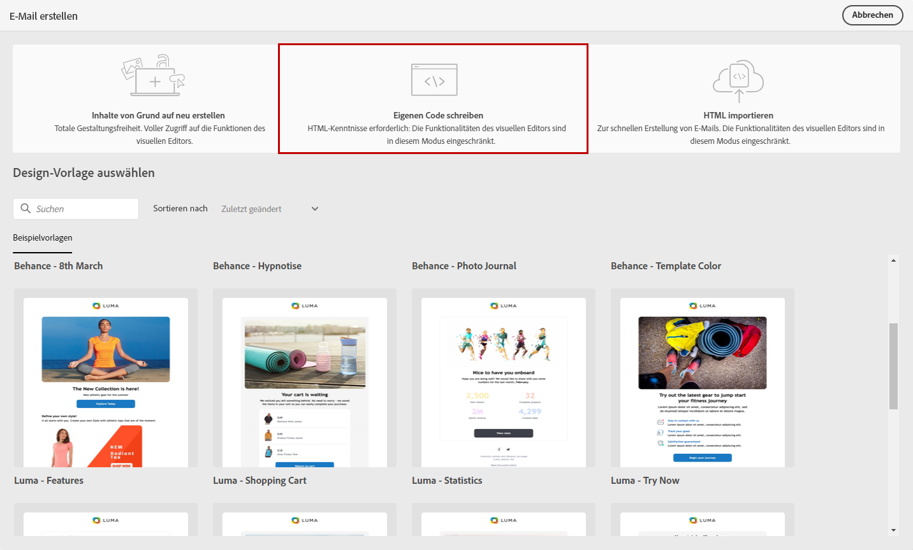

# Codieren Ihrer eigenen E-Mail-Inhalte {#code-content}

Verwenden Sie den Modus **[!UICONTROL Eigenen Code erstellen]**, um unformatierte HTML zu importieren und/oder Ihren E-Mail-Inhalt zu codieren.

>[!CAUTION]
>
>Diese Methode erfordert HTML-Kenntnisse.

1. Wählen Sie auf der Startseite von [E-Mail-Designer](get-started-email-designer.md) die Option **[!UICONTROL Eigenen Code schreiben]** aus.

   {zoomable=&quot;yes&quot;}

1. Geben oder fügen Sie Ihren rohen HTML-Code in die Hauptarbeitsfläche ein.

1. Verwenden Sie den linken Bereich, um die Personalisierungsfunktionen zu nutzen. [Weitere Informationen](../personalization/gs-personalization.md)

   {zoomable=&quot;yes&quot;}

1. Klicken Sie auf die Schaltfläche **[!UICONTROL Inhalt simulieren]**, um Design und Personalisierung der Nachricht mithilfe von Testprofilen zu überprüfen. [Weitere Informationen](../preview-test/preview-test.md)

1. Sobald Ihr Code fertig ist, klicken Sie auf **[!UICONTROL Speichern und schließen]**. Gehen Sie dann zurück zum Bildschirm zur Nachrichtenerstellung, um Ihre Nachricht fertigzustellen.
