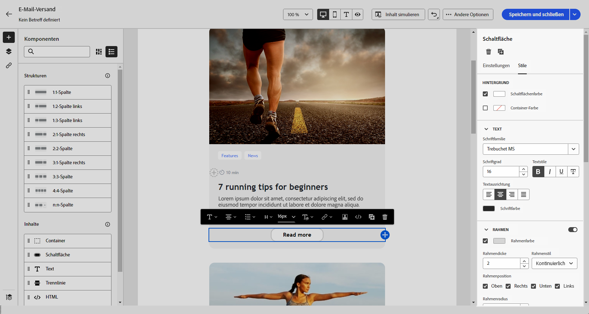
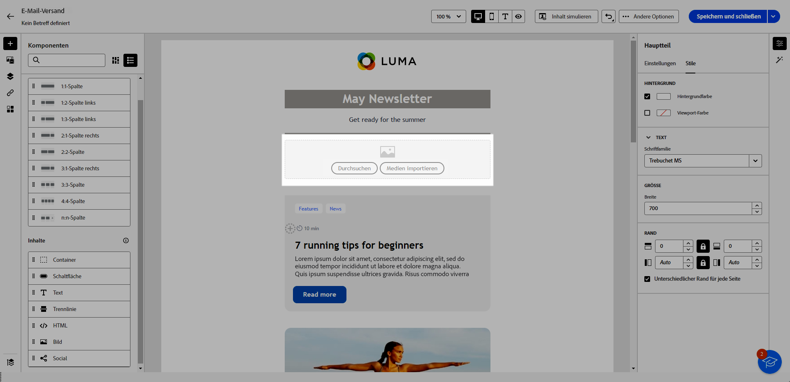

# Verwenden von Inhaltskomponenten {#content-components}

>[!CONTEXTUALHELP]
>id="ac_content_components_email"
>title="Über Inhalte"
>abstract="Inhaltskomponenten sind leere Platzhalter für Inhalte, mit denen Sie das Layout einer E-Mail gestalten können."

>[!CONTEXTUALHELP]
>id="ac_content_components_landing_page"
>title="Über Inhalte"
>abstract="Inhaltskomponenten sind leere Platzhalter für Inhalte, mit denen Sie das Layout einer Landingpage gestalten können."

>[!CONTEXTUALHELP]
>id="ac_content_components_fragment"
>title="Über Inhalte"
>abstract="Inhaltskomponenten sind leere Platzhalter für Inhalte, mit denen Sie das Layout eines Inhaltsfragments gestalten können."

>[!CONTEXTUALHELP]
>id="ac_content_components_template"
>title="Über Inhalte"
>abstract="Inhaltskomponenten sind leere Platzhalter für Inhalte, mit denen Sie das Layout einer Vorlage gestalten können."

Beim Erstellen Ihres E-Mail **[!UICONTROL Inhalts können Sie mit]** Inhaltskomponenten“ Ihre E-Mail mit unbearbeiteten, leeren Komponenten personalisieren, die Sie verwenden können, sobald sie in einer E-Mail platziert wurden.

Sie können so viele **[!UICONTROL Inhalte]** wie nötig in eine **[!UICONTROL Struktur]** einfügen, die das Layout Ihrer E-Mail definiert.

## Hinzufügen von Inhaltskomponenten {#add-content-components}

Gehen Sie wie folgt vor, um Ihrer E-Mail Inhaltskomponenten hinzuzufügen und diese an Ihre Anforderungen anzupassen.

1. Verwenden Sie im E-Mail-Designer einen [vorhandenen Inhalt](existing-content.md) oder ziehen Sie per Drag-and-Drop eine **[!UICONTROL Struktur]** in einen leeren Inhalt, um das Layout Ihrer E-Mail zu definieren. [Weitere Informationen dazu](create-email-content.md)

1. Ziehen Sie die **[!UICONTROL Inhalte]** Ihrer Wahl per Drag-and-Drop in die entsprechenden Strukturen.

   {zoomable="yes"}

   >[!NOTE]
   >
   >Sie können zu einer einzelnen Struktur und zu jeder Spalte einer Struktur mehrere Komponenten hinzufügen.

1. Passen Sie die Optionen für jede Komponente über die kontextabhängige Registerkarte **[!UICONTROL Einstellungen]** an. Wählen Sie beispielsweise aus, ob die Anzeige nur auf Desktop- oder Mobilgeräten oder auf beiden erfolgen soll. Sie können auf dieser Registerkarte auch Link-Optionen verwalten. [Weitere Informationen zum Verwalten von Links](message-tracking.md)

1. Passen Sie die Stilattribute für jede Komponente mithilfe der Registerkarte **[!UICONTROL Stil]** an. Ändern Sie beispielsweise den Textstil, den Abstand oder den Rand jeder Komponente. [Weitere Informationen über Ausrichtung und Abstand](alignment-and-padding.md)

   {zoomable="yes"}

1. Löschen oder duplizieren Sie **[!UICONTROL Bedarf aus dem erweiterten Menü]** Inhalt“ im rechten Bereich jede Inhaltskomponente.

## Container {#container}

Sie können einen einfachen Container hinzufügen, in den Sie eine andere Inhaltskomponente einfügen. Auf diese Weise können Sie bestimmte Stile auf den Container anwenden, die sich von den darin verwendeten Komponenten unterscheiden.

Sie können in diesen Container beispielsweise die Komponente **[!UICONTROL Container]** und anschließend die Komponente [Schaltfläche](#button) einfügen. Verwenden Sie einen bestimmten Hintergrund für den Container und einen anderen für die Schaltfläche.

{zoomable="yes"}

## Schaltfläche {#buttons}

Verwenden Sie die Komponente **[!UICONTROL Schaltfläche]**, um eine oder mehrere Schaltflächen in Ihre E-Mail einzufügen und Ihre E-Mail-Zielgruppe auf eine bestimmte Seite umzuleiten.

1. Platzieren Sie die Komponente **[!UICONTROL Schaltfläche]** aus der Liste **[!UICONTROL Inhalte]** per Drag-and-Drop in einer **[!UICONTROL Strukturkomponente]**.

   {zoomable="yes"}

1. Klicken Sie auf die neu hinzugefügte Schaltfläche, um den Text zu personalisieren und auf die Registerkarten **[!UICONTROL Einstellungen]** und **[!UICONTROL Stile]** zuzugreifen.

   {zoomable="yes"}

1. Fügen Sie auf der **[!UICONTROL Einstellungen]** im Feld **[!UICONTROL URL]** die URL hinzu, zu der Sie umleiten möchten, wenn Sie auf die Schaltfläche klicken.

1. Wählen Sie in der Dropdown-Liste **[!UICONTROL Ziel]** aus, wie der Inhalt angezeigt werden soll:

   * **[!UICONTROL Keine]**: Öffnet den Link im selben Fenster, in dem er angeklickt wurde (Standard).
   * **[!UICONTROL Leer]**: Öffnet den Link in einem neuen Fenster oder einer neuen Registerkarte.
   * **[!UICONTROL Selbst]**: Öffnet den Link im selben Fenster, in dem er angeklickt wurde.
   * **[!UICONTROL Übergeordnet]**: Öffnet den Link im übergeordneten Fenster.
   * **[!UICONTROL Oben]**: Öffnet den Link im vollständigen Textkörper des Fensters.

   {zoomable="yes"}

1. Personalisieren Sie Ihre Schaltfläche weiter, indem Sie Stilattribute wie **[!UICONTROL Rahmen]**, **[!UICONTROL Größe]**, **[!UICONTROL Rand]** und andere über die Registerkarte **[!UICONTROL Stile]** ändern.

## Text {#text}

Verwenden Sie die **[!UICONTROL Text]**-Komponente, um Text in Ihre E-Mail einzufügen, und passen Sie den Stil (Rahmen, Größe, Abstand usw.) mithilfe der Registerkarten **[!UICONTROL Einstellungen]** und **[!UICONTROL Stile]** an.

1. Ziehen Sie **[!UICONTROL Text]** aus dem Menü **[!UICONTROL Inhalte]** per Drag-and-Drop in eine **[!UICONTROL Strukturkomponente]**.

   {zoomable="yes"}

1. Klicken Sie auf die neu hinzugefügte Komponente, um den Text zu personalisieren und auf die Registerkarten **[!UICONTROL Einstellungen]** und **[!UICONTROL Stile]** zuzugreifen.

1. Ändern Sie Ihren Text mit den folgenden Optionen, die in der kontextbezogenen Symbolleiste verfügbar sind:

   {zoomable="yes"}

   * **[!UICONTROL Textstil ändern]**: Anwendung von Fett, Kursiv, Unterstrichen oder Durchgestrichen auf Ihren Text.
   * **Ausrichtung ändern**: Wählen Sie für Ihren Text zwischen linksbündig ausrichten, rechtsbündig ausrichten, zentriert oder Blocksatz.
   * **[!UICONTROL Liste erstellen]**: Aufzählungs- oder nummerierte Listen zu Ihrem Text hinzufügen.
   * **[!UICONTROL Überschrift festlegen]**: Bis zu sechs Überschriftenebenen zu Ihrem Text hinzufügen.
   * **Schriftgröße**: Wählen Sie die Schriftgröße Ihres Textes in Pixel aus.
   * **[!UICONTROL Bild bearbeiten]**: Ein Bild oder ein Asset zu Ihrer Textkomponente hinzufügen.
   * **[!UICONTROL Quell-Code anzeigen]**: Den Quell-Code Ihres Textes anzeigen. Es kann nicht geändert werden.
   * **[!UICONTROL Duplizieren]**: Eine Kopie der Textkomponente hinzufügen.
   * **[!UICONTROL Löschen]**: Die ausgewählte Textkomponente aus der E-Mail löschen.
   * **[!UICONTROL Personalisierung hinzufügen]**: Personalisierungsfelder hinzufügen, um den Inhalt aus Ihren Profildaten anzupassen.
   * **[!UICONTROL Bedingten Inhalt aktivieren]**: Hinzufügen bedingter Inhalte, um den Inhalt der Komponente an die Zielprofile anzupassen.

1. Passen Sie andere Stilattribute wie Textfarbe, Schriftfamilie, Rahmen, Abstand, Rand und andere über die Registerkarte &quot;**[!UICONTROL &quot;]**.

   {zoomable="yes"}

## Trennlinie {#divider}

Verwenden Sie die Komponente **[!UICONTROL Trennlinie]**, um das Layout und den Inhalt Ihrer E-Mail durch eine Trennlinie zu strukturieren.

Sie können Stilattribute wie Zeilenfarbe, Stil und Höhe in der Registerkarte **[!UICONTROL Stile]** anpassen.

{zoomable="yes"}

## HTML {#HTML}

Verwenden Sie die Komponente **[!UICONTROL HTML]**, um Teile Ihrer bestehenden HTML zu kopieren und einzufügen. Auf diese Weise können Sie kostenlose modulare HTML-Komponenten erstellen, um externe Inhalte wiederzuverwenden.

1. Ziehen Sie aus den **[!UICONTROL Komponenten]** die **[!UICONTROL HTML]**-Komponente per Drag-and-Drop in eine **[!UICONTROL Strukturkomponente]**.

   {zoomable="yes"}

1. Klicken Sie auf die neu hinzugefügte Komponente und wählen Sie dann in der kontextuellen Symbolleiste **[!UICONTROL Quell-Code anzeigen]**, um Ihren HTML-Code hinzuzufügen.

   {zoomable="yes"}

>[!NOTE]
>
>Um die Kompatibilität von externem Inhalt mit E-Mail-Designer sicherzustellen, empfiehlt Adobe [Erstellen einer neuen Nachricht](create-email-content.md) und Kopieren des Inhalts aus Ihrer bestehenden E-Mail in Komponenten.

## Bild {#image}

>[!IMPORTANT]
>
>Der Zugriff auf das Assets-Menü ist auf Benutzerinnen und Benutzer mit einer aktiven Adobe Experience Manager as a Cloud Service-Lizenz beschränkt. Wenn diese Lizenz nicht vorhanden ist, ist das Menü „Assets“ nicht verfügbar.

Verwenden Sie die **[!UICONTROL Bild]**-Komponente, um eine Bilddatei von Ihrem Computer in Ihre E-Mail einzufügen.

1. Ziehen Sie aus dem **[!UICONTROL Inhalt]**-Menü **[!UICONTROL Bild]** per Drag-and-Drop in eine **[!UICONTROL Struktur]**-Komponente.

   {zoomable="yes"}

1. Klicken Sie auf **[!UICONTROL Durchsuchen]**, um eine Bilddatei aus Ihren Assets auszuwählen. Sie können auch Ihre **[!UICONTROL Medien importieren]**.

   Weitere Informationen zum Hochladen und Hinzufügen von Assets in Adobe Experience Manager finden Sie in der [Dokumentation zu Adobe Experience Manager as a Cloud Service](https://experienceleague.adobe.com/docs/experience-manager-cloud-service/content/assets/manage/add-assets.html?lang=de).

   {zoomable="yes"}

1. Navigieren Sie durch Ihre Ordner, um das gewünschte Asset zu finden, oder verwenden Sie die Suchleiste, um es effizient zu suchen.

   Nachdem Sie das gesuchte Asset gefunden haben, klicken Sie auf **[!UICONTROL Auswählen]**.

   {zoomable="yes"}

1. Klicken Sie auf die neu hinzugefügte Komponente und legen Sie die Bildeigenschaften auf der Registerkarte **[!UICONTROL Einstellungen]** fest:

   * **[!UICONTROL Bildtitel]** ermöglicht die Definition eines Titels für das Bild.
   * **[!UICONTROL Alternativtext]** ermöglicht Ihnen, die zugeordnete Beschriftung zu Ihrem Bild zu definieren. Dies entspricht dem Alt-HTML-Attribut.

   {zoomable="yes"}

1. Fügen Sie einen Link hinzu, um Ihre Audience zu einem anderen Inhalt weiterzuleiten. [Weitere Informationen](message-tracking.md)

1. Passen Sie andere Stilattribute wie Rand, Rahmen und andere mithilfe der Registerkarte **[!UICONTROL Stile]** an.

## Social {#social}

Verwenden Sie die Komponente **[!UICONTROL Social]**, um Links zu Social-Media-Seiten in Ihre E-Mail einzufügen.

1. Ziehen Sie aus dem Menü **[!UICONTROL Komponenten]** die Komponente **[!UICONTROL Social]** per Drag-and-Drop in eine **[!UICONTROL Strukturkomponente]**.

1. Klicken Sie auf die neu hinzugefügte Komponente.

1. Im Feld **[!UICONTROL Social]** der Registerkarte **[!UICONTROL Einstellungen]** können Sie auswählen, welche sozialen Medien Sie hinzufügen oder entfernen möchten.

   {zoomable="yes"}

1. Wählen Sie die Größe Ihrer Symbole im Feld **[!UICONTROL Bildgröße]**.

1. Klicken Sie auf jedes Ihrer Symbole für soziale Medien, um die **[!UICONTROL URL]** zu konfigurieren, zu der Ihre Zielgruppe weitergeleitet werden soll.

   {zoomable="yes"}

1. Ändern Sie bei Bedarf die Symbole der einzelnen Social Media im Feld **[!UICONTROL Source]** .

1. Passen Sie andere Stilattribute wie Stil, Rand, Rahmen und andere über die Registerkarte **[!UICONTROL Stile]** an.