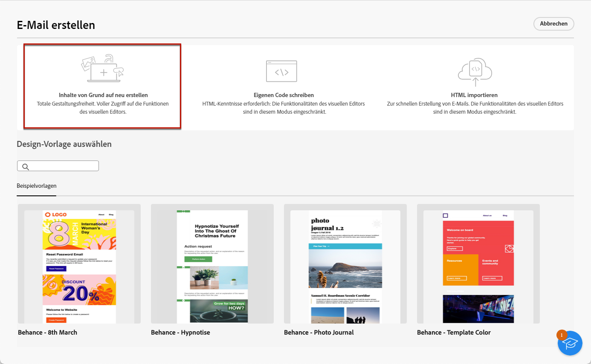
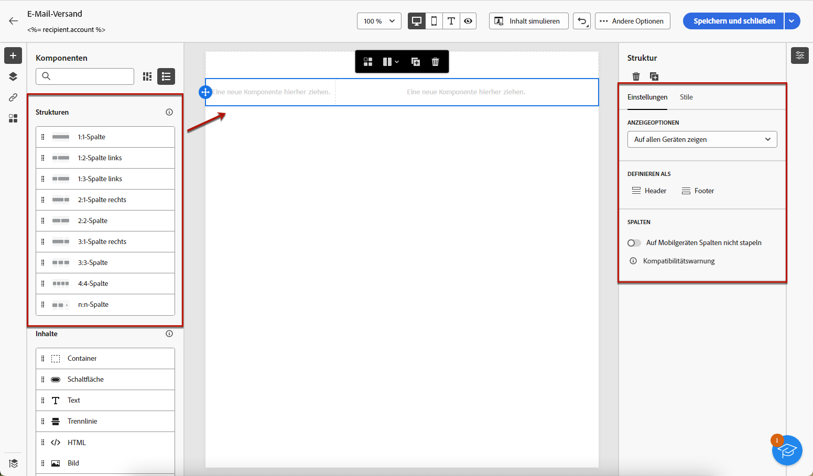
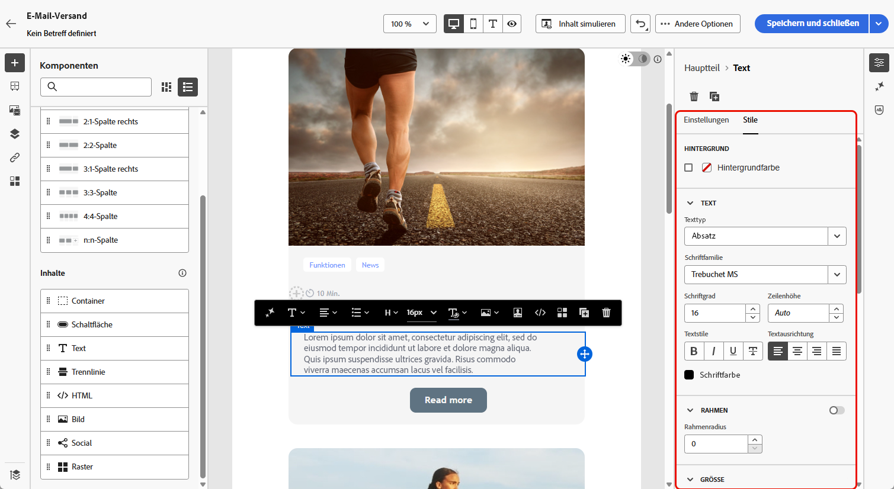
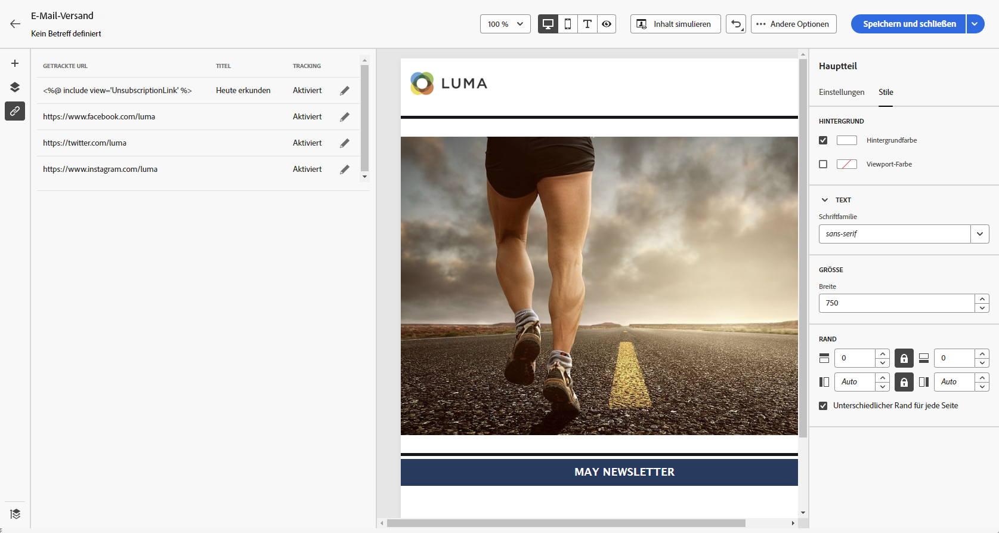
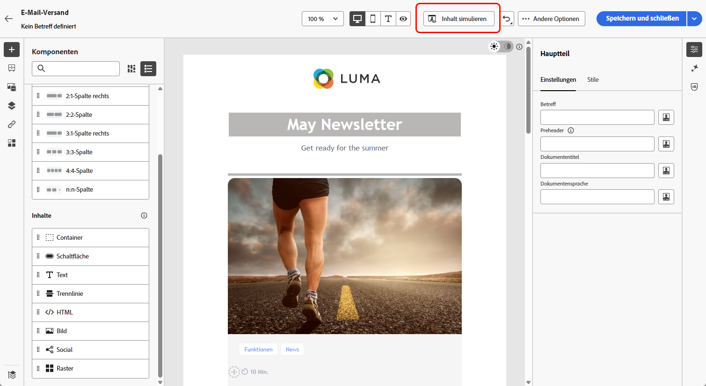

# Starten mit ganz neuem E-Mail-Inhalt {#create-email-content}

>[!CONTEXTUALHELP]
>id="ac_structure_components_email"
>title="Hinzufügen von Strukturen"
>abstract="Strukturen definieren das Layout der E-Mail. Ziehen Sie per Drag-and-Drop eine **Struktur**-Komponente in die Arbeitsfläche, um mit der Gestaltung Ihres E-Mail-Inhalts zu beginnen."

>[!CONTEXTUALHELP]
>id="ac_structure_components_landing_page"
>title="Hinzufügen von Strukturen"
>abstract="Strukturen definieren das Layout der Landingpage. Ziehen Sie per Drag-and-Drop eine **Strukturkomponente** in die Arbeitsfläche, um mit der Gestaltung Ihrer Landingpage zu beginnen."

>[!CONTEXTUALHELP]
>id="ac_structure_components_fragment"
>title="Hinzufügen von Strukturen"
>abstract="Strukturen definieren das Layout des Inhaltsfragments. Ziehen Sie per Drag-and-Drop eine **Strukturkomponente** in die Arbeitsfläche, um mit der Gestaltung Ihres Fragmentinhalts zu beginnen."

>[!CONTEXTUALHELP]
>id="ac_structure_components_template"
>title="Hinzufügen von Strukturen"
>abstract="Strukturen definieren das Layout der Vorlage. Ziehen Sie per Drag-and-Drop eine **Strukturkomponente** in die Arbeitsfläche, um mit der Gestaltung Ihres Vorlageninhalts zu beginnen."

>[!CONTEXTUALHELP]
>id="ac_edition_columns_email"
>title="Definieren von E-Mail-Spalten"
>abstract="Mit E-Mail-Designer können Sie das Layout Ihrer E-Mail einfach definieren, indem Sie die Spaltenstruktur definieren."

>[!CONTEXTUALHELP]
>id="ac_edition_columns_landing_page"
>title="Definieren der Landingpage-Spalten"
>abstract="Mit E-Mail-Designer können Sie das Layout Ihrer Landingpage einfach definieren, indem Sie die Spaltenstruktur festlegen."

>[!CONTEXTUALHELP]
>id="ac_edition_columns_fragment"
>title="Definieren der Inhaltsfragmentspalten"
>abstract="Mit E-Mail-Designer können Sie das Layout Ihres Inhaltsfragments einfach definieren, indem Sie die Spaltenstruktur festlegen."

>[!CONTEXTUALHELP]
>id="ac_edition_columns_template"
>title="Definieren der Vorlagenspalten"
>abstract="Mit E-Mail-Designer können Sie das Layout Ihrer Vorlage einfach definieren, indem Sie die Spaltenstruktur festlegen."

E-Mail-Designer bietet eine einfache Möglichkeit, die Struktur Ihrer E-Mail zu bestimmen. Durch das Hinzufügen und Verschieben von strukturellen Elementen mit einfachem Drag-and-Drop entwerfen Sie den Textkörper Ihrer E-Mail innerhalb von Sekunden.

➡️ [Entdecken Sie diese Funktion im Video](#video)

Gehen Sie wie folgt vor, um mit der Erstellung Ihres E-Mail-Inhalts zu beginnen.

1. Wählen Sie auf der Startseite des [E-Mail-Designers](get-started-email-designer.md#start-authoring) die Option **[!UICONTROL Inhalte von Grund auf neu erstellen]**.

   {zoomable="yes"}

1. Beginnen Sie mit der Gestaltung Ihres E-Mail-Inhalts, indem Sie **[!UICONTROL Strukturen]** per Drag-and-Drop auf die Arbeitsfläche ziehen, um das Layout Ihrer E-Mail zu definieren.

   >[!NOTE]
   >
   >Die Stapelung von Spalten ist nicht mit allen E-Mail-Programmen kompatibel. Wenn dies nicht unterstützt wird, werden Spalten nicht gestapelt.

1. Fügen Sie so viele **[!UICONTROL Strukturen]** wie nötig hinzu und bearbeiten Sie deren Einstellungen im entsprechenden Bereich auf der rechten Seite.

   {zoomable="yes"}

1. Wählen Sie die Komponente **[!UICONTROL n:n Spalte]** aus, um die Anzahl der Spalten zu definieren (3 bis 10). Definieren Sie die Breite der einzelnen Spalten, indem Sie die Pfeile am unteren Rand jeder Spalte verschieben.

   >[!NOTE]
   >
   >Die Größe einer Spalte muss immer mindestens 10 % der Gesamtbreite der Strukturkomponente betragen. Sie können nur leere Spalten entfernen.

1. Ziehen Sie aus dem **[!UICONTROL Komponenten]** so viele Elemente wie nötig per Drag-and-Drop in eine oder mehrere Strukturen. [Weitere Informationen über Inhaltskomponenten](content-components.md)

1. Passen Sie jede Komponente mit den Registerkarten **[!UICONTROL Einstellungen]** oder **[!UICONTROL Stil]** auf der rechten Seite an. Ändern Sie beispielsweise den Textstil, den Abstand oder den Rand jeder Komponente. [Weitere Informationen über Ausrichtung und Abstand](alignment-and-padding.md)

   {zoomable="yes"}

1. Fügen Sie Personalisierungsfelder ein, um Ihren E-Mail-Inhalt auf der Grundlage von Profildaten anzupassen. [Weitere Informationen über die Personalisierung von Inhalten](../personalization/personalize.md)

1. Fügen Sie Links zu Ihrem Inhalt hinzu.

   Klicken Sie auf die Registerkarte **[!UICONTROL Links]** im linken Bereich, um die Liste aller zu verfolgenden URLs Ihres Inhalts anzuzeigen. Ändern Sie **[!UICONTROL Tracking-Typ]** oder **[!UICONTROL Label]** und fügen Sie **[!UICONTROL Kategorien]** hinzu.

[Weitere Informationen über Links und Nachrichten-Tracking](message-tracking.md)

   {zoomable="yes"}

1. Personalisieren Sie Ihre E-Mail bei Bedarf weiter, indem Sie **[!UICONTROL erweiterten Menü auf]** Zum Code-Editor wechseln“ klicken. Auf diese Weise können Sie den E-Mail-Quell-Code bearbeiten, z. B. um Tracking- oder benutzerdefinierte HTML-Tags hinzuzufügen. [Weitere Informationen über den Code-Editor](code-content.md)

   >[!CAUTION]
   >
   >Nach dem Wechsel zum Code-Editor können Sie für diese E-Mail nicht mehr zum visuellen Designer zurückkehren.

1. Sobald Ihr Inhalt bereit ist, klicken Sie auf **[!UICONTROL Inhalt simulieren]**, um das E-Mail-Rendering zu überprüfen. Desktop- oder Mobilansicht auswählen. [Weitere Informationen über die Vorschau Ihrer E-Mail](../preview-test/preview-test.md)

   {zoomable="yes"}

1. Wenn Ihre E-Mail bereit ist, klicken Sie auf **[!UICONTROL Speichern]**.

## Anleitungsvideo {#video}

Hier erfahren Sie, wie Sie im E-Mail-Designer navigieren. Erfahren Sie, wie Sie eine E-Mail von Grund auf neu strukturieren, personalisieren und testen können.

>[!VIDEO](https://video.tv.adobe.com/v/3453574/?quality=12&captions=ger)