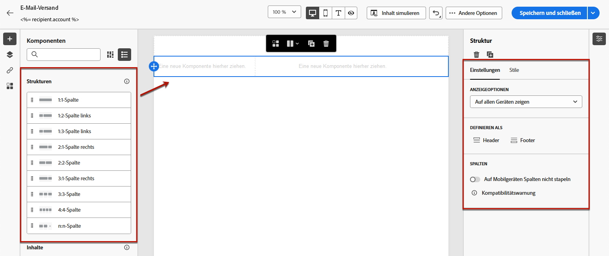
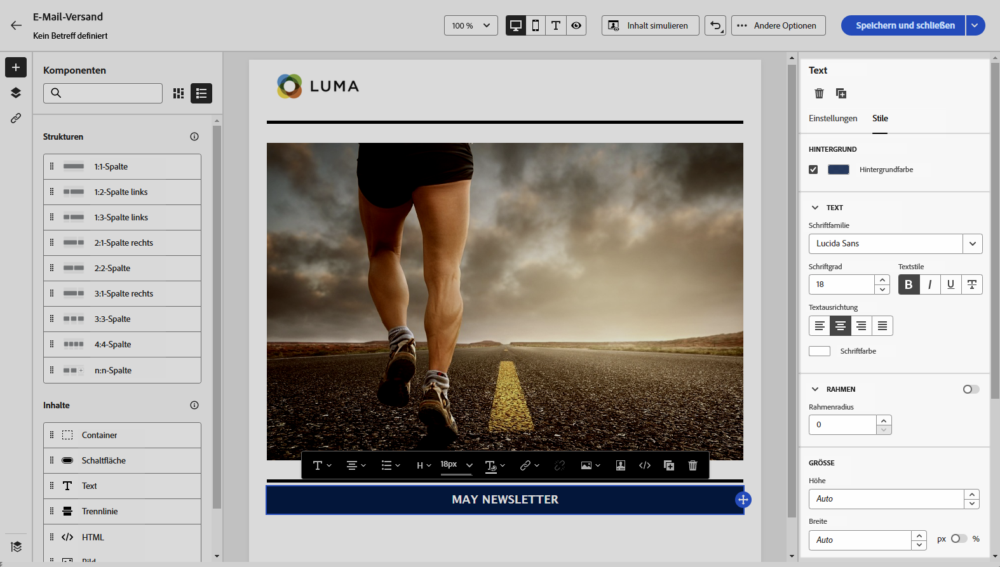
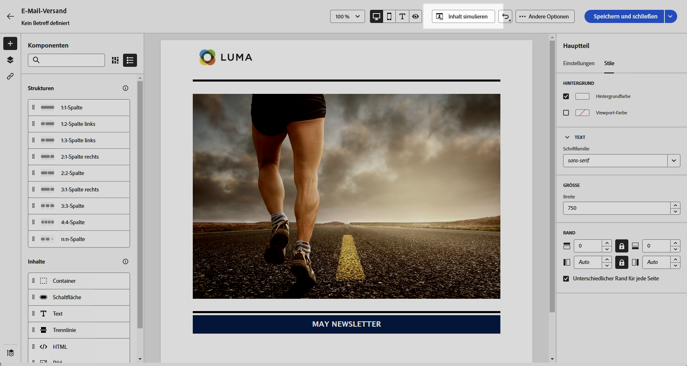

# Starten mit ganz neuem E-Mail-Inhalt {#create-email-content}

>[!CONTEXTUALHELP]
>id="ac_structure_components_email"
>title="Hinzufügen von Strukturen"
>abstract="Strukturen definieren das Layout der E-Mail. Ziehen Sie per Drag-and-Drop eine **Struktur**-Komponente in die Arbeitsfläche, um mit der Gestaltung Ihres E-Mail-Inhalts zu beginnen."

>[!CONTEXTUALHELP]
>id="ac_structure_components_landing_page"
>title="Hinzufügen von Strukturen"
>abstract="Strukturen definieren das Layout der Landingpage. Ziehen Sie per Drag-and-Drop eine **Strukturkomponente** in die Arbeitsfläche, um mit der Gestaltung Ihrer Landingpage zu beginnen."

>[!CONTEXTUALHELP]
>id="ac_structure_components_fragment"
>title="Hinzufügen von Strukturen"
>abstract="Strukturen definieren das Layout des Fragments. Ziehen Sie per Drag-and-Drop eine **Strukturkomponente** in die Arbeitsfläche, um mit der Gestaltung Ihres Fragmentinhalts zu beginnen."

>[!CONTEXTUALHELP]
>id="ac_structure_components_template"
>title="Hinzufügen von Strukturen"
>abstract="Strukturen definieren das Layout der Vorlage. Ziehen Sie per Drag-and-Drop eine **Strukturkomponente** in die Arbeitsfläche, um mit der Gestaltung Ihres Vorlageninhalts zu beginnen."

>[!CONTEXTUALHELP]
>id="ac_edition_columns_email"
>title="Definieren von E-Mail-Spalten"
>abstract="Mit E-Mail-Designer können Sie das Layout Ihrer E-Mail einfach definieren, indem Sie die Spaltenstruktur definieren."

>[!CONTEXTUALHELP]
>id="ac_edition_columns_landing_page"
>title="Definieren der Landingpage-Spalten"
>abstract="Mit E-Mail-Designer können Sie das Layout Ihrer Landingpage einfach definieren, indem Sie die Spaltenstruktur festlegen."

>[!CONTEXTUALHELP]
>id="ac_edition_columns_fragment"
>title="Definieren der Fragmentspalten"
>abstract="Mit E-Mail-Designer können Sie das Layout Ihres Fragements einfach definieren, indem Sie die Spaltenstruktur festlegen."

>[!CONTEXTUALHELP]
>id="ac_edition_columns_template"
>title="Definieren der Vorlagenspalten"
>abstract="Mit E-Mail-Designer können Sie das Layout Ihrer Vorlage einfach definieren, indem Sie die Spaltenstruktur festlegen."

E-Mail-Designer bietet eine einfache Möglichkeit, die Struktur Ihrer E-Mail zu bestimmen. Durch das Hinzufügen und Verschieben von strukturellen Elementen durch einfaches Drag-and-Drop können Sie den Textkörper Ihrer E-Mail in Sekundenschnelle entwerfen.

Gehen Sie wie folgt vor, um mit der Erstellung Ihres E-Mail-Inhalts zu beginnen.

1. Wählen Sie auf der Startseite des [E-Mail-Designers](get-started-email-designer.md#start-authoring) die Option **[!UICONTROL Inhalte von Grund auf neu erstellen]**.

   

1. Beginnen Sie mit der Gestaltung Ihres E-Mail-Inhalts, indem Sie **[!UICONTROL Strukturen]** per Drag-and-Drop auf die Arbeitsfläche ziehen, um das Layout Ihrer E-Mail zu definieren.

   >[!NOTE]
   >
   >Die Stapelung von Spalten ist nicht mit allen E-Mail-Programmen kompatibel. Wenn dies nicht unterstützt wird, werden Spalten nicht gestapelt.

1. Fügen Sie so viele **[!UICONTROL Strukturen]** wie nötig hinzu und bearbeiten Sie deren Einstellungen im entsprechenden Bereich auf der rechten Seite.

   

1. Wählen Sie die Komponente **[!UICONTROL n:n Spalte]** aus, um die Anzahl der Spalten zu definieren (3 bis 10). Sie können auch die Breite jeder Spalte ändern, indem Sie den Pfeil am unteren Rand einer jeden Spalte verschieben.

   >[!NOTE]
   >
   >Die Größe einer Spalte muss immer mindestens 10 % der Gesamtbreite der Strukturkomponente betragen. Sie können nur leere Spalten entfernen.

1. Aus dem Abschnitt **[!UICONTROL Komponenten]** können Sie beliebig viele Elemente per Drag-and-Drop in eine oder mehrere Strukturen ziehen. [Weitere Informationen über Inhaltskomponenten](content-components.md)

1. Jede Komponente kann über die Registerkarten **[!UICONTROL Einstellungen]** oder **[!UICONTROL Stil]** auf der rechten Seite weiter angepasst werden. Beispielsweise können Sie den Textstil, den Abstand oder den Rand jeder Komponente ändern. [Weitere Informationen über Ausrichtung und Abstand](alignment-and-padding.md)

   

1. Fügen Sie Personalisierungsfelder ein, um Ihre E-Mail-Inhalte auf der Grundlage von Profildaten anzupassen. [Weitere Informationen über die Personalisierung von Inhalten](../personalization/personalize.md)

1. Fügen Sie Links zu Ihrem Inhalt hinzu.

   Klicken Sie auf die Registerkarte **[!UICONTROL Links]** im linken Bereich, um die Liste aller zu verfolgenden URLs Ihres Inhalts anzuzeigen. Sie können bei Bedarf deren **[!UICONTROL Tracking-Typ]** oder **[!UICONTROL Kennzeichnung]** ändern und **[!UICONTROL Kategorien]** hinzufügen.

[Weitere Informationen über Links und Nachrichten-Tracking](message-tracking.md)

   

1. Bei Bedarf können Sie Ihre E-Mail weiter personalisieren, indem Sie im erweiterten Menü auf **[!UICONTROL Zum Code-Editor wechseln]** klicken. Auf diese Weise können Sie den Quell-Code der E-Mail bearbeiten, z. B. um Tracking- oder benutzerdefinierte HTML-Tags hinzuzufügen. [Weitere Informationen über den Code-Editor](code-content.md)

   >[!CAUTION]
   >
   >Nach dem Wechsel zum Code-Editor können Sie für diese E-Mail nicht mehr zum visuellen Designer zurückkehren.

1. Sobald Ihr Inhalt bereit ist, klicken Sie auf **[!UICONTROL Inhalt simulieren]**, um das E-Mail-Rendering zu überprüfen. Sie können zwischen der Desktop- oder der mobilen Ansicht wählen. [Weitere Informationen über die Vorschau Ihrer E-Mail](../preview-test/preview-test.md)

   

1. Wenn Ihre E-Mail bereit ist, klicken Sie auf **[!UICONTROL Speichern]**.

