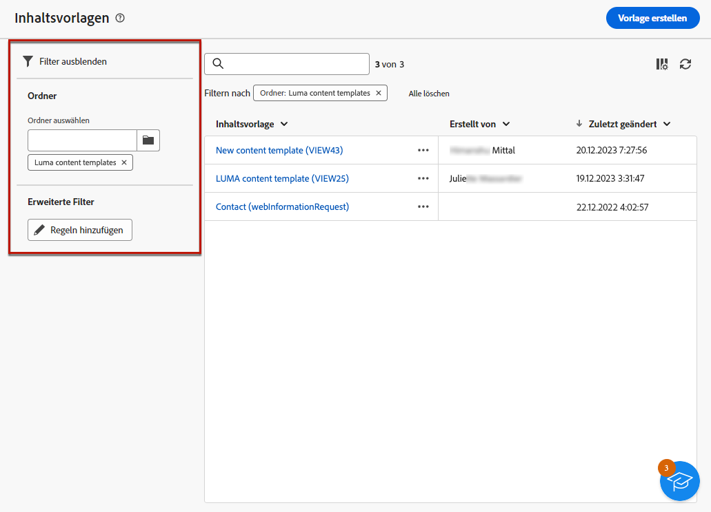
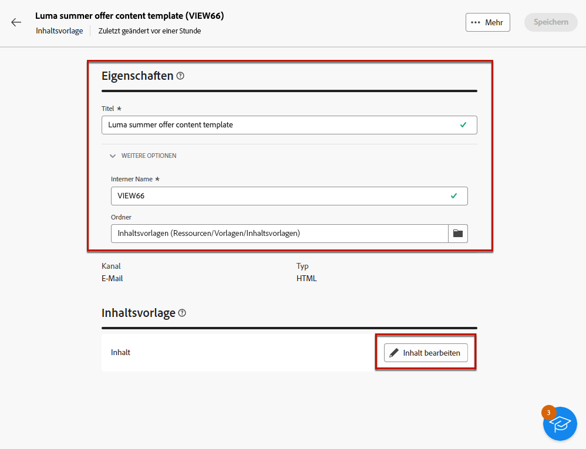
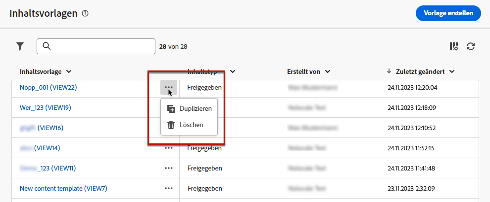
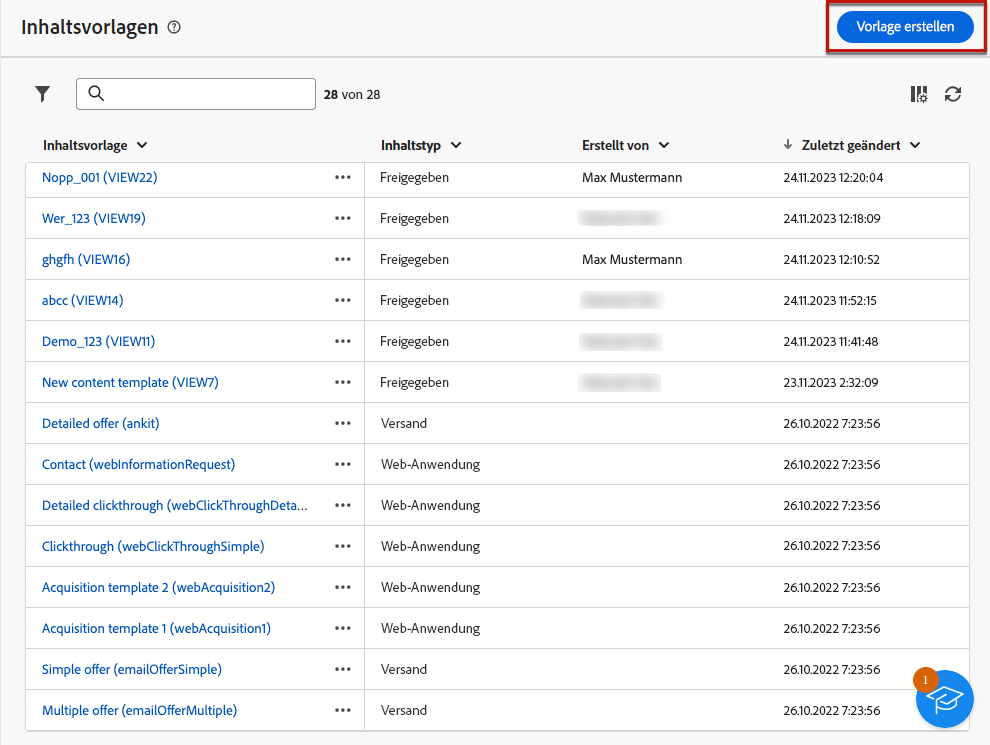
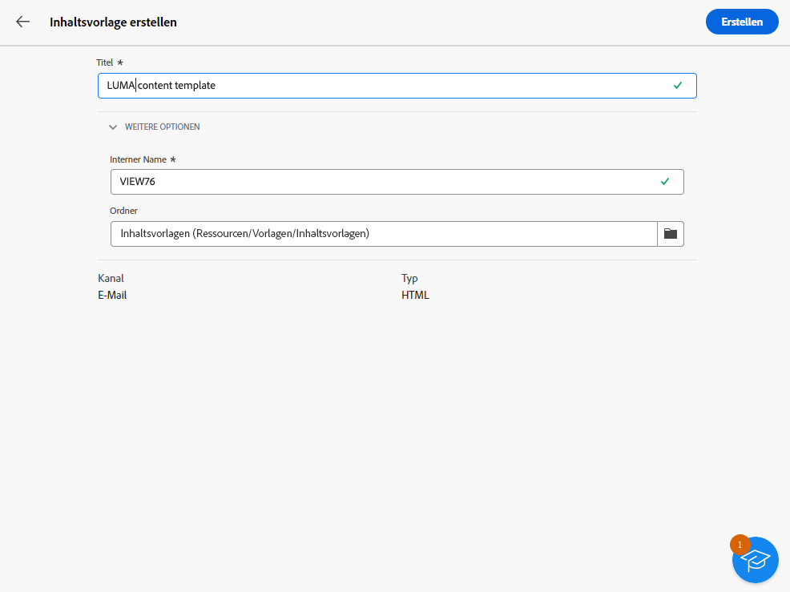
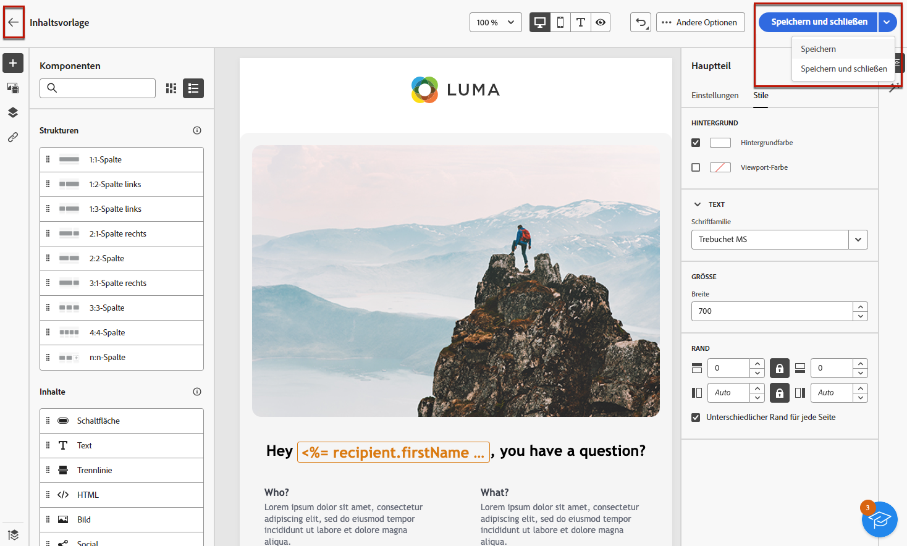
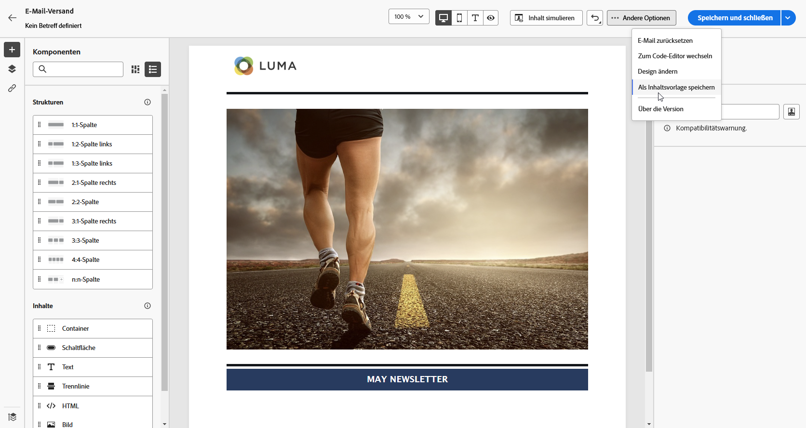
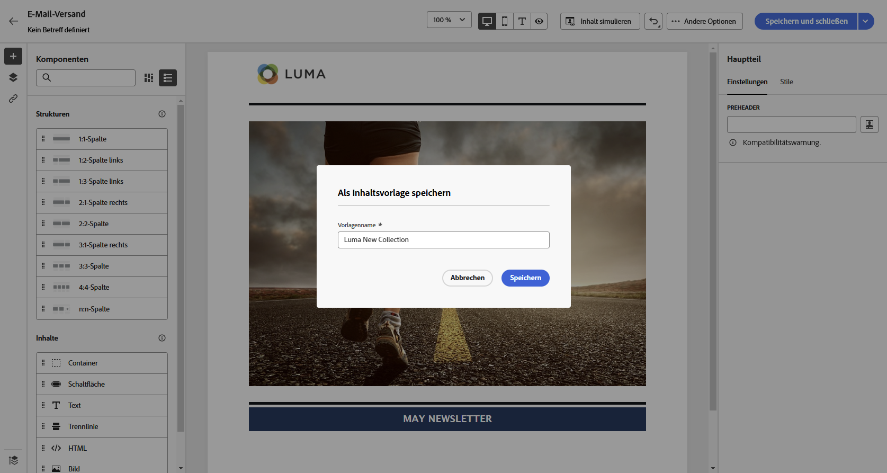
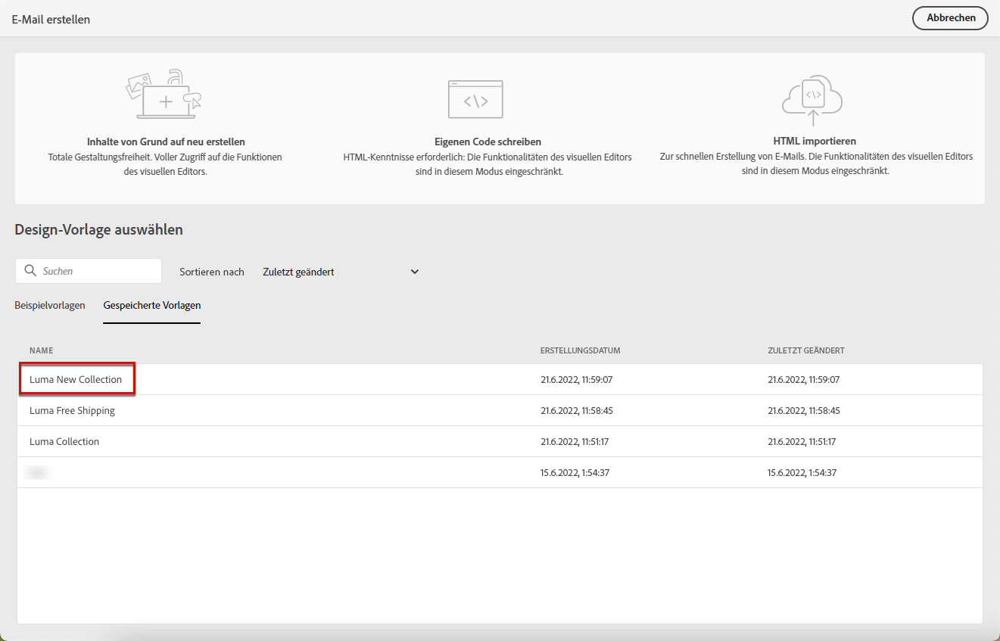

# Arbeiten mit Inhaltsvorlagen {#content-templates}

>[!CONTEXTUALHELP]
>id="acw_contenttemplate_menu"
>title="Definieren Ihrer eigenen Inhalte"
>abstract="Erstellen Sie eine eigenständige benutzerdefinierte Vorlage von Grund auf, damit Ihr Inhalt über mehrere E-Mails hinweg wiederverwendet werden kann."

Um den Design-Prozess zu beschleunigen und zu verbessern, können Sie eigenständige Vorlagen erstellen, um benutzerdefinierte Inhalte in [!DNL Adobe Campaign] einfach wiederzuverwenden.

Diese Funktion ermöglicht es inhaltsorientierten Benutzenden, an eigenständigen Vorlagen zu arbeiten, sodass Marketing-Benutzende diese in ihren E-Mail-Kampagnen wiederverwenden und anpassen können.

>[!NOTE]
>
>Derzeit werden nur **E-Mail**-Inhaltsvorlagen unterstützt.

## Aufrufen und Verwalten von Vorlagen {#access-manage-templates}

>[!CONTEXTUALHELP]
>id="acw_contenttemplate_edition"
>title="Bearbeiten des Vorlageninhalts"
>abstract="Klicken Sie auf die Schaltfläche **Inhalt bearbeiten**, um Ihre Inhalte mit dem E-Mail-Designer zu aktualisieren."

Um auf die Liste der Inhaltsvorlagen zuzugreifen, wählen Sie **[!UICONTROL Content-Management]** > **[!UICONTROL Inhaltsvorlagen]** über das Menü links aus.

Alle Vorlagen, die erstellt wurden, werden angezeigt – sowohl die, die mit der Option [Als Vorlage speichern](#save-as-template) aus einer E-Mail erstellt wurden, als auch die vom Menü **[!UICONTROL Inhaltsvorlagen]**.

<!--You can sort content templates by creation or modification date. You can also choose to display only the items that you created or modified.-->

Sie können nach einem bestimmten [Ordner](../get-started/permissions.md#folders) über die Dropdown-Liste filtern oder Regeln mithilfe des [Abfrage-Modelers](../query/query-modeler-overview.md) hinzufügen.

Um Inhalt für eine Vorlage zu bearbeiten, klicken Sie in der Liste auf das gewünschte Element. Sie haben folgende Möglichkeiten:

* Bearbeiten der Eigenschaften.

* Klicken Sie auf die Schaltfläche **[!UICONTROL Inhalt bearbeiten]**, um den Inhalt mit dem [E-Mail-Designer](get-started-email-designer.md) zu aktualisieren.

Um eine Vorlage zu löschen, wählen Sie die entsprechende Option aus dem Menü **[!UICONTROL Mehr Aktionen]** aus.

>[!NOTE]
>
>Wenn eine Vorlage gelöscht wird, sind die mit dieser Vorlage bereits erstellten Sendungen nicht betroffen.

## Erstellen von Inhaltsvorlagen {#create-content-templates}

>[!CONTEXTUALHELP]
>id="acw_contenttemplate_design"
>title="Inhaltsvorlage – Design"
>abstract="Inhaltsvorlage – Design"

>[!CONTEXTUALHELP]
>id="acw_contenttemplate_selection"
>title="Inhaltsvorlage – Auswahl"
>abstract="Inhaltsvorlage – Auswahl"

Es gibt zwei Möglichkeiten, Inhaltsvorlagen zu erstellen:

* Sie können eine neue Inhaltsvorlage mit dem Menü **[!UICONTROL Inhaltsvorlagen]** in der linken Leiste von Grund auf neu erstellen. [Weitere Informationen dazu](#create-template-from-scratch)

* Speichern Sie beim Entwerfen einer E-Mail Ihren E-Mail-Inhalt als Vorlage ab. [Weitere Informationen dazu](#save-as-template)

Nach der Speicherung können Sie diese Vorlage jetzt beim Erstellen einer beliebigen [E-Mail](../email/create-email.md) in [!DNL Adobe Campaign] verwenden. [Weitere Informationen dazu](use-email-templates.md)

>[!NOTE]
>
>* Änderungen an Inhaltsvorlagen werden nicht in E-Mails übernommen.
>
>* Wenn Vorlagen in einer E-Mail verwendet werden, wirken sich Änderungen an Ihrem E-Mail-Inhalt nicht auf die zuvor verwendete Inhaltsvorlage aus.

### Erstellen einer Vorlage von Grund auf {#create-template-from-scratch}

>[!CONTEXTUALHELP]
>id="acw_contenttemplate_properties"
>title="Definieren von Eigenschaften für Vorlagen"
>abstract="Wenn Sie eine Vorlage von Grund auf neu erstellen, definieren Sie die Eigenschaften, um sie bei Bedarf ganz einfach abrufen zu können."

Gehen Sie wie folgt vor, um eine Inhaltsvorlage von Grund auf neu zu erstellen.

1. Greifen Sie über das Menü **[!UICONTROL Content-Management]** > **[!UICONTROL Inhaltsvorlagen]** auf der linken Seite auf die Inhaltsvorlagen zu.

1. Wählen Sie **[!UICONTROL Vorlage erstellen]** aus.

   

1. Füllen Sie die Vorlagendetails aus. Sie können den Ordner auswählen, in dem Sie Ihre Vorlage speichern möchten. Standardmäßig werden Inhaltsvorlagen in einem dedizierten Ordner der Adobe Campaign-Hierarchie gespeichert: **[!UICONTROL Explorer]** > **[!UICONTROL Ressourcen]** > **[!UICONTROL Vorlagen]** > **[!UICONTROL Inhaltsvorlagen]**. [Erfahren Sie, wie Sie Ordner erstellen](../get-started/permissions.md#folders)

   

   >[!NOTE]
   >
   >Derzeit wird nur der Kanal **E-Mail** und der Typ **HTML** unterstützt.

1. Klicken Sie auf **[!UICONTROL Erstellen]** und wählen Sie aus den verschiedenen Optionen aus, wie Sie Ihre Vorlage entwerfen möchten:

   * [E-Mail von Grund auf neu erstellen](create-email-content.md) über die Benutzeroberfläche des E-Mail-Designers.

   * [Rohes HTML kodieren oder einfügen](code-content.md) direkt im E-Mail-Designer.

   * [Vorhandenen HTML-Inhalt importieren](existing-content.md) aus einer Datei oder einem ZIP-Ordner.

   * Verwenden Sie vorhandenen Inhalt aus einer Liste integrierter oder benutzerdefinierter Vorlagen. Die Schritte zur Verwendung einer Inhaltsvorlage in einer E-Mail werden in [diesem Abschnitt](use-email-templates.md) beschrieben.

   

1. Der [E-Mail-Designer](get-started-email-designer.md) wird angezeigt. Bearbeiten Sie Ihren Inhalt nach Bedarf, so wie Sie es bei jeder anderen E-Mail auch tun würden, je nach der von Ihnen gewählten Option.

   <!--You can test your content if needed. [Learn how](#test-template)-->

1. Wenn die Vorlage fertig ist, klicken Sie auf **[!UICONTROL Speichern]**.

   Klicken Sie bei Bedarf auf den Pfeil neben dem Vorlagennamen, um zum Bildschirm **[!UICONTROL Details]** zurückzukehren und die Vorlage zu bearbeiten.

   

Die Vorlage wird im Standardordner der Adobe Campaign-Hierarchie (**[!UICONTROL Explorer]** > **[!UICONTROL Ressourcen]** > **[!UICONTROL Vorlagen]** > **[!UICONTROL Inhaltsvorlagen]**). [Weitere Informationen zu Ordnern](../get-started/permissions.md#folders)

Sie wird auch im **[!UICONTROL Inhaltsvorlagen]** Liste. [Weitere Informationen](#access-manage-templates)

Anhand dieser Vorlage können Sie nun einen neuen Inhalt erstellen: Sie finden ihn in der Registerkarte **[!UICONTROL Gespeicherte Vorlagen]** des E-Mail-Designers. [Weitere Informationen dazu](use-email-templates.md)

### Speichern von E-Mail-Inhalten als Vorlage {#save-as-template}

Sobald Sie [eine E-Mail gestaltet haben](create-email-content.md), können Sie diesen Inhalt als Vorlage speichern, um ihn später wiederzuverwenden. Gespeicherte Vorlagen stehen allen in Ihrer Adobe Campaign-Umgebung zur Verfügung.

Gehen Sie wie folgt vor, um E-Mail-Inhalte als Vorlage zu speichern:

1. Klicken Sie im E-Mail-Designer oben rechts im Bildschirm auf **[!UICONTROL Mehr]**.

1. Wählen Sie im Dropdown-Menü **[!UICONTROL Als Inhaltsvorlage speichern]** aus.

   

1. Geben Sie einen Namen für diese Vorlage ein und speichern Sie sie.

   

Die Vorlage wird im Standardordner der Adobe Campaign-Hierarchie (**[!UICONTROL Explorer]** > **[!UICONTROL Ressourcen]** > **[!UICONTROL Vorlagen]** > **[!UICONTROL Inhaltsvorlagen]**). [Weitere Informationen zu Ordnern](../get-started/permissions.md#folders)

Sie wird auch im **[!UICONTROL Inhaltsvorlagen]** Liste. Sie wird zu einer eigenständigen Inhaltsvorlage, die Sie wie jedes andere Element in der Liste öffnen, bearbeiten und löschen können. [Weitere Informationen](#access-manage-templates)

Anhand dieser Vorlage können Sie nun einen neuen Inhalt erstellen: Sie finden ihn in der Registerkarte **[!UICONTROL Gespeicherte Vorlagen]** des E-Mail-Designers. [Weitere Informationen dazu](use-email-templates.md)

>[!NOTE]
>
>Änderungen an dieser neuen Vorlage werden nicht an die E-Mail-Adresse weitergeleitet, von der sie stammen. Wenn der ursprüngliche Inhalt in dieser E-Mail bearbeitet wird, wird die neue Vorlage ebenfalls nicht geändert.

<!--

Test your content template {#test-template}

You can test the rendering of any email content template, whether created from scratch or from an email. To do so, follow the steps below.

1. Access the content template list.

1. Click **[!UICONTROL Edit content]** from the **[!UICONTROL Template properties]**.

1. Click **[!UICONTROL Simulate Content]** and select a test profile to check your email rendering. You can choose the desktop or mobile view.

1. You can send a proof to test your content and have it approved by some internal users before using it. To do so, click the **[!UICONTROL Send proof]** button and follow the steps described in .

-->
