# Senden Ihrer ersten E-Mail {#first-email}

>[!CONTEXTUALHELP]
>id="acw_homepage_card2"
>title="Erste Schritte mit E-Mails"
>abstract="Beginnen Sie mit einer Vorlage oder verwenden Sie den neuen Email Designer von Adobe Campaign, um E-Mails zu erstellen, ohne eine einzelne Codezeile schreiben zu müssen. Erfahren Sie, wie Sie mit Email Designer Inhalte erstellen, eine Vorschau anzeigen und testen und eine E-Mail an eine bestehende Audience senden können."

Erfahren Sie, wie Sie Ihre erste E-Mail an eine bestimmte Zielgruppe senden. In diesem Anwendungsfall planen Sie den Versand einer E-Mail an Silber- und Gold-Mitglieder des Treueprogramms zu einem bestimmten Datum.

Die E-Mail basiert auf einer vordefinierten Design-Vorlage und enthält auch personalisierte Inhalte, die anhand von Kundenprofilattributen erstellt werden.

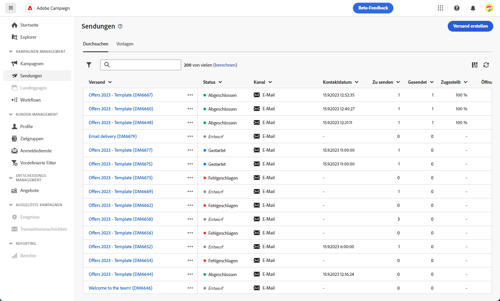

## E-Mail-Versand erstellen {#create-email}

>[!CONTEXTUALHELP]
>id="acw_deliveries_email_template_selection"
>title="Wählen Sie eine E-Mail-Vorlage aus"
>abstract="Eine E-Mail-Vorlage ist eine spezifische Versandkonfiguration, die vordefinierte Einstellungen wie Typologieregeln, Personalisierungs- oder Routing-Parameter enthält. Vorlagen werden in der Campaign-Clientkonsole definiert."

>[!CONTEXTUALHELP]
>id="acw_deliveries_email_properties"
>title="E-Mail-Eigenschaften"
>abstract="Die Eigenschaften sind die üblichen Versandparameter, nach denen ein Versand benannt und klassifiziert werden kann. Wenn der Versand auf einem erweiterten Schema basiert, das in der Adobe Campaign v8-Konsole definiert ist, stehen einige bestimmte **benutzerdefinierte Optionen** zur Verfügung."

Gehen Sie wie folgt vor, um einen neuen Versand zu erstellen:

1. Navigieren Sie zum **[!UICONTROL Sendungen]** in der linken Leiste auf und klicken Sie auf das  **[!UICONTROL Versand erstellen]** Schaltfläche.

1. Wählen Sie **[!UICONTROL E-Mail]** als Kanal und eine Vorlage aus.

   >[!NOTE]
   >
   >Vorlagen sind vorkonfigurierte Versandeinstellungen, die für die zukünftige Verwendung gespeichert werden. [Weitere Informationen](../msg/delivery-template.md)

   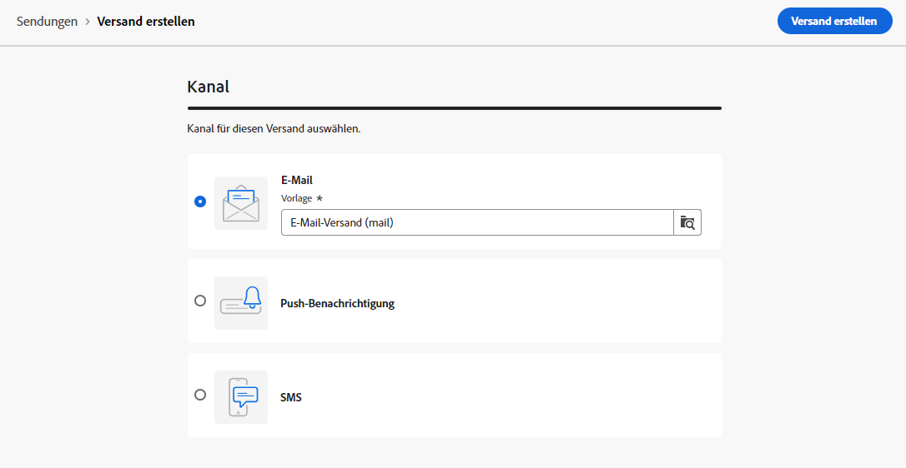

1. Klicken Sie zur Bestätigung auf **[!UICONTROL Versand erstellen]**.
1. Geben Sie einen Titel für den Versand ein und konfigurieren Sie zusätzliche Optionen entsprechend Ihren Anforderungen:

   * **[!UICONTROL Interner Name]**: Weisen Sie dem Versand eine eindeutige Kennung zu,
   * **[!UICONTROL Ordner]**: Speichern Sie den Versand in einem bestimmten Ordner,
   * **[!UICONTROL Versand-Code]**: Verwenden Sie dieses Feld, um Ihre Sendungen basierend auf Ihrer eigenen Namenskonvention zu organisieren.
   * **[!UICONTROL Beschreibung]**: Geben Sie eine Beschreibung für den Versand an,
   * **[!UICONTROL Art]**: Geben Sie die Art der E-Mail zu Klassifizierungszwecken an.<!--The content of the list is defined in the delivery template selected when creating the email.-->

   >[!NOTE]
   >
   >Wenn Sie Ihr Schema mit bestimmten benutzerdefinierten Feldern erweitert haben, können Sie diese im Abschnitt **[!UICONTROL Benutzerdefinierte Optionen]** aufrufen.

   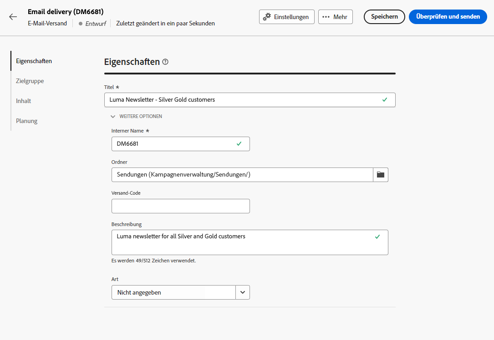

   Erweiterte Einstellungen wie Typologieregeln und Zielgruppen-Mappings sind über die Schaltfläche neben dem Versandnamen zugänglich. Diese Einstellungen sind zwar in der ausgewählten Vorlage vorkonfiguriert, können jedoch für diese E-Mail nach Bedarf bearbeitet werden.

## Erstellen des E-Mail-Inhalts {#create-content}

Detaillierte Informationen zur Konfiguration von E-Mail-Inhalten finden Sie in [diesem Abschnitt](../content/edit-content.md).

In diesem Anwendungsfall verwenden Sie eine vordefinierte Vorlage, um eine E-Mail zu erstellen.

1. Um mit der Erstellung des E-Mail-Inhalts zu beginnen, öffnen Sie den E-Mail-Versand und klicken Sie auf die Schaltfläche **[!UICONTROL Inhalt bearbeiten]**.

   Dies führt Sie zu einer speziellen Oberfläche, auf der Sie den Inhalt der E-Mail konfigurieren und mit dem E-Mail-Designer gestalten können.

   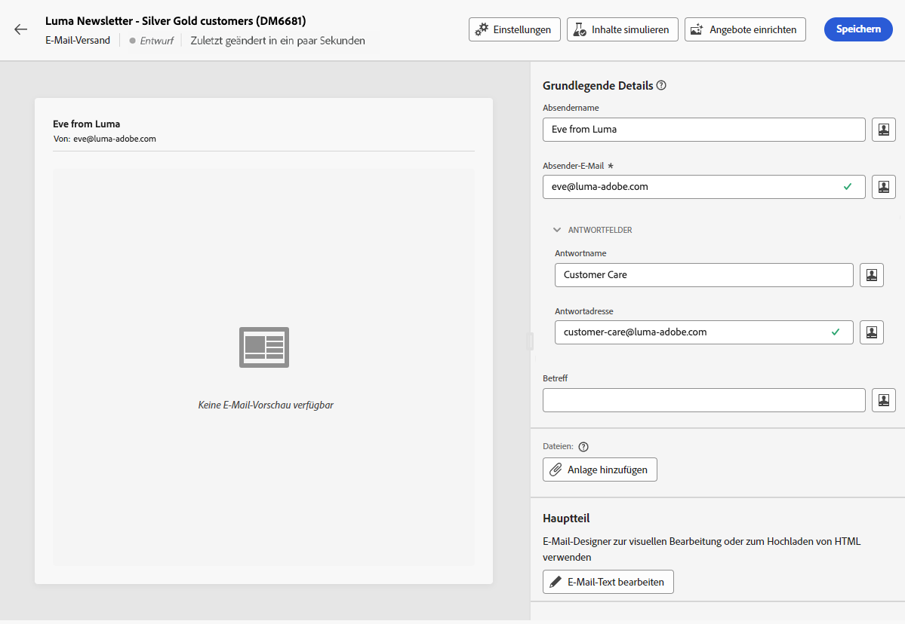

1. Geben Sie die Betreffzeile Ihrer E-Mail ein und personalisieren Sie sie mit dem Ausdruckseditor. [Erfahren Sie, wie Sie Ihren Inhalt personalisieren können](../personalization/personalize.md)

   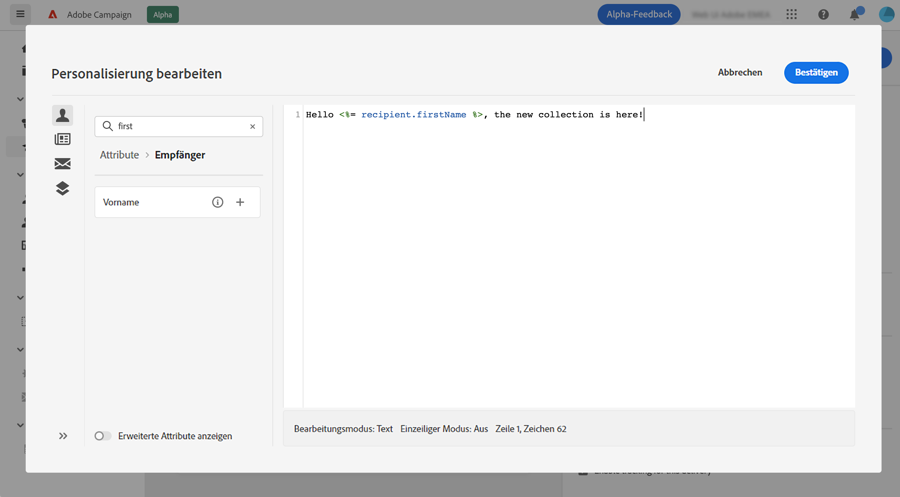

1. Um den Inhalt der E-Mail zu gestalten, klicken Sie auf die Schaltfläche **[!UICONTROL E-Mail-Textkörper bearbeiten]**.

   Wählen Sie die Methode zur Erstellung des Inhalts Ihrer E-Mail aus. Verwenden Sie in diesem Beispiel eine vordefinierte Design-Vorlage.

   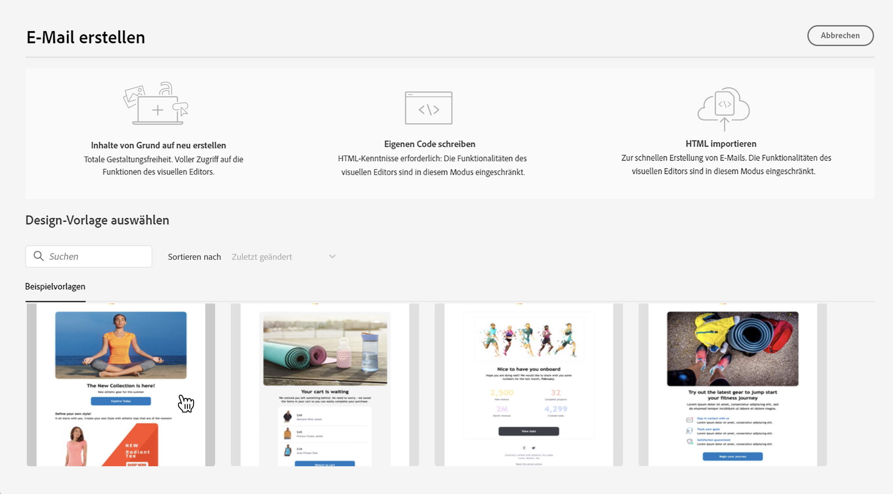

   <!--1. Select the HTML or ZIP file to import then click **[!UICONTROL Next]**.

    If your folder contains assets, choose the instance and folder where they should be stored then click **[!UICONTROL Import]**. (+ link to doc on assets?)

    -->

1. Wenn Sie die Vorlage auswählen, wird sie im E-Mail-Designer angezeigt, wo Sie alle notwendigen Änderungen vornehmen und eine Personalisierung hinzufügen können.

   Um zum Beispiel dem E-Mail-Titel eine Personalisierung hinzuzufügen, wählen Sie den Komponentenblock aus und klicken Sie auf **[!UICONTROL Personalisierung hinzufügen]**.

   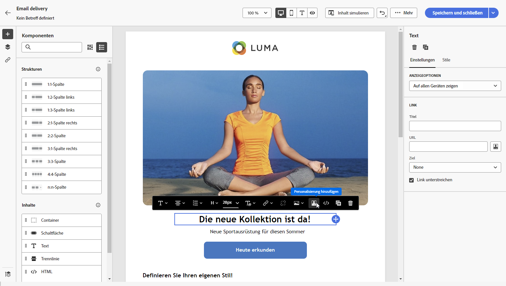

1. Wenn Sie mit dem Inhalt zufrieden sind, speichern und schließen Sie Ihren Entwurf. Klicken Sie auf **[!UICONTROL Speichern]**, um zum Bildschirm für die E-Mail-Erstellung zurückzukehren.

   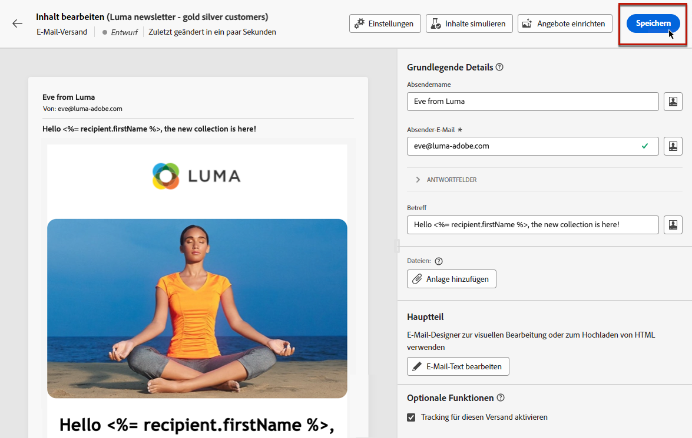

## Audience definieren {#define-audience}

>[!CONTEXTUALHELP]
>id="acw_deliveries_email_audience"
>title="Audience definieren"
>abstract="Die optimale Audience für Marketing-Nachrichten auswählen. Eine bestehende Audience auswählen, die bereits in einer Campaign v8-Instanz oder in Adobe Experience Platform definiert ist oder mit dem Regel-Builder eine neue Audience erstellen. Kontrollgruppen sind nicht für &quot;Aus Datei auswählen&quot;aktiviert und umgekehrt."

In diesem Anwendungsbeispiel senden Sie die E-Mail an eine bestehende Audience. Weitere Anweisungen zur Verwendung von Audiences finden Sie in [diesem Abschnitt](../audience/about-audiences.md).

1. Um die Audience für die E-Mail auszuwählen, klicken Sie auf die Schaltfläche **[!UICONTROL Audience auswählen]** und wählen eine vorhandene Audience aus der Liste aus.

   In diesem Beispiel möchten wir eine bestehende Audience verwenden, die auf Kunden der Treuepunktestufen Silber und Gold abzielt.

   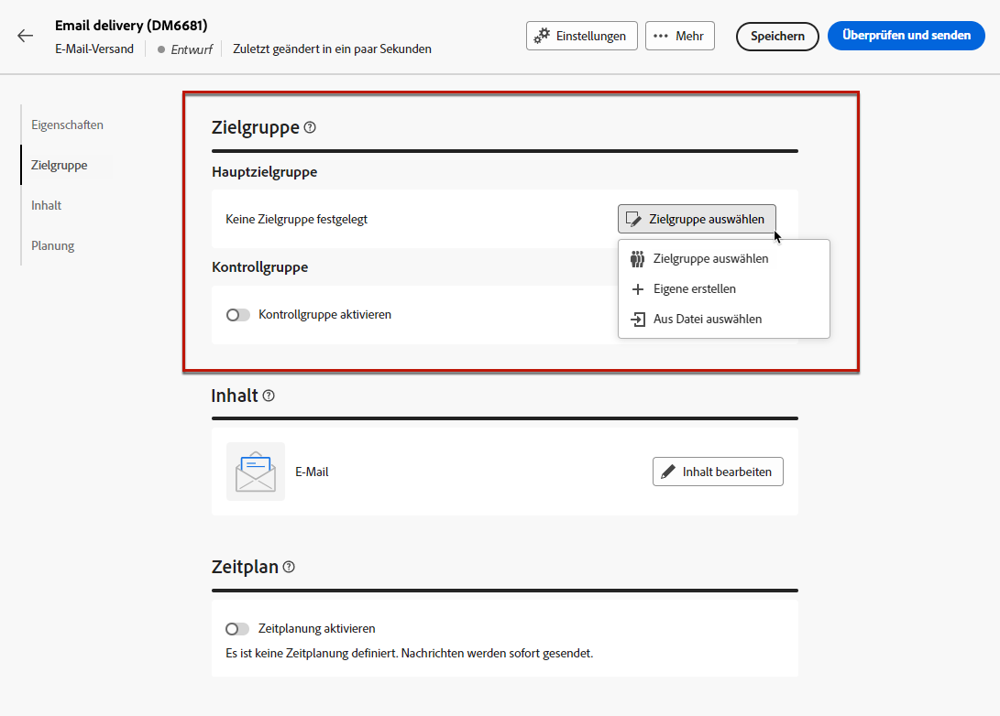

   >[!NOTE]
   >
   >Die in der Liste verfügbaren Audiences stammen entweder von Ihrer Campaign v8-Instanz oder von Adobe Experience Platform, wenn die Integration von Zielen und Quellen in Ihrer Instanz konfiguriert wurde.
   >
   >Die Ziel-/Quellen-Integration ermöglicht es Ihnen, Experience Platform-Segmente an Adobe Campaign zu senden und Versand- und -Trackinglogs von Campaign an Adobe Experience Platform zu senden. [Erfahren Sie, wie Sie mit Campaign und Adobe Experience Platform arbeiten](https://experienceleague.adobe.com/docs/campaign/campaign-v8/connect/ac-aep.html?lang=de){target="_blank"}.

1. Nach Auswahl der Audience können Sie die Zielgruppe durch Anwendung zusätzlicher Regeln weiter verfeinern.

   Sie können auch eine Kontrollgruppe einrichten, um das Verhalten der E-Mail-Empfängerinnen und -Empfänger im Vergleich zum Verhalten von nicht angesprochenen Profilen zu analysieren. [Erfahren Sie, wie Sie mit Kontrollgruppen arbeiten](../audience/control-group.md)

   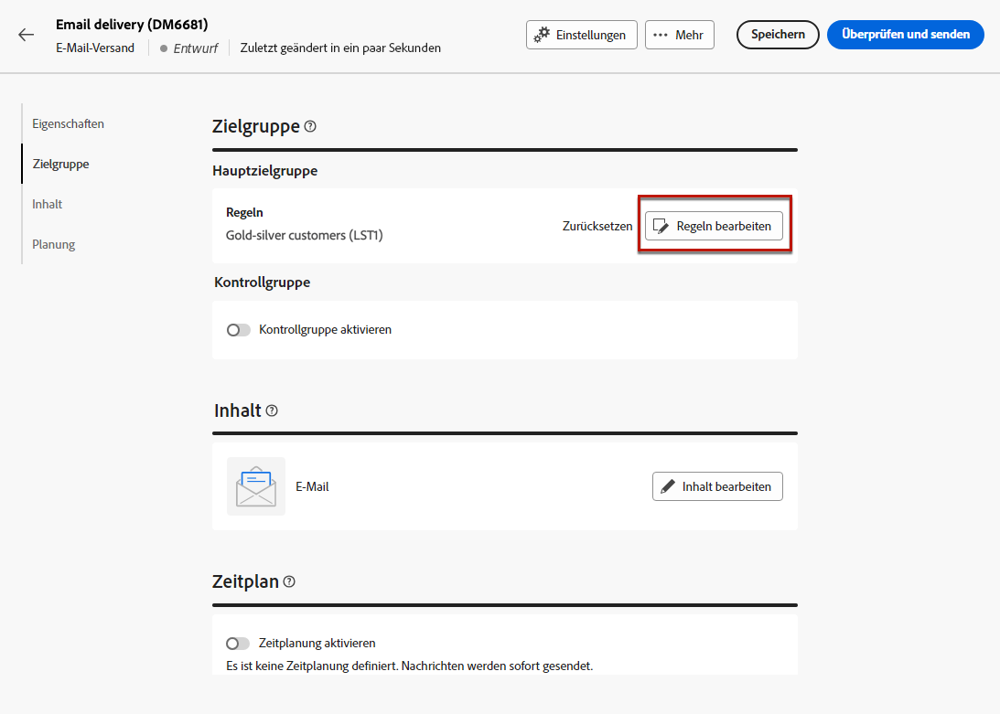

## Terminieren des Versands {#schedule}

>[!CONTEXTUALHELP]
>id="acw_deliveries_email_schedule"
>title="Terminieren des Versands"
>abstract="Definieren Sie das Datum und die genaue Uhrzeit für Ihren Versand. Indem Sie den günstigsten Zeitpunkt für Ihre Werbenachricht wählen, maximieren Sie die Öffnungsraten."

Um den Versand der E-Mail zu planen, öffnen Sie den E-Mail-Versand und navigieren Sie zum Abschnitt **Zeitplan**. Verwenden Sie den Umschalter **[!UICONTROL Zeitplan aktivieren]**, um ihn zu aktivieren, und legen Sie das gewünschte Datum und die gewünschte Uhrzeit für den Versand fest. Nach dem Versand beginnt der eigentliche Versand am von Ihnen definierten Kontaktdatum.

Standardmäßig ist die Option **[!UICONTROL Bestätigung vor dem Senden aktivieren]** aktiviert. Für diese Option müssen Sie den Versand bestätigen, bevor die E-Mail zum geplanten Zeitpunkt gesendet wird. Wenn Sie die E-Mail automatisch zum geplanten Zeitpunkt versenden müssen, können Sie diese Option deaktivieren.

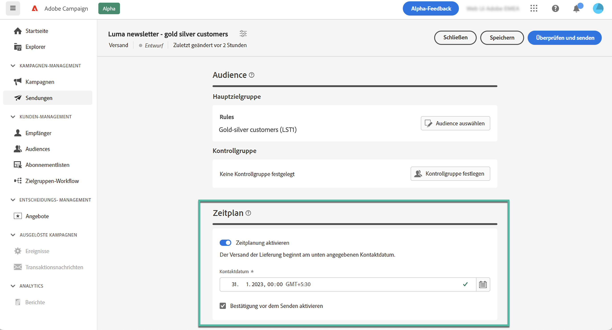

## Anzeigen der Vorschau und Testen der E-Mail {#preview-test}

Bevor Sie Ihre E-Mail versenden, können Sie sie in der Vorschau anzeigen und testen, um sicherzustellen, dass sie Ihren Erwartungen entspricht.

In diesem Anwendungsbeispiel sehen Sie sich die E-Mail-Vorschau an und senden Testversionen an bestimmte E-Mail-Adressen, während Sie einige der Zielgruppenprofile ersetzen.

Weitere Informationen zum Anzeigen einer Vorschau und zum Testen von E-Mails finden Sie in [diesem Abschnitt](../preview-test/preview-test.md).

1. Um Ihre E-Mail zu überprüfen, klicken Sie auf **[!UICONTROL Überprüfen und senden]**. Daraufhin wird eine Vorschau Ihrer E-Mail angezeigt, einschließlich der konfigurierten Eigenschaften, der Audience und des Zeitplans. Sie können jedes dieser Elemente bearbeiten, indem Sie auf die Schaltfläche „Ändern“ klicken.

1. Um eine Vorschau der E-Mail anzuzeigen und Testversionen zu senden, klicken Sie auf die Schaltfläche **[!UICONTROL Inhalt simulieren]**.

   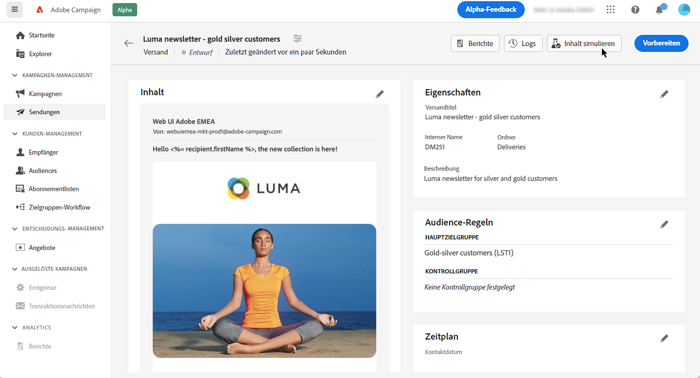

1. Wählen Sie im linken Seitenbereich die Profile aus, die für die Vorschau der E-Mail verwendet werden sollen.

   Im rechten Bereich wird eine Vorschau der E-Mail auf der Basis des ausgewählten Profils angezeigt. Wenn Sie mehrere Profile hinzugefügt haben, können Sie zwischen diesen Profilen wechseln, um eine Vorschau der jeweiligen E-Mail anzuzeigen.

   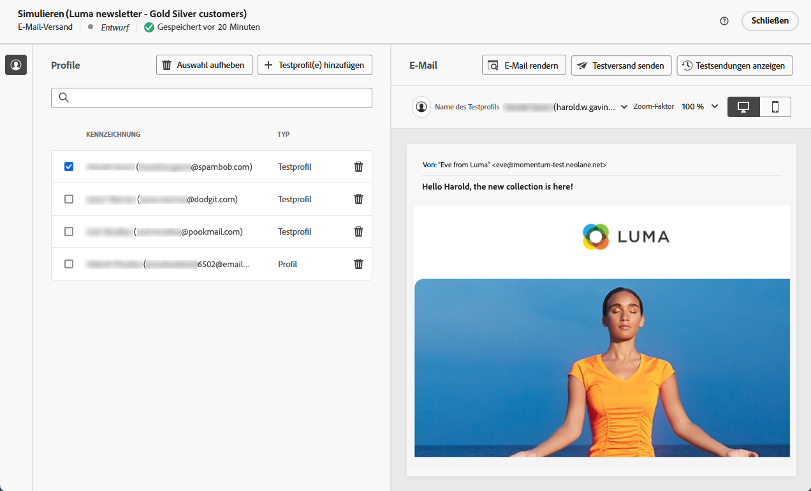

   <!-- !NOTE
    >
    >Additionally, the **[!UICONTROL Render email]** button allows you to preview the email using mutiple devices or mail providers. Learn on how to preview email rendering-->

1. Um Testversionen Ihrer E-Mail zu senden, klicken Sie auf die Schaltfläche **[!UICONTROL Test]** und wählen Sie den gewünschten Modus aus.

   Verwenden Sie in diesem Beispiel den Modus **[!UICONTROL Aus Hauptzielgruppe ersetzen]**. In diesem Modus werden Testversionen an bestimmte E-Mail-Adressen gesendet, deren Profil durch ein anderes ersetzt wurde.

   

1. Klicken Sie auf **[!UICONTROL Adresse hinzufügen]** und geben Sie die E-Mail-Adresse(n) an, die die Testversionen erhalten soll(en).

   Wählen Sie für jede E-Mail-Adresse ein Ersatzprofil aus. Sie können Adobe Campaign auch ein zufälliges Profil aus der Zielgruppe auswählen lassen.

   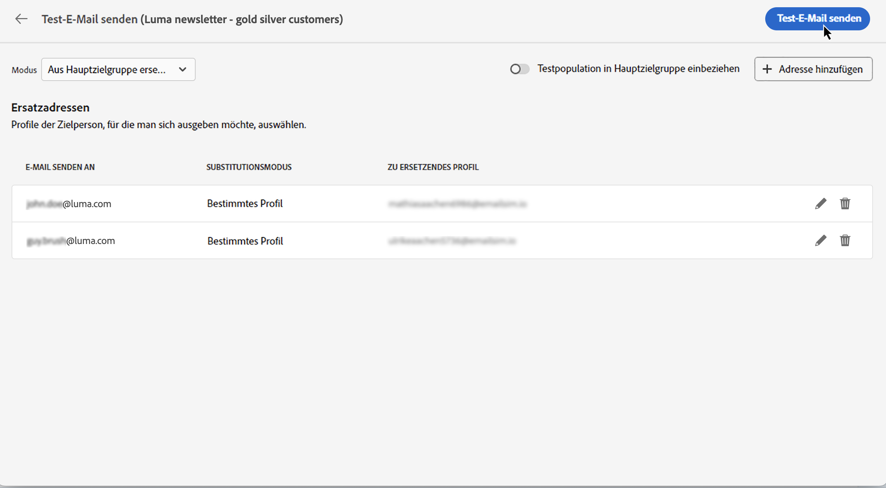

1. Klicken Sie auf **[!UICONTROL Test-E-Mail senden]** und bestätigen Sie dann den Versand.

   Testversionen werden an die angegebenen E-Mail-Adressen unter Verwendung des ausgewählten Profils mit dem Präfix **[Testversand x]** gesendet.

   

   Sie können den Status des Versands überprüfen und jederzeit auf die gesendeten Test-E-Mails zugreifen, indem Sie auf die Schaltfläche **[!UICONTROL Test-E-Mail-Protokoll anzeigen]** im Bildschirm „Inhalt simulieren“ klicken.

## Senden und Überwachen der E-Mail {#prepare-send}

Nachdem Sie Ihre E-Mail geprüft und getestet haben, können Sie die Vorbereitung starten und die E-Mail versenden.

1. Um die Vorbereitung der E-Mail zu starten, klicken Sie auf **[!UICONTROL Vorbereiten]**. [Erfahren Sie, wie Sie eine E-Mail vorbereiten](../monitor/prepare-send.md)

   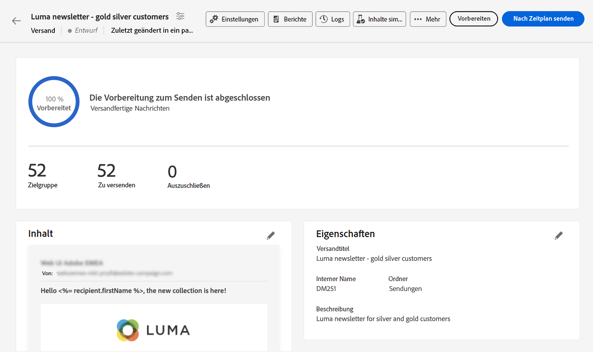

1. Wenn Ihre E-Mail versandbereit ist, klicken Sie auf die Schaltfläche **[!UICONTROL Senden]** (oder **[!UICONTROL Nach Zeitplan senden]**, wenn Sie den Versand zeitlich geplant haben) und bestätigen Sie den Versand.

1. Während des Sendevorgangs können Sie seinen Fortschritt verfolgen und Statistiken in Echtzeit direkt in diesem Bildschirm einsehen.

   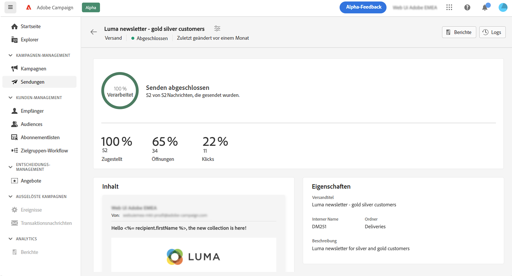

   Sie können auch detaillierte Informationen über die Sendung abrufen, indem Sie auf die Schaltfläche **[!UICONTROL Logs]** klicken. [Erfahren Sie, wie Sie Versandlogs überwachen](../monitor/delivery-logs.md)

1. Nachdem die E-Mail versendet wurde, können Sie auf spezielle Berichte zur weiteren Analyse zugreifen, indem Sie auf die Schaltfläche **[!UICONTROL Reporting]** klicken.

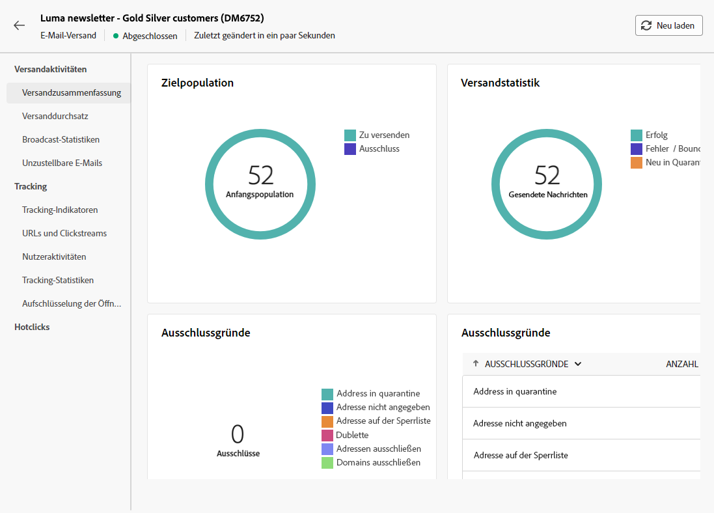
