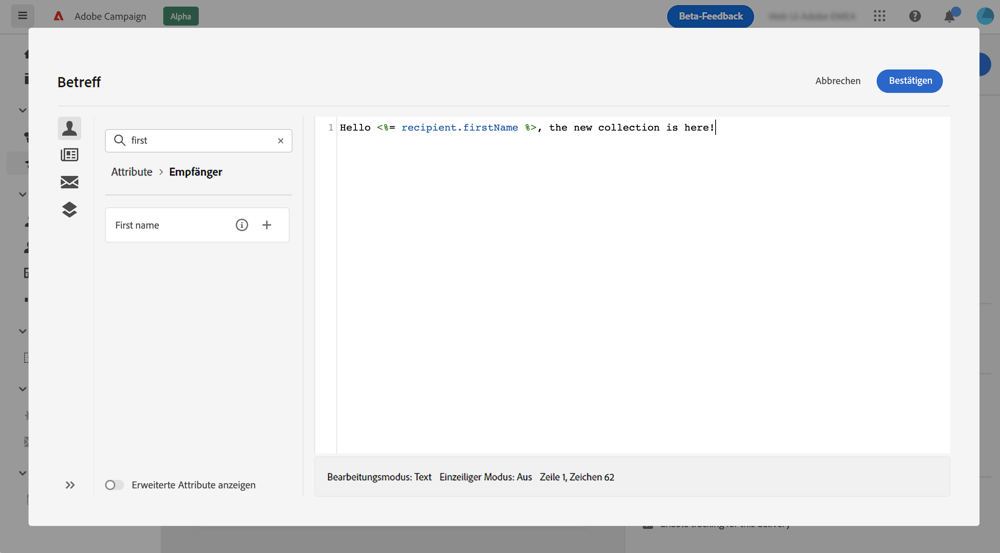

# Erstellen Ihrer ersten E-Mail {#first-email}

>[!CONTEXTUALHELP]
>id="acw_homepage_learning_card3"
>title="Erste Schritte mit E-Mails"
>abstract="Sie können einen eigenständigen E-Mail-Versand erstellen oder eine E-Mail im Rahmen eines Kampagnen-Workflows erstellen. Hier erfahren Sie, wie Sie den Versand erstellen, die Zielgruppe auswählen und den E-Mail-Inhalt entwerfen."

Erfahren Sie, wie Sie Ihre erste E-Mail an eine bestimmte Zielgruppe senden. In diesem Anwendungsfall planen Sie den Versand einer E-Mail an Silber- und Gold-Mitglieder des Treueprogramms zu einem bestimmten Datum.

Die E-Mail basiert auf einer vordefinierten [Design-Vorlage](../email/create-email-templates.md) und enthält außerdem personalisierte Inhalte, die anhand von Kundenprofilattributen erstellt werden.

➡️ [Entdecken Sie diese Funktion im Video](#video)

## Erstellen des E-Mail-Versands {#create-email}

>[!CONTEXTUALHELP]
>id="acw_deliveries_email_template_selection"
>title="Auswählen einer E-Mail-Vorlage"
>abstract="Eine E-Mail-Vorlage ist eine spezifische Versandkonfiguration, die vordefinierte Einstellungen wie Typologieregeln, Personalisierung oder Routing-Parameter enthält. Vorlagen werden in der Campaign-Clientkonsole definiert."

>[!CONTEXTUALHELP]
>id="acw_deliveries_email_properties"
>title="Definieren von E-Mail-Eigenschaften"
>abstract="Die Eigenschaften sind die gebräuchlichen Versandparameter, mit denen Sie Ihren Versand benennen und klassifizieren können. Die zusätzlichen Einstellungen sind optional. Wenn der Versand auf einem erweiterten Schema basiert, das in der Adobe Campaign v8-Konsole definiert ist, stehen einige bestimmte **benutzerdefinierte Optionen** zur Verfügung."

Sie können einen eigenständigen E-Mail-Versand erstellen oder eine E-Mail im Rahmen eines Kampagnen-Workflows erstellen. Die folgenden Schritte beschreiben die Vorgehensweise für einen eigenständigen (einmaligen) E-Mail-Versand. Mehr über die Schritte zur Erstellung von Sendungen in Adobe Campaign erfahren Sie auf [dieser Seite](../msg/gs-deliveries.md).

Gehen Sie wie folgt vor, um einen neuen E-Mail-Versand zu erstellen.

1. Navigieren Sie zum Menü **[!UICONTROL Sendungen]** in der linken Leiste und klicken Sie auf die Schaltfläche **[!UICONTROL Versand erstellen]**.

   

1. Wählen Sie **[!UICONTROL Kanal]** E-Mail“ und wählen Sie eine E-Mail-Versandvorlage aus der Liste.

   >[!NOTE]
   >
   >Vorlagen sind vorkonfigurierte Versandeinstellungen, die für die zukünftige Verwendung gespeichert werden. [Weitere Informationen](../msg/delivery-template.md)

   {zoomable="yes"}

1. Klicken Sie zur Bestätigung auf **[!UICONTROL Versand erstellen]**.
1. Geben Sie einen Titel für den Versand ein und konfigurieren Sie zusätzliche Optionen entsprechend Ihren Anforderungen:

   * **[!UICONTROL Interner Name]**: Weisen Sie dem Versand eine eindeutige Kennung zu.
   * **[!UICONTROL Ordner]**: Speichern Sie den Versand in einem bestimmten Ordner.
   * **[!UICONTROL Versand-Code]**: Verwenden Sie dieses Feld, um Ihre Sendungen basierend auf Ihrer eigenen Namenskonvention zu organisieren.
   * **[!UICONTROL Beschreibung]**: Geben Sie eine Beschreibung für den Versand an.
   * **[!UICONTROL Art]**: Geben Sie die Art der E-Mail zu Klassifizierungszwecken an.<!--The content of the list is defined in the delivery template selected when creating the email.-->

   >[!NOTE]
   >
   >Wenn Sie Ihr Schema mit bestimmten benutzerdefinierten Feldern erweitert haben, können Sie diese im Abschnitt **[!UICONTROL Benutzerdefinierte Optionen]** aufrufen.

   {zoomable="yes"}

1. Erweiterte Einstellungen wie Typologieregeln und Zielgruppen-Mappings sind darüber hinaus über die Schaltfläche **[!UICONTROL Einstellungen]** oben rechts im Bildschirm verfügbar. Diese Einstellungen sind in der ausgewählten Vorlage vorkonfiguriert, können jedoch für diese E-Mail nach Bedarf bearbeitet werden. [Weitere Informationen](../advanced-settings/delivery-settings.md)

## Zielgruppe definieren {#define-audience}

>[!CONTEXTUALHELP]
>id="acw_deliveries_email_audience"
>title="Auswählen einer Zielgruppe für Ihren Versand"
>abstract="Die optimale Zielgruppe für Marketing-Nachrichten auswählen. Sie können eine vorhandene Zielgruppe auswählen (die bereits in einer Campaign v8-Instanz oder in Adobe Experience Platform definiert ist), mit dem Abfrage-Modeler eine neue Zielgruppe erstellen oder eine Datei hochladen, die Ihre Zielgruppe enthält. Kontrollgruppen sind nicht aktiviert für die Option **Aus Datei auswählen** und umgekehrt."
>additional-url="https://experienceleague.adobe.com/docs/campaign-web/v8/audiences/target-audiences/add-audience.html?lang=de" text="Auswählen der Hauptzielgruppen"
>additional-url="https://experienceleague.adobe.com/docs/campaign-web/v8/audiences/target-audiences/control-group.html?lang=de" text="Festlegen einer Kontrollgruppe"

In diesem Anwendungsbeispiel senden Sie die E-Mail an eine bestehende Zielgruppe.

Weitere Anweisungen zur Verwendung von Zielgruppen finden Sie in [diesem Abschnitt](../audience/about-recipients.md).

1. Um die Audience für die E-Mail auszuwählen, klicken Sie auf **[!UICONTROL Schaltfläche Audience auswählen]** wählen eine vorhandene Audience aus der Liste aus.

   In diesem Beispiel möchten wir eine bestehende Audience verwenden, die sich an Kunden der Treuepunktestufen Silber und Gold richtet.

   {zoomable="yes"}

   >[!NOTE]
   >
   >Die in der Liste verfügbaren Audiences stammen entweder aus Ihrer Campaign v8-Instanz oder aus Adobe Experience Platform, wenn die Ziel-/Source-Integration in Ihrer Instanz konfiguriert wurde. Mit dieser Integration können Sie Experience Platform-Segmente an Adobe Campaign senden und Versand- und Trackinglogs von Campaign an Adobe Experience Platform senden. Wie Sie mit Campaign und Adobe Experience Platform arbeiten, erfahren Sie in der Dokumentation [Campaign v8 (Client-Konsole)](https://experienceleague.adobe.com/docs/campaign/campaign-v8/connect/ac-aep/ac-aep.html?lang=de){target="_blank"}.

1. Nach Auswahl der Zielgruppe können Sie die Zielgruppe durch Anwendung zusätzlicher Regeln weiter verfeinern.

   {zoomable="yes"}

1. Sie können auch eine Kontrollgruppe einrichten, um das Verhalten der E-Mail-Empfängerinnen und -Empfänger im Vergleich zum Verhalten von nicht angesprochenen Profilen zu analysieren. [Erfahren Sie, wie Sie mit Kontrollgruppen arbeiten](../audience/control-group.md)

## Definieren des E-Mail-Inhalts {#create-content}

Gehen Sie wie folgt vor, um mit der Erstellung Ihres E-Mail-Inhalts zu beginnen. In diesem Anwendungsfall verwenden Sie eine vordefinierte E-Mail-[Versandvorlage](../msg/delivery-template.md) zur Gestaltung Ihrer E-Mail.<!--TBC delivery template or email content template?-->

<!--Detailed instructions on how to configure the email content are available in [this section](../email/edit-content.md).-->

1. Klicken Sie im Dashboard des E-Mail-Versands auf die Schaltfläche **[!UICONTROL Inhalt bearbeiten]**.

   {zoomable="yes"}

   Dadurch gelangen Sie zu einer dedizierten Oberfläche, auf der Sie den E-Mail-Inhalt konfigurieren und auf den E-Mail-Designer zugreifen können. [Weitere Informationen](edit-content.md)

   {zoomable="yes"}

1. Geben Sie die Betreffzeile Ihrer E-Mail ein und personalisieren Sie sie mit dem Ausdruckseditor. [Erfahren Sie, wie Sie Ihren Inhalt personalisieren können](../personalization/personalize.md)

   {zoomable="yes"}

1. Um den Inhalt der E-Mail zu gestalten, klicken Sie auf die Schaltfläche **[!UICONTROL E-Mail-Textkörper bearbeiten]**.

   Wählen Sie die Methode zur Erstellung des Inhalts Ihrer E-Mail aus. Verwenden Sie in diesem Beispiel eine [vordefinierte Inhaltsvorlage](create-email-templates.md).

   {zoomable="yes"}

1. Sobald Sie die Vorlage auswählen, wird sie im [E-Mail-Designer](create-email-content.md) angezeigt, wo Sie alle notwendigen Änderungen vornehmen und eine Personalisierung hinzufügen können.

   Um beispielsweise dem E-Mail-Titel eine Personalisierung hinzuzufügen, wählen Sie den Komponentenblock aus und klicken Sie auf **[!UICONTROL Personalization hinzufügen]**.

   {zoomable="yes"}

1. Wenn Sie mit dem Inhalt zufrieden sind, speichern und schließen Sie Ihren Entwurf. Klicken Sie auf **[!UICONTROL Speichern]**, um zum Bildschirm für die E-Mail-Erstellung zurückzukehren.

   {zoomable="yes"}

## Planen des Versands {#schedule}

Wenn ein Versand im Rahmen eines Workflows durchgeführt wird, müssen Sie die **Planungs**-Aktivität verwenden. Weitere Informationen finden Sie auf [dieser Seite](../workflows/activities/scheduler.md). Die folgenden Schritte gelten nur für eigenständige Sendungen.

1. Navigieren Sie in den Versandeigenschaften zum Abschnitt **[!UICONTROL Zeitplan]**.

1. Betätigen Sie den Umschalter, um **[!UICONTROL Planung aktivieren]** zu aktivieren.

1. Legen Sie Datum und Uhrzeit für den Versand fest.

   {zoomable="yes"}

Nach dem Versand beginnt der eigentliche Versand am von Ihnen definierten Kontaktdatum.

Weitere Informationen zur Versandplanung finden Sie in [diesem Abschnitt](../msg/gs-deliveries.md#schedule-the-delivery-sending).

## Vorschau einer E-Mail und Durchführen von Testsendungen {#preview-test}

Bevor Sie Ihre E-Mail versenden, können Sie sie in der Vorschau anzeigen und testen, um sicherzustellen, dass sie Ihren Erwartungen entspricht.

In diesem Anwendungsbeispiel sehen Sie sich die E-Mail-Vorschau an und senden Testsendungen an bestimmte E-Mail-Adressen inklusive Identitätswechsel einiger Audience-Profile.

Weitere Informationen zum Anzeigen einer Vorschau einer E-Mail und zum Senden von Testsendungen finden Sie in [diesem Abschnitt](../preview-test/preview-test.md).

1. Um Ihre E-Mail zu überprüfen, klicken Sie auf **[!UICONTROL Überprüfen und senden]**. Dadurch wird eine Vorschau Ihrer E-Mail angezeigt, zusammen mit allen konfigurierten Eigenschaften, der Audience und dem Zeitplan. Sie können jedes dieser Elemente bearbeiten, indem Sie auf die Schaltfläche „Ändern“ klicken.

1. Um eine Vorschau der E-Mail anzuzeigen und Testsendungen durchzuführen, klicken Sie auf die Schaltfläche **[!UICONTROL Inhalt simulieren]**.

   {zoomable="yes"}

   >[!NOTE]
   >
   >Die Schaltfläche **[!UICONTROL Inhalte simulieren]** ist in bestimmten Situationen deaktiviert. Einschränkungen sind in [diesem Abschnitt](#content-simulation-limitations) aufgeführt.

1. Wählen Sie im linken Seitenbereich die Profile aus, die für die Vorschau der E-Mail verwendet werden sollen.

   Im rechten Bereich wird eine Vorschau der E-Mail auf der Basis des ausgewählten Profils angezeigt. Wenn Sie mehrere Profile hinzugefügt haben, können Sie zwischen diesen Profilen wechseln, um eine Vorschau der jeweiligen E-Mail anzuzeigen.

   {zoomable="yes"}

   <!--Additionally, the **[!UICONTROL Render email]** button allows you to preview the email using multiple devices or mail providers. Learn on how to preview email rendering
    -->

1. Um Testsendungen durchzuführen, klicken Sie auf **[!UICONTROL Schaltfläche Testsendungen]** wählen Sie dann den gewünschten Modus aus.

   Verwenden Sie in diesem Beispiel den Modus **[!UICONTROL Aus Hauptzielgruppe ersetzen]**, der Testsendungen an bestimmte E-Mail-Adressen sendet und sich dabei stellvertretend als einige der Profile ausgibt, auf die die E-Mail abzielt.

   {zoomable="yes"}

1. Klicken Sie **[!UICONTROL Adresse hinzufügen]** und geben Sie die E-Mail-Adresse(n) an, an die die Testsendungen gesendet werden sollen.

   Wählen Sie für jede E-Mail-Adresse ein Ersatzprofil aus. Sie können Adobe Campaign auch ein zufälliges Profil aus der Zielgruppe auswählen lassen.

   {zoomable="yes"}

1. Klicken Sie **[!UICONTROL Testversand durchführen]** und bestätigen Sie dann den Versand.

   Es werden Testsendungen unter Verwendung des ausgewählten Profils mit dem Präfix **[Proof x]** an die angegebenen E-Mail-Adressen gesendet.

   {zoomable="yes"}

   Sie können den Status des Versands überprüfen und jederzeit auf die gesendeten Testsendungen zugreifen, indem Sie auf die Schaltfläche **[!UICONTROL Testsendungen anzeigen]** im Bildschirm „Inhalt simulieren“ klicken.

### Einschränkungen bei der Inhaltssimulation {#content-simulation-limitations}

>[!CONTEXTUALHELP]
>id="acw_simulation_limitation_multilingual"
>title="Die Inhaltssimulation wird nicht unterstützt"
>abstract="Die Schaltfläche **Inhalte simulieren** ist deaktiviert, da der mehrsprachige Versand nur ein Gebietsschema enthält."

>[!CONTEXTUALHELP]
>id="acw_simulation_limitation_reconcilied_deliveries"
>title="Die Inhaltssimulation wird nicht unterstützt"
>abstract="Die Schaltfläche **Inhalte simulieren** ist deaktiviert, da die Funktion in dieser Phase nicht mit abgestimmten Sendungen kompatibel ist."

>[!CONTEXTUALHELP]
>id="acw_simulation_limitation_ffda"
>title="Die Inhaltssimulation wird nicht unterstützt"
>abstract="Die Schaltfläche **Inhalte simulieren** ist deaktiviert, da sie im FFDA-Modus (Full Federated Access) von Campaign Enterprise nicht unterstützt wird."

>[!CONTEXTUALHELP]
>id="acw_simulation_limitation_no_file"
>title="Die Inhaltssimulation wird nicht unterstützt"
>abstract="Die Schaltfläche **Inhalte simulieren** ist deaktiviert, da keine Inhalte hochgeladen wurden."

In einigen Fällen können Sie keine Inhaltssimulation durchführen und die Schaltfläche **[!UICONTROL Inhalte simulieren]** ist deaktiviert.

Die Inhaltssimulation wird in folgenden Fällen nicht unterstützt:

<!--* When a multilingual delivery contains only one locale,-->
* Mit abgestimmten Sendungen
* Wenn Ihr Campaign-Bereitstellungsmodell [Adobe Campaign Enterprise Full Federated Access (FFDA) ist](https://experienceleague.adobe.com/de/docs/campaign/campaign-v8/config/architecture/ffda/enterprise-deployment){target="_blank"}
* Wenn keine Datei hochgeladen wurde

## Senden und Überwachen der E-Mail {#prepare-send}

Nachdem Sie Ihre E-Mail geprüft und getestet haben, können Sie die Vorbereitung starten und die E-Mail versenden.

1. Um die Vorbereitung der E-Mail zu starten, klicken Sie auf **[!UICONTROL Vorbereiten]**. [Erfahren Sie, wie Sie eine E-Mail vorbereiten](../monitor/prepare-send.md)

   {zoomable="yes"}

1. Sobald Ihre E-Mail versandbereit ist, klicken Sie auf die Schaltfläche **[!UICONTROL Senden]** (oder **[!UICONTROL Nach Zeitplan senden]** wenn Sie den Versand geplant haben) und bestätigen Sie den Versand.

1. Während des Sendevorgangs können Sie seinen Fortschritt verfolgen und Statistiken in Echtzeit direkt in diesem Bildschirm einsehen.

   {zoomable="yes"}

   <!--
    {zoomable="yes"}-->

   Sie können auch detaillierte Informationen über die Sendung abrufen, indem Sie auf die Schaltfläche **[!UICONTROL Logs]** klicken. [Erfahren Sie, wie Sie Versandlogs überwachen](../monitor/delivery-logs.md)

1. Nachdem die E-Mail versendet wurde, können Sie auf spezielle Berichte zur weiteren Analyse zugreifen, indem Sie auf die Schaltfläche **[!UICONTROL Reporting]** klicken.

{zoomable="yes"}

## Anleitungsvideo {#video}

Hier erfahren Sie, wie Sie einen neuen E-Mail-Versand erstellen, die Zielgruppe definieren, den Inhalt gestalten, eine Vorschau simulieren und einen Testversand durchführen können.

>[!VIDEO](https://video.tv.adobe.com/v/3425866/?quality=12)