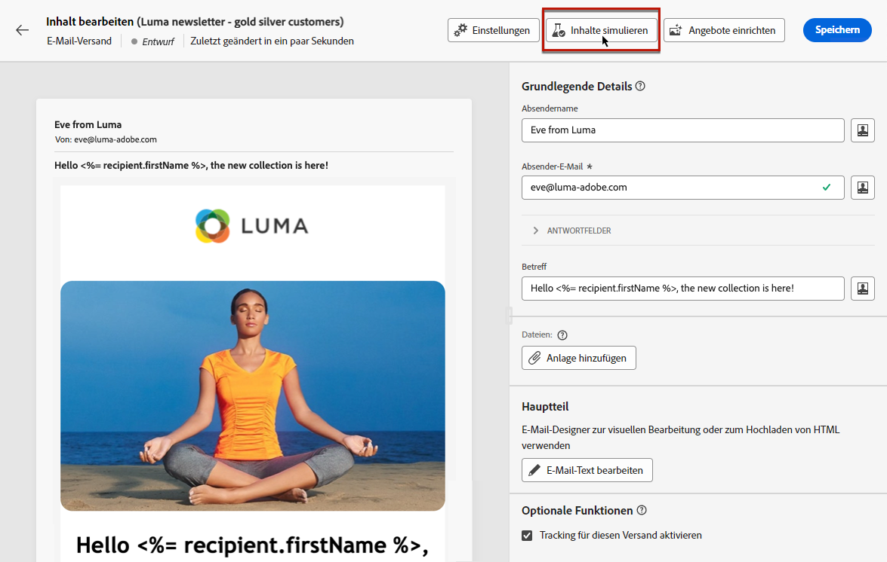

# Erste E-Mail senden {#first-email}

>[!NOTE]
>
>Diese Dokumentation wird derzeit erstellt und häufig aktualisiert. Die endgültige Version dieses Inhalts wird im Januar 2023 vorliegen.

In diesem Anwendungsbeispiel wird die Erstellung Ihrer ersten E-Mail vorgestellt

In diesem Beispiel planen wir den Versand einer E-Mail an ein bestimmtes Datum an Silber- und Goldloyalitätskunden. Diese E-Mail wird mit einer vordefinierten HTML-Vorlage aus einer ZIP-Datei erstellt und beinhaltet eine Personalisierung anhand der Profilattribute.

## E-Mail erstellen {#create-email}

1. Erstellen Sie einen neuen Versand aus dem **[!UICONTROL Sendungen]** Menü.
1. Wählen Sie die **[!UICONTROL Email]** und der zu verwendenden Vorlage und klicken Sie auf **[!UICONTROL Erstellen]**.

   >[!NOTE]
   >
   >Informationen zu Vorlagen. Check Info in V7 doc

   

1. Benennen Sie den Versand und konfigurieren Sie je nach Bedarf zusätzliche Optionen:

   * Interner Name:
   * Ordner:
   * Versand-Code:
   * Beschreibung:
   * Art:

   Überprüfen Sie, welche Einstellungen in der Vorlage definiert sind, und nennen Sie sie (Beschreibung). folder?, nature?)

   

   >[!NOTE]
   >
   >Info zu Schaltfläche für Versandeinstellungen + Link zum Dokument

## E-Mail-Inhalt erstellen {#create-content}

>[!CONTEXTUALHELP]
>id="acw_homepage_card3"
>title="Erstellen Sie Ihren ersten E-Mail-Inhalt mit Email Designer."
>abstract="Erstellen des ersten E-Mail-Inhalts"

>[!CONTEXTUALHELP]
>id="acw_deliveries_email_content"
>title="E-Mail-Inhalt erstellen"
>abstract="TBC"

1. Klicken Sie auf **[!UICONTROL Inhalt bearbeiten]** -Schaltfläche, um den Inhalt Ihrer E-Mail zu erstellen.

   Auf diesem Bildschirm können Sie den E-Mail-Inhalt konfigurieren und mit Email Designer entwerfen.

   

   >[!NOTE]
   >
   >Die E-Mail-Informationen Von und Aus sind in der ausgewählten E-Mail-Vorlage vordefiniert.
   >
   >Standardmäßig ist das E-Mail-Tracking für Öffnungen und Klicks aktiviert. Um diese Optionen zu deaktivieren, deaktivieren Sie sie im Abschnitt Optionale Funktionen .

1. Geben Sie den Betreff Ihrer E-Mail mithilfe des Ausdruckseditors an. [Erfahren Sie, wie Sie Ihren Inhalt personalisieren können.](../personalization/personalize.md)

   In diesem Beispiel möchten wir die Betreffzeile mit dem Vornamen der Profile personalisieren.

   

1. Fügen Sie bei Bedarf eine angehängte Datei zu Ihrer E-Mail hinzu. Erfahren Sie, wie Sie E-Mail-Inhalte bearbeiten

1. Klicken Sie auf **[!UICONTROL Bearbeiten des E-Mail-Hauptteils]** -Schaltfläche, um den Inhalt Ihrer E-Mail zu erstellen und zu gestalten.

   Wählen Sie die Methode zur Erstellung Ihres E-Mail-Inhalts aus. In diesem Beispiel möchten wir einen vorhandenen HTML-Inhalt importieren.

   

1. Wählen Sie die zu importierende HTML- oder ZIP-Datei aus und klicken Sie auf **[!UICONTROL Nächste]**.

   Wenn Ihr Ordner Assets enthält, wählen Sie die Instanz und den Ordner aus, in der sie gespeichert werden sollen, und klicken Sie auf **[!UICONTROL Import]**. (+ Link zum Dokument zu Assets?)

   

1. Nachdem der Inhalt importiert wurde, wird er in Email Designer angezeigt, sodass Sie ihn bei Bedarf bearbeiten und personalisieren können.

   In diesem Beispiel möchten wir eine Personalisierung zum E-Mail-Titel hinzufügen. Markieren Sie dazu den Baustein und klicken Sie auf **[!UICONTROL Personalisierung hinzufügen]**.

   

1. Nachdem der Inhalt fertig ist, speichern Sie ihn und klicken Sie auf den Pfeil, um zum E-Mail-Erstellungsbildschirm zurückzukehren.

   

## Definieren der Audience {#define-audience}

>[!CONTEXTUALHELP]
>id="acw_deliveries_email_audience"
>title="Definieren der Audience"
>abstract="TBC"

1. Klicken Sie auf **[!UICONTROL Zielgruppe auswählen]** und wählen Sie dann eine existierende Zielgruppe aus oder erstellen Sie eine neue.

   In diesem Beispiel möchten wir eine bestehende Zielgruppe verwenden, die Kunden auswählt, die zu den Stufen &quot;Silber&quot;und &quot;Gold&quot;gehören.

   

   >[!NOTE]
   >
   >Die in der Liste verfügbaren Zielgruppen stammen entweder aus Ihrer Campaign V8-Instanz oder aus Adobe Experience Platform, wenn die Destination/Sources-Integration in Ihrer Instanz implementiert wurde. Erfahren Sie, wie Sie die E-Mail-Zielgruppe auswählen

1. Nach Auswahl der Audience können Sie die Regeln bei Bedarf bearbeiten. Sie können auch eine Kontrollgruppe einrichten, um das Verhalten der E-Mail-Empfänger im Vergleich zum Verhalten von Profilen zu analysieren, die nicht zur Zielgruppe gehören. Erfahren Sie, wie Sie mit Kontrollgruppen arbeiten.

## Terminieren Sie den Versand {#schedule}

>[!CONTEXTUALHELP]
>id="acw_deliveries_email_schedule"
>title="Terminieren Sie den Versand"
>abstract="TBC"

Um den Versand der E-Mail zu planen, klicken Sie auf Aktivieren und geben Sie das gewünschte Datum und die gewünschte Uhrzeit an.

= Vor dem Senden validieren : Was geschieht am geplanten Datum? Benachrichtigung zur Bestätigung des Nachrichtenversands?

## Vorschau erstellen und E-Mail testen {#preview-test}

Sobald Ihre E-Mail fertig ist, können Sie sie in der Vorschau ansehen und testen, bevor Sie den Versand starten.

1. Klicken **[!UICONTROL Zu sendende Überprüfung]**. Eine Vorschau Ihrer E-Mail wird zusammen mit allen konfigurierten Eigenschaften, Zielgruppen und Zeitplänen angezeigt. Sie können diese Elemente über die Schaltfläche Ändern bearbeiten.

   

1. Klicken Sie auf **[!UICONTROL Inhalt simulieren]** -Schaltfläche, um eine Vorschau der E-Mail anzuzeigen und Testsendungen durchzuführen.

1. Wählen Sie im linken Bereich die Profile aus, die für die Vorschau der E-Mail verwendet werden sollen. Sie können Zielgruppenprofile oder dedizierte Testprofile verwenden.

1. Je nach ausgewähltem Profil wird im rechten Bereich eine Vorschau der E-Mail angezeigt. Wenn Sie mehrere Profile hinzugefügt haben, können Sie zwischen diesen Profilen wechseln, um eine Vorschau der entsprechenden E-Mail anzuzeigen.

   

   >[!NOTE]
   >
   >Darüber hinaus wird die **[!UICONTROL E-Mail rendern]** -Schaltfläche können Sie die Vorschau der E-Mail mit mehreren Geräten oder E-Mail-Anbietern anzeigen. Erfahren Sie, wie Sie eine Vorschau des E-Mail-Renderings anzeigen.

1. Um Testsendungen Ihrer E-Mail durchzuführen, klicken Sie auf die Schaltfläche **[!UICONTROL Test]** und wählen Sie die Profile aus, die den Testversand erhalten sollen. In diesem Beispiel möchten wir die Testsendungen an ein bestimmtes Testprofil senden.

   

   >[!NOTE]
   >
   >Sie können Ihre Nachrichten auch testen, indem Sie die Identität einiger Zielgruppenprofile übernehmen und die Testversandnachricht an die von Ihnen ausgewählte E-Mail-Adresse senden. Erfahren Sie, wie Sie im Zielmodus Substitution verwenden

1. Klicken **[!UICONTROL Test-E-Mail senden]** validieren Sie dann den Versand.

   Nachdem die Testsendungen durchgeführt wurden, können Sie ihren Status überprüfen, indem Sie auf die Schaltfläche **[!UICONTROL Anzeigen des E-Mail-Testprotokolls]** Schaltfläche.

## E-Mail senden und überwachen {#prepare-send}

Nachdem Sie Ihre E-Mail geprüft und getestet haben, können Sie die Vorbereitung starten und sie senden.

1. Klicken **[!UICONTROL Vorbereiten]** , um die Vorbereitung der Nachricht zu starten.

   Sie können den Vorbereitungsfortschritt zusammen mit Statistiken in Echtzeit verfolgen. Nach Abschluss der Vorbereitung können Sie detaillierte Protokolle zur weiteren Analyse aufrufen. Erfahren Sie, wie Sie Sendungen überwachen.

   

1. Sobald Ihre E-Mail versandbereit ist, klicken Sie auf **[!UICONTROL Senden]** validieren Sie dann den Versand.

   Sie können den Versand in Echtzeit zusammen mit Statistiken verfolgen. Darüber hinaus wird die **[!UICONTROL Protokolle]** ermöglicht den Zugriff auf detaillierte Informationen zum E-Mail-Versand. Erfahren Sie, wie Sie Sendungen überwachen.

   

1. Nach dem Versand der E-Mail können Sie für weitere Analysezwecke auf spezifische Berichte zugreifen.

   
