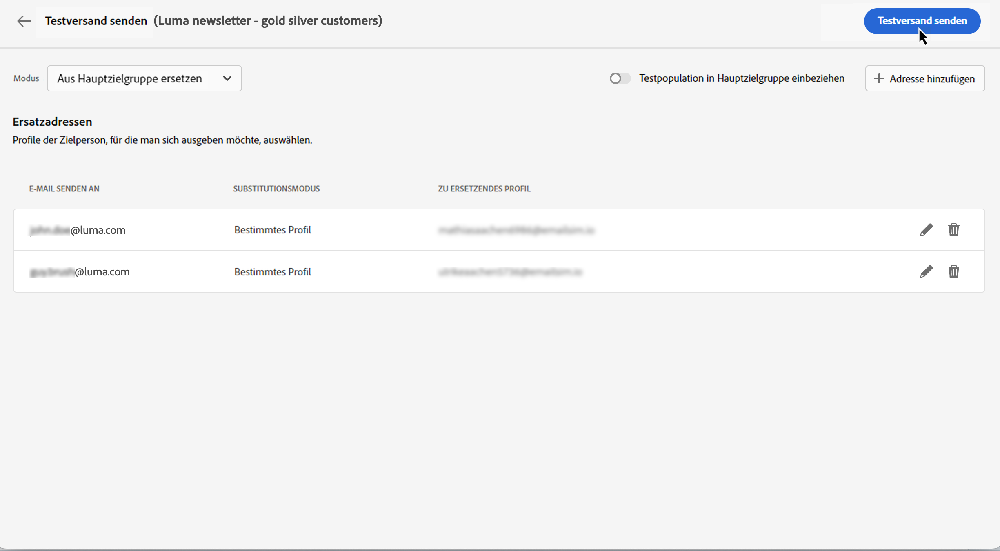

# Eine erste E-Mail senden {#first-email}

>[!CONTEXTUALHELP]
>id="acw_homepage_card2"
>title="Gen-KI für E-Mail-Inhalt"
>abstract="Unsere Gen-KI-Technologie nutzt fortschrittliche Algorithmen, um sehr ansprechende und personalisierte Inhalte zu generieren. Steigern Sie Öffnungsraten, Clickthrough-Raten und Konversionen mit der intelligenten Inhaltserstellung von Gen AI. Bleiben Sie dem Wettbewerb voraus und heben Sie Ihr E-Mail-Marketing-Spiel mit Gen AI auf E-Mail-Inhalt auf."

Erfahren Sie, wie Sie Ihre erste E-Mail an eine bestimmte Zielgruppe senden. In diesem Anwendungsfall planen Sie den Versand einer E-Mail an Silber- und Gold-Mitglieder des Treueprogramms zu einem bestimmten Datum.

Auf Basis einer vordefinierten [Designvorlage](../content/email-templates.md)enthält die E-Mail auch personalisierte Inhalte, die auf Kundenprofilattributen basieren.

## Erstellen des E-Mail-Versands {#create-email}

>[!CONTEXTUALHELP]
>id="acw_deliveries_email_template_selection"
>title="Auswählen einer E-Mail-Vorlage"
>abstract="Eine E-Mail-Vorlage ist eine spezifische Versandkonfiguration, die vordefinierte Einstellungen wie Typologieregeln, Personalisierungs- oder Routing-Parameter enthält. Vorlagen werden in der Campaign-Clientkonsole definiert."

>[!CONTEXTUALHELP]
>id="acw_deliveries_email_properties"
>title="E-Mail-Eigenschaften definieren"
>abstract="Die Eigenschaften sind die üblichen Versandparameter, nach denen ein Versand benannt und klassifiziert werden kann. Die zusätzlichen Einstellungen sind optional. Wenn der Versand auf einem erweiterten Schema basiert, das in der Adobe Campaign v8-Konsole definiert ist, stehen einige bestimmte **benutzerdefinierte Optionen** zur Verfügung."

Sie können einen eigenständigen E-Mail-Versand erstellen oder eine E-Mail im Rahmen eines Kampagnen-Workflows erstellen. Die folgenden Schritte beschreiben die Vorgehensweise für einen eigenständigen (einmaligen) E-Mail-Versand. Wenn Sie im Kontext eines Kampagnen-Workflows arbeiten, finden Sie die Erstellungsschritte im Abschnitt [diesem Abschnitt](../workflows/activities/channels.md#create-a-delivery-in-a-campaign-workflow).

Gehen Sie wie folgt vor, um einen neuen eigenständigen E-Mail-Versand zu erstellen.

1. Gehen Sie zum Menü **[!UICONTROL Sendungen]** in der linken Leiste, und klicken Sie auf die Schaltfläche **[!UICONTROL Versand erstellen]**.

   

1. Wählen Sie **[!UICONTROL E-Mail]** als Kanal und wählen Sie eine E-Mail-Versandvorlage aus der Liste.

   >[!NOTE]
   >
   >Vorlagen sind vorkonfigurierte Versandeinstellungen, die für die zukünftige Verwendung gespeichert werden. [Weitere Informationen](../msg/delivery-template.md)

   

1. Klicken Sie zur Bestätigung auf **[!UICONTROL Versand erstellen]**.
1. Geben Sie einen Titel für den Versand ein und konfigurieren Sie zusätzliche Optionen entsprechend Ihren Anforderungen:

   * **[!UICONTROL Interner Name]**: Weisen Sie dem Versand eine eindeutige Kennung zu.
   * **[!UICONTROL Ordner]**: Speichern Sie den Versand in einem bestimmten Ordner.
   * **[!UICONTROL Versandcode]**: Verwenden Sie dieses Feld, um Ihre Sendungen nach Ihrer eigenen Namenskonvention zu organisieren.
   * **[!UICONTROL Beschreibung]**: Geben Sie eine Beschreibung für den Versand an.
   * **[!UICONTROL Art]**: Geben Sie die Art der E-Mail zu Klassifizierungszwecken an.<!--The content of the list is defined in the delivery template selected when creating the email.-->

   >[!NOTE]
   >
   >Wenn Sie Ihr Schema mit bestimmten benutzerdefinierten Feldern erweitert haben, können Sie diese im Abschnitt **[!UICONTROL Benutzerdefinierte Optionen]** aufrufen.

   

1. Erweiterte Einstellungen wie Typologieregeln und Zielgruppen-Mappings sind darüber hinaus über die **[!UICONTROL Einstellungen]** Schaltfläche oben rechts im Bildschirm. Diese Einstellungen sind zwar in der ausgewählten Vorlage vorkonfiguriert, können jedoch für diese E-Mail nach Bedarf bearbeitet werden. [Weitere Informationen](../advanced-settings/delivery-settings.md)

## Audience definieren {#define-audience}

>[!CONTEXTUALHELP]
>id="acw_deliveries_email_audience"
>title="Zielgruppe für Ihren Versand auswählen"
>abstract="Die optimale Audience für Marketing-Nachrichten auswählen. Sie können eine existierende Zielgruppe auswählen (die bereits in einer Campaign v8-Instanz oder in Adobe Experience Platform definiert ist), mit dem Rule Builder eine neue Zielgruppe erstellen oder eine Datei mit Ihrer Zielgruppe hochladen. Kontrollgruppen sind nicht für die **Aus Datei auswählen** und umgekehrt."
>additional-url="https://experienceleague.adobe.com/docs/campaign-web/v8/audiences/target-audiences/add-audience.html" text="Hauptzielgruppen auswählen"
>additional-url="https://experienceleague.adobe.com/docs/campaign-web/v8/audiences/control-group.html" text="Festlegen einer Kontrollgruppe"

In diesem Anwendungsbeispiel senden Sie die E-Mail an eine bestehende Audience.

Weitere Anweisungen zur Verwendung von Audiences finden Sie in [diesem Abschnitt](../audience/about-audiences.md).

1. Um die Audience für die E-Mail auszuwählen, klicken Sie auf die Schaltfläche **[!UICONTROL Audience auswählen]** und wählen eine vorhandene Audience aus der Liste aus.

   In diesem Beispiel möchten wir eine bestehende Audience verwenden, die auf Kunden der Treuepunktestufen Silber und Gold abzielt.

   

   >[!NOTE]
   >
   >Die in der Liste verfügbaren Zielgruppen stammen entweder aus Ihrer Campaign v8-Instanz oder aus Adobe Experience Platform, wenn die Ziel-/Quellintegration für Ihre Instanz konfiguriert wurde. Durch diese Integration können Sie Experience Platform-Segmente an Adobe Campaign senden und Kampagnenversand- und -verfolgungslogs an Adobe Experience Platform senden. Erfahren Sie, wie Sie mit Campaign und Adobe Experience Platform im [Dokumentation zu Campaign v8 (Clientkonsole)](https://experienceleague.adobe.com/docs/campaign/campaign-v8/connect/ac-aep/ac-aep.html){target="_blank"}.

1. Nach Auswahl der Audience können Sie die Zielgruppe durch Anwendung zusätzlicher Regeln weiter verfeinern.

   

1. Sie können auch eine Kontrollgruppe einrichten, um das Verhalten der E-Mail-Empfängerinnen und -Empfänger im Vergleich zum Verhalten von nicht angesprochenen Profilen zu analysieren. [Erfahren Sie, wie Sie mit Kontrollgruppen arbeiten](../audience/control-group.md)

## Definieren des E-Mail-Inhalts {#create-content}

Gehen Sie wie folgt vor, um mit der Erstellung Ihres E-Mail-Inhalts zu beginnen. In diesem Anwendungsfall verwenden Sie eine vordefinierte E-Mail-[Versandvorlage](../msg/delivery-template.md) zur Gestaltung Ihrer E-Mail.<!--TBC delivery template or email content template?-->

<!--Detailed instructions on how to configure the email content are available in [this section](../content/edit-content.md).-->

1. Klicken Sie im Dashboard des E-Mail-Versands auf die Schaltfläche **[!UICONTROL Inhalt bearbeiten]**.

   

   Dadurch gelangen Sie zu einer dedizierten Oberfläche, auf der Sie den E-Mail-Inhalt konfigurieren und auf den E-Mail-Designer zugreifen können. [Weitere Informationen](../content/edit-content.md)

   

1. Geben Sie die Betreffzeile Ihrer E-Mail ein und personalisieren Sie sie mit dem Ausdruckseditor. [Erfahren Sie, wie Sie Ihren Inhalt personalisieren können](../personalization/personalize.md)

   

1. Um den Inhalt der E-Mail zu gestalten, klicken Sie auf die Schaltfläche **[!UICONTROL E-Mail-Textkörper bearbeiten]**.

   Wählen Sie die Methode zur Erstellung des Inhalts Ihrer E-Mail aus. Verwenden Sie in diesem Beispiel eine [vordefinierte Inhaltsvorlage](../msg/delivery-template.md).

   

1. Sobald Sie die Vorlage auswählen, wird sie im [E-Mail-Designer](../content/create-email-content.md) angezeigt, wo Sie alle notwendigen Änderungen vornehmen und eine Personalisierung hinzufügen können.

   Um zum Beispiel dem E-Mail-Titel eine Personalisierung hinzuzufügen, wählen Sie den Komponentenblock aus und klicken Sie auf **[!UICONTROL Personalisierung hinzufügen]**.

   

1. Wenn Sie mit dem Inhalt zufrieden sind, speichern und schließen Sie Ihren Entwurf. Klicken Sie auf **[!UICONTROL Speichern]**, um zum Bildschirm für die E-Mail-Erstellung zurückzukehren.

   

## Terminieren des Versands {#schedule}

Gehen Sie wie folgt vor, um den Versand der E-Mail zu planen.

Weitere Anweisungen zum Planen des Versands finden Sie unter [diesem Abschnitt](../msg/gs-messages.md#gs-schedule).

1. Navigieren Sie zum **[!UICONTROL Zeitplan]** Abschnitt.

1. Verwenden Sie die **[!UICONTROL Aktivieren der Planung]** aktivieren.

1. Legen Sie Datum und Uhrzeit für den Versand fest.

   

Nach dem Versand beginnt der eigentliche Versand am von Ihnen definierten Kontaktdatum.

## Anzeigen der Vorschau und Testen der E-Mail {#preview-test}

Bevor Sie Ihre E-Mail versenden, können Sie sie in der Vorschau anzeigen und testen, um sicherzustellen, dass sie Ihren Erwartungen entspricht.

In diesem Anwendungsbeispiel sehen Sie sich die E-Mail-Vorschau an und senden Testversionen an bestimmte E-Mail-Adressen, während Sie einige der Zielgruppenprofile ersetzen.

Weitere Informationen zum Anzeigen einer Vorschau und zum Testen von E-Mails finden Sie in [diesem Abschnitt](../preview-test/preview-test.md).

1. Um Ihre E-Mail zu überprüfen, klicken Sie auf **[!UICONTROL Überprüfen und senden]**. Daraufhin wird eine Vorschau Ihrer E-Mail angezeigt, einschließlich der konfigurierten Eigenschaften, der Audience und des Zeitplans. Sie können jedes dieser Elemente bearbeiten, indem Sie auf die Schaltfläche „Ändern“ klicken.

1. Um eine Vorschau der E-Mail anzuzeigen und Testversionen zu senden, klicken Sie auf die Schaltfläche **[!UICONTROL Inhalt simulieren]** Schaltfläche.

   

1. Wählen Sie im linken Seitenbereich die Profile aus, die für die Vorschau der E-Mail verwendet werden sollen.

   Im rechten Bereich wird eine Vorschau der E-Mail auf der Basis des ausgewählten Profils angezeigt. Wenn Sie mehrere Profile hinzugefügt haben, können Sie zwischen diesen Profilen wechseln, um eine Vorschau der jeweiligen E-Mail anzuzeigen.

   

   <!--Additionally, the **[!UICONTROL Render email]** button allows you to preview the email using mutiple devices or mail providers. Learn on how to preview email rendering
    -->

1. Um Testversionen Ihrer E-Mail zu senden, klicken Sie auf die Schaltfläche **[!UICONTROL Test]** und wählen Sie den gewünschten Modus aus.

   Verwenden Sie in diesem Beispiel den Modus **[!UICONTROL Aus Hauptzielgruppe ersetzen]**. In diesem Modus werden Testversionen an bestimmte E-Mail-Adressen gesendet, deren Profil durch ein anderes ersetzt wurde.

   

1. Klicken Sie auf **[!UICONTROL Adresse hinzufügen]** und geben Sie die E-Mail-Adresse(n) an, die die Testversionen erhalten soll(en).

   Wählen Sie für jede E-Mail-Adresse ein Ersatzprofil aus. Sie können Adobe Campaign auch ein zufälliges Profil aus der Zielgruppe auswählen lassen.

   

1. Klicken Sie auf **[!UICONTROL Test-E-Mail senden]** und bestätigen Sie dann den Versand.

   Testversionen werden an die angegebenen E-Mail-Adressen unter Verwendung des ausgewählten Profils mit dem Präfix **[Testversand x]** gesendet.

   

   Sie können den Status des Versands überprüfen und jederzeit auf die gesendeten Test-E-Mails zugreifen, indem Sie auf die Schaltfläche **[!UICONTROL Test-E-Mail-Protokoll anzeigen]** im Bildschirm „Inhalt simulieren“ klicken.

## Senden und Überwachen der E-Mail {#prepare-send}

Nachdem Sie Ihre E-Mail geprüft und getestet haben, können Sie die Vorbereitung starten und die E-Mail versenden.

1. Um die Vorbereitung der E-Mail zu starten, klicken Sie auf **[!UICONTROL Vorbereiten]**. [Erfahren Sie, wie Sie eine E-Mail vorbereiten](../monitor/prepare-send.md)

   

1. Wenn Ihre E-Mail versandbereit ist, klicken Sie auf die Schaltfläche **[!UICONTROL Senden]** (oder **[!UICONTROL Nach Zeitplan senden]**, wenn Sie den Versand zeitlich geplant haben) und bestätigen Sie den Versand.

1. Während des Sendevorgangs können Sie seinen Fortschritt verfolgen und Statistiken in Echtzeit direkt in diesem Bildschirm einsehen.

   

   Sie können auch detaillierte Informationen über die Sendung abrufen, indem Sie auf die Schaltfläche **[!UICONTROL Logs]** klicken. [Erfahren Sie, wie Sie Versandlogs überwachen](../monitor/delivery-logs.md)

1. Nachdem die E-Mail versendet wurde, können Sie auf spezielle Berichte zur weiteren Analyse zugreifen, indem Sie auf die Schaltfläche **[!UICONTROL Reporting]** klicken.

