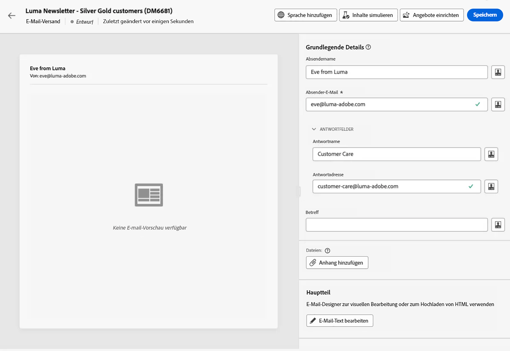

# Senden Ihrer ersten E-Mail {#first-email}

In diesem Anwendungsbeispiel wird gezeigt, wie Sie Ihre erste E-Mail erstellen. Wir planen den Versand einer E-Mail zu einem bestimmten Datum an Kunden der Treuestufen Silber und Gold. Diese E-Mail wird mit einer vordefinierten Vorlage erstellt und umfasst eine Personalisierung anhand der Profilattribute.

## Erstellen der E-Mail {#create-email}

>[!CONTEXTUALHELP]
>id="acw_deliveries_email_template_selection"
>title="Wählen Sie eine E-Mail-Vorlage aus"
>abstract="Eine Vorlage wird in der Adobe Campaign v8-Konsole definiert. Dies ist eine spezifische Versandkonfiguration, die vordefinierte Parameter wie Typologieregeln, Personalisierung oder Routing-Parameter enthält."

>[!CONTEXTUALHELP]
>id="acw_deliveries_email_properties"
>title="E-Mail-Eigenschaften"
>abstract="Die Eigenschaften sind die üblichen Versandparameter, nach denen Sie Ihren Versand benennen und klassifizieren können. Wenn Ihr Versand auf einem erweiterten Schema basiert, das in der Adobe Campaign v8-Konsole definiert ist, stehen einige **benutzerdefinierte Optionen** zur Verfügung."

1. Erstellen Sie einen neuen Versand im Menü **[!UICONTROL Sendungen]**.

1. Wählen Sie die **[!UICONTROL Email]** und der zu verwendenden Vorlage und klicken Sie auf **[!UICONTROL Versand erstellen]**.

   >[!NOTE]
   >
   >Eine Vorlage ist eine spezifische Versandkonfiguration, die als Vorlage zur Wiederverwendung gespeichert wurde. Versandvorlagen werden von Admins in der Adobe Campaign-Konsole konfiguriert. [Erfahren Sie, wie Sie mit Versandvorlagen arbeiten.](https://experienceleague.adobe.com/docs/campaign/campaign-v8/campaigns/send/create-templates.html){target="_blank"}.

   

1. Geben Sie einen Titel für die E-Mail an und konfigurieren Sie zusätzliche Optionen entsprechend Ihren Anforderungen:

   * **[!UICONTROL Interner Name]**: Weisen Sie dem Versand eine eindeutige Kennung zu,
   * **[!UICONTROL Ordner]**: Speichern Sie den Versand in einem bestimmten Ordner,
   * **[!UICONTROL Versand-Code]**: Verwenden Sie dieses Feld, um Ihre Sendungen basierend auf Ihrer eigenen Namenskonvention zu organisieren.
   * **[!UICONTROL Beschreibung]**: Geben Sie eine Beschreibung für den Versand an,
   * **[!UICONTROL Art]**: Geben Sie die Art der E-Mail zu Klassifizierungszwecken an.<!--The content of the list is defined in the delivery template selected when creating the email.-->
   >[!NOTE]
   >
   >Wenn Sie Ihr Schema mit bestimmten benutzerdefinierten Feldern erweitert haben, können Sie in den **[!UICONTROL benutzerdefinierten Optionen]** darauf zugreifen.

   

   Darüber hinaus sind erweiterte Einstellungen (Typologieregel, Zielgruppen-Mappings usw.) über die Schaltfläche neben dem Versandnamen verfügbar. Sie sind in der bei der E-Mail-Erstellung ausgewählten Vorlage vordefiniert. Sie können sie bei Bedarf bearbeiten.

## Erstellen des E-Mail-Inhalts {#create-content}

>[!CONTEXTUALHELP]
>id="acw_homepage_card3"
>title="Erfahren Sie, wie Sie mit E-Mail-Designer E-Mail-Inhalte gestalten."
>abstract="Erfahren Sie, wie Sie Inhalte gestalten."

In diesem Anwendungsbeispiel wird die E-Mail mit einer vordefinierten Vorlage erstellt. Detaillierte Informationen zur Konfiguration von E-Mail-Inhalten finden Sie in [diesem Abschnitt](../content/edit-content.md).

1. Klicken Sie auf die Schaltfläche **[!UICONTROL Inhalt bearbeiten]**, um den Inhalt Ihrer E-Mail zu erstellen.

   Auf diesem Bildschirm können Sie den Inhalt der E-Mail konfigurieren und mit E-Mail-Designer gestalten.

   

1. Geben Sie den Betreff Ihrer E-Mail an und personalisieren Sie ihn mithilfe des Ausdruckseditors. [Erfahren Sie, wie Sie Ihren Inhalt personalisieren können](../personalization/personalize.md)

   

1. Klicken Sie auf die Schaltfläche **[!UICONTROL E-Mail-Textkörper bearbeiten]**, um den Inhalt Ihrer E-Mail zu erstellen und zu gestalten.

   Wählen Sie die Methode zur Erstellung des Inhalts Ihrer E-Mail aus. In diesem Beispiel möchten wir eine bereits vorhandene Design-Vorlage verwenden.

   

<!--1. Select the HTML or ZIP file to import then click **[!UICONTROL Next]**.

    If your folder contains assets, choose the instance and folder where they should be stored then click **[!UICONTROL Import]**. (+ link to doc on assets?)

    -->

1. Nach der Auswahl der Vorlage wird sie in E-Mail-Designer angezeigt, sodass sie bei Bedarf bearbeitet und personalisiert werden kann.

   In diesem Beispiel möchten wir eine Personalisierung zum E-Mail-Titel hinzufügen. Wählen Sie dazu die Komponente aus und klicken Sie auf **[!UICONTROL Personalisierung hinzufügen]**.

   

1. Wenn der Inhalt fertig ist, speichern und schließen Sie den Entwurf und klicken Sie auf **[!UICONTROL Speichern]** , um zum E-Mail-Erstellungsbildschirm zurückzukehren.

   

## Definieren der Audience {#define-audience}

>[!CONTEXTUALHELP]
>id="acw_deliveries_email_audience"
>title="Definieren der Audience"
>abstract="Wählen Sie die beste Audience für Ihre Marketing-Nachricht aus. Sie können eine bereits in einer Campaign v8-Instanz oder in Adobe Experience Platform definierte Audience auswählen oder eine neue Audience mit dem Regel-Builder erstellen."

In diesem Anwendungsbeispiel senden wir die E-Mail an eine bereits bestehende Audience. Weitere Informationen zum Arbeiten mit Audiences finden Sie in [diesem Abschnitt](../audience/about-audiences.md).

1. Klicken Sie auf **[!UICONTROL Audience auswählen]** und wählen Sie eine bestehende Audience, die Sie ansprechen möchten, aus.

   In diesem Beispiel möchten wir eine bestehende Audience verwenden, die sich an Kunden der Treuepunktestufen Silber und Gold richtet.

   

   >[!NOTE]
   >
   >Die in der Liste verfügbaren Zielgruppen stammen entweder aus Ihrer Campaign V8-Instanz oder aus Adobe Experience Platform, wenn die Ziel-/Quellen-Integration in Ihrer Instanz konfiguriert wurde.
   >
   >Die Ziel-/Quellen-Integration ermöglicht es Ihnen, Experience Platform-Segmente an Adobe Campaign zu senden und Kampagnenversand- und -verfolgungslogs an Adobe Experience Platform zu senden. [Erfahren Sie, wie Sie mit Campaign und Adobe Experience Platform arbeiten.](https://experienceleague.adobe.com/docs/campaign/campaign-v8/connect/ac-aep.html){target="_blank"}.

1. Nach Auswahl Ihrer Audience können Sie das Ziel mithilfe zusätzlicher Regeln verfeinern.

   Sie können auch eine Kontrollgruppe einrichten, um das Verhalten der E-Mail-Empfänger im Vergleich zum Verhalten von Profilen zu analysieren, die nicht angesprochen wurden. [Erfahren Sie, wie Sie mit Kontrollgruppen arbeiten](../audience/control-group.md)

   

## Terminieren des Versands {#schedule}

>[!CONTEXTUALHELP]
>id="acw_deliveries_email_schedule"
>title="Terminieren des Versands"
>abstract="Definieren Sie das Datum und die genaue Uhrzeit für Ihren Versand. Indem Sie den günstigsten Zeitpunkt für Ihre Werbenachricht wählen, maximieren Sie die Öffnungsraten."

Um den Versand der E-Mail zu terminieren, klicken Sie auf **[!UICONTROL Aktivieren]** und geben Sie dann das gewünschte Datum und die gewünschte Uhrzeit für den Versand an.

Standardmäßig wird die **[!UICONTROL Vor dem Versand bestätigen]** aktiviert ist, d. h., Sie müssen den Versand bestätigen, damit die E-Mail zum angegebenen Zeitpunkt gesendet werden kann. Deaktivieren Sie diese Option, damit die E-Mail zum geplanten Datum und zur geplanten Uhrzeit ohne Bestätigung gesendet werden kann.

## Anzeigen der Vorschau und Testen der E-Mail {#preview-test}

Sobald Ihre E-Mail fertig ist, können Sie sie in der Vorschau ansehen und testen, bevor Sie den Versand starten.

In diesem Anwendungsbeispiel werden wir eine Vorschau der E-Mail anzeigen und Testsendungen an bestimmte E-Mail-Adressen durchführen, während wir einige der Zielgruppenprofile imitieren.

Weitere Informationen zum Anzeigen einer Vorschau und zum Testen von E-Mails finden Sie in [diesem Abschnitt](../preview-test/preview-test.md).

1. Klicken **[!UICONTROL Überprüfen und Senden]**. Eine Vorschau Ihrer E-Mail wird zusammen mit allen konfigurierten Eigenschaften, Audience und Zeitplan angezeigt. Sie können jedes dieser Elemente über die Schaltfläche „Ändern“ bearbeiten.

1. Klicken Sie auf die Schaltfläche **[!UICONTROL Inhalt simulieren]**, um eine Vorschau der E-Mail anzuzeigen und Testsendungen durchzuführen.

   

1. Wählen Sie im linken Seitenbereich die Profile aus, die für die Vorschau der E-Mail verwendet werden sollen.

1. Im rechten Bereich wird eine Vorschau der E-Mail basierend auf dem ausgewählten Profil angezeigt. Wenn Sie mehrere Profile hinzugefügt haben, können Sie zwischen diesen Profilen wechseln, um eine Vorschau der entsprechenden E-Mail anzuzeigen.

   

   <!-- !NOTE
    >
    >Additionally, the **[!UICONTROL Render email]** button allows you to preview the email using mutiple devices or mail providers. Learn on how to preview email rendering-->

1. Um Testsendungen Ihrer E-Mail durchzuführen, klicken Sie auf die Schaltfläche **[!UICONTROL Test]** und wählen Sie den gewünschten Modus aus, um Ihre Testsendungen durchzuführen.

   In diesem Beispiel verwenden wir den Modus Von Hauptzielgruppe ersetzen , d. h. wir senden Testsendungen an bestimmte E-Mail-Adressen, während wir einige der Profile imitieren, die in den Versand aufgenommen wurden.

   

1. Klicken Sie auf Adresse hinzufügen und geben Sie die E-Mail-Adresse(n) an, an die die Testsendungen gesendet werden sollen.

   Wählen Sie für jede E-Mail-Adresse das Profil aus der Zielgruppe aus, das stellvertretend agieren soll. Sie können Adobe Campaign auch ein zufälliges Profil aus der Zielgruppe auswählen lassen.

   

1. Klicken Sie auf **[!UICONTROL Test-E-Mail senden]** und bestätigen Sie dann den Versand.

   Testsendungen werden mit dem ausgewählten Profil an die angegebenen E-Mail-Adressen gesendet, wobei die Variable **[Proof x]** -Präfix.

   

   Sie können den Status des Versands überprüfen und jederzeit auf die gesendeten Testsendungen zugreifen, indem Sie auf die Schaltfläche **[!UICONTROL Anzeigen des E-Mail-Testprotokolls]** im Bildschirm &quot;Inhalt simulieren&quot;.

## Senden und Überwachen der E-Mail {#prepare-send}

Nachdem Sie Ihre E-Mail geprüft und getestet haben, können Sie mit ihrer Vorbereitung beginnen und sie senden.

1. Klicken Sie auf **[!UICONTROL Vorbereiten]**, um mit der Vorbereitung der Nachricht zu beginnen. [Erfahren Sie, wie Sie eine E-Mail vorbereiten](../monitor/prepare-send.md)

   

1. Sobald Ihre E-Mail versandbereit ist, klicken Sie auf **[!UICONTROL Senden]** oder **[!UICONTROL Senden als geplant]** validieren Sie dann den Versand.

1. Sobald der Versand Ihrer E-Mail entweder sofort oder am geplanten Datum begonnen hat, können Sie den Versand in Echtzeit in diesem Bildschirm verfolgen, einschließlich Statistiken.

   

   >[!NOTE]
   >
   >Darüber hinaus ermöglicht die Schaltfläche **[!UICONTROL Protokolle]** den Zugriff auf detaillierte Informationen zum E-Mail-Versand. [Erfahren Sie, wie Sie Versand-Logs überwachen](../monitor/delivery-logs.md)

1. Nachdem die E-Mail gesendet wurde, können Sie dedizierte Berichte für weitere Analysezwecke einsehen. [Erfahren Sie, wie Sie mit Berichten arbeiten.](../reporting/reports.md)
   
