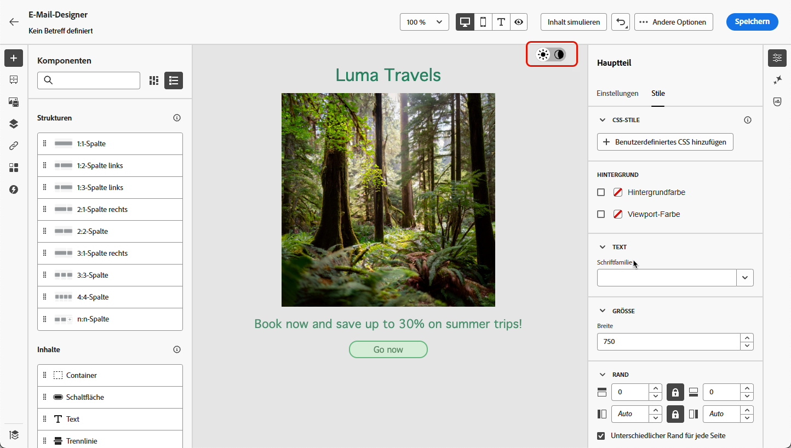
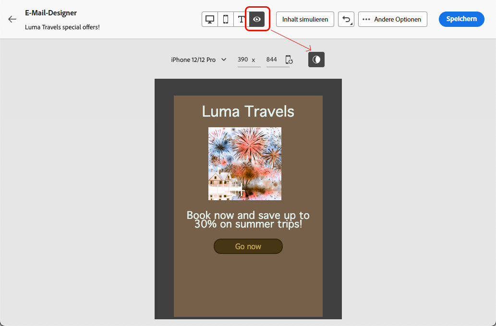

# Verwalten von Inhalten im dunklen Modus {#dark-mode}

>[!CONTEXTUALHELP]
>id="ac_edition_darkmode"
>title="Wechseln zum dunklen Modus"
>abstract="Wechseln Sie in den dunklen Modus, um eine Vorschau des Renderings zu erhalten und spezifische benutzerdefinierte Einstellungen festzulegen.  Das endgültige Rendering hängt vom E-Mail-Client der Empfangenden ab. Beachten Sie, dass nicht alle E-Mail-Clients den benutzerdefinierten dunklen Modus unterstützen."

>[!CONTEXTUALHELP]
>id="ac_edition_darkmode_preview"
>title="Wechseln zum dunklen Modus"
>abstract="Wechseln Sie zum dunklen Modus, um eine Vorschau des Renderings auf unterstützenden E-Mail-Clients anzuzeigen.  Das endgültige Rendering hängt vom E-Mail-Client der Empfangenden ab. Beachten Sie, dass nicht alle E-Mail-Clients den dunklen Modus unterstützen."

Beim Gestalten Ihrer E-Mails können Sie mit dem [E-Mail-Designer](get-started-email-designer.md) von [!DNL Adobe Campaign] zur Ansicht **[!UICONTROL Dunkler Modus]** wechseln.

In der Ansicht „Dunkler Modus“ von <!--Email Designer --> können Sie auch spezifische benutzerdefinierte Einstellungen definieren, die von den unterstützenden E-Mail-Clients angezeigt werden, wenn ihr dunkler Modus aktiviert ist.

## Was der dunkle Modus? {#what-is-dark-mode}

Das Rendering des dunklen Modus in den verschiedenen E-Mail-Clients ist komplex. Definieren wir zunächst den dunklen Modus.

Der dunkle Modus ermöglicht es unterstützenden E-Mail-Clients und Anwendungen, E-Mails mit dunkleren Hintergründen und helleren Farben für Text, Schaltflächen und andere UI-Elemente anzuzeigen. Dadurch werden die Augen entlastet, die Akkulaufzeit verlängert und die Lesbarkeit in schwach beleuchteten Umgebungen verbessert – für ein angenehmeres Seherlebnis.

Da der dunkle Modus zunehmend von führenden Betriebssystemen und Anwendungen<!-- (Apple Mail, Gmail, Outlook, Twitter, Slack)--> unterstützt wird, ist er zu einem wichtigen Bestandteil des modernen E-Mail-Designs geworden, um sicherzustellen, dass Inhalte für alle Nutzenden lesbar und visuell ansprechend bleiben.

## Schutzmechanismen {#guardrails}

Die Erwartungen hinsichtlich des Renderings im dunklen Modus sollten unter Vorbehalt betrachtet werden, da die Umsetzung je nach E-Mail-Client stark variieren kann.

<!--The dark mode final rendering depends on the recipient's email client. It is not possible to guarantee that your email will look the same in dark mode across all devices.-->

Bevor Sie den dunklen Modus im E-Mail-Designer von [!DNL Adobe Campaign] verwenden, müssen Sie wissen, wie die wichtigsten E-Mail-Clients damit umgehen. Es sind drei Fälle zu unterscheiden:

<!--
* Check out the list of [email clients supporting dark mode](https://www.caniemail.com/search/?s=dark){target="_blank"}

* Learn more on Dark mode in this [Litmus blog post](https://www.litmus.com/blog/the-ultimate-guide-to-dark-mode-for-email-marketers){target="_blank"}
-->

### Clients unterstützen keinen dunklen Modus {#not-supporting}

Einige E-Mail-Clients unterstützen diese Funktion überhaupt nicht, z. B.:

* Yahoo!Mail
* AOL

Unabhängig davon, ob Sie im E-Mail-Designer benutzerdefinierte Einstellungen für den dunklen Modus festlegen oder nicht, zeigen diese E-Mail-Clients niemals ein Rendering im dunklen Modus an. <!--Regardless of whether the interface is in light or dark mode, your email will render the same.-->

### Clients, die ihren eigenen dunklen Modus anwenden {#default-support}

Einige E-Mail-Clients wenden systematisch ihren eigenen standardmäßigen dunklen Modus auf alle empfangenen E-Mails an. Farben, Hintergründe, Bilder usw. werden automatisch an die für den E-Mail-Client spezifischen Einstellungen für den dunklen Modus angepasst, sodass keine externen Änderungen möglich sind.

<!--It is important to note that less than 25% of email clients offer customization options for dark mode. Clients such as Gmail implement their own dark mode rendering, which is not subject to external modification.-->

Bei diesen Clients handelt es sich zum Beispiel um:

* Gmail (Webmail für Desktop, iOS, Android, Webmail für Mobile)
* Outlook für Windows
* Outlook, Windows Mail

In diesem Fall werden benutzerdefinierte Einstellungen, die Sie im E-Mail-Designer für den dunklen Modus festlegen, durch die Einstellungen des E-Mail-Clients überschrieben.

Es ist wichtig zu verstehen, dass diese E-Mail-Clients zwar den dunklen Modus unterstützen, Ihr spezifisches Design für den dunklen Modus jedoch nicht gerendert wird.

### Clients, die den benutzerdefinierten dunklen Modus unterstützen {#custom-support}

Andere E-Mail-Clients bieten die Option, den benutzerdefinierten dunklen Modus mit der Abfrage `@media (prefers-color-scheme: dark)` zu rendern. Diese Methode wird auch vom E-Mail-Designer von [!DNL Journey Optimizer] verwendet.

Im Folgenden finden Sie eine Liste der wichtigsten Clients, die diese Option unterstützen:

* Apple Mail für macOS
* Apple Mail für iOS
* Outlook für macOS
* Outlook.com
* Outlook für iOS
* Outlook für Android

In diesem Fall sollten die spezifischen Einstellungen angezeigt werden, die im E-Mail-Designer festgelegt wurden.

>[!NOTE]
>
>In [diesem Abschnitt](#define-custom-dark-mode) erfahren Sie, wie Sie mit dem E-Mail-Designer benutzerdefinierte Einstellungen für den dunklen Modus festlegen können.

Je nach E-Mail-Client können jedoch einige Einschränkungen gelten. Beispielsweise generieren einige Clients wie Apple Mail 16 (macOS 13) keinen dunklen Modus, wenn im E-Mail-Inhalt Bilder vorhanden sind.

Um optimale Ergebnisse zu erzielen, testen Sie Ihre Inhalte mit den E-Mail-Clients, an die Sie die Inhalte senden möchten. Um eine Simulation anzuzeigen, die dem Endergebnis für jeden Client so nahe wie möglich kommt, verwenden Sie die Option [E-Mail-Rendering](../preview-test/email-rendering.md) im E-Mail-Designer.

## Dunkler Modus im E-Mail-Designer {#dark-mode-email-designer}

Beim dunklen Modus im E-Mail-Designer sind zwei Aspekte zu berücksichtigen:

* Sie können eine Vorschau anzeigen lassen, wie der standardmäßige dunkle Modus in den meisten unterstützenden E-Mail-Clients gerendert wird. [Weitere Informationen](#preview-dark-mode)

* Wenn Sie die Standardeinstellungen der E-Mail-Clients, [die einen benutzerdefinierten dunklen Modus unterstützen](#custom-support), überschreiben möchten, können Sie benutzerdefinierte Einstellungen für die E-Mail festlegen, die Sie gerade bearbeiten. [Weitere Informationen](#define-custom-dark-mode)

### Vorschau des standardmäßigen dunklen Modus {#preview-dark-mode}

Gehen Sie wie folgt vor, um auf den dunklen Modus des E-Mail-Designers zuzugreifen und eine Vorschau der Standardeinstellungen für den dunklen Modus zu erhalten.

1. Wählen Sie auf der Startseite des E-Mail-Designers die Option **[!UICONTROL Inhalte von Grund auf neu erstellen]** aus. [Weitere Informationen](create-email-content.md)

1. Fügen Sie Ihrem Inhalt [Strukturen](create-email-content.md) und [Inhaltskomponenten](content-components.md) hinzu.

1. Schalten Sie oben rechts auf der zentralen Arbeitsfläche den dunklen Modus ein, indem Sie den Umschalter auf **[!UICONTROL Dunkler Modus]** stellen.

   

1. Die standardmäßige Vorschau des dunklen Modus wird angezeigt.

   

Standardmäßig wendet die Vorschau im dunklen Modus des E-Mail-Designers das Farbschema „Vollfarbinvertierung“ auf alle Elemente außer Bildern und Symbolen an.

Das bedeutet, dass Bereiche mit hellen und dunklen Elementen erkannt und invertiert werden, sodass helle Hintergründe dunkel und dunkler Text hell werden, während dunkle Hintergründe hell und heller Text dunkel werden.

>[!CAUTION]
>
>Das endgültige Rendering kann je nach E-Mail-Client der Empfangenden variieren. Um eine Simulation anzuzeigen, die dem Endergebnis für jeden E-Mail-Client so nahe wie möglich kommt, verwenden Sie die Option [E-Mail-Rendering](../preview-test/email-rendering.md).

### Definieren des benutzerdefinierten dunklen Modus {#define-custom-dark-mode}

>[!CONTEXTUALHELP]
>id="ac_edition_darkmode_image"
>title="Verwenden eines bestimmten Bildes für den dunklen Modus"
>abstract="Es kann ein anderes Bild ausgewählt werden, das angezeigt wird, wenn der dunkle Modus aktiviert ist.  Das Hinzufügen eines bestimmten Bildes für den dunklen Modus garantiert nicht, dass es in allen E-Mail-Clients ordnungsgemäß gerendert wird. Beachten Sie, dass nicht alle E-Mail-Clients den benutzerdefinierten dunklen Modus unterstützen."

Nach dem Wechsel in den **[!UICONTROL dunklen Modus]** können Sie bestimmte Stilelemente Ihres Inhalts bearbeiten, die nur angezeigt werden, wenn der dunkle Modus im E-Mail-Client des Empfangenden aktiviert ist – vorausgesetzt, diese Funktion wird unterstützt.

>[!WARNING]
>
>Das endgültige Rendering im dunklen Modus hängt vom jeweiligen E-Mail-Client ab, sodass die Ergebnisse voneinander abweichen können. [Weitere Informationen](#guardrails)

<!--
>[!WARNING]
>
>Not all email clients support dark mode. Moreover, some email clients only apply their own default dark mode for all emails that are received. In both cases, the custom settings that you defined in the Email Designer cannot be rendered.-->

Journey Optimizer nutzt <!-- `@media (prefers-color-scheme: dark)` method-->, um den benutzerdefinierten Stil für den dunklen Modus des E-Mail-Designers zu verwenden CSS-Abfrage `@media (prefers-color-scheme: dark)`, die erkennt, ob der E-Mail-Client der oder des Benutzenden auf den dunklen Modus eingestellt ist, und das in Ihrer E-Mail definierte dunkle Design anwendet.

Gehen Sie wie folgt vor, um benutzerdefinierte Einstellungen für den dunklen Modus zu definieren.

1. Wechseln Sie im E-Mail-Designer zur Vorschau **[!UICONTROL Dunkler Modus]**. [Weitere Informationen](#preview-dark-mode)

1. Bearbeiten Sie alle Stilfarbenattribute wie Text, Hintergründe, Schaltflächen usw.

1. Sie können die Farben von Bildern und Symbolen nicht ändern, aber Sie können bestimmte Elemente nur für den dunklen Modus definieren.

   Wählen Sie dazu ein Bild aus. Wechseln Sie mithilfe der Option **[!UICONTROL Dunkler Modus]** über den entsprechenden Umschalter im Bereich **[!UICONTROL Einstellungen]** in den dunklen Modus und wählen Sie ein anderes Element aus.

   

   <!---->

1. Sie können jederzeit die Option **[!UICONTROL Zur Live-Ansicht wechseln]** verwenden, um zu überprüfen, wie Ihre Inhalte auf verschiedenen Gerätegrößen gerendert werden. Wählen Sie in dieser Ansicht den Umschalter für den dunklen Modus oben auf dem Bildschirm aus, um eine Vorschau Ihres Inhalts im dunklen Modus auf den verschiedenen Geräten anzuzeigen.

   {width="80%" align="center"}

   >[!CAUTION]
   >
   >Die Live-Ansicht ist eine allgemeine Vorschau, die dazu dient, das Rendering auf verschiedenen Gerätegrößen zu vergleichen. Das endgültige Rendering kann je nach E-Mail-Client der Empfangenden variieren.

1. Wenn Sie mit den Änderungen für den dunklen Modus zufrieden sind, klicken Sie auf **[!UICONTROL Inhalte simulieren]**.

   

1. Wählen Sie **[!UICONTROL E-Mail rendern]** und verbinden Sie sich mit Ihrem Litmus-Konto. Sie können das endgültige Rendering des dunklen Modus für verschiedene E-Mail-Clients sehen. Weitere Informationen zu [E-Mail-Rendering](../preview-test/email-rendering.md).

   >[!WARNING]
   >
   >Obwohl die Simulation die Darstellung von E-Mails im dunklen Modus so gut wie möglich nachbildet, kann das tatsächliche Rendering je nach E-Mail-Dienstanbieter oder gerätespezifischen Einstellungen abweichen.

## Best Practices {#best-practices}

Da der dunkle Modus zunehmend von führenden E-Mail-Clients unterstützt wird, ist es entscheidend, das Rendering Ihrer E-Mails sowohl in hellen als auch in dunklen Umgebungen zu berücksichtigen – unabhängig davon, ob Sie den [benutzerdefinierten dunklen Modus](#define-custom-dark-mode) verwenden oder nicht.

Der dunkle Modus kann Farben, Hintergründe und Bilder verändern – und manchmal Design-Entscheidungen überschreiben. Um visuelle Konsistenz, Barrierefreiheit und Markenintegrität zu gewährleisten, befolgen Sie die nachstehenden Best Practices.

**Optimieren Ihrer Bilder und Logos**

* Speichern Sie Logos und Symbole als PNGs mit transparentem Hintergrund, um sichtbare weiße Kästchen im dunklen Modus zu vermeiden.

* Vermeiden Sie Bilder mit fest eingebetteten weißen oder hellen Hintergründen.

* Wenn Transparenz nicht möglich ist, platzieren Sie Bilder in Ihrem Design auf einem einfarbigen Hintergrund, um ungewollte Farbinversionen zu verhindern.

**Beachten der Hintergründe**

* Stellen Sie sicher, dass ausreichend Kontrast zwischen Text- und Hintergrundfarben besteht, damit Ihre Inhalte sowohl im hellen als auch im dunklen Modus gut lesbar sind.

* Vermeiden Sie es, sich für wichtige Inhalte ausschließlich auf Hintergrundfarben zu verlassen. Einige Clients überschreiben Hintergrundfarben im dunklen Modus. Stellen Sie daher sicher, dass wichtige Informationen weiterhin sichtbar sind.

<!--**Inline critical styles**

Inline CSS helps maintain more control over styling, as some clients strip external styles in dark mode.-->

**Gestalten barrierefreier Inhalte im dunklen Modus**

<!--KEEP dark mode accessibility best practices IN ONE SINGLE LOCATION - for now listed on this page.
If needed, it can be moved to the Design accessible content page:
The best practices for designing accesible content in dark mode are listed in [this section](accessible-content.md#dark-mode).-->

* Verwenden Sie Farbkombinationen, die für Menschen mit Farbenblindheit leicht zu unterscheiden sind.

* Verwenden Sie eine Farbpalette mit mittleren Tönen, um einen ausreichenden Kontrast sowohl auf hellen als auch auf dunklen Hintergründen sicherzustellen.

* Verwenden Sie barrierefreie Farbkombinationen mit hohem Kontrast, um die Lesbarkeit zu verbessern und die WCAG-Standards (Web Content Accessibility Guidelines) zu erfüllen. Verwenden Sie Tools wie den Kontrast-Checker von WebAIM, um den Farbkontrast zu überprüfen.

* Vermeiden Sie dünne Schriftarten, da diese die Lesbarkeit beeinträchtigen können. Wenn Ihre Marke eine dünne Schriftart verwendet, sollten Sie diese im dunklen Modus fett formatieren.

* Verzichten Sie auf reines Weiß auf tiefschwarzem Hintergrund, da dies zu Augenbelastung führen kann und von einigen E-Mail-Clients automatisch invertiert wird.

* Stellen Sie barrierefreie Ausweichstile bereit, wenn der dunkle Modus nicht unterstützt wird.

**Testen Ihrer E-Mails in einer dunklen Umgebung**

* Verwenden Sie die [Vorschau des dunklen Modus](#preview-dark-mode) des E-Mail-Designers, die invertierte Farbschemata verwendet, um Probleme frühzeitig zu erkennen.

* Verwenden Sie die Option [E-Mail-Rendering](../preview-test/email-rendering.md), die auf Litmus basiert, um Ihre Designs in den wichtigsten E-Mail-Clients (Apple Mail, Gmail, Outlook) zu simulieren und zu überprüfen, wie sich Farben und Bilder im dunklen Modus verhalten.
