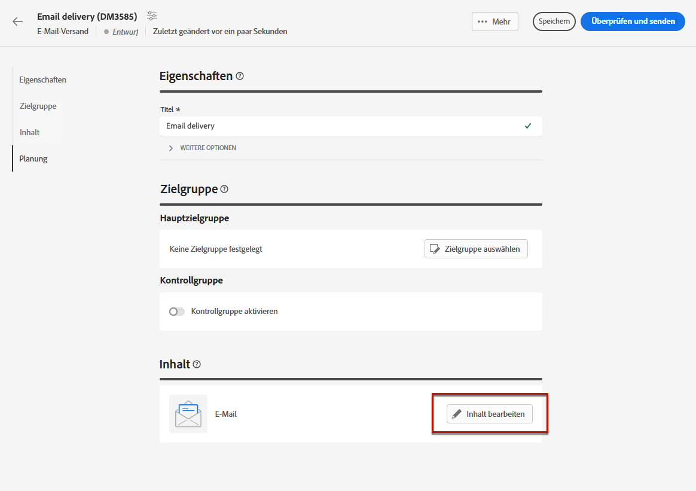
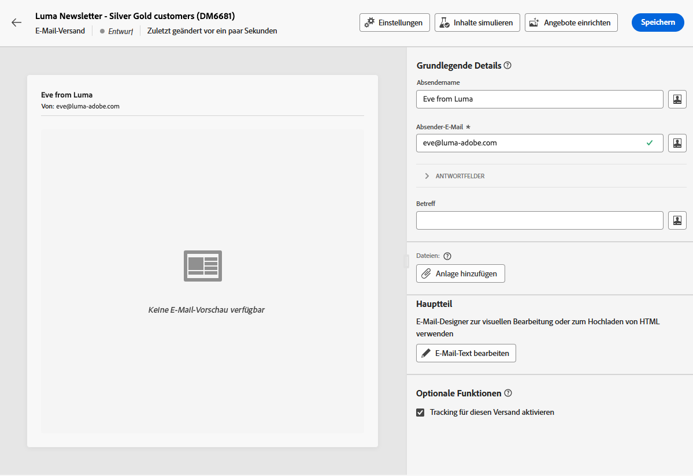
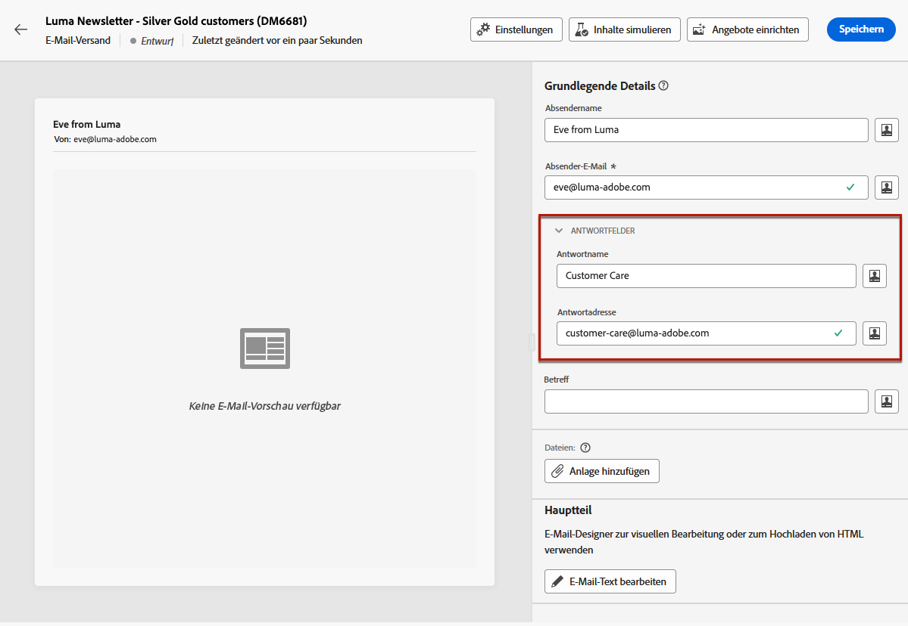
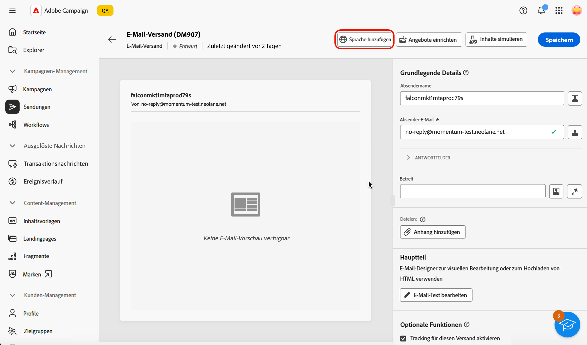
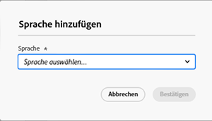
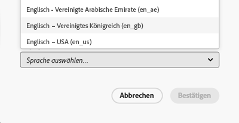
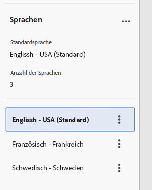
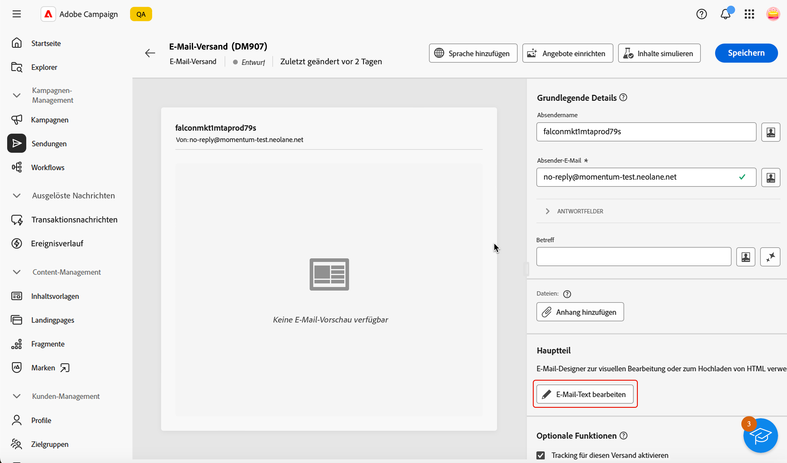
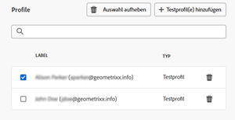
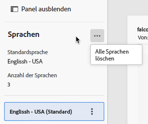

# Konfigurieren des E-Mail-Inhalts {#edit-content}

>[!CONTEXTUALHELP]
>id="acw_deliveries_email_content"
>title="Definieren des E-Mail-Inhalts"
>abstract="Auf dem Bildschirm **Inhalt bearbeiten** können Sie grundlegende Elemente Ihrer Nachricht definieren, wie z. B. die Absenderadresse und die Betreffzeile, zusätzliche Aktionen durchführen, wie z. B. Anhänge oder Angebote hinzufügen, und auf den E-Mail-Designer zugreifen, um Ihrer Nachricht einen optimierten Look zu verleihen."

>[!CONTEXTUALHELP]
>id="acw_deliveries_email_header"
>title="Festlegen der E-Mail-Eigenschaften"
>abstract="Im Abschnitt **Grundlegende Details** können die Adresse der Absenderin bzw. des Absenders und die Antwortadresse aktualisiert und die Betreffzeile mithilfe des Ausdruckseditors definiert werden."

>[!CONTEXTUALHELP]
>id="acw_deliveries_email_attachment"
>title="Anhängen von Dateien an eine E-Mail"
>abstract="Wählen Sie eine oder mehrere Dateien aus, die Sie Ihrer Nachricht anfügen möchten. Zur Vermeidung von Leistungsproblemen wird empfohlen, nicht mehr als einen Anhang pro E-Mail hinzuzufügen."

>[!CONTEXTUALHELP]
>id="acw_deliveries_email_options"
>title="Bearbeiten des Trackings"
>abstract="Standardmäßig ist das Tracking für den Versand aktiviert, d. h. alle im Nachrichteninhalt enthaltenen Links werden verfolgt. Sie können diese Option hier deaktivieren."
>additional-url="https://experienceleague.adobe.com/de/docs/campaign-web/v8/content/email-design/design-content/message-tracking" text="Hinzufügen von Links und Nachverfolgen von Nachrichten"

>[!CONTEXTUALHELP]
>id="acw_deliveries_email_multilingual"
>title="Sprachen hinzufügen"
>abstract="Auf dieser Registerkarte finden Sie eine Liste der Sprachen, in denen der Versand durchgeführt werden soll. Sie können weitere Sprachen hinzufügen, indem Sie auf die Schaltfläche „Sprache hinzufügen“ klicken oder über diese Registerkarte eine andere Sprache duplizieren."

Der E-Mail-Bildschirm **[!UICONTROL Inhalt bearbeiten]** ermöglicht Ihnen Folgendes:

* Definieren der grundlegenden Elemente Ihrer Nachricht, z. B. die Absenderadresse und die Betreffzeile
* Durchführen zusätzlicher Aktionen, z. B. Hinzufügen von Anhängen oder Einrichten von Angeboten
* Zugriff auf den [E-Mail-Designer](get-started-email-designer.md#start-authoring), um mit der Erstellung des eigentlichen Inhalts Ihrer E-Mail zu beginnen
* Hinzufügen von Sprachvarianten zu Ihren Sendungen.

>[!NOTE]
>
>Alle bearbeitbaren Textfelder dieses Bildschirms können mithilfe von Personalisierungsfeldern ausgefüllt werden. [Erfahren Sie, wie Sie Inhalte personalisieren](../personalization/personalize.md)

## Konfigurieren des Versands

Gehen Sie wie folgt vor, um den Inhalt einer E-Mail zu konfigurieren oder zu bearbeiten.

1. Klicken Sie auf die Schaltfläche **[!UICONTROL Inhalt bearbeiten]** im Bildschirm [E-Mail-Versand-Dashboard](../email/create-email.md).

   {zoomable="yes"}

1. Der Bildschirm zur Bearbeitung des E-Mail-Inhalts wird geöffnet.

   {zoomable="yes"}

   >[!NOTE]
   >
   >Wenn Sie eine neue E-Mail konfigurieren, sind die Felder **[!UICONTROL Absendername]** und **[!UICONTROL Absender-E-Mail]** bereits ausgefüllt.

1. Das Feld **[!UICONTROL Absendername]** wird in der E-Mail-Vorlage definiert. Wenn Sie ihn ändern möchten, verwenden Sie einen Namen, der von den Empfängerinnen und Empfängern leicht erkannt werden kann, z. B. den Namen Ihrer Marke, um die Öffnungsrate Ihrer Sendungen zu erhöhen.

   >[!NOTE]
   >
   >Um das Erlebnis der Empfängerinnen und Empfänger weiter zu verbessern, können Sie den Namen einer Person hinzufügen, z. B. „Eva von Luma“.

1. Das Adressfeld **[!UICONTROL Absender-E-Mail]** wird ebenfalls in der E-Mail-Vorlage definiert. Stellen Sie sicher, dass die Adress-Domain mit der Subdomain übereinstimmt, die Sie an Adobe delegiert haben.

   >[!NOTE]
   >
   >Sie können den Teil vor dem „@“ ändern, nicht aber die Domain-Adresse.

1. Erweitern Sie den Abschnitt **[!UICONTROL Antwortfelder]**. Name und Adresse der Absenderin bzw. des Absenders werden standardmäßig für Antworten verwendet. Adobe empfiehlt, eine echte Adresse zu verwenden, wie etwa die der Kundenunterstützung Ihrer Marke. So kann sich das Team der Kundenunterstützung ggf. um etwaige Antworten kümmern.

   {zoomable="yes"}

1. Definieren Sie die **[!UICONTROL Betreffzeile]** der E-Mail. Geben Sie Ihren Betreff direkt in das dafür vorgesehene Feld ein oder öffnen Sie den Ausdruckseditor, um mithilfe verschiedener Attribute, Ausdrucksfragmente oder Angebote eine [Personalisierung](../personalization/personalize.md) hinzuzufügen.

1. Wenn Sie eine Datei an die E-Mail anhängen möchten, klicken Sie auf die Schaltfläche **[!UICONTROL Anhang hinzufügen]** und wählen Sie eine oder mehrere Dateien aus.

   >[!NOTE]
   >
   >Zur Vermeidung von Leistungsproblemen wird empfohlen, nicht mehr als einen Anhang pro E-Mail hinzuzufügen.

   <!--limitation on size + number of files?-->

1. Wenn Sie mit Ihrer E-Mail Angebote versenden möchten, wählen Sie diese über die Schaltfläche **[!UICONTROL Angebote einrichten]** aus.

   Sie können sie dann mithilfe von Personalisierungsfeldern in die E-Mail einfügen. [Erfahren Sie, wie Sie Angebote senden](../msg/offers.md)

## E-Mail-Textkörper bearbeiten

1. Klicken Sie auf die **[!UICONTROL E-Mail-Text bearbeiten]**, um den Inhalt der E-Mail mithilfe der E-[-Designer zu strukturieren und ](get-started-email-designer.md#start-authoring).

   >[!NOTE]
   >
   >Sie können auch den Mauszeiger über die E-Mail-Vorschau bewegen und **[!UICONTROL E-Mail-Designer öffnen]** auswählen.

   Weitere Informationen zum Entwerfen von E-Mail-Inhalten finden Sie in diesen Abschnitten:

   * [Verfassen von E-Mails von Grund auf neu](create-email-content.md)
   * [Gestalten Ihrer Inhalte](get-started-email-style.md)

1. Standardmäßig ist für den Versand Tracking aktiviert. Sie können diese Option im Bereich **[!UICONTROL Optionale Funktionen]** deaktivieren. [Erfahren Sie, wie Sie Links hinzufügen und das Tracking verwalten](message-tracking.md)

1. Nachdem Sie den Inhalt Ihrer E-Mail definiert haben, können Sie vor dem Versand mit der Schaltfläche **[!UICONTROL Inhalt simulieren]** überprüfen, wie die E-Mail dargestellt wird. [Erfahren Sie, wie Sie Ihre E-Mail in einer Vorschau anzeigen und testen](../preview-test/preview-test.md).

## Konfigurieren eines mehrsprachigen Versands

In der Web-Benutzeroberfläche von Campaign können Sie Ihre E-Mail-Sendungen als mehrsprachig einrichten, sodass Sie Nachrichten basierend auf der bevorzugten Sprache eines Profils senden können. Wenn keine Voreinstellung definiert ist, wird die Nachricht in der Standardsprache gesendet.

In einem mehrsprachigen Versand basiert die Sprachverwaltung auf Varianten. Jede Variante stellt eine Sprache dar.

Bei der Versanderstellung können Sie die Anzahl der Varianten hinzufügen, die der Anzahl der erforderlichen Sprachen in der Nachricht entspricht. Sie können auch die Standardsprache festlegen, wenn Sie neue Sprachen hinzufügen.

### Hinzufügen einer Sprachvariante

Gehen Sie wie folgt vor, um Sprachvarianten zu erstellen:

1. Klicken Sie auf **[!UICONTROL Schaltfläche]** Sprache hinzufügen“ im oberen Abschnitt des E-Mail-Konfigurationsbildschirms.

   >[!IMPORTANT]
   >
   >Die Schaltfläche **[!UICONTROL Sprache hinzufügen]** ist nur verfügbar, wenn die Zieldimension das Sprachschema enthält. Weitere Informationen zu Schemata und Zielgruppendimensionen finden Sie in der [ Dokumentation](https://experienceleague.adobe.com/en/docs/campaign-web/v8/audiences/targeting-dimensions){target=_blank}.

   {zoomable="yes"}

1. Wählen Sie die Sprache aus, die der Dropdown-Liste **[!UICONTROL Sprache]** hinzugefügt werden soll. Beim Hinzufügen der ersten Sprache wird sie als Standard festgelegt und der aktuelle Inhalt ist die Standardsprache. Wenn Sie neue Sprachen hinzufügen, basiert der Inhalt auf dem Standardinhalt.

   >[!NOTE]
   >
   >Die in dieser Liste verfügbaren Sprachen hängen von den Werten ab, die durch das Attribut Sprache definiert wurden (Werte wie: system, user, dbenum usw.) Weitere Informationen zur Auflistungsverwaltung finden Sie in [Abschnitt](https://experienceleague.adobe.com/en/docs/campaign-web/v8/conf/enumerations){target=_blank}.

   {zoomable="yes"}

   Beispiel hier für Englisch (USA):

   {zoomable="yes"}

1. Wiederholen Sie diesen Vorgang, um weitere Sprachen hinzuzufügen. Im **[!UICONTROL Sprache]** wird die Liste der ausgewählten Sprachen, die Anzahl der verschiedenen Sprachen sowie die Standardsprache angezeigt.

   Wenn Sie beispielsweise Englisch, Französisch und Schwedisch ausgewählt haben, können Sie diese 3 Sprachen sehen, wie unten dargestellt:

   {zoomable="yes"}

   Sie können auf die Schaltfläche Erweitern oben rechts klicken, um alle Sprachen zu löschen.

### Definieren des E-Mail-Inhalts für jede Variante

Sobald Sprachen festgelegt sind, definieren Sie den Inhalt der E-Mail, die an die Profile mit dieser bevorzugten Sprache gesendet wird.

Gehen Sie wie folgt vor, um einen E-Mail-Inhalt zu definieren:

1. Öffnen Sie [E-Mail-Designer](get-started-email-designer.md#start-authoring) indem Sie auf die Schaltfläche **[!UICONTROL E-Mail-Textkörper bearbeiten]** klicken.

   >[!NOTE]
   >
   >Sie können auch den Mauszeiger über die E-Mail-Vorschau bewegen und **[!UICONTROL E-Mail-Designer öffnen]** auswählen.

   {zoomable="yes"}

1. Sie können eine Vorschau des Versands anzeigen, indem Sie auf die Schaltfläche **[!UICONTROL Inhalt simulieren]** klicken und das Profil und die Sprache auswählen, in der die E-Mail angezeigt werden soll.

1. Im Fenster Inhalt simulieren können Sie zwischen Profilen wechseln, um eine Vorschau des Inhalts der E-Mail anzuzeigen, die der für dieses Profil eingerichteten Sprache entspricht.

   {zoomable="yes"}

### Sprachvarianten duplizieren oder entfernen

Klicken Sie oben rechts auf die Schaltfläche „Erweitern“ und dann auf die Schaltfläche **[!UICONTROL Alle Varianten löschen]**, um alle Sprachen zu löschen.

{zoomable="yes"}

Um eine Sprachvariante zu entfernen, klicken Sie auf die drei Punkte auf der rechten Seite der Registerkarte und wählen Sie Entfernen aus.

Um eine Sprachvariante zu duplizieren, klicken Sie auf die drei Punkte auf der rechten Seite der Registerkarte und wählen Sie Duplizieren. Wenn Sie eine andere Sprache als die Standardsprache duplizieren, basiert der duplizierte Inhalt auf der Sprache, die Sie dupliziert haben.

1. Nachdem Sie den Inhalt Ihrer E-Mail definiert haben, können Sie vor dem Versand mit der Schaltfläche **[!UICONTROL Inhalt simulieren]** überprüfen, wie die E-Mail dargestellt wird. [Erfahren Sie, wie Sie Ihre E-Mail in einer Vorschau anzeigen und testen](../preview-test/preview-test.md).