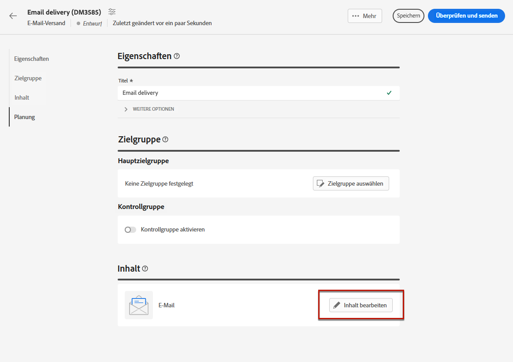
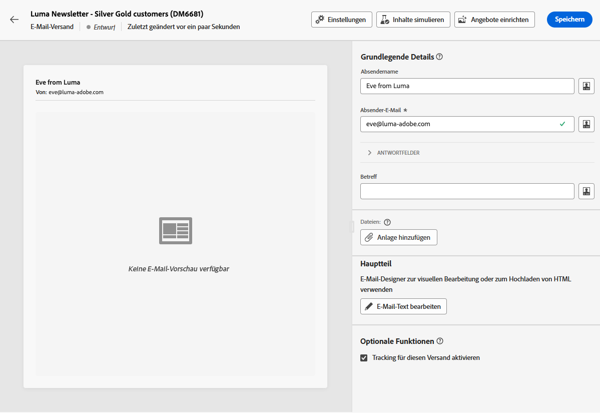
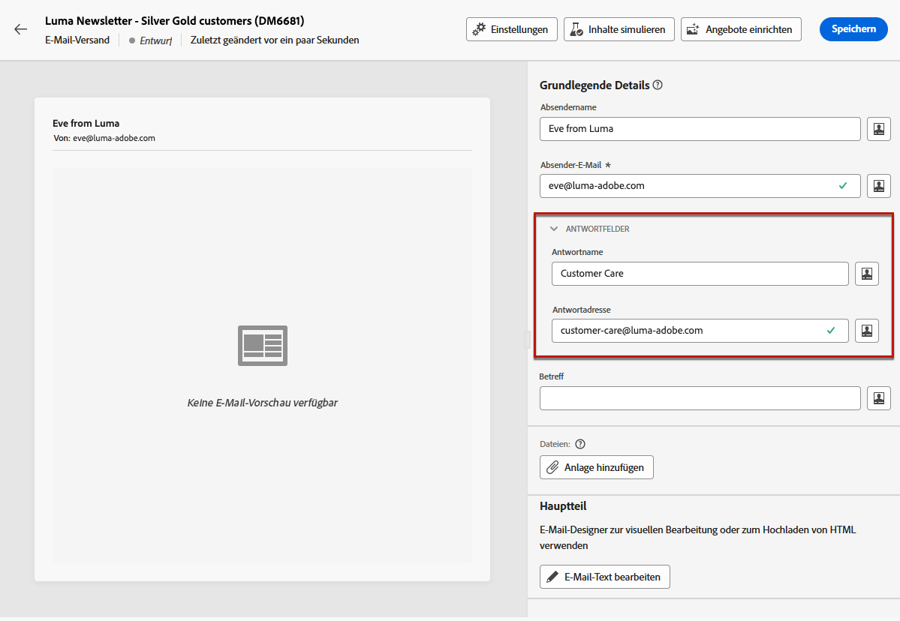

<?xml version="1.0" encoding="UTF-8"?>
<xliff xmlns="urn:oasis:names:tc:xliff:document:1.2" xmlns:okp="okapi-framework:xliff-extensions" xmlns:its="http://www.w3.org/2005/11/its" xmlns:itsxlf="http://www.w3.org/ns/its-xliff/" version="1.2" its:version="2.0">
<file original="help/v8/email/edit-content.md.mdsc" source-language="en-US" target-language="en-XX" datatype="x-text/markdown">
<body>
<trans-unit id="tu1" restype="x-YAML_METADATA_HEADER_VALUE" xml:space="preserve">
<source xml:lang="en-US">Edit the email content</source>
<target xml:lang="en-XX">Bearbeiten des E-Mail-Inhalts</target>
</trans-unit>
<trans-unit id="tu2" restype="x-YAML_METADATA_HEADER_VALUE" xml:space="preserve">
<source xml:lang="en-US">Learn how to edit the email content in Campaign Web user interface</source>
<target xml:lang="en-XX">Erfahren Sie, wie Sie den E-Mail-Inhalt in der Campaign Web-Benutzeroberfläche bearbeiten können</target>
</trans-unit>
<trans-unit id="tu3" xml:space="preserve">
<source xml:lang="en-US">Configure the email content</source>
<target xml:lang="en-XX">Konfigurieren des E-Mail-Inhalts</target>
</trans-unit>
<trans-unit id="tu4" xml:space="preserve">
<source xml:lang="en-US">Define the email content</source>
<target xml:lang="en-XX">Definieren des E-Mail-Inhalts</target>
</trans-unit>
<trans-unit id="tu5" xml:space="preserve">
<source xml:lang="en-US">The <ph id="1" ctype="x-STRONG_EMPHASIS">**</ph>Edit content<ph id="2" ctype="x-STRONG_EMPHASIS">**</ph> screen allows you to define basic elements of your message, such as the sender address and subject line, perform additional actions like adding attachments or offers, and access the Email Designer to give your message a polished look.</source>
<target xml:lang="en-XX">Auf dem Bildschirm <ph id="1" ctype="x-STRONG_EMPHASIS">**</ph>Inhalt bearbeiten<ph id="2" ctype="x-STRONG_EMPHASIS">**</ph> können Sie grundlegende Elemente Ihrer Nachricht definieren, wie z. B. die Absenderadresse und die Betreffzeile, zusätzliche Aktionen durchführen, wie z. B. Anhänge oder Angebote hinzufügen, und auf den E-Mail-Designer zugreifen, um Ihrer Nachricht einen optimierten Look zu verleihen.</target>
</trans-unit>
<trans-unit id="tu6" xml:space="preserve">
<source xml:lang="en-US">Set the email properties</source>
<target xml:lang="en-XX">Festlegen der E-Mail-Eigenschaften</target>
</trans-unit>
<trans-unit id="tu7" xml:space="preserve">
<source xml:lang="en-US">The <ph id="1" ctype="x-STRONG_EMPHASIS">**</ph>Basic details<ph id="2" ctype="x-STRONG_EMPHASIS">**</ph> section allows you to update the sender's address and reply-to address, and define the subject line using the Expression Editor.</source>
<target xml:lang="en-XX">Im Abschnitt <ph id="1" ctype="x-STRONG_EMPHASIS">**</ph>Grundlegende Details<ph id="2" ctype="x-STRONG_EMPHASIS">**</ph> können die Adresse der Absenderin bzw. des Absenders und die Antwortadresse aktualisiert und die Betreffzeile mithilfe des Ausdruckseditors definiert werden.</target>
</trans-unit>
<trans-unit id="tu8" xml:space="preserve">
<source xml:lang="en-US">Attach files to your email</source>
<target xml:lang="en-XX">Anhängen von Dateien an eine E-Mail</target>
</trans-unit>
<trans-unit id="tu9" xml:space="preserve">
<source xml:lang="en-US">Select one or multiple files to insert into your message. To avoid performance issues, it is recommended not to include more than one attachment per email.</source>
<target xml:lang="en-XX">Wählen Sie eine oder mehrere Dateien aus, die Sie Ihrer Nachricht anfügen möchten. Zur Vermeidung von Leistungsproblemen wird empfohlen, nicht mehr als einen Anhang pro E-Mail hinzuzufügen.</target>
</trans-unit>
<trans-unit id="tu10" xml:space="preserve">
<source xml:lang="en-US">Edit tracking</source>
<target xml:lang="en-XX">Bearbeiten des Trackings</target>
</trans-unit>
<trans-unit id="tu11" xml:space="preserve">
<source xml:lang="en-US">By default, tracking is enabled for the delivery, meaning all links included in the message content are tracked. You can disable this option from here.</source>
<target xml:lang="en-XX">Standardmäßig ist das Tracking für den Versand aktiviert, d. h. alle im Nachrichteninhalt enthaltenen Links werden verfolgt. Sie können diese Option hier deaktivieren.</target>
</trans-unit>
<trans-unit id="tu12" xml:space="preserve">
<source xml:lang="en-US">https://experienceleague.adobe.com/en/docs/campaign-web/v8/content/email-design/design-content/message-tracking</source>
<target xml:lang="en-XX">https://experienceleague.adobe.com/de/docs/campaign-web/v8/content/email-design/design-content/message-tracking</target>
</trans-unit>
<trans-unit id="tu13" xml:space="preserve">
<source xml:lang="en-US">Add links and track messages</source>
<target xml:lang="en-XX">Hinzufügen von Links und Nachverfolgen von Nachrichten</target>
</trans-unit>
<trans-unit id="tu14" xml:space="preserve">
<source xml:lang="en-US">The email <ph id="1" ctype="x-STRONG_EMPHASIS">**[!UICONTROL </ph>Edit content<ph id="3" ctype="x-LINK_REF">]**</ph> screen allows you to:</source>
<target xml:lang="en-XX">Der E-Mail-Bildschirm <ph id="1" ctype="x-STRONG_EMPHASIS">**[!UICONTROL </ph>Inhalt bearbeiten<ph id="3" ctype="x-LINK_REF">]**</ph> ermöglicht Ihnen Folgendes:</target>
</trans-unit>
<trans-unit id="tu15" xml:space="preserve">
<source xml:lang="en-US">Define basic elements of your message such as the sender's address and the subject line</source>
<target xml:lang="en-XX">Definieren der grundlegenden Elemente Ihrer Nachricht, z. B. die Absenderadresse und die Betreffzeile</target>
</trans-unit>
<trans-unit id="tu16" xml:space="preserve">
<source xml:lang="en-US">Perform additional actions such as adding attachments or setting up offers</source>
<target xml:lang="en-XX">Durchführen zusätzlicher Aktionen, z. B. Hinzufügen von Anhängen oder Einrichten von Angeboten</target>
</trans-unit>
<trans-unit id="tu17" xml:space="preserve">
<source xml:lang="en-US">Access the <ph id="1" ctype="x-LINK">[</ph>Email Designer<ph id="2" ctype="x-LINK">](get-started-email-designer.md#start-authoring)</ph> to start building the proper content of your email</source>
<target xml:lang="en-XX">Zugriff auf den <ph id="1" ctype="x-LINK">[</ph>E-Mail-Designer<ph id="2" ctype="x-LINK">](get-started-email-designer.md#start-authoring)</ph>, um mit der Erstellung des eigentlichen Inhalts Ihrer E-Mail zu beginnen</target>
</trans-unit>
<trans-unit id="tu18" xml:space="preserve">
<source xml:lang="en-US">Add language variants to your deliveries. <ph id="1" ctype="x-LINK">[</ph>Read more<ph id="2" ctype="x-LINK">](../msg/multilingual.md)</ph></source>
<target xml:lang="en-XX">Hinzufügen von Sprachvarianten zu Ihren Sendungen. <ph id="1" ctype="x-LINK">[</ph>Mehr dazu<ph id="2" ctype="x-LINK">](../msg/multilingual.md)</ph></target>
</trans-unit>
<trans-unit id="tu19" xml:space="preserve">
<source xml:lang="en-US"><ph id="1" ctype="x-regxph" equiv-text="[!NOTE">[!NOTE]</ph></source>
<target xml:lang="en-XX"><ph id="1" ctype="x-regxph" equiv-text="[!NOTE">[!NOTE]</ph></target>
</trans-unit>
<trans-unit id="tu20" xml:space="preserve">
<source xml:lang="en-US">All the editable text fields of this screen can be filled in using personalization fields. <ph id="1" ctype="x-LINK">[</ph>Learn how to personalize content<ph id="2" ctype="x-LINK">](../personalization/personalize.md)</ph></source>
<target xml:lang="en-XX">Alle bearbeitbaren Textfelder dieses Bildschirms können mithilfe von Personalisierungsfeldern ausgefüllt werden. <ph id="1" ctype="x-LINK">[</ph>Erfahren Sie, wie Sie Inhalte personalisieren<ph id="2" ctype="x-LINK">](../personalization/personalize.md)</ph></target>
</trans-unit>
<trans-unit id="tu21" xml:space="preserve">
<source xml:lang="en-US">Configure the delivery</source>
<target xml:lang="en-XX">Konfigurieren des Versands</target>
</trans-unit>
<trans-unit id="tu22" xml:space="preserve">
<source xml:lang="en-US">To configure or edit the content of an email, follow the steps below.</source>
<target xml:lang="en-XX">Gehen Sie wie folgt vor, um den Inhalt einer E-Mail zu konfigurieren oder zu bearbeiten.</target>
</trans-unit>
<trans-unit id="tu23" xml:space="preserve">
<source xml:lang="en-US">Click the <ph id="1" ctype="x-STRONG_EMPHASIS">**[!UICONTROL </ph>Edit content<ph id="3" ctype="x-LINK_REF">]**</ph> button from the <ph id="5" ctype="x-LINK">[</ph>email delivery dashboard<ph id="6" ctype="x-LINK">](../email/create-email.md)</ph> screen.</source>
<target xml:lang="en-XX">Klicken Sie auf die Schaltfläche <ph id="1" ctype="x-STRONG_EMPHASIS">**[!UICONTROL </ph>Inhalt bearbeiten<ph id="3" ctype="x-LINK_REF">]**</ph> im Bildschirm <ph id="5" ctype="x-LINK">[</ph>E-Mail-Versand-Dashboard<ph id="6" ctype="x-LINK">](../email/create-email.md)</ph>.</target>
</trans-unit>
<trans-unit id="tu24" xml:space="preserve">
<source xml:lang="en-US"><ph id="1" ctype="x-IMAGE">{zoomable="yes"}</ph></source>
<target xml:lang="en-XX"><ph id="1" ctype="x-IMAGE">{zoomable="yes"}</ph></target>
</trans-unit>
<trans-unit id="tu25" xml:space="preserve">
<source xml:lang="en-US">The email content edition screen opens.</source>
<target xml:lang="en-XX">Der Bildschirm zur Bearbeitung des E-Mail-Inhalts wird geöffnet.</target>
</trans-unit>
<trans-unit id="tu26" xml:space="preserve">
<source xml:lang="en-US"><ph id="1" ctype="x-IMAGE">{zoomable="yes"}</ph></source>
<target xml:lang="en-XX"><ph id="1" ctype="x-IMAGE">{zoomable="yes"}</ph></target>
</trans-unit>
<trans-unit id="tu27" xml:space="preserve">
<source xml:lang="en-US"><ph id="1" ctype="x-regxph" equiv-text="[!NOTE">[!NOTE]</ph></source>
<target xml:lang="en-XX"><ph id="1" ctype="x-regxph" equiv-text="[!NOTE">[!NOTE]</ph></target>
</trans-unit>
<trans-unit id="tu28" xml:space="preserve">
<source xml:lang="en-US">If you are configuring a new email, the <ph id="1" ctype="x-STRONG_EMPHASIS">**[!UICONTROL </ph>From name<ph id="3" ctype="x-LINK_REF">]**</ph> and <ph id="5" ctype="x-STRONG_EMPHASIS">**[!UICONTROL </ph>From email<ph id="7" ctype="x-LINK_REF">]**</ph> fields are already populated.</source>
<target xml:lang="en-XX">Wenn Sie eine neue E-Mail konfigurieren, sind die Felder <ph id="1" ctype="x-STRONG_EMPHASIS">**[!UICONTROL </ph>Absendername<ph id="3" ctype="x-LINK_REF">]**</ph> und <ph id="5" ctype="x-STRONG_EMPHASIS">**[!UICONTROL </ph>Absender-E-Mail<ph id="7" ctype="x-LINK_REF">]**</ph> bereits ausgefüllt.</target>
</trans-unit>
<trans-unit id="tu29" xml:space="preserve">
<source xml:lang="en-US">The <ph id="1" ctype="x-STRONG_EMPHASIS">**[!UICONTROL </ph>From name<ph id="3" ctype="x-LINK_REF">]**</ph> field is defined in the email template. If you want to modify it, use a name that is easily identifiable by the recipients, such as your brand's name, to increase the opening rate of your deliveries.</source>
<target xml:lang="en-XX">Das Feld <ph id="1" ctype="x-STRONG_EMPHASIS">**[!UICONTROL </ph>Absendername<ph id="3" ctype="x-LINK_REF">]**</ph> wird in der E-Mail-Vorlage definiert. Wenn Sie ihn ändern möchten, verwenden Sie einen Namen, der von den Empfängerinnen und Empfängern leicht erkannt werden kann, z. B. den Namen Ihrer Marke, um die Öffnungsrate Ihrer Sendungen zu erhöhen.</target>
</trans-unit>
<trans-unit id="tu30" xml:space="preserve">
<source xml:lang="en-US"><ph id="1" ctype="x-regxph" equiv-text="[!NOTE">[!NOTE]</ph></source>
<target xml:lang="en-XX"><ph id="1" ctype="x-regxph" equiv-text="[!NOTE">[!NOTE]</ph></target>
</trans-unit>
<trans-unit id="tu31" xml:space="preserve">
<source xml:lang="en-US">To further improve the recipient's experience, you can add a person's name, for example, "Eve from Luma".</source>
<target xml:lang="en-XX">Um das Erlebnis der Empfängerinnen und Empfänger weiter zu verbessern, können Sie den Namen einer Person hinzufügen, z. B. „Eva von Luma“.</target>
</trans-unit>
<trans-unit id="tu32" xml:space="preserve">
<source xml:lang="en-US">The <ph id="1" ctype="x-STRONG_EMPHASIS">**[!UICONTROL </ph>From email<ph id="3" ctype="x-LINK_REF">]**</ph> address field is also defined in the email template. Make sure the address domain matches the subdomain that you delegated to Adobe.</source>
<target xml:lang="en-XX">Das Adressfeld <ph id="1" ctype="x-STRONG_EMPHASIS">**[!UICONTROL </ph>Absender-E-Mail<ph id="3" ctype="x-LINK_REF">]**</ph> wird ebenfalls in der E-Mail-Vorlage definiert. Stellen Sie sicher, dass die Adress-Domain mit der Subdomain übereinstimmt, die Sie an Adobe delegiert haben.</target>
</trans-unit>
<trans-unit id="tu33" xml:space="preserve">
<source xml:lang="en-US"><ph id="1" ctype="x-regxph" equiv-text="[!NOTE">[!NOTE]</ph></source>
<target xml:lang="en-XX"><ph id="1" ctype="x-regxph" equiv-text="[!NOTE">[!NOTE]</ph></target>
</trans-unit>
<trans-unit id="tu34" xml:space="preserve">
<source xml:lang="en-US">You can change the part preceding the '@', but not the domain address.</source>
<target xml:lang="en-XX">Sie können den Teil vor dem „@“ ändern, nicht aber die Domain-Adresse.</target>
</trans-unit>
<trans-unit id="tu35" xml:space="preserve">
<source xml:lang="en-US"><ph id="1" ctype="x-regxph" equiv-text="[!NOTE">[!NOTE]</ph></source>
<target xml:lang="en-XX"><ph id="1" ctype="x-regxph" equiv-text="[!NOTE">[!NOTE]</ph></target>
</trans-unit>
<trans-unit id="tu36" xml:space="preserve">
<source xml:lang="en-US">Administrators can restrict this field to a predefined list of sender addresses. In this case, you select an address from a dropdown list instead of typing it. <ph id="1" ctype="x-LINK">[</ph>Learn more<ph id="2" ctype="x-LINK">](../administration/options.md#restrict-sender-address)</ph></source>
<target xml:lang="en-XX">Admins können dieses Feld auf eine vordefinierte Liste von Absenderadressen beschränken. Wählen Sie in diesem Fall eine Adresse aus einer Dropdown-Liste aus, anstatt sie einzugeben. <ph id="1" ctype="x-LINK">[</ph>Weitere Informationen<ph id="2" ctype="x-LINK">](../administration/options.md#restrict-sender-address)</ph></target>
</trans-unit>
<trans-unit id="tu37" xml:space="preserve">
<source xml:lang="en-US">Expand the <ph id="1" ctype="x-STRONG_EMPHASIS">**[!UICONTROL </ph>Reply-to fields<ph id="3" ctype="x-LINK_REF">]**</ph> section. The sender's name and addresses are used by default for replies. However, Adobe recommends using an existing real address, such as your brand's customer care. In this case, if a recipient sends a reply, the customer care team will be able to handle it.</source>
<target xml:lang="en-XX">Erweitern Sie den Abschnitt <ph id="1" ctype="x-STRONG_EMPHASIS">**[!UICONTROL </ph>Antwortfelder<ph id="3" ctype="x-LINK_REF">]**</ph>. Name und Adresse der Absenderin bzw. des Absenders werden standardmäßig für Antworten verwendet. Adobe empfiehlt, eine echte Adresse zu verwenden, wie etwa die der Kundenunterstützung Ihrer Marke. So kann sich das Team der Kundenunterstützung ggf. um etwaige Antworten kümmern.</target>
</trans-unit>
<trans-unit id="tu38" xml:space="preserve">
<source xml:lang="en-US"><ph id="1" ctype="x-IMAGE">{zoomable="yes"}</ph></source>
<target xml:lang="en-XX"><ph id="1" ctype="x-IMAGE">{zoomable="yes"}</ph></target>
</trans-unit>
<trans-unit id="tu39" xml:space="preserve">
<source xml:lang="en-US">Define the email <ph id="1" ctype="x-STRONG_EMPHASIS">**[!UICONTROL </ph>Subject line<ph id="3" ctype="x-LINK_REF">]**</ph>. Type your subject directly into the dedicated field, or open the Expression Editor to add <ph id="5" ctype="x-LINK">[</ph>personalization<ph id="6" ctype="x-LINK">](../personalization/personalize.md)</ph> using various attributes, expression fragments, or offers.</source>
<target xml:lang="en-XX">Definieren Sie die<ph id="1" ctype="x-STRONG_EMPHASIS">**[!UICONTROL </ph>Betreffzeile<ph id="3" ctype="x-LINK_REF">]**</ph> der E-Mail. Geben Sie Ihren Betreff direkt in das dafür vorgesehene Feld ein oder öffnen Sie den Ausdruckseditor, um mithilfe verschiedener Attribute, Ausdrucksfragmente oder Angebote eine <ph id="5" ctype="x-LINK">[</ph>Personalisierung<ph id="6" ctype="x-LINK">](../personalization/personalize.md)</ph> hinzuzufügen.</target>
</trans-unit>
<trans-unit id="tu40" xml:space="preserve">
<source xml:lang="en-US">If you want to attach a file to the email, click the <ph id="1" ctype="x-STRONG_EMPHASIS">**[!UICONTROL </ph>Add attachment<ph id="3" ctype="x-LINK_REF">]**</ph> button, then select one or multiple files.</source>
<target xml:lang="en-XX">Wenn Sie eine Datei an die E-Mail anhängen möchten, klicken Sie auf die Schaltfläche <ph id="1" ctype="x-STRONG_EMPHASIS">**[!UICONTROL </ph>Anhang hinzufügen<ph id="3" ctype="x-LINK_REF">]**</ph> und wählen Sie eine oder mehrere Dateien aus.</target>
</trans-unit>
<trans-unit id="tu41" xml:space="preserve">
<source xml:lang="en-US"><ph id="1" ctype="x-regxph" equiv-text="[!NOTE">[!NOTE]</ph></source>
<target xml:lang="en-XX"><ph id="1" ctype="x-regxph" equiv-text="[!NOTE">[!NOTE]</ph></target>
</trans-unit>
<trans-unit id="tu42" xml:space="preserve">
<source xml:lang="en-US">To avoid performance issues, it is recommended not to include more than one attachment per email.</source>
<target xml:lang="en-XX">Zur Vermeidung von Leistungsproblemen wird empfohlen, nicht mehr als einen Anhang pro E-Mail hinzuzufügen.</target>
</trans-unit>
<trans-unit id="tu43" xml:space="preserve">
<source xml:lang="en-US">If you want to send offers with your email, select them using the <ph id="1" ctype="x-STRONG_EMPHASIS">**[!UICONTROL </ph>Set up offers<ph id="3" ctype="x-LINK_REF">]**</ph> button.</source>
<target xml:lang="en-XX">Wenn Sie mit Ihrer E-Mail Angebote versenden möchten, wählen Sie diese über die Schaltfläche <ph id="1" ctype="x-STRONG_EMPHASIS">**[!UICONTROL </ph>Angebote einrichten<ph id="3" ctype="x-LINK_REF">]**</ph> aus.</target>
</trans-unit>
<trans-unit id="tu44" xml:space="preserve">
<source xml:lang="en-US">You can then insert them into the email using personalization fields. <ph id="1" ctype="x-LINK">[</ph>Learn how to send offers<ph id="2" ctype="x-LINK">](../msg/offers.md)</ph></source>
<target xml:lang="en-XX">Sie können sie dann mithilfe von Personalisierungsfeldern in die E-Mail einfügen. <ph id="1" ctype="x-LINK">[</ph>Erfahren Sie, wie Sie Angebote senden<ph id="2" ctype="x-LINK">](../msg/offers.md)</ph></target>
</trans-unit>
<trans-unit id="tu45" xml:space="preserve">
<source xml:lang="en-US">Edit the email body</source>
<target xml:lang="en-XX">Bearbeiten des E-Mail-Texts</target>
</trans-unit>
<trans-unit id="tu46" xml:space="preserve">
<source xml:lang="en-US">Click the <ph id="1" ctype="x-STRONG_EMPHASIS">**[!UICONTROL </ph>Edit email body<ph id="3" ctype="x-LINK_REF">]**</ph> button to structure and design the content of the email using the <ph id="5" ctype="x-LINK">[</ph>Email Designer<ph id="6" ctype="x-LINK">](get-started-email-designer.md#start-authoring)</ph>.</source>
<target xml:lang="en-XX">Klicken Sie auf die Schaltfläche <ph id="1" ctype="x-STRONG_EMPHASIS">**[!UICONTROL </ph>E-Mail-Text bearbeiten<ph id="3" ctype="x-LINK_REF">]**</ph>, um den Inhalt der E-Mail mithilfe des <ph id="5" ctype="x-LINK">[</ph>E-Mail-Designers<ph id="6" ctype="x-LINK">](get-started-email-designer.md#start-authoring)</ph> zu strukturieren und zu gestalten.</target>
</trans-unit>
<trans-unit id="tu47" xml:space="preserve">
<source xml:lang="en-US"><ph id="1" ctype="x-regxph" equiv-text="[!NOTE">[!NOTE]</ph></source>
<target xml:lang="en-XX"><ph id="1" ctype="x-regxph" equiv-text="[!NOTE">[!NOTE]</ph></target>
</trans-unit>
<trans-unit id="tu48" xml:space="preserve">
<source xml:lang="en-US">You can also hover over the email preview and select <ph id="1" ctype="x-STRONG_EMPHASIS">**[!UICONTROL </ph>Open email designer<ph id="3" ctype="x-LINK_REF">]**</ph>.</source>
<target xml:lang="en-XX">Sie können auch den Mauszeiger über die E-Mail-Vorschau bewegen und <ph id="1" ctype="x-STRONG_EMPHASIS">**[!UICONTROL </ph>E-Mail-Designer öffnen<ph id="3" ctype="x-LINK_REF">]**</ph> auswählen.</target>
</trans-unit>
<trans-unit id="tu49" xml:space="preserve">
<source xml:lang="en-US">Additional information on how to design email content are available in these sections:</source>
<target xml:lang="en-XX">Weitere Informationen zum Entwerfen von E-Mail-Inhalten finden Sie in diesen Abschnitten:</target>
</trans-unit>
<trans-unit id="tu50" xml:space="preserve">
<source xml:lang="en-US">Author emails from scratch</source>
<target xml:lang="en-XX">Verfassen von E-Mails von Grund auf neu</target>
</trans-unit>
<trans-unit id="tu51" xml:space="preserve">
<source xml:lang="en-US">Style your content</source>
<target xml:lang="en-XX">Gestalten Ihrer Inhalte</target>
</trans-unit>
<trans-unit id="tu52" xml:space="preserve">
<source xml:lang="en-US">By default, tracking is enabled for the delivery. You can disable it, or configure open tracking, from the delivery's <ph id="1" ctype="x-STRONG_EMPHASIS">**[!UICONTROL </ph>Settings<ph id="3" ctype="x-LINK_REF">]**</ph> > <ph id="5" ctype="x-STRONG_EMPHASIS">**[!UICONTROL </ph>Tracking<ph id="7" ctype="x-LINK_REF">]**</ph> tab. <ph id="9" ctype="x-LINK">[</ph>Learn more<ph id="10" ctype="x-LINK">](../advanced-settings/delivery-settings.md#tracking-tab)</ph>. <ph id="11" ctype="x-LINK">[</ph>Learn how to add links and manage tracking<ph id="12" ctype="x-LINK">](message-tracking.md)</ph></source>
<target xml:lang="en-XX">Standardmäßig ist für den Versand Tracking aktiviert. Sie können es deaktivieren oder das Öffnungs-Tracking über die Registerkarte <ph id="1" ctype="x-STRONG_EMPHASIS">**[!UICONTROL </ph>Einstellungen<ph id="3" ctype="x-LINK_REF">]**</ph> > <ph id="5" ctype="x-STRONG_EMPHASIS">**[!UICONTROL </ph>Tracking<ph id="7" ctype="x-LINK_REF">]**</ph> des Versands konfigurieren. <ph id="9" ctype="x-LINK">[</ph>Weitere Informationen<ph id="10" ctype="x-LINK">](../advanced-settings/delivery-settings.md#tracking-tab)</ph>. <ph id="11" ctype="x-LINK">[</ph>Erfahren Sie, wie Sie Links hinzufügen und das Tracking verwalten<ph id="12" ctype="x-LINK">](message-tracking.md)</ph></target>
</trans-unit>
<trans-unit id="tu53" xml:space="preserve">
<source xml:lang="en-US">Once the content of your email has been defined, use the <ph id="1" ctype="x-STRONG_EMPHASIS">**[!UICONTROL </ph>Simulate content<ph id="3" ctype="x-LINK_REF">]**</ph> button to check how it displays before sending it. You can also validate your content quality to assess readability, CTA effectiveness, and overall quality. <ph id="5" ctype="x-LINK">[</ph>Learn more about content quality validation<ph id="6" ctype="x-LINK">](../content/brands-score.md#validate-quality)</ph></source>
<target xml:lang="en-XX">Nachdem Sie den Inhalt Ihrer E-Mail definiert haben, können Sie vor dem Versand mit der Schaltfläche <ph id="1" ctype="x-STRONG_EMPHASIS">**[!UICONTROL </ph>Inhalt simulieren<ph id="3" ctype="x-LINK_REF">]**</ph> überprüfen, wie die E-Mail dargestellt wird. Sie können auch die Qualität Ihrer Inhalte überprüfen, um die Lesbarkeit, die CTA-Effektivität und die Gesamtqualität zu bewerten. <ph id="5" ctype="x-LINK">[</ph>Weitere Informationen zur Qualitätsprüfung von Inhalten<ph id="6" ctype="x-LINK">](../content/brands-score.md#validate-quality)</ph></target>
</trans-unit>
<trans-unit id="tu54" xml:space="preserve">
<source xml:lang="en-US"><ph id="1" ctype="x-LINK">[</ph>Learn how to preview and test your email<ph id="2" ctype="x-LINK">](../preview-test/preview-test.md)</ph>.</source>
<target xml:lang="en-XX"><ph id="1" ctype="x-LINK">[</ph>Erfahren Sie, wie Sie Ihre E-Mail in einer Vorschau anzeigen und testen<ph id="2" ctype="x-LINK">](../preview-test/preview-test.md)</ph>.</target>
</trans-unit>
</body>
</file>
</xliff>