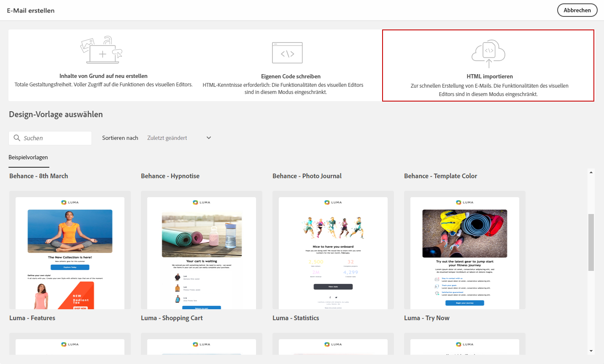
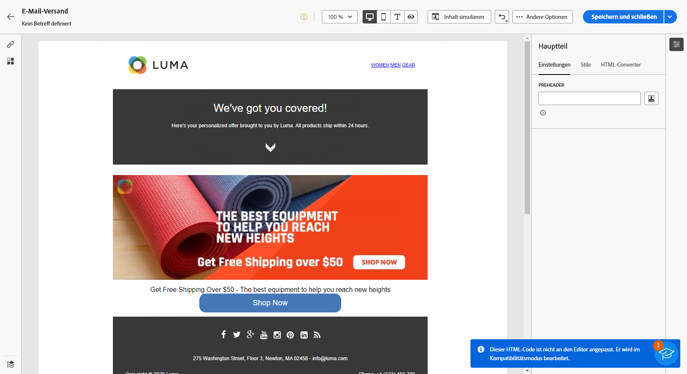
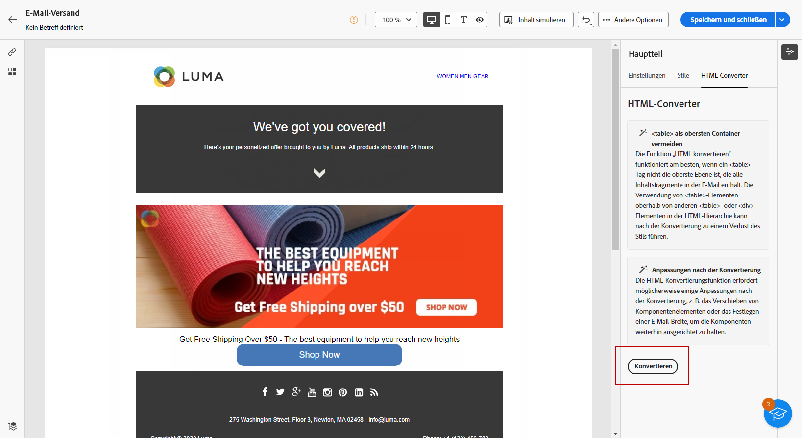

# Importieren Ihrer E-Mail-Inhalte {#existing-content}

>[!CONTEXTUALHELP]
>id="acw_deliveries_email_import_content"
>title="Verwenden eines vorhandenen E-Mail-Inhalts"
>abstract="Der E-Mail-Designer ermöglicht den Import vorhandener HTML-Inhalte. Dieser Inhalt kann eine HTML-Datei mit einem integrierten Stylesheet oder ein ZIP-Ordner mit der HTML-Datei, dem Stylesheet (.css) und Bildern sein."

Sie können vorhandene HTML-Inhalte in den E-Mail-Designer importieren. Dieser Inhalt kann Folgendes sein:

* Eine **HTML-Datei** mit integriertem Stylesheet,
* Ein Ordner **.zip** der HTML-Datei, dem Stylesheet (.css) und Bildern.

>[!NOTE]
>
>Die Struktur des komprimierten Ordners ist freigestellt. Verweise müssen jedoch relativ sein und zur Baumstruktur des ZIP-Ordners passen.

➡️ [Entdecken Sie diese Funktion im Video](#video)

Gehen Sie wie folgt vor, um eine Datei mit HTML-Inhalten zu importieren:

1. Wählen Sie auf der Startseite des [E-Mail-Designers](get-started-email-designer.md) die Option **[!UICONTROL HTML importieren]** aus.

   {zoomable="yes"}

1. Ziehen Sie die HTML- oder ZIP-Datei mit Ihrem HTML-Inhalt per Drag-and-Drop und klicken Sie auf **[!UICONTROL Importieren]**.

1. Sobald der HTML-Inhalt hochgeladen wurde, befindet sich Ihr Inhalt im **[!UICONTROL Kompatibilitätsmodus]**.

   In diesem Modus können Sie Ihren Text personalisieren, Links hinzufügen oder Assets in Ihren Inhalt aufnehmen.

   {zoomable="yes"}

1. Um die Inhaltskomponenten von Email Designer zu nutzen, rufen Sie die Registerkarte **[!UICONTROL HTML Converter]** auf und klicken Sie auf **[!UICONTROL Konvertieren]**.

   {zoomable="yes"}

>[!NOTE]
>
>Wenn ein `<table>`-Tag als erste Ebene in einer HTML-Datei verwendet wird, kann dies zum Verlust von Stileinstellungen finden, einschließlich der Einstellungen für Hintergrund und Breite im Tag der obersten Ebene.

1. Personalisieren Sie Ihre importierte Datei nach Bedarf mit den Funktionen von E-Mail-Designer. [Weitere Informationen](content-components.md)

## Anleitungsvideo {#video}

Erfahren Sie, wie Sie eine E-Mail erstellen, indem Sie HTML hochladen, mit der E-Mail-Designer kompatibel machen und in eine Vorlage konvertieren.

>[!VIDEO](https://video.tv.adobe.com/v/3427633/?quality=12)