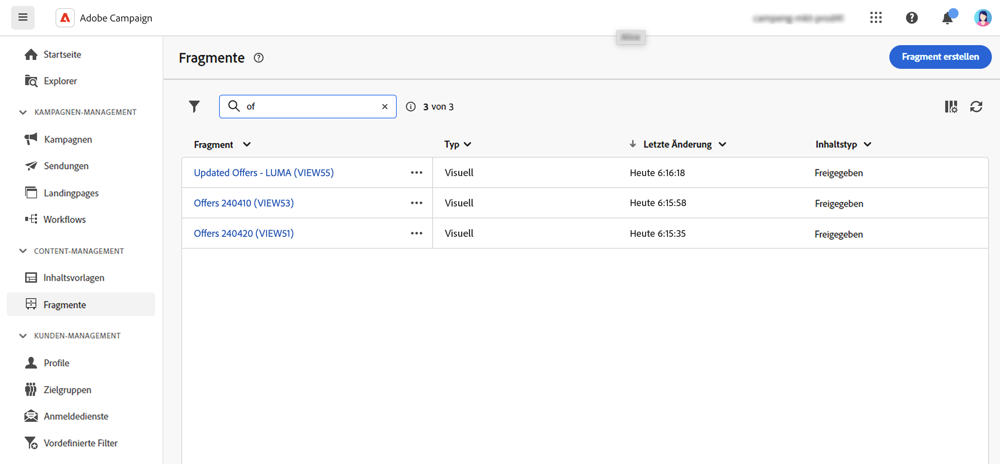
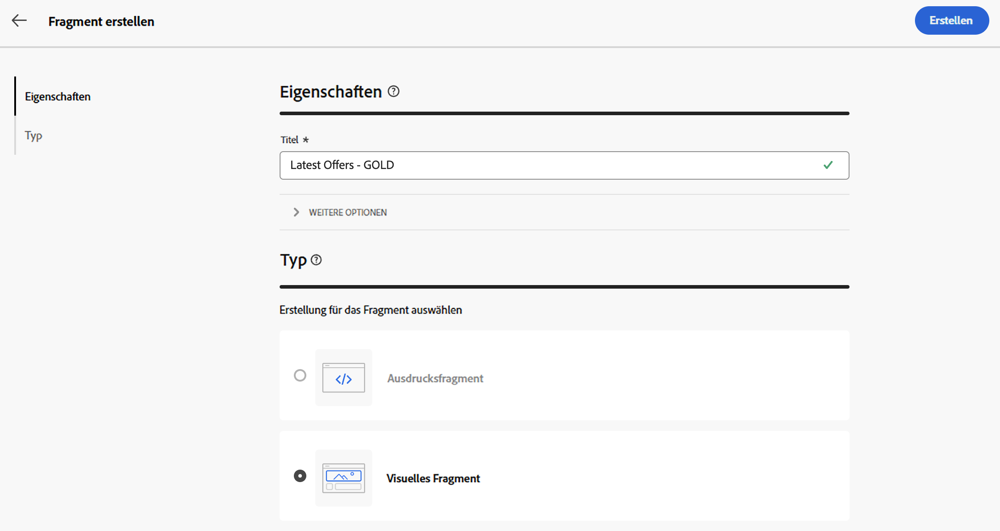
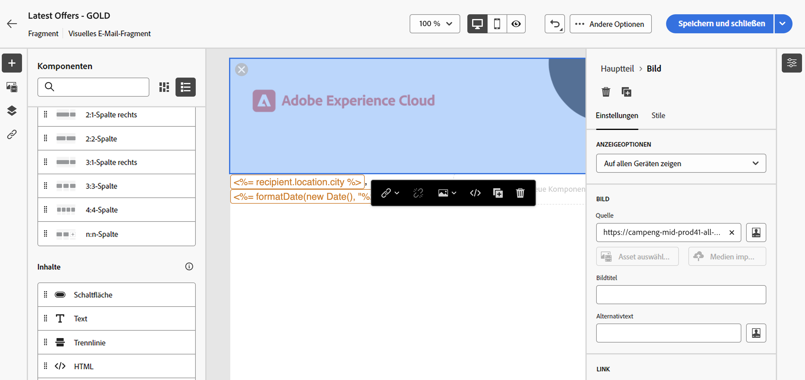
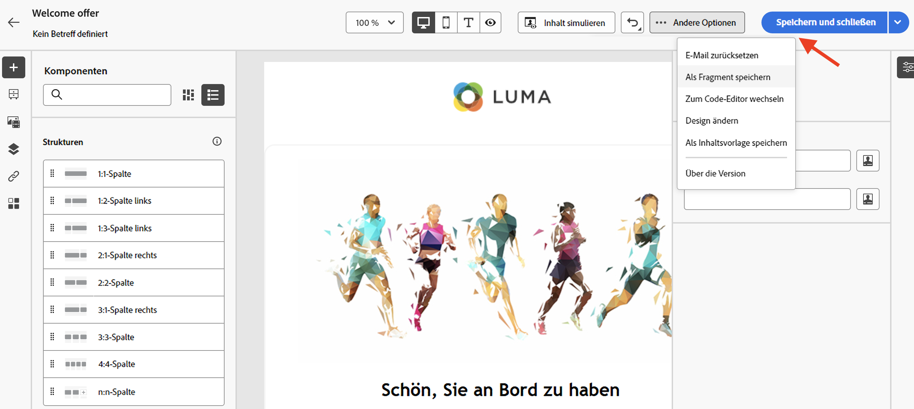
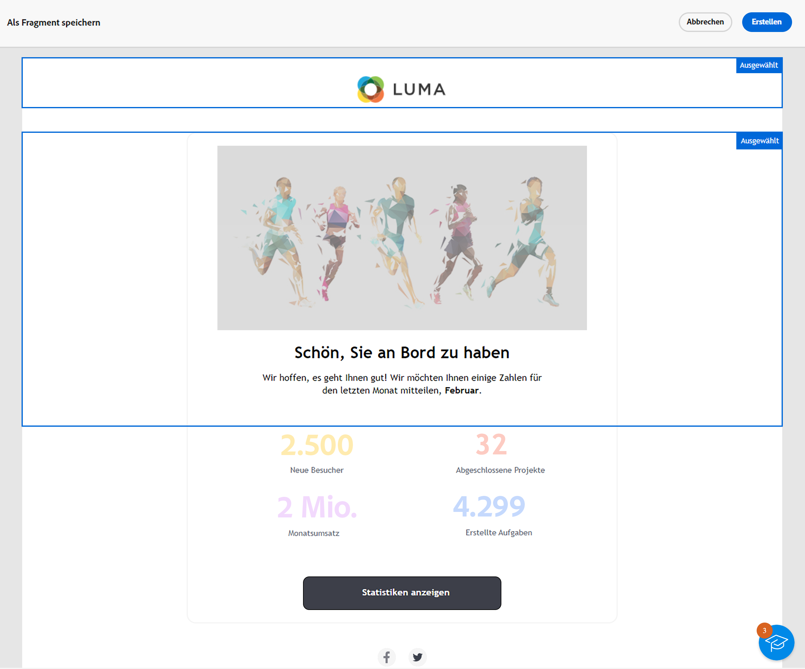
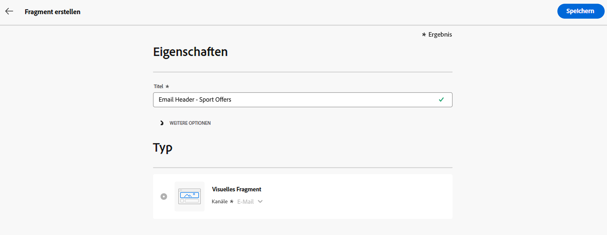
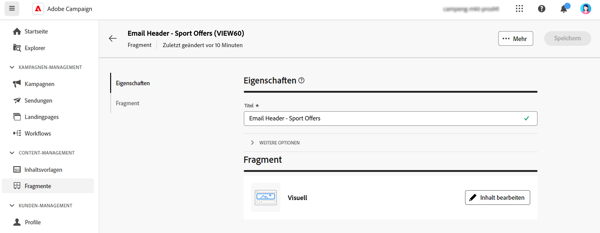
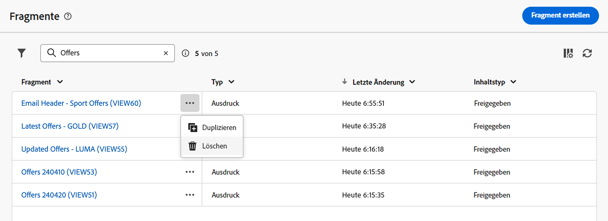

# Arbeiten mit Fragmenten {#fragments}

>[!CONTEXTUALHELP]
>id="acw_fragments_menu"
>title="Eigene Fragmente definieren"
>abstract="Ein Fragment ist eine wiederverwendbare Komponente, die kampagnenübergreifend in einer oder mehreren E-Mails referenziert werden kann."

>[!CONTEXTUALHELP]
>id="acw_fragments_save"
>title="Fragmente – Speichern"
>abstract="Fragmente – Speichern"

>[!CONTEXTUALHELP]
>id="acw_fragments_create"
>title="Eigene Fragmente definieren"
>abstract="Ein Fragment ist eine wiederverwendbare Komponente, die kampagnenübergreifend in einer oder mehreren E-Mails referenziert werden kann."

>[!CONTEXTUALHELP]
>id="acw_fragments_properties"
>title="Fragmente – Eigenschaften"
>abstract="Fragmente – Eigenschaften"

>[!CONTEXTUALHELP]
>id="acw_fragments_type"
>title="Fragmenttyp"
>abstract="Wählen Sie den Fragmenttyp aus. Derzeit sind nur visuelle Fragmente für E-Mails verfügbar."

>[!CONTEXTUALHELP]
>id="acw_fragments_list"
>title="Eigene Fragmente definieren"
>abstract="Ein Fragment ist eine wiederverwendbare Komponente, die kampagnenübergreifend in einer oder mehreren E-Mails referenziert werden kann. Sie können auch Fragmente in Ihren E-Mail-Vorlagen verwenden. Derzeit sind nur visuelle Fragmente verfügbar."

>[!CONTEXTUALHELP]
>id="acw_fragments_details"
>title="Fragmente – Details"
>abstract="Fragmente – Details"

>[!CONTEXTUALHELP]
>id="acw_create_fragment"
>title="Eigene Fragmente definieren"
>abstract="Ein Fragment ist eine wiederverwendbare Komponente, die kampagnenübergreifend in einer oder mehreren E-Mails referenziert werden kann."

Ein Fragment ist eine wiederverwendbare Komponente, die kampagnenübergreifend in einer oder mehreren E-Mails referenziert werden kann. Beim Ändern eines Fragments wird jeder Inhalt, der dieses verwendet, aktualisiert.

Mit dieser Funktion können Sie mehrere benutzerdefinierte Inhaltsbausteine vorab erstellen, die von Marketing-Benutzern verwendet werden können, um E-Mail-Inhalte schnell in einem verbesserten Designprozess zusammenzustellen.

So nutzen Sie Fragmente optimal:

* Erstellen Sie Ihre eigenen visuellen Fragmente, wie unten beschrieben.
* Verwenden Sie sie in Email Designer so oft wie nötig in Ihrem Inhalt. Siehe [Hinzufügen visueller Fragmente zu E-Mails](../email/use-visual-fragments.md).

## Erstellen eines visuellen Fragments {#create-fragments}

Fragmente können auf zwei Arten erstellt werden:

* Erstellen Sie ein Fragment von Grund auf mithilfe der **[!UICONTROL Fragmente]** dediziertes Menü. [Weitere Informationen dazu](#create-from-scratch)

* Speichern Sie beim Entwerfen von Inhalten einen Teil Ihres Inhalts als Fragment. [Weitere Informationen dazu](#save-as-fragment)

Nach dem Speichern ist Ihr Fragment für die Verwendung in einer E-Mail- oder E-Mail-Vorlage verfügbar. Unabhängig davon, ob es von Grund auf neu oder aus einem vorhandenen Inhalt erstellt wurde, können Sie dieses Fragment jetzt beim Erstellen von Inhalten in Campaign verwenden. Siehe [Hinzufügen visueller Fragmente](../email/use-visual-fragments.md).

### Erstellen eines neuen Fragments {#create-from-scratch}

Gehen Sie wie folgt vor, um ein Fragment von Grund auf neu zu erstellen.

1. [Zugriff auf die Fragmentliste](#access-manage-fragments) durch die **[!UICONTROL Content Management]** > **[!UICONTROL Fragmente]** Menü links.

   

1. Auswählen **[!UICONTROL Fragment erstellen]**.

1. Geben Sie den Titel des Fragments ein.

   

1. Bei Bedarf können Sie weitere Optionen definieren, z. B. den internen Namen des Fragments, dessen Ordner und eine Beschreibung.

   >[!NOTE]
   >
   >Derzeit können Sie nur visuelle Fragmente erstellen.

1. Klicken Sie auf **Erstellen** -Schaltfläche, um den Inhalt des Fragments zu konfigurieren.

1. Der [E-Mail-Designer](../email/get-started-email-designer.md) wird angezeigt. Bearbeiten Sie den Inhalt nach Bedarf auf die gleiche Weise wie für jede E-Mail innerhalb einer Kampagne. Sie können Bilder, Links, Personalisierungsfelder und dynamische Inhalte hinzufügen.

   

1. Sobald das Fragment fertig ist, klicken Sie auf **[!UICONTROL Speichern und schließen]**. Sie wird zum [Fragmentliste](#access-manage-fragments).

Dieses Fragment kann jetzt beim Erstellen von [email](../email/get-started-email-designer.md) oder [Inhaltsvorlage](use-email-templates.md) in Campaign. [Weitere Informationen dazu](../email/use-visual-fragments.md)

### Inhalt als Fragment speichern {#save-as-fragment}

Jeder E-Mail-Inhalt kann zur späteren Wiederverwendung als Fragment gespeichert werden. Beim Entwerfen einer [Inhaltsvorlage](use-email-templates.md) oder [email](../email/get-started-email-designer.md) -Versand können Sie einen Teil Ihres Inhalts als visuelles Fragment speichern. Gehen Sie dazu wie folgt vor:

1. Im [Email Designer](../email/get-started-email-designer.md), klicken Sie auf die **Mehr** rechts oben auf dem Bildschirm.

1. Auswählen **[!UICONTROL Als Fragment speichern]** aus dem Dropdown-Menü.

   

1. Die **[!UICONTROL Als Fragment speichern]** angezeigt. Hier können Sie die Elemente auswählen, die Sie in Ihr Fragment aufnehmen möchten, einschließlich Personalisierungsfeldern und dynamischem Inhalt.

   >[!CAUTION]
   >
   >Sie können nur nebeneinander liegende Abschnitte auswählen. Sie können keine leere Struktur oder ein anderes Fragment auswählen.

   

1. Wählen Sie **[!UICONTROL Erstellen]** aus. Füllen Sie den Fragmentnamen aus und speichern Sie ihn.

   

   Dieser Inhalt ist jetzt ein eigenständiges Fragment , das zum [Fragmentliste](#manage-fragments)und kann über das dedizierte Menü aufgerufen werden. Sie können dieses Fragment jetzt beim Erstellen von [email](../email/get-started-email-designer.md) oder [Inhaltsvorlage](use-email-templates.md) in Campaign. [Weitere Informationen dazu](../email/use-visual-fragments.md)

>[!NOTE]
>
>Änderungen an diesem neuen Fragment werden nicht in die E-Mail oder Vorlage übertragen, aus der es stammt. Wenn der ursprüngliche Inhalt in dieser E-Mail oder Vorlage bearbeitet wird, wird das neue Fragment ebenfalls nicht geändert.

## Fragmente verwalten {#manage-fragments}

Sie können ein Fragment in der Fragmentliste bearbeiten, aktualisieren, duplizieren oder löschen.

### Bearbeiten und Aktualisieren eines Fragments {#edit-fragments}

Gehen Sie wie folgt vor, um ein Fragment zu bearbeiten.

1. Klicken Sie auf den Namen des zu bearbeitenden Fragments im **[!UICONTROL Fragmente]** Liste.
1. Klicken Sie auf **Inhalt bearbeiten** -Schaltfläche, um den Inhalt dieses Fragments zu öffnen.

   

1. Nehmen Sie die erforderlichen Änderungen vor und speichern Sie Ihre Änderungen.

>[!CAUTION]
>
>Jede Änderung an einem Fragment wird für die E-Mail-Sendungen oder Vorlagen übernommen, die es verwenden.

### Fragment löschen {#delete-fragments}

Gehen Sie wie folgt vor, um ein Fragment zu löschen:

1. Navigieren Sie zur Fragmentliste und klicken Sie auf die Schaltfläche **[!UICONTROL Mehr Aktionen]** neben dem zu löschenden Fragment.
1. Klicks **Löschen** und bestätigen Sie.

   

>[!CAUTION]
>
>Beim Löschen eines Inhaltsfragments werden E-Mail-Sendungen und Vorlagen mit diesem Fragment aktualisiert und das Fragment wird aus dem Nachrichteninhalt entfernt. Sie können die Vererbung bei Bedarf aufheben. [Weitere Informationen](use-visual-fragments.md#break-inheritance)
>

### Fragment duplizieren {#duplicate-fragments}

Sie können ein Fragment einfach duplizieren, um ein neues zu erstellen. Gehen Sie wie folgt vor, um ein vorhandenes Fragment zu duplizieren:

1. Navigieren Sie zur Fragmentliste und klicken Sie auf die Schaltfläche **[!UICONTROL Mehr Aktionen]** neben dem zu löschenden Fragment.
1. Klicks **Duplizieren** und bestätigen Sie.
1. Geben Sie den Titel des neuen Fragments ein und speichern Sie die Änderungen.

   Das Fragment wird der Liste der Fragmente hinzugefügt. Sie können sie bearbeiten und nach Bedarf konfigurieren.
