# Generierung von E-Mails mit dem KI-Assistenten {#generative-content}

>[!BEGINSHADEBOX]

**Inhaltsverzeichnis**

* [Erste Schritte mit dem KI-Assistenten](generative-gs.md)
* **[Generierung von E-Mails mit dem KI-Assistenten](generative-content.md)**
* [Generierung von SMS mit dem KI-Assistenten](generative-sms.md)
* [Generierung von Push-Benachrichtigungen mit dem KI-Assistenten](generative-push.md)

>[!ENDSHADEBOX]

Nachdem Sie Ihre E-Mails erstellt und personalisiert haben, verwenden Sie den KI-Assistenten von Journey Optimizer in Campaign mit generativer KI, um Ihren Inhalt auf die nächste Stufe zu bringen.

Der KI-Assistenten kann Ihnen dabei helfen, die Wirkung Ihrer Sendungen zu optimieren, indem Ihnen verschiedene Inhalte vorgeschlagen werden, die mit größerer Wahrscheinlichkeit bei Ihrer Zielgruppe ankommen.

>[!NOTE]
>
>Bevor Sie mit der Verwendung dieser Funktion beginnen, lesen Sie die entsprechenden Informationen zu [Schutzmechanismen und Begrenzungen](generative-gs.md#guardrails-and-limitations).

## Inhaltsgenerierung mit dem KI-Assistenten {#generative-text}

1. Nachdem Sie Ihren E-Mail-Versand erstellt und konfiguriert haben, klicken Sie auf **[!UICONTROL Inhalt bearbeiten]**.

   Weitere Informationen zur Konfiguration Ihres E-Mail-Versands finden Sie auf [dieser Seite](../email/create-email-content.md).

1. Geben Sie die **[!UICONTROL grundlegenden Details]** zu Ihrem Versand an. Klicken Sie abschließend auf **[!UICONTROL Inhalt bearbeiten]**.

1. Personalisieren Sie Ihre E-Mail nach Bedarf.  [Weitere Informationen](content-components.md)

1. Rufen Sie das Menü **[!UICONTROL KI-Assistent]** auf.

   Sie können auch eine **[!UICONTROL Textkomponente]** auswählen, um nur einen bestimmten Inhalt zu erfassen.

   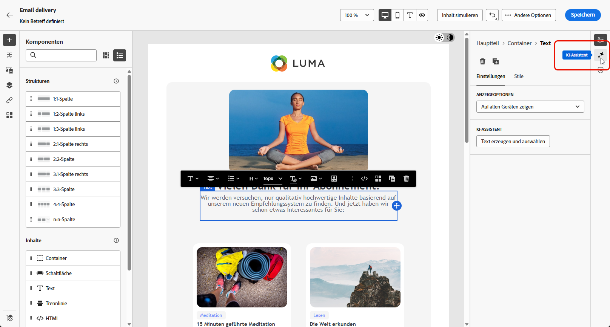{zoomable=&quot;yes&quot;}

1. Passen Sie den Inhalt an, indem Sie im Feld **[!UICONTROL Prompt]** beschreiben, was Sie generieren möchten.

   Wenn Sie Hilfe bei der Erstellung Ihres Prompts benötigen, finden Sie in der **[!UICONTROL Prompt-Bibliothek]** eine Vielzahl von Ideen für Prompts, mit denen Sie Ihre Sendungen verbessern können.

   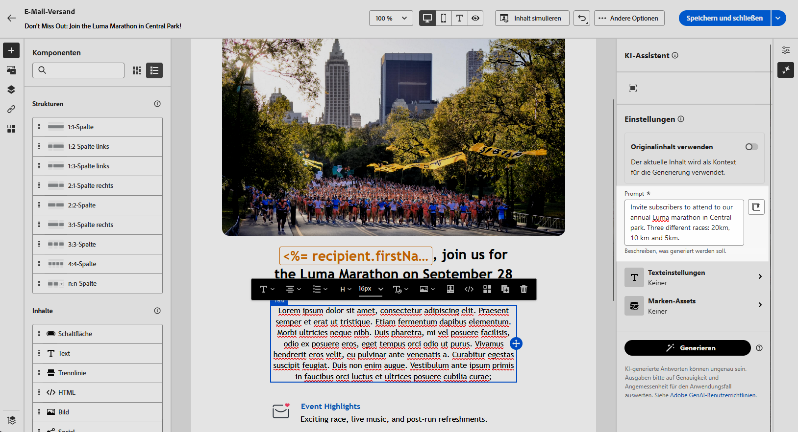{zoomable=&quot;yes&quot;}

1. Schalten Sie die **[!UICONTROL Betreffzeile]** oder **[!UICONTROL Vorüberschrift]** ein, um sie in die Variantengenerierung einzubeziehen.

1. Aktivieren Sie im Kontextmenü die Option **[!UICONTROL Mit aktuellem Kontext verbessern]** für den KI-Assistenten, um neue Inhalte basierend auf Ihrem Versand, dem Versandnamen und der ausgewählten Zielgruppe zu personalisieren.

   >[!IMPORTANT]
   >
   > Ihr Prompt muss immer an einen bestimmten Kontext gebunden sein, indem Sie ein Marken-Asset hochladen oder die Option **[!UICONTROL Aktuellen Inhalt verbessern]** aktivieren.

1. Klicken Sie auf **[!UICONTROL Marken-Asset hochladen]**, um ein beliebiges Marken-Asset hinzuzufügen, das Inhalte enthält, die zusätzlichen Kontext für den KI-Assistenten bieten können.

   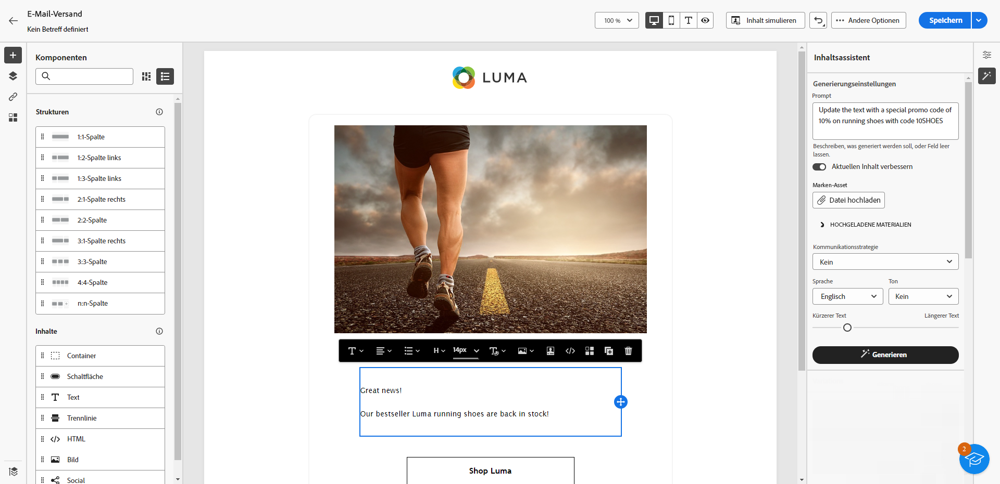{zoomable=&quot;yes&quot;}

1. Wählen Sie die **[!UICONTROL Kommunikationsstrategie]** aus, die am besten Ihren Anforderungen entspricht. Dies wirkt sich auf den Ton und den Stil des generierten Textes aus.

1. Wählen Sie die **[!UICONTROL Sprache]** und den **[!UICONTROL Ton]** aus. die der generierte Text haben soll. Dadurch wird sichergestellt, dass der Text für Ihre Zielgruppe und Ihren Zweck geeignet ist.

   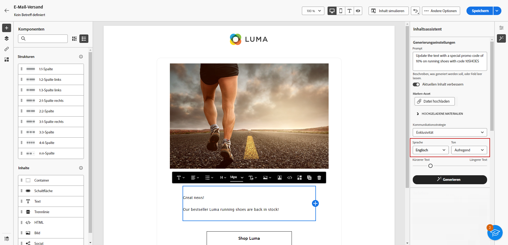{zoomable=&quot;yes&quot;}

1. Wenn die Eingabeaufforderung fertig ist, klicken Sie auf **[!UICONTROL Generieren]**.

1. Durchsuchen Sie die generierten **[!UICONTROL Varianten]** und klicken Sie auf **[!UICONTROL Anwenden]**, wenn Sie den richtigen Inhalt gefunden haben.

   Klicken Sie auf **[!UICONTROL Vorschau]**, um eine Vollbildversion der ausgewählten Variante anzuzeigen.

   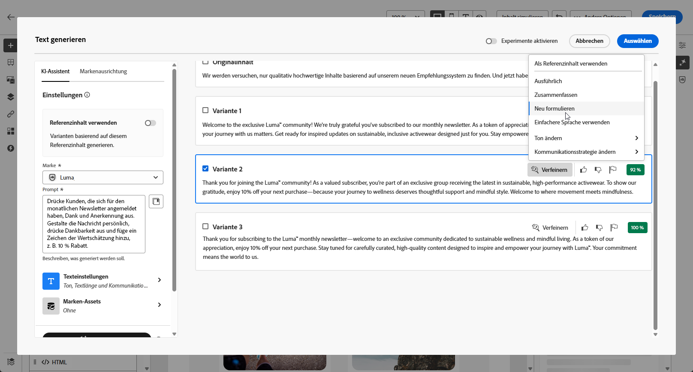{zoomable=&quot;yes&quot;}

1. Fügen Sie Personalisierungsfelder ein, um Ihre E-Mail-Inhalte auf der Grundlage von Profildaten anzupassen. [Weitere Informationen über die Personalisierung von Inhalten](../personalization/personalize.md)

   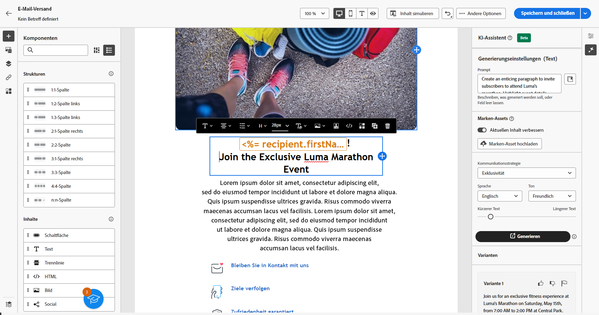{zoomable=&quot;yes&quot;}

1. Klicken Sie nach der Definition des Nachrichteninhalts auf die Schaltfläche **[!UICONTROL Inhalt simulieren]**, um das Rendern zu steuern, und überprüfen Sie die Personalisierungseinstellungen mit Testprofilen. [Weitere Informationen](../preview-test/preview-content.md)

   {zoomable=&quot;yes&quot;}

1. Wenn Sie Inhalt, Zielgruppe und Zeitplan definiert haben, können Sie den E-Mail-Versand vorbereiten. [Weitere Informationen](../monitor/prepare-send.md)

## Bildgenerierung mit dem KI-Assistenten {#generative-image}

Im folgenden Beispiel erfahren Sie, wie Sie den KI-Assistenten nutzen können, um Ihren Inhalt zu optimieren und zu verbessern und so ein benutzerfreundlicheres Erlebnis zu gewährleisten. Führen Sie folgende Schritte aus:

1. Nachdem Sie Ihren E-Mail-Versand erstellt und konfiguriert haben, klicken Sie auf **[!UICONTROL Inhalt bearbeiten]**.

   Weitere Informationen zur Konfiguration Ihres E-Mail-Versands finden Sie auf [dieser Seite](../email/create-email-content.md).

1. Geben Sie die **[!UICONTROL grundlegenden Details]** für Ihren Versand ein. Klicken Sie abschließend auf **[!UICONTROL E-Mail-Inhalt bearbeiten]**.

1. Wählen Sie mit dem KI-Assistenten das Asset aus, das Sie ändern möchten.

1. Wählen Sie aus dem Menü auf der rechten Seite die Option **[!UICONTROL KI-Assistent]** aus.

   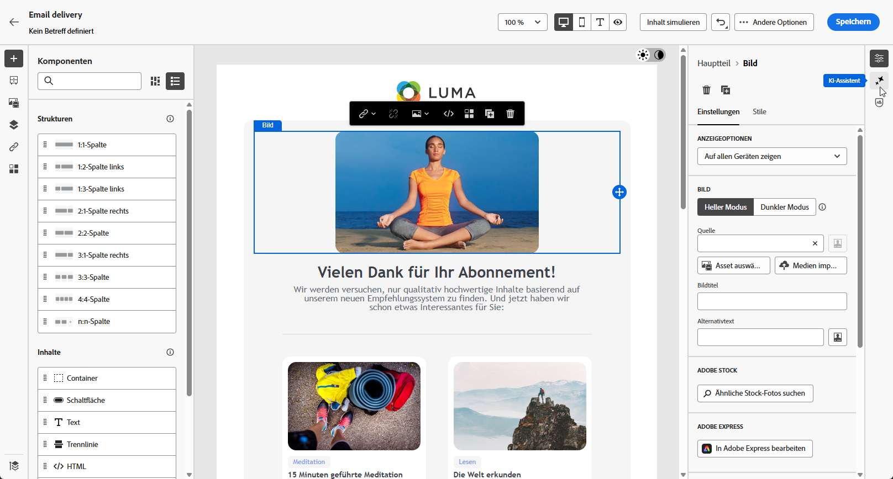{zoomable=&quot;yes&quot;}

1. Passen Sie den Inhalt an, indem Sie im Feld **[!UICONTROL Prompt]** beschreiben, was Sie generieren möchten.

   Wenn Sie Hilfe bei der Erstellung Ihres Prompts benötigen, finden Sie in der **[!UICONTROL Prompt-Bibliothek]** eine Vielzahl von Ideen für Prompts, mit denen Sie Ihre Sendungen verbessern können.

   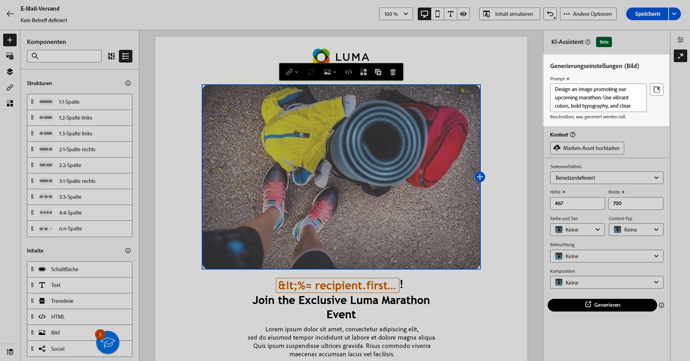{zoomable=&quot;yes&quot;}

1. Klicken Sie auf **[!UICONTROL Marken-Asset hochladen]**, um ein beliebiges Marken-Asset hinzuzufügen, das Inhalte enthält, die zusätzlichen Kontext für den KI-Assistenten bieten können.

   >[!IMPORTANT]
   >
   > Ihr Prompt muss immer an einen bestimmten Kontext gebunden sein.

1. Wählen Sie das **[!UICONTROL Seitenverhältnis]** des Assets aus. Dadurch wird die Breite und Höhe des Assets bestimmt.

   Sie können aus gängigen Verhältnissen wie 16:9, 4:3, 3:2 oder 1:1 wählen oder eine benutzerdefinierte Größe eingeben.

1. Passen Sie die Einstellungen **[!UICONTROL Farbe und Ton]**, **[!UICONTROL Inhaltstyp]**, **[!UICONTROL Beleuchtung]** und **[!UICONTROL Komposition]** an, damit Sie den gewünschten Asset-Eigenschaften entsprechen.

   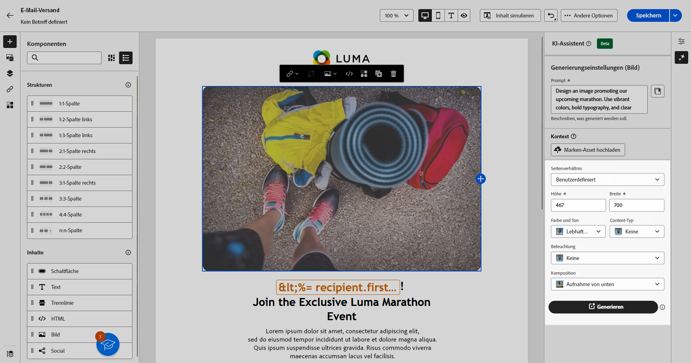{zoomable=&quot;yes&quot;}

1. Sobald Sie mit der Konfiguration der Eingabeaufforderung zufrieden sind, klicken Sie auf **[!UICONTROL Generieren]**.

1. Durchsuchen Sie die **[!UICONTROL Variantenvorschläge]**, um das gewünschte Asset zu finden. 

   Klicken Sie auf **[!UICONTROL Vorschau]**, um eine Vollbildversion der ausgewählten Variante anzuzeigen.

   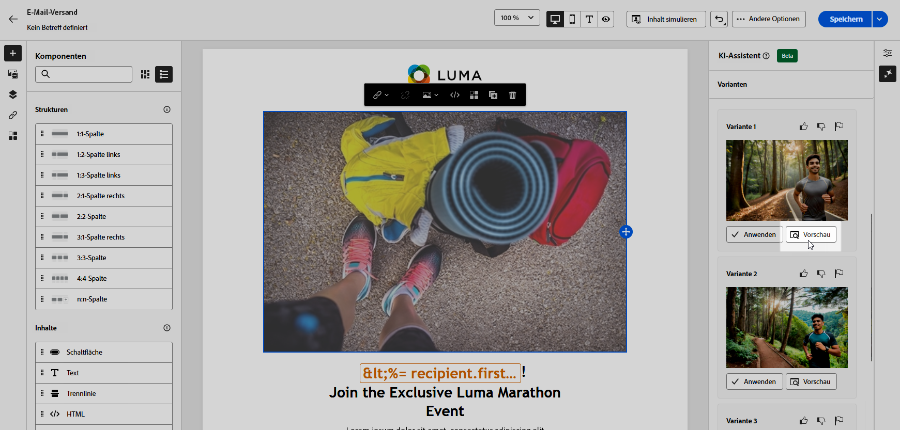{zoomable=&quot;yes&quot;}

1. Wählen Sie **[!UICONTROL Ähnliche anzeigen]**, wenn Sie verwandte Bilder zu dieser Variante anzeigen möchten.

1. Klicken Sie auf **[!UICONTROL Auswählen]**, sobald Sie den passenden Inhalt gefunden haben.

   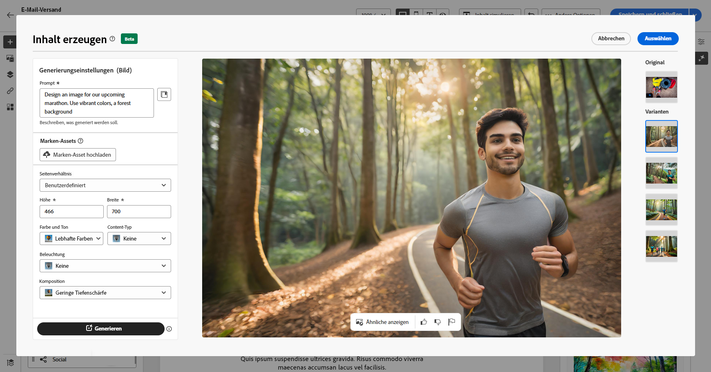{zoomable=&quot;yes&quot;}

1. Klicken Sie nach der Definition des Nachrichteninhalts auf die Schaltfläche **[!UICONTROL Inhalt simulieren]**, um das Rendern zu steuern, und überprüfen Sie die Personalisierungseinstellungen mit Testprofilen.  [Weitere Informationen](../preview-test/preview-content.md)

   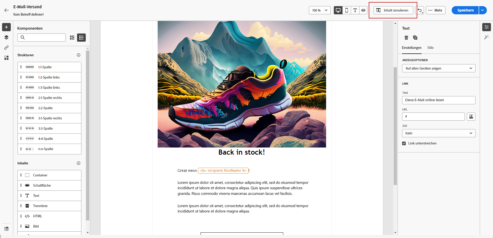{zoomable=&quot;yes&quot;}

1. Wenn Sie Inhalt, Zielgruppe und Zeitplan definiert haben, können Sie den E-Mail-Versand vorbereiten. [Weitere Informationen](../monitor/prepare-send.md)
