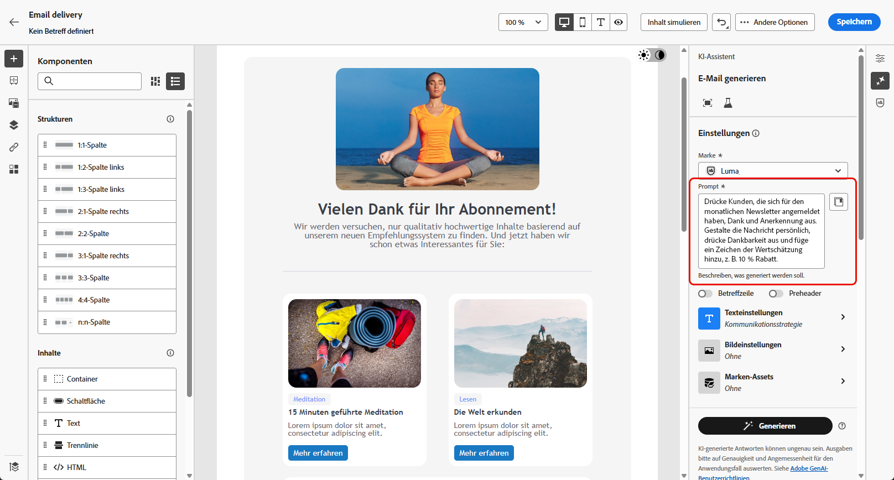
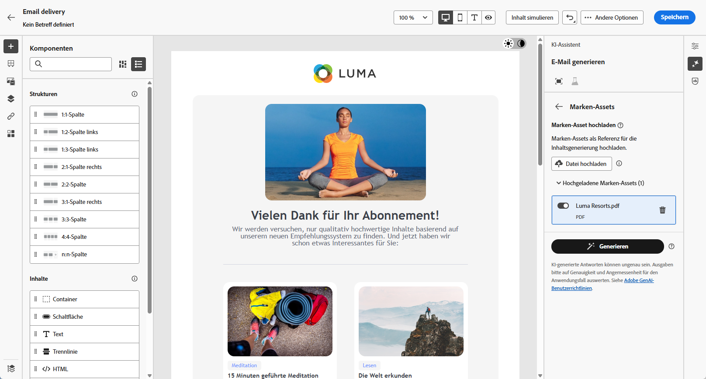

# Generierung von E-Mails mit dem KI-Assistenten {#generative-content}

>[!IMPORTANT]
>
>Bevor Sie mit der Verwendung dieser Funktion beginnen, lesen Sie die entsprechenden Informationen unter [Schutzmechanismen und Einschränkungen](generative-gs.md#generative-guardrails).
>&#x200B;> 
>
>Sie müssen einer [Benutzervereinbarung](https://www.adobe.com/de/legal/licenses-terms/adobe-dx-gen-ai-user-guidelines.html){target="_blank"} zustimmen, bevor Sie den KI-Assistenten in Adobe Campaign Web verwenden können. Weitere Informationen erhalten Sie beim Adobe-Support.

Sobald Sie Ihre E-Mails erstellt und personalisiert haben, können Sie Ihren Inhalt mithilfe des KI-Assistenten in Adobe Campaign Web optimieren.

Der KI-Assistent in Adobe Campaign Web hilft Ihnen dabei, die Wirkung Ihrer Sendungen zu optimieren, indem er ganze E-Mails, gezielte Textinhalte und Bilder generiert, die auf Ihre Zielgruppe zugeschnitten sind. Dadurch werden Ihre E-Mail-Kampagnen für eine bessere Interaktion optimiert.

Verwenden Sie bei Ihren E-Mail-Kampagnen den KI-Assistenten, um vollständige E-Mails, Texte oder Bilder zu generieren. Auf den folgenden Registerkarten erfahren Sie, wie Sie den KI-Assistenten in Adobe Campaign Web verwenden.

>[!BEGINTABS]

>[!TAB Generierung kompletter E-Mails]

Im folgenden Beispiel wird der KI-Assistent in Adobe Campaign Web verwendet, um eine vorhandene E-Mail zu optimieren und für ein besonderes Ereignis anzupassen.

1. Nachdem Sie Ihren E-Mail-Versand erstellt und konfiguriert haben, klicken Sie auf **[!UICONTROL Inhalt bearbeiten]**.

   Weitere Informationen zur Konfiguration Ihres E-Mail-Versands finden Sie auf [dieser Seite](../email/create-email-content.md).

1. Personalisieren Sie Ihr Layout nach Bedarf und rufen Sie das Menü **[!UICONTROL KI-Assistent]** auf.

   {zoomable="yes"}

1. Aktivieren Sie für den KI-Assistenten die Option **[!UICONTROL Originalinhalt verwenden]**, um neue Inhalte basierend auf dem ausgewählten Inhalt zu personalisieren.

1. Passen Sie den Inhalt an, indem Sie im Feld **[!UICONTROL Prompt]** beschreiben, was Sie generieren möchten.

   Wenn Sie Hilfe bei der Erstellung Ihres Prompts benötigen, finden Sie in der **[!UICONTROL Prompt-Bibliothek]** eine Vielzahl von Ideen für Prompts, mit denen Sie Ihre Sendungen verbessern können.

   {zoomable="yes"}

1. Schalten Sie die **[!UICONTROL Betreffzeile]** oder den **[!UICONTROL Preheader]** ein, um sie bzw. ihn in die Variantengenerierung einzubeziehen.

1. Passen Sie Ihren Prompt mit der Option **[!UICONTROL Texteinstellungen]** an:

   * **[!UICONTROL Kommunikationsstrategie]**: Wählen Sie den am besten geeigneten Kommunikationsstil für den generierten Text aus.
   * **[!UICONTROL Ton]**: Stellen Sie sicher, dass der Ton Ihrer E-Mail bei Ihrer Zielgruppe ankommt. Je nachdem, ob Sie informativ, humorvoll oder überzeugend klingen möchten, passt der KI-Assistent die Nachricht entsprechend an.

   {zoomable="yes"}

1. Wählen Sie Ihre **[!UICONTROL Bildeinstellungen]** aus:

   * **[!UICONTROL Inhaltstyp]**: Kategorisieren Sie die Art des visuellen Elements, wobei zwischen verschiedenen Arten der visuellen Darstellung wie Fotos, Grafiken oder Kunst unterschieden wird.
   * **[!UICONTROL Visuelle Intensität]**: Steuern Sie die Wirkung des Bildes durch Anpassen seiner Intensität. Durch eine niedrigere Einstellung (2) wird das Erscheinungsbild weicher, während eine höhere Einstellung (10) das Bild lebendiger macht.
   * **[!UICONTROL Farbe und Ton]**: Passen Sie die Gesamterscheinung der Farben und die vermittelte Stimmung oder Atmosphäre an.
   * **[!UICONTROL Beleuchtung]**: Ändern Sie die Beleuchtung in einem Bild, um dessen Atmosphäre zu prägen und bestimmte Elemente hervorzuheben.
   * **[!UICONTROL Komposition]**: Ordnen Sie Elemente innerhalb des Rahmens eines Bildes an.

1. Klicken Sie im Menü **[!UICONTROL Marken-Assets]** auf **[!UICONTROL Marken-Asset hochladen]**, um beliebige Marken-Assets hinzuzufügen, die zusätzlichen Kontext für den KI-Assistenten liefern. Wählen Sie alternativ ein zuvor hochgeladenes Asset aus.

   Zuvor hochgeladene Dateien sind in der Dropdown-Liste **[!UICONTROL Hochgeladene Marken-Assets]** verfügbar. Aktivieren Sie die Assets, die in den Generierungsprozess einbezogen werden sollen.

   {zoomable="yes"}

1. Wenn das Prompt fertig ist, klicken Sie auf **[!UICONTROL Generieren]**.

1. Durchsuchen Sie die generierten **[!UICONTROL Varianten]** und klicken Sie auf **[!UICONTROL Vorschau]**, um eine Vollbildversion der ausgewählten Variante anzuzeigen, oder **[!UICONTROL Anwenden]**, um Ihren aktuellen Inhalt zu ersetzen.

1. Klicken Sie auf das Prozentsymbol, um Ihre **[!UICONTROL Markenausrichtungsbewertung]** anzuzeigen und Abweichungen von Ihrer Marke zu identifizieren.

   Weitere Informationen finden Sie unter [Bewertung der Markenausrichtung](../content/brands-score.md).

   {zoomable="yes"}

1. Navigieren Sie im Fenster **[!UICONTROL Vorschau]** zur Option **[!UICONTROL Verfeinern]**, um auf zusätzliche Anpassungsfunktionen zuzugreifen:

   * **[!UICONTROL Neu formulieren]**: Der KI-Assistent formuliert Ihre Nachricht auf verschiedene Arten um, sodass Ihre Texte für verschiedene Zielgruppen interessant und ansprechend klingen.
   * **[!UICONTROL Einfachere Sprache verwenden]**: Vereinfachen Sie Ihren Text, damit er für eine breitere Zielgruppe verständlich und zugänglich ist.

   Sie können auch den **[!UICONTROL Ton]** und die **[!UICONTROL Kommunikationsstrategie]** Ihres Textes ändern.

   {zoomable="yes"}

1. Öffnen Sie die Registerkarte **[!UICONTROL Markenausrichtung]**, um zu sehen, wie Ihr Inhalt mit Ihren [Markenrichtlinien](../content/brands.md) abgestimmt ist.

1. Klicken Sie auf **[!UICONTROL Auswählen]**, sobald Sie den passenden Inhalt gefunden haben.

1. Fügen Sie Personalisierungsfelder ein, um Ihre E-Mail-Inhalte auf der Grundlage von Profildaten anzupassen. Klicken Sie danach auf die Schaltfläche **[!UICONTROL Inhalte simulieren]**, um das Rendern zu steuern, und überprüfen Sie die Personalisierungseinstellungen mit Testprofilen. [Weitere Informationen](../preview-test/preview-content.md)

Bereiten Sie den E-Mail-Versand vor, wenn Sie Inhalt, Zielgruppe und Zeitplan definieren. [Weitere Informationen](../monitor/prepare-send.md)

>[!TAB Nur Textgenerierung]

Im folgenden Beispiel wird der KI-Assistent verwendet, um den Inhalt Ihrer E-Mail-Einladung für ein bevorstehendes Ereignis zu verbessern.

1. Nachdem Sie Ihren E-Mail-Versand erstellt und konfiguriert haben, klicken Sie auf **[!UICONTROL Inhalt bearbeiten]**.

   Weitere Informationen zur Konfiguration Ihres E-Mail-Versands finden Sie auf [dieser Seite](../email/create-email-content.md).

1. Wählen Sie eine **[!UICONTROL Textkomponente]** aus, um bestimmte Inhalte zu erfassen, und rufen Sie das Menü **[!UICONTROL KI-Assistent]** auf.

   {zoomable="yes"}

1. Aktivieren Sie für den KI-Assistenten die Option **[!UICONTROL Originalinhalt verwenden]**, um neue Inhalte basierend auf dem ausgewählten Inhalt zu personalisieren.

1. Passen Sie den Inhalt an, indem Sie im Feld **[!UICONTROL Prompt]** beschreiben, was Sie generieren möchten.

   Wenn Sie Hilfe bei der Erstellung Ihres Prompts benötigen, finden Sie in der **[!UICONTROL Prompt-Bibliothek]** eine Vielzahl von Ideen für Prompts, mit denen Sie Ihre Sendungen verbessern können.

   {zoomable="yes"}

1. Passen Sie Ihren Prompt mit der Option **[!UICONTROL Texteinstellungen]** an:

   * **[!UICONTROL Kommunikationsstrategie]**: Wählen Sie den am besten geeigneten Kommunikationsstil für den generierten Text aus.
   * **[!UICONTROL Ton]**: Stellen Sie sicher, dass der Ton Ihrer E-Mail bei Ihrer Zielgruppe ankommt. Je nachdem, ob Sie informativ, humorvoll oder überzeugend klingen möchten, passt der KI-Assistent die Nachricht entsprechend an.
   * **Textlänge**: Wählen Sie mit dem Regler die gewünschte Textlänge aus.

   {zoomable="yes"}

1. Klicken Sie im Menü **[!UICONTROL Marken-Assets]** auf **[!UICONTROL Marken-Asset hochladen]**, um beliebige Marken-Assets hinzuzufügen, die zusätzlichen Kontext für den KI-Assistenten liefern. Wählen Sie alternativ ein zuvor hochgeladenes Asset aus.

   Zuvor hochgeladene Dateien sind in der Dropdown-Liste **[!UICONTROL Hochgeladene Marken-Assets]** verfügbar. Aktivieren Sie die Assets, die in den Generierungsprozess einbezogen werden sollen.

1. Wenn das Prompt fertig ist, klicken Sie auf **[!UICONTROL Generieren]**.

1. Durchsuchen Sie die generierten **[!UICONTROL Varianten]** und klicken Sie auf **[!UICONTROL Vorschau]**, um eine Vollbildversion der ausgewählten Variante anzuzeigen, oder **[!UICONTROL Anwenden]**, um Ihren aktuellen Inhalt zu ersetzen.

1. Klicken Sie auf das Prozentsymbol, um Ihre **[!UICONTROL Markenausrichtungsbewertung]** anzuzeigen und Abweichungen von Ihrer Marke zu identifizieren.

   Weitere Informationen finden Sie unter [Bewertung der Markenausrichtung](../content/brands-score.md).

   {zoomable="yes"}

1. Navigieren Sie im Fenster **[!UICONTROL Vorschau]** zur Option **[!UICONTROL Verfeinern]**, um auf zusätzliche Anpassungsfunktionen zuzugreifen:

   * **[!UICONTROL Als Referenzinhalt verwenden]**: Die gewählte Variante dient hierbei als Referenzinhalt für die Generierung anderer Ergebnisse.
   * **[!UICONTROL Ausführlich]**: Gehen Sie genauer auf bestimmte Themen ein und liefern Sie zusätzliche Details, um das Verständnis und die Interaktion zu verbessern.
   * **[!UICONTROL Zusammenfassen]**: Fassen Sie die wichtigsten Punkte in klaren, prägnanten Aussagen zusammen, die die Aufmerksamkeit der Leserinnen und Leser wecken und sie zum Weiterlesen animieren.
   * **[!UICONTROL Neu formulieren]**: Formulieren Sie Ihre Nachricht auf verschiedene Arten um, sodass Ihr Text frisch und für verschiedene Zielgruppen ansprechend bleibt.
   * **[!UICONTROL Einfachere Sprache verwenden]**: Vereinfachen Sie Ihren Text, damit er für eine breitere Zielgruppe verständlich und zugänglich ist.

   Sie können auch den **[!UICONTROL Ton]** und die **[!UICONTROL Kommunikationsstrategie]** Ihres Textes ändern.

   {zoomable="yes"}

1. Öffnen Sie die Registerkarte **[!UICONTROL Markenausrichtung]**, um zu sehen, wie Ihr Inhalt mit Ihren [Markenrichtlinien](../content/brands.md) abgestimmt ist.

1. Klicken Sie auf **[!UICONTROL Auswählen]**, sobald Sie den passenden Inhalt gefunden haben.

1. Fügen Sie Personalisierungsfelder ein, um Ihre E-Mail-Inhalte auf der Grundlage von Profildaten anzupassen. Klicken Sie danach auf die Schaltfläche **[!UICONTROL Inhalte simulieren]**, um das Rendern zu steuern, und überprüfen Sie die Personalisierungseinstellungen mit Testprofilen. [Weitere Informationen](../preview-test/preview-content.md)

Bereiten Sie den E-Mail-Versand vor, wenn Sie Inhalt, Zielgruppe und Zeitplan definieren. [Weitere Informationen](../monitor/prepare-send.md)

>[!TAB Bildgenerierung]

Im folgenden Beispiel erfahren Sie, wie Sie den KI-Assistenten nutzen können, um Ihre Assets zu optimieren und zu verbessern und so ein benutzerfreundlicheres Erlebnis zu gewährleisten.

1. Nachdem Sie Ihren E-Mail-Versand erstellt und konfiguriert haben, klicken Sie auf **[!UICONTROL Inhalt bearbeiten]**.

   Weitere Informationen zur Konfiguration Ihres E-Mail-Versands finden Sie auf [dieser Seite](../email/create-email-content.md).

1. Geben Sie die **[!UICONTROL grundlegenden Details]** zu Ihrem Versand an. Klicken Sie abschließend auf **[!UICONTROL E-Mail-Inhalt bearbeiten]**.

1. Wählen Sie mit dem KI-Assistenten das Asset aus, das Sie ändern möchten.

1. Wählen Sie aus dem Menü auf der rechten Seite die Option **[!UICONTROL KI-Assistent]** aus.

   {zoomable="yes"}

1. Aktivieren Sie für den KI-Assistenten die Option **[!UICONTROL Referenzstil]**, um neue Inhalte basierend auf dem ausgewählten Inhalt zu personalisieren.

1. Passen Sie den Inhalt an, indem Sie im Feld **[!UICONTROL Prompt]** beschreiben, was Sie generieren möchten.

   Wenn Sie Hilfe bei der Erstellung Ihres Prompts benötigen, finden Sie in der **[!UICONTROL Prompt-Bibliothek]** eine Vielzahl von Ideen für Prompts, mit denen Sie Ihre Sendungen verbessern können.

   {zoomable="yes"}

1. Passen Sie Ihren Prompt mit der Option **[!UICONTROL Texteinstellungen]** an:

   * **[!UICONTROL Seitenverhältnis]**: Bestimmen Sie die Breite und Höhe des Assets. Wählen Sie aus gängigen Verhältnissen wie 16:9, 4:3, 3:2 oder 1:1 oder geben Sie eine benutzerdefinierte Größe ein.
   * **[!UICONTROL Inhaltstyp]**: Kategorisieren Sie die Art des visuellen Elements, wobei zwischen verschiedenen Arten der visuellen Darstellung wie Fotos, Grafiken oder Kunst unterschieden wird.
   * **[!UICONTROL Visuelle Intensität]**: Steuern Sie die Wirkung des Bildes durch Anpassen seiner Intensität. Durch eine niedrigere Einstellung (2) wird das Erscheinungsbild weicher, während eine höhere Einstellung (10) das Bild lebendiger macht.
   * **[!UICONTROL Farbe und Ton]**: Passen Sie die Gesamterscheinung der Farben und die vermittelte Stimmung oder Atmosphäre an.
   * **[!UICONTROL Beleuchtung]**: Ändern Sie die Beleuchtung in einem Bild, um dessen Atmosphäre zu prägen und bestimmte Elemente hervorzuheben.
   * **[!UICONTROL Komposition]**: Ordnen Sie Elemente innerhalb des Rahmens eines Bildes an.

   {zoomable="yes"}

1. Klicken Sie im Menü **[!UICONTROL Marken-Assets]** auf **[!UICONTROL Marken-Asset hochladen]**, um beliebige Marken-Assets hinzuzufügen, die zusätzlichen Kontext für den KI-Assistenten liefern. Wählen Sie alternativ ein zuvor hochgeladenes Asset aus.

   Zuvor hochgeladene Dateien sind in der Dropdown-Liste **[!UICONTROL Hochgeladene Marken-Assets]** verfügbar. Aktivieren Sie die Assets, die in den Generierungsprozess einbezogen werden sollen.

1. Sobald Sie mit der Konfiguration des Prompts zufrieden sind, klicken Sie auf **[!UICONTROL Generieren]**.

1. Durchsuchen Sie die generierten **[!UICONTROL Varianten]** und klicken Sie auf **[!UICONTROL Vorschau]**, um eine Vollbildversion der ausgewählten Variante anzuzeigen, oder **[!UICONTROL Anwenden]**, um Ihren aktuellen Inhalt zu ersetzen.

1. Klicken Sie auf das Prozentsymbol, um Ihre **[!UICONTROL Markenausrichtungsbewertung]** anzuzeigen und Abweichungen von Ihrer Marke zu identifizieren.

   Weitere Informationen finden Sie unter [Bewertung der Markenausrichtung](../content/brands-score.md).

   {zoomable="yes"}

1. Wählen Sie **[!UICONTROL Ähnliche generieren]** aus, wenn Sie verwandte Bilder zu dieser Variante anzeigen möchten.

1. Öffnen Sie die Registerkarte **[!UICONTROL Markenausrichtung]**, um zu sehen, wie Ihr Inhalt mit Ihren [Markenrichtlinien](../content/brands.md) abgestimmt ist.

1. Klicken Sie auf **[!UICONTROL Auswählen]**, sobald Sie den passenden Inhalt gefunden haben.

1. Klicken Sie nach der Definition des Nachrichteninhalts auf die Schaltfläche **[!UICONTROL Inhalte simulieren]**, um das Rendern zu steuern, und überprüfen Sie die Personalisierungseinstellungen mit Testprofilen. [Weitere Informationen](../preview-test/preview-content.md)

1. Bereiten Sie den E-Mail-Versand vor, wenn Sie Inhalt, Zielgruppe und Zeitplan definieren. [Weitere Informationen](../monitor/prepare-send.md)

>[!ENDTABS]

## Anleitungsvideo {#video}

Erfahren Sie, wie Sie den KI-Assistenten nutzen können, um ganze E-Mails, Texte oder Bilder zu erstellen.

>[!VIDEO](https://video.tv.adobe.com/v/3428984)