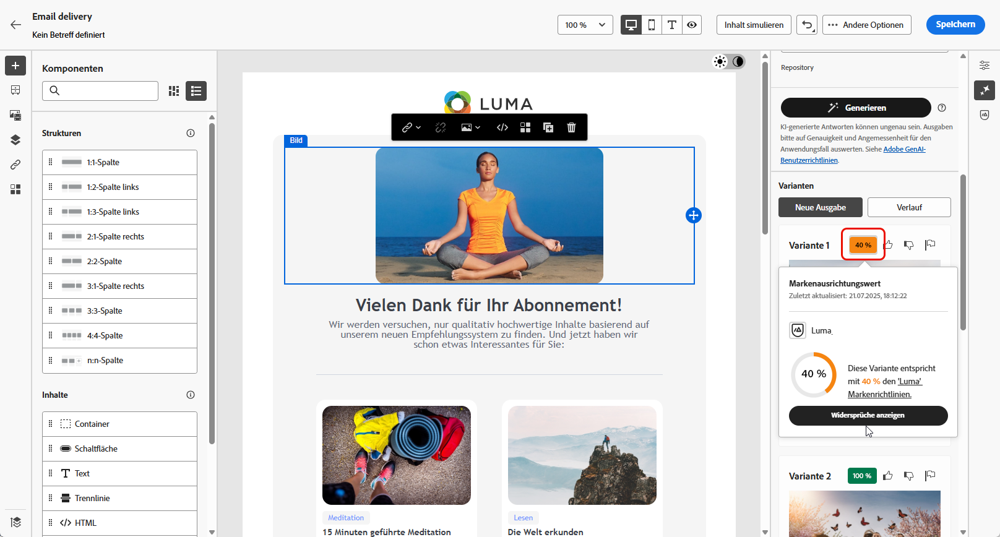
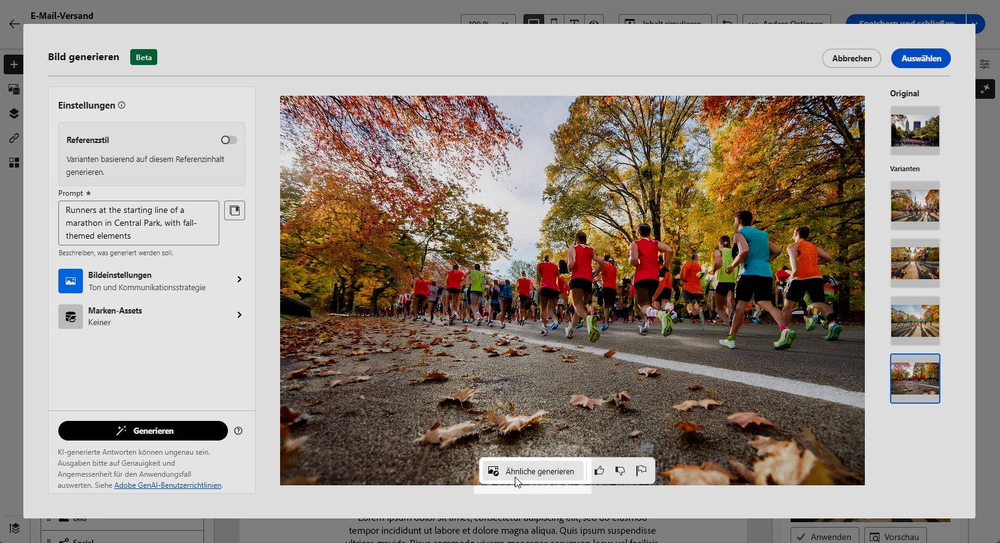

# Generierung von E-Mails mit dem KI-Assistenten {#generative-content}

>[!BEGINSHADEBOX]

**Inhaltsverzeichnis**

* [Erste Schritte mit dem KI-Assistenten](generative-gs.md)
* **[Generierung von E-Mails mit dem KI-Assistenten](generative-content.md)**
* [Generierung von SMS mit dem KI-Assistenten](generative-sms.md)
* [Generierung von Push-Benachrichtigungen mit dem KI-Assistenten](generative-push.md)

>[!ENDSHADEBOX]

Nachdem Sie Ihre E-Mails erstellt und personalisiert haben, verwenden Sie den KI-Assistenten von Journey Optimizer in Campaign mit generativer KI, um Ihren Inhalt auf die nächste Stufe zu bringen.

Der KI-Assistenten kann Ihnen dabei helfen, die Wirkung Ihrer Sendungen zu optimieren, indem Ihnen verschiedene Inhalte vorgeschlagen werden, die mit größerer Wahrscheinlichkeit bei Ihrer Zielgruppe ankommen.

>[!NOTE]
>
>Bevor Sie mit der Verwendung dieser Funktion beginnen, lesen Sie die entsprechenden Informationen zu [Schutzmechanismen und Begrenzungen](generative-gs.md#guardrails-and-limitations).

## Inhaltsgenerierung mit dem KI-Assistenten {#generative-text}

So kann Ihr KI-Assistent Ihnen beim Schreiben ansprechender E-Mails helfen:

* **Zusammenfassung**: Lange Informationen können E-Mail-Empfänger überlasten. Verwenden Sie den KI-Assistenten, um wichtige Punkte in klaren, präzisen Zusammenfassungen zusammenzufassen, die Aufmerksamkeit erregen und sie dazu ermutigen, mehr zu lesen.

* **Laborate**: Der KI-Assistent kann Ihnen dabei helfen, zu bestimmten Themen zu erweitern und zusätzliche Details für ein besseres Verständnis und eine bessere Interaktion bereitzustellen.

* **Vereinfachen der Sprache**: Nutzen Sie den KI-Assistenten, um Ihre Sprache zu vereinfachen und für eine breitere Zielgruppe Klarheit und Barrierefreiheit zu gewährleisten.

* **Rehrase**:Der KI-Assistent kann Ihre Nachricht auf unterschiedliche Weise umformulieren und so Ihr Schreiben für verschiedene Zielgruppen frisch und ansprechend gestalten.

* **Ton ändern**: Der Ton Ihrer E-Mail sollte bei Ihrer Zielgruppe Resonanz finden. Unabhängig davon, ob Sie informativ, spielerisch oder überzeugend klingen möchten, kann der KI-Assistent die Nachricht entsprechend anpassen.

Im folgenden Beispiel werden wir den KI-Assistenten nutzen, um den Inhalt unserer E-Mail-Einladung für unsere bevorstehende Veranstaltung zu verbessern.

1. Nachdem Sie Ihren E-Mail-Versand erstellt und konfiguriert haben, klicken Sie auf **[!UICONTROL Inhalt bearbeiten]**.

   Weitere Informationen zur Konfiguration Ihres E-Mail-Versands finden Sie auf [dieser Seite](../email/create-email-content.md).

1. Personalisieren Sie Ihre E-Mail nach Bedarf und greifen Sie auf die **[!UICONTROL KI-Assistent]** Menü.

   Sie können auch eine **[!UICONTROL Textkomponente]** auswählen, um nur einen bestimmten Inhalt zu erfassen.

   {zoomable=&quot;yes&quot;}

1. Aktivieren Sie die **[!UICONTROL Originalinhalt verwenden]** Option für den KI-Assistenten, um neuen Inhalt basierend auf Ihrem Versand, dem Versandnamen und der ausgewählten Zielgruppe zu personalisieren.

   >[!IMPORTANT]
   >
   > Ihr Prompt muss immer an einen bestimmten Kontext gebunden sein, indem Sie ein Marken-Asset hochladen oder die Option **[!UICONTROL Aktuellen Inhalt verbessern]** aktivieren.

1. Passen Sie den Inhalt an, indem Sie im Feld **[!UICONTROL Prompt]** beschreiben, was Sie generieren möchten.

   Wenn Sie Hilfe bei der Erstellung Ihres Prompts benötigen, finden Sie in der **[!UICONTROL Prompt-Bibliothek]** eine Vielzahl von Ideen für Prompts, mit denen Sie Ihre Sendungen verbessern können.

   {zoomable=&quot;yes&quot;}

1. Sie können die **[!UICONTROL Betreff]** oder **[!UICONTROL Preheader]** , um sie in die Variantengenerierung aufzunehmen.

   Beachten Sie, dass dies verfügbar ist, wenn Sie keine bestimmte Textkomponente ausgewählt haben.

1. Klicken Sie auf **[!UICONTROL Marken-Asset hochladen]**, um ein beliebiges Marken-Asset hinzuzufügen, das Inhalte enthält, die zusätzlichen Kontext für den KI-Assistenten bieten können.

   {zoomable=&quot;yes&quot;}

1. Passen Sie Ihre Eingabeaufforderung mit den verschiedenen Optionen an:

   * **[!UICONTROL Kommunikationsstrategie]**: Wählen Sie den gewünschten Kommunikationsansatz für den generierten Text aus.
   * **[!UICONTROL Sprache]**: Wählen Sie die Sprache für den Inhalt der Variante aus.
   * **[!UICONTROL Ton]**: Stellen Sie sicher, dass der Text Ihrer Zielgruppe und Ihrem Zweck entspricht.
   * **[!UICONTROL Length]**: Wählen Sie die Länge Ihres Inhalts mit dem Regler für den Bereich aus. Nur verfügbar, wenn Sie eine bestimmte Textkomponente ausgewählt haben.

   {zoomable=&quot;yes&quot;}

1. Wenn die Eingabeaufforderung fertig ist, klicken Sie auf **[!UICONTROL Generieren]**.

1. Durchsuchen Sie die generierte **[!UICONTROL Varianten]** und klicken **[!UICONTROL Vorschau]** , um eine Vollbildversion der ausgewählten Variante anzuzeigen.

1. Navigieren Sie zum **[!UICONTROL Verfeinern]** -Option innerhalb der **[!UICONTROL Vorschau]** um auf zusätzliche Anpassungsfunktionen zuzugreifen und Ihre Variante auf Ihre Voreinstellungen anzupassen.

   Klicken Sie auf **[!UICONTROL Auswählen]**, sobald Sie den passenden Inhalt gefunden haben.

   {zoomable=&quot;yes&quot;}

1. Fügen Sie Personalisierungsfelder ein, um Ihre E-Mail-Inhalte auf der Grundlage von Profildaten anzupassen. Klicken Sie dann auf die **[!UICONTROL Inhalt simulieren]** zur Steuerung des Renderings und zur Überprüfung der Personalisierungseinstellungen mit Testprofilen. [Weitere Informationen](../preview-test/preview-content.md)

   {zoomable=&quot;yes&quot;}

Wenn Sie Inhalt, Zielgruppe und Zeitplan definiert haben, können Sie den E-Mail-Versand vorbereiten. [Weitere Informationen](../monitor/prepare-send.md)

## Bildgenerierung mit dem KI-Assistenten {#generative-image}

Nutzen Sie den KI-Assistenten, um vielfältige und maßgeschneiderte Visualisierungen für Ihre E-Mail-Kampagnen zu erstellen. Sie kann beispielsweise für Folgendes verwendet werden:

* **Erzeugen**: Erstellen Sie eine Vielzahl ansprechender Bilder, die speziell für Ihre E-Mail-Kampagnen entwickelt wurden. Die präzise Steuerung der Einstellungen wie Farbpalette, Blitzbildung und Komposition ermöglicht es Ihnen, bei unterschiedlichen Zielgruppensegmenten zu Resonanz zu gelangen und Ihre individuellen Kampagnenziele zu erreichen.

* **Ähnliche generieren**: Verwenden Sie den KI-Assistenten, um Bilder zu generieren, die einer ausgewählten Variante ähnlich sind.

* **Marken-Asset**: Optimieren Sie die Bildauswahl für E-Mail-Kampagnen, indem Sie sowohl interne Marken-Assets als auch externe Quellen wie Adobe Firefly nutzen.

Im folgenden Beispiel erfahren Sie, wie Sie den KI-Assistenten nutzen können, um Ihren Inhalt zu optimieren und zu verbessern und so ein benutzerfreundlicheres Erlebnis zu gewährleisten. Führen Sie folgende Schritte aus:

1. Nachdem Sie Ihren E-Mail-Versand erstellt und konfiguriert haben, klicken Sie auf **[!UICONTROL Inhalt bearbeiten]**.

   Weitere Informationen zur Konfiguration Ihres E-Mail-Versands finden Sie auf [dieser Seite](../email/create-email-content.md).

1. Geben Sie die **[!UICONTROL grundlegenden Details]** zu Ihrem Versand an. Klicken Sie abschließend auf **[!UICONTROL E-Mail-Inhalt bearbeiten]**.

1. Wählen Sie mit dem KI-Assistenten das Asset aus, das Sie ändern möchten.

1. Wählen Sie aus dem Menü auf der rechten Seite die Option **[!UICONTROL KI-Assistent]** aus.

   {zoomable=&quot;yes&quot;}

1. Passen Sie den Inhalt an, indem Sie im Feld **[!UICONTROL Prompt]** beschreiben, was Sie generieren möchten.

   Wenn Sie Hilfe bei der Erstellung Ihres Prompts benötigen, finden Sie in der **[!UICONTROL Prompt-Bibliothek]** eine Vielzahl von Ideen für Prompts, mit denen Sie Ihre Sendungen verbessern können.

   {zoomable=&quot;yes&quot;}

1. Klicken Sie auf **[!UICONTROL Marken-Asset hochladen]**, um ein beliebiges Marken-Asset hinzuzufügen, das Inhalte enthält, die zusätzlichen Kontext für den KI-Assistenten bieten können.

   >[!IMPORTANT]
   >
   > Ihr Prompt muss immer an einen bestimmten Kontext gebunden sein.

1. Passen Sie Ihre Eingabeaufforderung mit den verschiedenen Optionen an:

   * **[!UICONTROL Seitenverhältnis]**: Bestimmt die Breite und Höhe des Assets. Sie können aus gängigen Verhältnissen wie 16:9, 4:3, 3:2 oder 1:1 wählen oder eine benutzerdefinierte Größe eingeben.
   * **[!UICONTROL Farbe und Ton]**: Die Gesamtdarstellung der Farben innerhalb eines Bildes und die Stimmung oder Atmosphäre, die es vermittelt.
   * **[!UICONTROL Inhaltstyp]**: Dadurch wird die Art des visuellen Elements kategorisiert, wobei zwischen verschiedenen Formen der visuellen Darstellung wie Fotos, Grafiken oder Kunst unterschieden wird.
   * **[!UICONTROL Beleuchtung]**: Dies bezieht sich auf die Blitze, die in einem Bild vorhanden sind, das seine Atmosphäre prägt und bestimmte Elemente hervorhebt.
   * **[!UICONTROL Komposition]**: Dies bezieht sich auf die Anordnung der Elemente innerhalb des Rahmens eines Bildes.

   {zoomable=&quot;yes&quot;}

1. Sobald Sie mit der Konfiguration der Eingabeaufforderung zufrieden sind, klicken Sie auf **[!UICONTROL Generieren]**.

1. Durchsuchen Sie die **[!UICONTROL Variantenvorschläge]**, um das gewünschte Asset zu finden. 

   Klicken Sie auf **[!UICONTROL Vorschau]**, um eine Vollbildversion der ausgewählten Variante anzuzeigen.

   {zoomable=&quot;yes&quot;}

1. Wählen Sie **[!UICONTROL Ähnliche anzeigen]**, wenn Sie verwandte Bilder zu dieser Variante anzeigen möchten.

1. Klicken Sie auf **[!UICONTROL Auswählen]**, sobald Sie den passenden Inhalt gefunden haben.

   {zoomable=&quot;yes&quot;}

1. Klicken Sie nach der Definition des Nachrichteninhalts auf die Schaltfläche **[!UICONTROL Inhalt simulieren]**, um das Rendern zu steuern, und überprüfen Sie die Personalisierungseinstellungen mit Testprofilen.  [Weitere Informationen](../preview-test/preview-content.md)

   {zoomable=&quot;yes&quot;}

1. Wenn Sie Inhalt, Zielgruppe und Zeitplan definiert haben, können Sie den E-Mail-Versand vorbereiten. [Weitere Informationen](../monitor/prepare-send.md)
