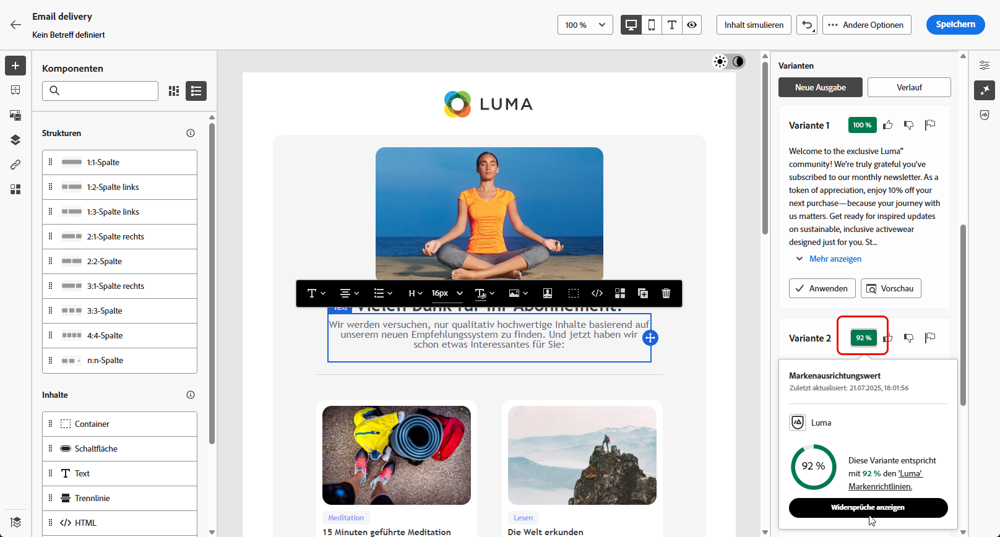

# Textgenerierung mit dem Inhaltsassistenten {#generative-content}

Nachdem Sie Ihre E-Mails erstellt und personalisiert haben, verwenden Sie den Inhaltsassistenten mit generativer KI, um Ihren Inhalt auf die nächste Stufe zu bringen.

Der Inhaltsassistent kann Ihnen dabei helfen, die Wirkung Ihrer Sendungen zu optimieren, indem Ihnen verschiedene Inhalte vorgeschlagen werden, die mit größerer Wahrscheinlichkeit bei Ihrer Zielgruppe ankommen.

>[!NOTE]
>
>Bevor Sie mit der Verwendung dieser Funktion beginnen, lesen Sie die entsprechenden Informationen unter [Schutzmechanismen und Begrenzungen](generative-gs.md#guardrails-and-limitations).

Gehen Sie wie folgt vor, um mit dem Inhaltsassistenten E-Mail-Inhalte zu erstellen und zu verbessern. Sie können mit dem Inhaltsassistenten auch den vollständigen HTML-Inhalt erstellen, wie auf [dieser Seite](generative-email.md) beschrieben wird.

1. Nachdem Sie Ihren E-Mail-Versand erstellt und konfiguriert haben, klicken Sie auf **[!UICONTROL Inhalt bearbeiten]**.

   Weitere Informationen zur Konfiguration Ihres E-Mail-Versands finden Sie auf [dieser Seite](../email/create-email-content.md).

1. Geben Sie die **[!UICONTROL grundlegenden Details]** für Ihren Versand ein. Klicken Sie abschließend auf **[!UICONTROL E-Mail-Inhalt bearbeiten]**.

1. Personalisieren Sie Ihre E-Mail nach Bedarf.

1. Wählen Sie die **[!UICONTROL Textkomponente]** aus, die Sie aktualisieren möchten, und rufen Sie das Menü „Erlebnisgenerierung“ auf.

   

1. Passen Sie den Inhalt an, indem Sie beschreiben, was Sie generieren möchten.

   Aktivieren Sie die Option **[!UICONTROL Mit aktuellem Kontext verbessern]** für den Inhaltsassistenten, um neue Inhalte basierend auf Ihrem Versand, dem Versandnamen und der ausgewählten Zielgruppe zu personalisieren.

   

1. Wählen Sie **[!UICONTROL Datei hochladen]** aus, um ein beliebiges Marken-Asset hinzuzufügen, das Inhalte enthält, die zusätzlichen Kontext für den Inhaltsassistenten bieten können.

   Sie können auch auf **[!UICONTROL hochgeladene Inhalte]** klicken, um zuvor aktualisierte Dateien zu finden. Beachten Sie, dass der hochgeladene Inhalt ausschließlich für die Wiederverwendung durch die aktuelle Benutzerin bzw. den aktuellen Benutzer verfügbar ist.

1. Wählen Sie die **[!UICONTROL Kommunikationsstrategie]** aus, die am besten Ihren Anforderungen entspricht. Dies wirkt sich auf den Ton und den Stil des generierten Textes aus.

1. Wählen Sie die **[!UICONTROL Sprache]** und den **[!UICONTROL Ton]** aus. die der generierte Text haben soll. Dadurch wird sichergestellt, dass der Text für Ihre Zielgruppe und Ihren Zweck geeignet ist.

   

1. Verwenden Sie den Schieberegler, um die Länge des generierten Textes festzulegen.

1. Wenn die Eingabeaufforderung fertig ist, klicken Sie auf **[!UICONTROL Generieren]**.

1. Durchsuchen Sie die generierten **[!UICONTROL Varianten]** und klicken Sie auf **[!UICONTROL Anwenden]**, wenn Sie den richtigen Inhalt gefunden haben.

   

1. Fügen Sie Personalisierungsfelder ein, um Ihre E-Mail-Inhalte auf der Grundlage von Profildaten anzupassen. [Weitere Informationen über die Personalisierung von Inhalten](../personalization/personalize.md)

   

1. Klicken Sie nach der Definition des Nachrichteninhalts auf die Schaltfläche **[!UICONTROL Inhalt simulieren]**, um das Rendern zu steuern, und überprüfen Sie die Personalisierungseinstellungen mit Testprofilen. [Weitere Informationen](../preview-test/preview-content.md)

   

1. Wenn Sie Inhalt, Zielgruppe und Zeitplan definiert haben, können Sie den E-Mail-Versand vorbereiten. [Weitere Informationen](../monitor/prepare-send.md)
