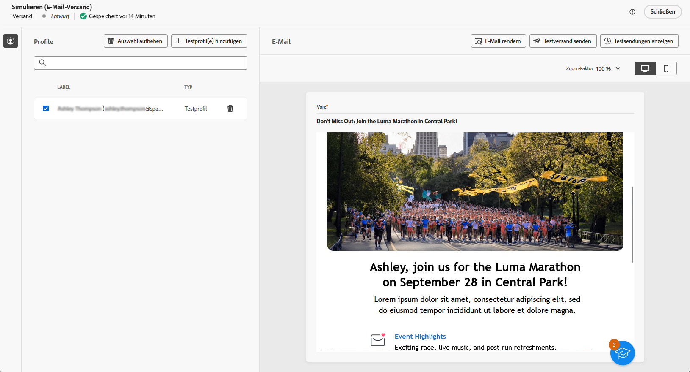
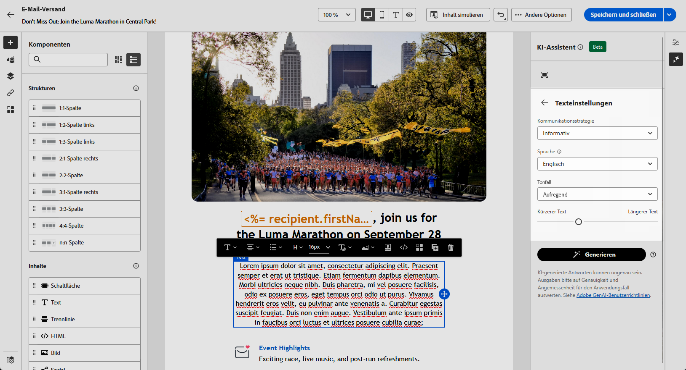
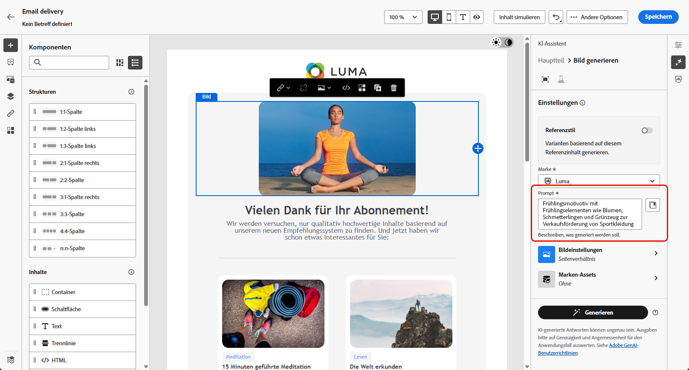

# Generierung von E-Mails mit dem KI-Assistenten {#generative-content}

>[!IMPORTANT]
>
>Bevor Sie mit der Verwendung dieser Funktion beginnen, lesen Sie die entsprechenden [Leitplanken und Einschränkungen](generative-gs.md#generative-guardrails).
> 
>
>Sie müssen einer [Benutzervereinbarung“ zustimmen](https://www.adobe.com/de/legal/licenses-terms/adobe-dx-gen-ai-user-guidelines.html){target="_blank"} bevor Sie den KI-Assistenten in Adobe Campaign Web verwenden. Weitere Informationen erhalten Sie vom Adobe-Support.

Nachdem Sie Ihre E-Mails erstellt und personalisiert haben, können Sie den KI-Assistenten in Adobe Campaign Web verwenden, um Ihre Inhalte zu verbessern.

Der KI-Assistent in Adobe Campaign Web hilft Ihnen, die Wirkung Ihrer Sendungen zu optimieren, indem er ganze E-Mails, zielgerichtete Textinhalte und Bilder generiert, die auf Ihre Audience zugeschnitten sind. Dies verbessert Ihre E-Mail-Kampagnen für eine bessere Interaktion.

Verwenden Sie bei Ihren E-Mail-Kampagnen den KI-Assistenten, um vollständige E-Mails, Text oder Bilder zu generieren. Auf den folgenden Registerkarten erfahren Sie, wie Sie den KI-Assistenten in Adobe Campaign Web verwenden.

>[!BEGINTABS]

>[!TAB Generierung kompletter E-Mails]

Im folgenden Beispiel nutzen Sie den KI-Assistenten in Adobe Campaign Web, um eine bestehende E-Mail zu verfeinern und für ein spezielles Ereignis anzupassen.

1. Nachdem Sie Ihren E-Mail-Versand erstellt und konfiguriert haben, klicken Sie auf **[!UICONTROL Inhalt bearbeiten]**.

   Weiterführende Informationen zur Konfiguration Ihres E-Mail-Versands finden Sie auf [dieser Seite](../email/create-email-content.md).

1. Personalisieren Sie Ihr Layout nach Bedarf und greifen Sie auf das Menü **[!UICONTROL KI-Assistent]** zu.

   {zoomable="yes"}

1. Aktivieren Sie für den KI-Assistenten die Option **[!UICONTROL Originalinhalt verwenden]**, um neue Inhalte basierend auf dem ausgewählten Inhalt zu personalisieren.

1. Passen Sie den Inhalt an, indem Sie beschreiben, was Sie im Feld **[!UICONTROL Eingabeaufforderung]** generieren möchten.

   Wenn Sie Hilfe bei der Erstellung Ihrer Eingabeaufforderung benötigen, rufen Sie die **[!UICONTROL Eingabeaufforderungsbibliothek]** auf, die eine Vielzahl von Ideen für die Eingabeaufforderung bereitstellt, um Ihre Sendungen zu verbessern.

   {zoomable="yes"}

1. Schalten Sie die **[!UICONTROL Betreffzeile]** oder **[!UICONTROL Preheader]** um, um sie in die Variantengenerierung aufzunehmen.

1. Passen Sie die Eingabeaufforderung mit der Option **[!UICONTROL Texteinstellungen]** an:

   * **[!UICONTROL Kommunikationsstrategie]**: Wählen Sie den am besten geeigneten Kommunikationsstil für den generierten Text aus.
   * **[!UICONTROL Tone]**: Stellen Sie sicher, dass der Ton Ihrer E-Mail bei Ihrer Audience Anklang findet. Egal ob informativ, verspielt oder überzeugend klingen soll, der KI-Assistent passt die Nachricht entsprechend an.

   {zoomable="yes"}

1. Wählen Sie Ihre **[!UICONTROL Bildeinstellungen]** aus:

   * **[!UICONTROL Content-Typ]**: Kategorisieren der Art des visuellen Elements, wobei zwischen verschiedenen Formen der visuellen Darstellung wie Fotos, Grafiken oder Kunst unterschieden wird.
   * **[!UICONTROL Visuelle Intensität]**: Kontrollieren Sie die Wirkung des Bildes, indem Sie seine Intensität anpassen. Eine niedrigere Einstellung (2) sorgt für ein weicheres Erscheinungsbild, während eine höhere Einstellung (10) das Bild lebendiger macht.
   * **[!UICONTROL Farbe und Ton]**: Passen Sie das Gesamtbild der Farben und die vermittelte Stimmung oder Atmosphäre an.
   * **[!UICONTROL Beleuchtung]**: Ändern Sie die Beleuchtung im Bild, um die Atmosphäre zu formen und bestimmte Elemente hervorzuheben.
   * **[!UICONTROL Komposition]**: Ordnet Elemente innerhalb des Rahmens des Bildes an.

   {zoomable="yes"}

1. Klicken Sie im Menü **[!UICONTROL Marken]** auf **[!UICONTROL Marken-Asset hochladen]**, um jedes Marken-Asset hinzuzufügen, das zusätzlichen Kontext für den KI-Assistenten bietet, oder wählen Sie ein zuvor hochgeladenes Asset aus.

   Zuvor hochgeladene Dateien sind in der Dropdown-Liste **[!UICONTROL Hochgeladene Marken-Assets]** verfügbar. Schalten Sie die Assets ein, die Sie in Ihre Generation aufnehmen möchten.

1. Wenn das Prompt fertig ist, klicken Sie auf **[!UICONTROL Generieren]**.

1. Durchsuchen Sie die generierten **[!UICONTROL Varianten]** und klicken Sie auf **[!UICONTROL Vorschau]**, um eine Vollbildversion der ausgewählten Variante anzuzeigen.

1. Navigieren Sie im Fenster **[!UICONTROL Vorschau]** zur Option **[!UICONTROL Verfeinern]**, um auf zusätzliche Anpassungsfunktionen zuzugreifen:

   * **[!UICONTROL Umformulieren]**: Der KI-Assistent formuliert Ihre Nachricht auf unterschiedliche Weise neu, sodass Sie frisch schreiben und für unterschiedliche Zielgruppen interessant sind.
   * **[!UICONTROL Einfachere Sprache verwenden]**: Vereinfachen Sie Ihre Sprache, um einer breiteren Zielgruppe Klarheit und Zugänglichkeit zu verschaffen.

   Sie können auch den **[!UICONTROL Ton]** und die **[!UICONTROL Kommunikationsstrategie]** Ihres Textes ändern.

   {zoomable="yes"}

1. Klicken Sie **[!UICONTROL Auswählen]**, sobald Sie den entsprechenden Inhalt gefunden haben.

1. Fügen Sie Personalisierungsfelder ein, um Ihren E-Mail-Inhalt auf der Grundlage von Profildaten anzupassen. Klicken Sie anschließend auf die Schaltfläche **[!UICONTROL Inhalt simulieren]**, um das Rendering zu steuern und die Personalisierungseinstellungen mit Testprofilen zu überprüfen. [Weitere Informationen](../preview-test/preview-content.md)

   {zoomable="yes"}

Bereiten Sie den E-Mail-Versand vor, wenn Sie Inhalt, Zielgruppe und Zeitplan definieren. [Weitere Informationen](../monitor/prepare-send.md)

>[!TAB Nur Textgenerierung]

Nutzen Sie im folgenden Beispiel den KI-Assistenten, um den Inhalt Ihrer E-Mail-Einladung für ein bevorstehendes Ereignis zu erweitern.

1. Nachdem Sie Ihren E-Mail-Versand erstellt und konfiguriert haben, klicken Sie auf **[!UICONTROL Inhalt bearbeiten]**.

   Weiterführende Informationen zur Konfiguration Ihres E-Mail-Versands finden Sie auf [dieser Seite](../email/create-email-content.md).

1. Wählen Sie eine **[!UICONTROL Textkomponente]** aus, um bestimmte Inhalte anzusprechen, und rufen Sie das Menü **[!UICONTROL KI-Assistent]** auf.

   {zoomable="yes"}

1. Aktivieren Sie für den KI-Assistenten die Option **[!UICONTROL Originalinhalt verwenden]**, um neue Inhalte basierend auf dem ausgewählten Inhalt zu personalisieren.

1. Passen Sie den Inhalt an, indem Sie beschreiben, was Sie im Feld **[!UICONTROL Eingabeaufforderung]** generieren möchten.

   Wenn Sie Hilfe bei der Erstellung Ihrer Eingabeaufforderung benötigen, rufen Sie die **[!UICONTROL Eingabeaufforderungsbibliothek]** auf, die eine Vielzahl von Ideen für die Eingabeaufforderung bereitstellt, um Ihre Sendungen zu verbessern.

   {zoomable="yes"}

1. Passen Sie die Eingabeaufforderung mit der Option **[!UICONTROL Texteinstellungen]** an:

   * **[!UICONTROL Kommunikationsstrategie]**: Wählen Sie den am besten geeigneten Kommunikationsstil für den generierten Text aus.
   * **[!UICONTROL Tone]**: Stellen Sie sicher, dass der Ton Ihrer E-Mail bei Ihrer Audience Anklang findet. Egal ob informativ, verspielt oder überzeugend klingen soll, der KI-Assistent passt die Nachricht entsprechend an.
   * **Textlänge**: Wählen Sie mit dem Regler die gewünschte Textlänge aus.

   {zoomable="yes"}

1. Klicken Sie im Menü **[!UICONTROL Marken]** auf **[!UICONTROL Marken-Asset hochladen]**, um jedes Marken-Asset hinzuzufügen, das zusätzlichen Kontext für den KI-Assistenten bietet, oder wählen Sie ein zuvor hochgeladenes Asset aus.

   Zuvor hochgeladene Dateien sind in der Dropdown-Liste **[!UICONTROL Hochgeladene Marken-Assets]** verfügbar. Schalten Sie die Assets ein, die Sie in Ihre Generation aufnehmen möchten.

1. Wenn das Prompt fertig ist, klicken Sie auf **[!UICONTROL Generieren]**.

1. Durchsuchen Sie die generierten **[!UICONTROL Varianten]** und klicken Sie auf **[!UICONTROL Vorschau]**, um eine Vollbildversion der ausgewählten Variante anzuzeigen.

1. Navigieren Sie im Fenster **[!UICONTROL Vorschau]** zur Option **[!UICONTROL Verfeinern]**, um auf zusätzliche Anpassungsfunktionen zuzugreifen:

   * **[!UICONTROL Als Referenzinhalt verwenden]**: Die ausgewählte Variante dient als Referenzinhalt für die Generierung anderer Ergebnisse.
   * **[!UICONTROL Ausarbeiten]**: Erweitern Sie Ihre Kenntnisse zu bestimmten Themen und liefern Sie zusätzliche Details, um das Verständnis und die Interaktion zu verbessern.
   * **[!UICONTROL Zusammenfassen]**: Zusammenfassen von Schlüsselpunkten in klaren, knappen Zusammenfassungen, um Aufmerksamkeit zu erregen und das weitere Lesen zu fördern.
   * **[!UICONTROL Umformulieren]**: Formulieren Sie Ihre Nachricht auf unterschiedliche Weise neu, sodass Sie neu schreiben und unterschiedliche Zielgruppen ansprechen können.
   * **[!UICONTROL Einfachere Sprache verwenden]**: Vereinfachen Sie Ihre Sprache, um einer breiteren Zielgruppe Klarheit und Zugänglichkeit zu verschaffen.

   Sie können auch den **[!UICONTROL Ton]** und die **[!UICONTROL Kommunikationsstrategie]** Ihres Textes ändern.

   {zoomable="yes"}

1. Klicken Sie **[!UICONTROL Auswählen]**, sobald Sie den entsprechenden Inhalt gefunden haben.

1. Fügen Sie Personalisierungsfelder ein, um Ihren E-Mail-Inhalt auf der Grundlage von Profildaten anzupassen. Klicken Sie anschließend auf die Schaltfläche **[!UICONTROL Inhalt simulieren]**, um das Rendering zu steuern und die Personalisierungseinstellungen mit Testprofilen zu überprüfen. [Weitere Informationen](../preview-test/preview-content.md)

Bereiten Sie den E-Mail-Versand vor, wenn Sie Inhalt, Zielgruppe und Zeitplan definieren. [Weitere Informationen](../monitor/prepare-send.md)

>[!TAB Bildgenerierung]

Im folgenden Beispiel erfahren Sie, wie Sie den KI-Assistenten nutzen können, um Ihre Assets zu optimieren und zu verbessern und so ein benutzerfreundlicheres Erlebnis zu gewährleisten.

1. Nachdem Sie Ihren E-Mail-Versand erstellt und konfiguriert haben, klicken Sie auf **[!UICONTROL Inhalt bearbeiten]**.

   Weiterführende Informationen zur Konfiguration Ihres E-Mail-Versands finden Sie auf [dieser Seite](../email/create-email-content.md).

1. Geben Sie die **[!UICONTROL grundlegenden Details]** zu Ihrem Versand an. Klicken Sie abschließend auf **[!UICONTROL E-Mail-Inhalt bearbeiten]**.

1. Wählen Sie mit dem KI-Assistenten das Asset aus, das Sie ändern möchten.

1. Wählen Sie aus dem Menü auf der rechten Seite die Option **[!UICONTROL KI-Assistent]** aus.

   {zoomable="yes"}

1. Aktivieren Sie für den KI-Assistenten die Option **[!UICONTROL Referenzstil]**, um neue Inhalte basierend auf dem ausgewählten Inhalt zu personalisieren.

1. Passen Sie den Inhalt an, indem Sie beschreiben, was Sie im Feld **[!UICONTROL Eingabeaufforderung]** generieren möchten.

   Wenn Sie Hilfe bei der Erstellung Ihrer Eingabeaufforderung benötigen, rufen Sie die **[!UICONTROL Eingabeaufforderungsbibliothek]** auf, die eine Vielzahl von Ideen für die Eingabeaufforderung bereitstellt, um Ihre Sendungen zu verbessern.

   {zoomable="yes"}

1. Passen Sie Ihre Eingabeaufforderung mit der Option **[!UICONTROL Bildeinstellungen]** an:

   * **[!UICONTROL Seitenverhältnis]**: Legen Sie die Breite und Höhe des Assets fest. Wählen Sie aus gängigen Verhältnissen wie 16:9, 4:3, 3:2 oder 1:1 oder geben Sie eine benutzerdefinierte Größe ein.
   * **[!UICONTROL Content-Typ]**: Kategorisieren der Art des visuellen Elements, wobei zwischen verschiedenen Formen der visuellen Darstellung wie Fotos, Grafiken oder Kunst unterschieden wird.
   * **[!UICONTROL Visuelle Intensität]**: Kontrollieren Sie die Wirkung des Bildes, indem Sie seine Intensität anpassen. Eine niedrigere Einstellung (2) sorgt für ein weicheres Erscheinungsbild, während eine höhere Einstellung (10) das Bild lebendiger macht.
   * **[!UICONTROL Farbe und Ton]**: Passen Sie das Gesamtbild der Farben und die vermittelte Stimmung oder Atmosphäre an.
   * **[!UICONTROL Beleuchtung]**: Ändern Sie die Beleuchtung im Bild, um die Atmosphäre zu formen und bestimmte Elemente hervorzuheben.
   * **[!UICONTROL Komposition]**: Ordnet Elemente innerhalb des Rahmens des Bildes an.

   {zoomable="yes"}

1. Klicken Sie im Menü **[!UICONTROL Marken]** auf **[!UICONTROL Marken-Asset hochladen]**, um jedes Marken-Asset hinzuzufügen, das zusätzlichen Kontext für den KI-Assistenten bietet, oder wählen Sie ein zuvor hochgeladenes Asset aus.

   Zuvor hochgeladene Dateien sind in der Dropdown-Liste **[!UICONTROL Hochgeladene Marken-Assets]** verfügbar. Schalten Sie die Assets ein, die Sie in Ihre Generation aufnehmen möchten.

1. Sobald Sie mit der Konfiguration des Prompts zufrieden sind, klicken Sie auf **[!UICONTROL Generieren]**.

1. Durchsuchen Sie die **[!UICONTROL Variantenvorschläge]**, um das gewünschte Asset zu finden.

   Klicken Sie auf **[!UICONTROL Vorschau]**, um eine Vollbildversion der ausgewählten Variante anzuzeigen.

   {zoomable="yes"}

1. Wählen Sie **[!UICONTROL Ähnliche generieren]** aus, wenn Sie verwandte Bilder zu dieser Variante anzeigen möchten.

   {zoomable="yes"}

1. Klicken Sie **[!UICONTROL Auswählen]**, sobald Sie den entsprechenden Inhalt gefunden haben.

1. Klicken Sie nach der Definition des Nachrichteninhalts auf die Schaltfläche **[!UICONTROL Inhalt simulieren]**, um das Rendering zu steuern und die Personalisierungseinstellungen mit Testprofilen zu überprüfen. [Weitere Informationen](../preview-test/preview-content.md)

1. Bereiten Sie den E-Mail-Versand vor, wenn Sie Inhalt, Zielgruppe und Zeitplan definieren. [Weitere Informationen](../monitor/prepare-send.md)

>[!ENDTABS]

## Anleitungsvideo {#video}

Erfahren Sie, wie Sie den KI-Assistenten nutzen können, um ganze E-Mails, Texte oder Bilder zu erstellen.

>[!VIDEO](https://video.tv.adobe.com/v/3428984)