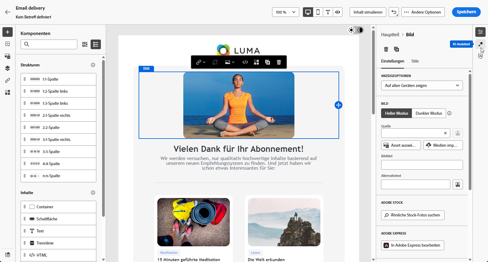
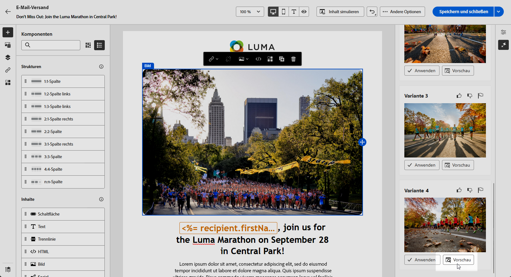
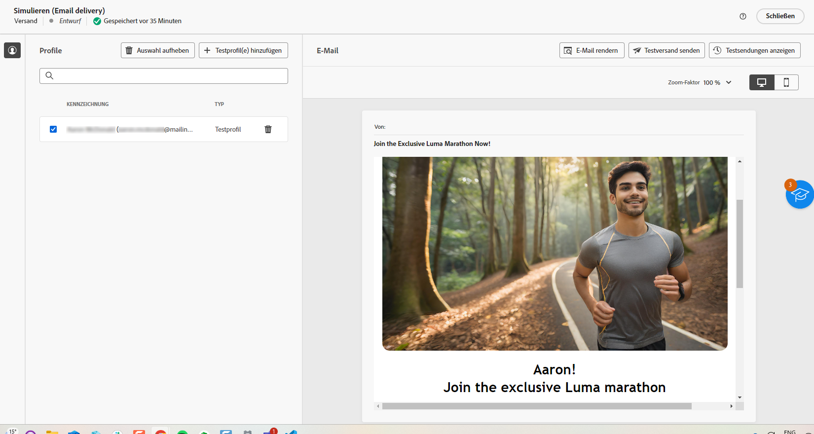

# Generierung von E-Mail-Bildern mit dem Inhaltsassistenten {#generative-image}

Nachdem Sie Ihre E-Mails erstellt und personalisiert haben, können Sie Ihre Inhalte mit dem Inhaltsassistenten verbessern, der auf generativer KI basiert. Diese Funktion vereinfacht den Prozess der Personalisierung und Inhaltsverbesserung.

Gehen Sie wie folgt vor, um mit dem Inhaltsassistenten Bilder in E-Mails zu erstellen und zu verbessern. Sie können mit dem Inhaltsassistenten auch den vollständigen HTML-Inhalt erstellen, wie auf [dieser Seite](generative-email.md) beschrieben, oder einen Textinhalt generieren, wie auf [dieser Seite](generative-content.md) erklärt wird.

>[!NOTE]
>
>Bevor Sie mit der Verwendung dieser Funktion beginnen, lesen Sie die entsprechenden Informationen zu [Schutzmechanismen und Begrenzungen](generative-gs.md#guardrails-and-limitations).

Im folgenden Beispiel erfahren Sie, wie Sie den Inhaltsassistenten nutzen können, um Ihren Inhalt zu optimieren und zu verbessern und so ein benutzerfreundlicheres Erlebnis zu gewährleisten. Führen Sie folgende Schritte aus:

1. Nachdem Sie Ihren E-Mail-Versand erstellt und konfiguriert haben, klicken Sie auf **[!UICONTROL Inhalt bearbeiten]**.

   Weitere Informationen zur Konfiguration Ihres E-Mail-Versands finden Sie auf [dieser Seite](../email/create-email-content.md).

1. Geben Sie die **[!UICONTROL grundlegenden Details]** zu Ihrem Versand an. Klicken Sie abschließend auf **[!UICONTROL E-Mail-Inhalt bearbeiten]**.

1. Wählen Sie mit dem Inhaltsassistenten das Asset aus, das Sie ändern möchten.

1. Wählen Sie aus dem Menü auf der rechten Seite die Option **[!UICONTROL Erlebnisgenerierung]** aus.

   {zoomable=&quot;yes&quot;}

1. Fügen Sie eine Eingabeaufforderung hinzu, um Ihre Ergebnisse besser anzupassen.

   {zoomable=&quot;yes&quot;}

1. Wählen Sie **[!UICONTROL Datei hochladen]** aus, wenn Sie ein Marken-Asset hinzufügen möchten, das Inhalte enthält, die zusätzlichen Kontext für den Inhaltsassistenten liefern können.

   Sie können auch auf **[!UICONTROL Hochgeladene Inhalte]** klicken, um zuvor aktualisierte Dateien zu finden. Beachten Sie, dass der hochgeladene Inhalt ausschließlich für die Wiederverwendung durch die aktuelle Benutzerin bzw. den aktuellen Benutzer verfügbar ist.

1. Wählen Sie das **[!UICONTROL Seitenverhältnis]** des Assets aus. Dadurch wird die Breite und Höhe des Assets bestimmt.

   Sie können aus gängigen Verhältnissen wie 16:9, 4:3, 3:2 oder 1:1 wählen oder eine benutzerdefinierte Größe eingeben.

1. Passen Sie die Einstellungen **[!UICONTROL Farbe und Ton]**, **[!UICONTROL Inhaltstyp]**, **[!UICONTROL Beleuchtung]** und **[!UICONTROL Komposition]** an, damit Sie den gewünschten Asset-Eigenschaften entsprechen.

   {zoomable=&quot;yes&quot;}

1. Sobald Sie mit der Konfiguration der Eingabeaufforderung zufrieden sind, klicken Sie auf **[!UICONTROL Generieren]**.

1. Durchsuchen Sie die **[!UICONTROL Variantenvorschläge]**, um das gewünschte Asset zu finden. Klicken Sie auf **[!UICONTROL Vorschau]**, um eine Vollbildversion der ausgewählten Variante anzuzeigen.

   {zoomable=&quot;yes&quot;}

1. Klicken Sie auf **[!UICONTROL Auswählen]**, sobald Sie den passenden Inhalt gefunden haben.

   {zoomable=&quot;yes&quot;}

1. Klicken Sie nach der Definition des Nachrichteninhalts auf die Schaltfläche **[!UICONTROL Inhalt simulieren]**, um das Rendern zu steuern, und überprüfen Sie die Personalisierungseinstellungen mit Testprofilen.  [Weitere Informationen](../preview-test/preview-content.md)

   {zoomable=&quot;yes&quot;}

1. Wenn Sie Inhalt, Zielgruppe und Zeitplan definiert haben, können Sie den E-Mail-Versand vorbereiten. [Weitere Informationen](../monitor/prepare-send.md)
