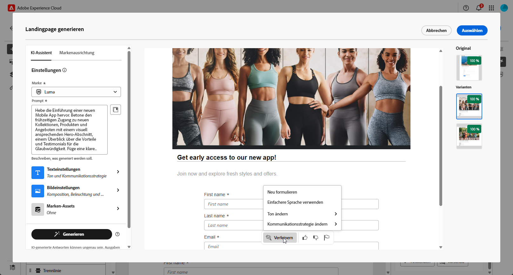
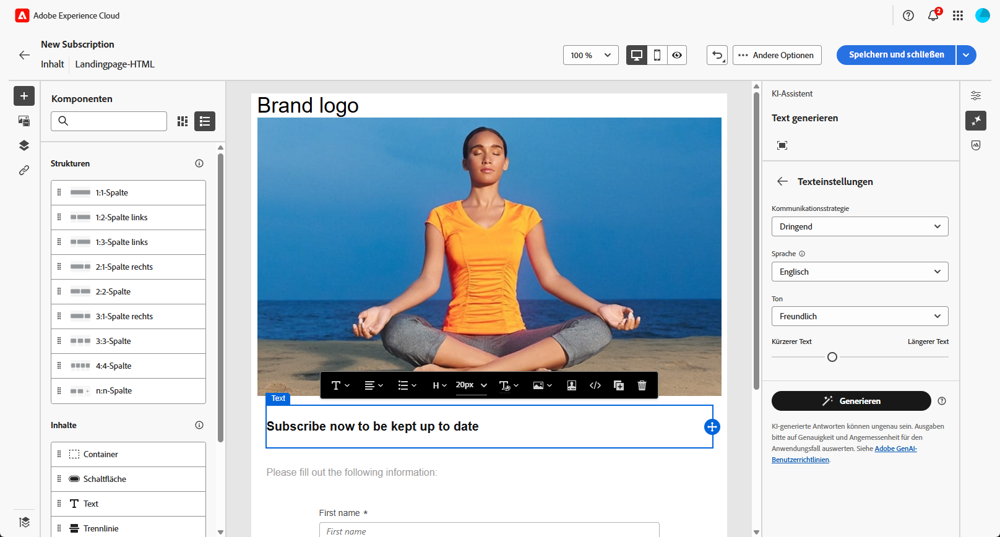
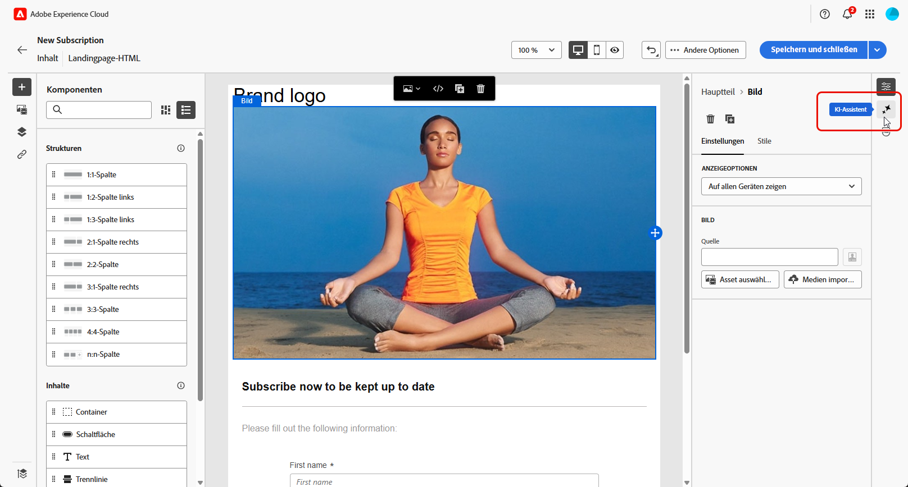

# Generieren von Landingpages mit KI-Assistenten{#generative-lp}

>[!IMPORTANT]
>
>Bevor Sie mit der Verwendung dieser Funktion beginnen, lesen Sie die entsprechenden [Leitplanken und Einschränkungen](generative-gs.md#generative-guardrails).
> 
>
>Sie müssen einer [Benutzervereinbarung“ zustimmen](https://www.adobe.com/de/legal/licenses-terms/adobe-dx-gen-ai-user-guidelines.html) bevor Sie den KI-Assistenten in Adobe Campaign Web verwenden können. Weitere Informationen erhalten Sie vom Adobe-Support.

Transformieren Sie Ihre Landingpages mit dem KI-Assistenten im Adobe Campaign Web, der auf generativer KI basiert.

Erstellen Sie mühelos wirkungsvolle Inhalte, einschließlich kompletter Seiten, maßgeschneiderter Textausschnitte und benutzerdefinierter Visualisierungen, die Ihre Zielgruppe ansprechen und so mehr Interaktion und Interaktion fördern.

Auf den folgenden Registerkarten erfahren Sie, wie Sie den KI-Assistenten in Adobe Campaign Web verwenden.

>[!BEGINTABS]

>[!TAB Vollständige Landingpage-Generierung]

Im folgenden Beispiel erfahren Sie, wie Sie mit dem KI-Assistenten eine vorhandene Landingpage-Vorlage verfeinern können.

1. Nachdem Sie Ihre Landingpage erstellt und konfiguriert haben, klicken Sie auf **[!UICONTROL Inhalt bearbeiten]**.

   Weitere Informationen zur Konfiguration Ihrer Landingpage finden Sie auf [dieser Seite](../landing-pages/create-lp.md).

1. Personalisieren Sie Ihr Layout nach Bedarf und greifen Sie auf das Menü **[!UICONTROL KI-Assistent]** zu.

   {zoomable="yes"}

1. Aktivieren Sie die Option **[!UICONTROL Original-Inhalt verwenden]** für den KI-Assistenten, um neue Inhalte basierend auf den ausgewählten Inhalten zu personalisieren.

1. Passen Sie den Inhalt an, indem Sie beschreiben, was Sie im Feld **[!UICONTROL Eingabeaufforderung]** generieren möchten.

   Wenn Sie Hilfe bei der Erstellung Ihrer Eingabeaufforderung benötigen, rufen Sie die **[!UICONTROL Eingabeaufforderungsbibliothek]** auf, die eine Vielzahl von Ideen für die Eingabeaufforderung enthält, um Ihre Landingpage zu verbessern.

   {zoomable="yes"}

1. Passen Sie Ihr Prompt mit der Option **[!UICONTROL Texteinstellungen]** an:

   * **[!UICONTROL Kommunikationsstrategie]**: Wählen Sie den am besten geeigneten Kommunikationsstil für den generierten Text aus.
   * **[!UICONTROL Ton]**: Der Ton Ihrer Landingpage sollte bei Ihrer Zielgruppe ankommen. Egal, ob Sie informativ, spielerisch oder überzeugend klingen möchten, der KI-Assistent kann die Nachricht entsprechend anpassen.

   {zoomable="yes"}

1. Wählen Sie Ihre **[!UICONTROL Bildeinstellungen]** aus:

   * **[!UICONTROL Content-Typ]**: Kategorisieren der Art des visuellen Elements, wobei zwischen verschiedenen Formen der visuellen Darstellung wie Fotos, Grafiken oder Kunst unterschieden wird.
   * **[!UICONTROL Visuelle Intensität]**: Kontrollieren Sie die Wirkung des Bildes, indem Sie seine Intensität anpassen. Eine niedrigere Einstellung (2) sorgt für ein weicheres Erscheinungsbild, während eine höhere Einstellung (10) das Bild lebendiger macht.
   * **[!UICONTROL Farbe und Ton]**: Passen Sie das allgemeine Erscheinungsbild der Farben in einem Bild und die Stimmung oder Atmosphäre an, die es vermittelt.
   * **[!UICONTROL Beleuchtung]**: Ändern Sie die Beleuchtung in einem Bild, um die Atmosphäre zu formen und bestimmte Elemente hervorzuheben.
   * **[!UICONTROL Komposition]**: Ordnen Sie Elemente innerhalb des Rahmens eines Bildes an.

   {zoomable="yes"}

1. Klicken Sie im Menü **[!UICONTROL Marken-Assets]** auf **[!UICONTROL Marken-Asset hochladen]**, um jedes Marken-Asset hinzuzufügen, das zusätzlichen Kontext für den KI-Assistenten bietet, oder wählen Sie ein zuvor hochgeladenes Asset aus.

   Zuvor hochgeladene Dateien sind in der Dropdown-Liste **[!UICONTROL Hochgeladene Marken-Assets]** verfügbar. Schalten Sie die Assets ein, die Sie in Ihre Generation aufnehmen möchten.

   {zoomable="yes"}

1. Wenn das Prompt fertig ist, klicken Sie auf **[!UICONTROL Generieren]**.

1. Durchsuchen Sie die generierten **[!UICONTROL Varianten]** und klicken Sie auf **[!UICONTROL Vorschau]**, um eine Vollbildversion der ausgewählten Variante anzuzeigen.

1. Navigieren Sie im Fenster **[!UICONTROL Vorschau]** zur Option **[!UICONTROL Verfeinern]**, um auf zusätzliche Anpassungsfunktionen zuzugreifen:

   * **[!UICONTROL Umformulieren]**: Der KI-Assistent kann Ihre Nachricht auf unterschiedliche Weise umformulieren, sodass Sie frisch schreiben und für unterschiedliche Zielgruppen interessant sind.
   * **[!UICONTROL Einfachere Sprache verwenden]**: Vereinfachen Sie Ihre Sprache, um einer breiteren Zielgruppe Klarheit und Zugänglichkeit zu verschaffen.

   Sie können auch den **[!UICONTROL Ton]** und die **[!UICONTROL Kommunikationsstrategie]** Ihres Textes ändern.

   {zoomable="yes"}

1. Klicken Sie **[!UICONTROL Auswählen]**, sobald Sie den entsprechenden Inhalt gefunden haben.

1. Fügen Sie Personalisierungsfelder ein, um den Inhalt Ihrer Landingpage auf der Grundlage von Profildaten anzupassen. Klicken Sie anschließend auf die Schaltfläche **[!UICONTROL Inhalt simulieren]**, um das Rendering zu steuern und die Personalisierungseinstellungen mit Testprofilen zu überprüfen. [Weitere Informationen](../landing-pages/create-lp.md#test-landing-page).

Sobald Ihre Landingpage fertig ist, veröffentlichen Sie sie, um sie für die Verwendung in einer Nachricht verfügbar zu machen. [Weitere Informationen](../landing-pages/create-lp.md#publish-landing-page).

>[!TAB Nur Textgenerierung]

Im folgenden Beispiel erfahren Sie, wie Sie den KI-Assistenten nutzen können, um den Inhalt Ihrer Landingpage zu verbessern.

1. Nachdem Sie Ihre Landingpage erstellt und konfiguriert haben, klicken Sie auf **[!UICONTROL Inhalt bearbeiten]**.

   Weitere Informationen zur Konfiguration Ihrer Landingpage finden Sie auf [dieser Seite](../landing-pages/create-lp.md).

1. Wählen Sie eine **[!UICONTROL Textkomponente]** aus, um bestimmte Inhalte anzusprechen, und rufen Sie das Menü **[!UICONTROL KI-Assistent]** auf.

   {zoomable="yes"}

1. Aktivieren Sie die Option **[!UICONTROL Original-Inhalt verwenden]** für den KI-Assistenten, um neue Inhalte basierend auf den ausgewählten Inhalten zu personalisieren.

1. Passen Sie den Inhalt an, indem Sie beschreiben, was Sie im Feld **[!UICONTROL Eingabeaufforderung]** generieren möchten.

   Wenn Sie Hilfe bei der Erstellung Ihrer Eingabeaufforderung benötigen, rufen Sie die **[!UICONTROL Eingabeaufforderungsbibliothek]** auf, die eine Vielzahl von Ideen für die Eingabeaufforderung zur Verbesserung Ihrer Landingpages bietet.

   {zoomable="yes"}

1. Passen Sie Ihr Prompt mit der Option **[!UICONTROL Texteinstellungen]** an:

   * **[!UICONTROL Kommunikationsstrategie]**: Wählen Sie den am besten geeigneten Kommunikationsstil für den generierten Text aus.
   * **[!UICONTROL Ton]**: Der Ton Ihrer Landingpage sollte bei Ihrer Zielgruppe ankommen. Egal, ob Sie informativ, spielerisch oder überzeugend klingen möchten, der KI-Assistent kann die Nachricht entsprechend anpassen.
   * **Textlänge**: Wählen Sie mit dem Regler die gewünschte Textlänge aus.

   {zoomable="yes"}

1. Klicken Sie im Menü **[!UICONTROL Marken-Assets]** auf **[!UICONTROL Marken-Asset hochladen]**, um jedes Marken-Asset hinzuzufügen, das zusätzlichen Kontext für den KI-Assistenten bietet, oder wählen Sie ein zuvor hochgeladenes Asset aus.

   Zuvor hochgeladene Dateien sind in der Dropdown-Liste **[!UICONTROL Hochgeladene Marken-Assets]** verfügbar. Schalten Sie die Assets ein, die Sie in Ihre Generation aufnehmen möchten.

   {zoomable="yes"}

1. Wenn das Prompt fertig ist, klicken Sie auf **[!UICONTROL Generieren]**.

1. Durchsuchen Sie die generierten **[!UICONTROL Varianten]** und klicken Sie auf **[!UICONTROL Vorschau]**, um eine Vollbildversion der ausgewählten Variante anzuzeigen.

1. Navigieren Sie zur Option **[!UICONTROL Verfeinern]** im Fenster **[!UICONTROL Vorschau]**, um auf zusätzliche Anpassungsfunktionen zuzugreifen:

   * **[!UICONTROL Als Referenzinhalt verwenden]**: Die gewählte Variante dient hierbei als Referenzinhalt für die Generierung anderer Ergebnisse.
   * **[!UICONTROL Ausarbeiten]**: Erweitern Sie Ihre Kenntnisse zu bestimmten Themen und liefern Sie zusätzliche Details, um das Verständnis und die Interaktion zu verbessern.
   * **[!UICONTROL Zusammenfassen]**: Zusammenfassen umfangreicher Informationen in klaren, knappen Zusammenfassungen, die Aufmerksamkeit erregen und zum weiteren Lesen anregen.
   * **[!UICONTROL Umformulieren]**: Formulieren Sie Ihre Nachricht auf unterschiedliche Weise neu, sodass Sie neu schreiben und unterschiedliche Zielgruppen ansprechen können.
   * **[!UICONTROL Einfachere Sprache verwenden]**: Vereinfachen Sie Ihre Sprache, um einer breiteren Zielgruppe Klarheit und Zugänglichkeit zu verschaffen.

   Sie können auch den **[!UICONTROL Ton]** und die **[!UICONTROL Kommunikationsstrategie]** Ihres Textes ändern.

   {zoomable="yes"}

1. Klicken Sie **[!UICONTROL Auswählen]**, sobald Sie den entsprechenden Inhalt gefunden haben.

1. Fügen Sie Personalisierungsfelder ein, um den Inhalt Ihrer Landingpage auf der Grundlage von Profildaten anzupassen. Klicken Sie anschließend auf die Schaltfläche **[!UICONTROL Inhalt simulieren]**, um das Rendering zu steuern und die Personalisierungseinstellungen mit Testprofilen zu überprüfen. [Weitere Informationen](../landing-pages/create-lp.md#test-landing-page).

Sobald Ihre Landingpage fertig ist, veröffentlichen Sie sie, um sie für die Verwendung in einer Nachricht verfügbar zu machen. [Weitere Informationen](../landing-pages/create-lp.md#publish-landing-page).

>[!TAB Nur Bildgenerierung]

Im folgenden Beispiel erfahren Sie, wie Sie mit dem KI-Assistenten Ihre Assets optimieren und verbessern und so ein benutzerfreundlicheres Erlebnis gewährleisten können.

1. Nachdem Sie Ihre Landingpage erstellt und konfiguriert haben, klicken Sie auf **[!UICONTROL Inhalt bearbeiten]**.

   Weitere Informationen zur Konfiguration Ihrer Landingpage finden Sie auf [dieser Seite](../landing-pages/create-lp.md).

1. Wählen Sie das Asset aus, das Sie mit dem KI-Assistenten ändern möchten.

1. Wählen Sie aus dem Menü auf der rechten Seite die Option **[!UICONTROL KI-Assistent]** aus.

   {zoomable="yes"}

1. Aktivieren Sie die Option **[!UICONTROL Referenzstil]** für den KI-Assistenten, um neue Inhalte basierend auf dem Referenzinhalt zu personalisieren. Sie können auch ein Bild hochladen, um Kontext zu Ihrer Variante hinzuzufügen.

1. Passen Sie den Inhalt an, indem Sie beschreiben, was Sie im Feld **[!UICONTROL Eingabeaufforderung]** generieren möchten.

   Wenn Sie Hilfe bei der Erstellung Ihrer Eingabeaufforderung benötigen, rufen Sie die **[!UICONTROL Eingabeaufforderungsbibliothek]** auf, die eine Vielzahl von Ideen für die Eingabeaufforderung zur Verbesserung Ihrer Landingpages bietet.

   {zoomable="yes"}

1. Passen Sie Ihr Prompt mit der Option **[!UICONTROL Texteinstellungen]** an:

   * **[!UICONTROL Seitenverhältnis]**: Legen Sie die Breite und Höhe des Assets fest. Wählen Sie aus gängigen Verhältnissen wie 16:9, 4:3, 3:2 oder 1:1 oder geben Sie eine benutzerdefinierte Größe ein.
   * **[!UICONTROL Content-Typ]**: Kategorisieren der Art des visuellen Elements, wobei zwischen verschiedenen Formen der visuellen Darstellung wie Fotos, Grafiken oder Kunst unterschieden wird.
   * **[!UICONTROL Visuelle Intensität]**: Kontrollieren Sie die Wirkung des Bildes, indem Sie seine Intensität anpassen. Eine niedrigere Einstellung (2) sorgt für ein weicheres Erscheinungsbild, während eine höhere Einstellung (10) das Bild lebendiger macht.
   * **[!UICONTROL Farbe und Ton]**: Passen Sie das allgemeine Erscheinungsbild der Farben in einem Bild und die Stimmung oder Atmosphäre an, die es vermittelt.
   * **[!UICONTROL Beleuchtung]**: Ändern Sie die Beleuchtung in einem Bild, um die Atmosphäre zu formen und bestimmte Elemente hervorzuheben.
   * **[!UICONTROL Komposition]**: Ordnen Sie Elemente innerhalb des Rahmens eines Bildes an.

   {zoomable="yes"}

1. Klicken Sie im Menü **[!UICONTROL Marken-Assets]** auf **[!UICONTROL Marken-Asset hochladen]**, um jedes Marken-Asset hinzuzufügen, das zusätzlichen Kontext für den KI-Assistenten bietet, oder wählen Sie ein zuvor hochgeladenes Asset aus.

   Zuvor hochgeladene Dateien sind in der Dropdown-Liste **[!UICONTROL Hochgeladene Marken-Assets]** verfügbar. Schalten Sie die Assets ein, die Sie in Ihre Generation aufnehmen möchten.

1. Sobald Sie mit der Konfiguration des Prompts zufrieden sind, klicken Sie auf **[!UICONTROL Generieren]**.

1. Durchsuchen Sie die **[!UICONTROL Variantenvorschläge]**, um das gewünschte Asset zu finden.

   Klicken Sie auf **[!UICONTROL Vorschau]**, um eine Vollbildversion der ausgewählten Variante anzuzeigen.

1. Wählen Sie **[!UICONTROL Ähnliche generieren]** aus, wenn Sie verwandte Bilder zu dieser Variante anzeigen möchten.

   {zoomable="yes"}

1. Klicken Sie **[!UICONTROL Auswählen]**, sobald Sie den entsprechenden Inhalt gefunden haben.

1. Klicken Sie nach der Definition des Nachrichteninhalts auf die Schaltfläche **[!UICONTROL Inhalt simulieren]**, um das Rendering zu steuern und die Personalisierungseinstellungen mit Testprofilen zu überprüfen. [Weitere Informationen](../landing-pages/create-lp.md#test-landing-page).

Sobald Ihre Landingpage fertig ist, veröffentlichen Sie sie, um sie für die Verwendung in einer Nachricht verfügbar zu machen. [Weitere Informationen](../landing-pages/create-lp.md#publish-landing-page).

>[!ENDTABS]