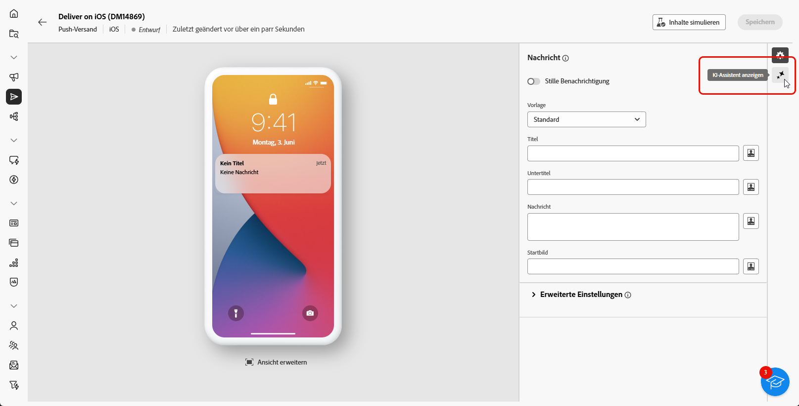

# Generieren von Push-Benachrichtigungen mit dem KI-Assistenten {#generative-push}

>[!IMPORTANT]
>
>Bevor Sie mit der Verwendung dieser Funktion beginnen, lesen Sie die entsprechenden [Leitplanken und Einschränkungen](generative-gs.md#generative-guardrails).
> 
>
>Sie müssen einer [Benutzervereinbarung“ zustimmen](https://www.adobe.com/de/legal/licenses-terms/adobe-dx-gen-ai-user-guidelines.html) bevor Sie den KI-Assistenten in Adobe Campaign Web verwenden. Weitere Informationen erhalten Sie vom Adobe-Support.

Der KI-Assistent hilft Ihnen, die Wirkung Ihrer Sendungen zu optimieren, indem er verschiedene Inhalte vorschlägt, die Ihre Audience ansprechen.

Im folgenden Beispiel wird der KI-Assistent genutzt, um überzeugende Botschaften zu erstellen und ein ansprechenderes Kundenerlebnis zu schaffen.

1. Nachdem Sie Ihren Push-Benachrichtigungs-Versand erstellt und konfiguriert haben, klicken Sie auf **[!UICONTROL Inhalt bearbeiten]**.

   Weitere Informationen zur Konfiguration Ihres Push-Versands finden Sie auf [dieser Seite](../push/create-push.md).

1. Rufen Sie das Menü **[!UICONTROL KI-Assistenten anzeigen]** auf.

   {zoomable="yes"}

1. Aktivieren Sie die Option **[!UICONTROL Original-Inhalt verwenden]** für den KI-Assistenten, um neue Inhalte basierend auf den ausgewählten Inhalten zu personalisieren.

1. Passen Sie den Inhalt an, indem Sie beschreiben, was Sie im Feld **[!UICONTROL Eingabeaufforderung]** generieren möchten.

   Wenn Sie Hilfe bei der Erstellung Ihrer Eingabeaufforderung benötigen, rufen Sie die **[!UICONTROL Eingabeaufforderungsbibliothek]** auf, die eine Vielzahl von Ideen für die Eingabeaufforderung bereitstellt, um Ihre Sendungen zu verbessern.

   {zoomable="yes"}

1. Wählen Sie das Feld aus, das Sie generieren möchten: **[!UICONTROL Titel]**, **[!UICONTROL Nachricht]** und/oder **[!UICONTROL Bild]**.

1. Passen Sie die Eingabeaufforderung mit der Option **[!UICONTROL Texteinstellungen]** an:

   * **[!UICONTROL Kommunikationsstrategie]**: Wählen Sie den am besten geeigneten Kommunikationsstil für den generierten Text aus.
   * **[!UICONTROL Tone]**: Passen Sie den Ton Ihrer E-Mail an, damit er bei Ihrer Audience Anklang findet. Egal ob informativ, verspielt oder überzeugend klingen soll, der KI-Assistent passt die Nachricht entsprechend an.

   {zoomable="yes"}

1. Wählen Sie Ihre **[!UICONTROL Bildeinstellungen]** aus:

   * **[!UICONTROL Content-Typ]**: Kategorisieren der Art des visuellen Elements, wobei zwischen verschiedenen Formen der visuellen Darstellung wie Fotos, Grafiken oder Kunst unterschieden wird.
   * **[!UICONTROL Visuelle Intensität]**: Kontrollieren Sie die Wirkung des Bildes, indem Sie seine Intensität anpassen. Eine niedrigere Einstellung (2) sorgt für ein weicheres, zurückhaltenderes Erscheinungsbild, während eine höhere Einstellung (10) das Bild lebendiger und visuell kraftvoller macht.
   * **[!UICONTROL Beleuchtung]**: Passen Sie die Beleuchtung im Bild an, um die Atmosphäre zu formen und bestimmte Elemente hervorzuheben.
   * **[!UICONTROL Komposition]**: Ordnet Elemente innerhalb des Rahmens des Bildes an.

   {zoomable="yes"}

1. Klicken Sie im Menü **[!UICONTROL Marken-Assets]** auf **[!UICONTROL Marken-Asset hochladen]**, um ein Marken-Asset mit Inhalten hinzuzufügen, das zusätzlichen Kontext für den KI-Assistenten bietet, oder wählen Sie ein zuvor hochgeladenes Asset aus.

   Zuvor hochgeladene Dateien sind in der Dropdown-Liste **[!UICONTROL Hochgeladene Marken-Assets]** verfügbar. Schalten Sie die Assets ein, die Sie in Ihre Generation aufnehmen möchten.

1. Wenn das Prompt fertig ist, klicken Sie auf **[!UICONTROL Generieren]**.

1. Durchsuchen Sie die generierten **[!UICONTROL Varianten]** und klicken Sie auf **[!UICONTROL Vorschau]**, um eine Vollbildversion der ausgewählten Variante anzuzeigen.

1. Navigieren Sie im Fenster **[!UICONTROL Vorschau]** zur Option **[!UICONTROL Verfeinern]**, um auf zusätzliche Anpassungsfunktionen zuzugreifen:

   * **[!UICONTROL Als Referenzinhalt verwenden]**: Verwenden Sie die ausgewählte Variante als Referenzinhalt, um andere Ergebnisse zu generieren.
   * **[!UICONTROL Umformulieren]**: Formulieren Sie Ihre Nachricht auf unterschiedliche Weise neu, um das Schreiben für unterschiedliche Zielgruppen frisch und interessant zu halten.
   * **[!UICONTROL Einfachere Sprache verwenden]**: Vereinfachen Sie Ihre Sprache, um einer breiteren Zielgruppe Klarheit und Zugänglichkeit zu verschaffen.

   Sie können auch den **[!UICONTROL Ton]** und die **[!UICONTROL Kommunikationsstrategie]** Ihres Textes ändern.

   {zoomable="yes"}

1. Klicken Sie **[!UICONTROL Auswählen]**, sobald Sie den entsprechenden Inhalt gefunden haben.

1. Fügen Sie Personalisierungsfelder ein, um Ihren E-Mail-Inhalt auf der Grundlage von Profildaten anzupassen. Klicken Sie anschließend auf die Schaltfläche **[!UICONTROL Inhalt simulieren]**, um das Rendering zu steuern und die Personalisierungseinstellungen mit Testprofilen zu überprüfen. [Weitere Informationen](../preview-test/preview-content.md)

   {zoomable="yes"}

Bereiten Sie den Push-Versand vor, wenn Sie Inhalt, Zielgruppe und Zeitplan definieren. [Weitere Informationen](../monitor/prepare-send.md)