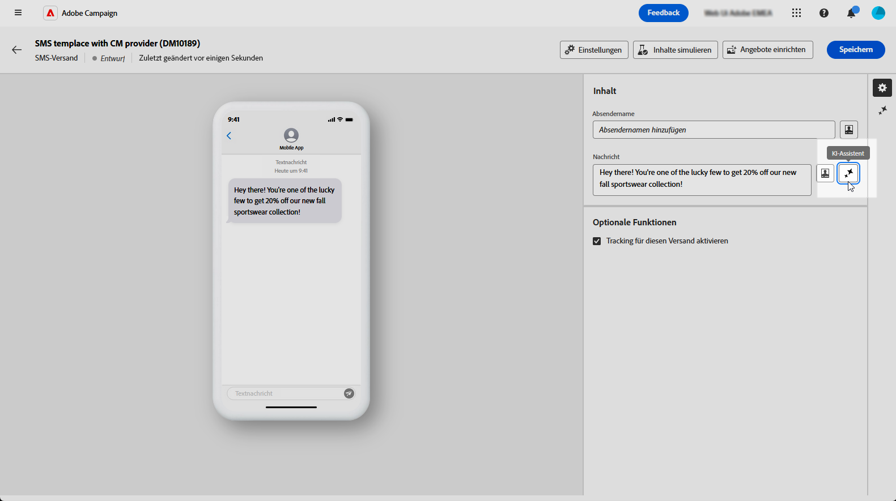
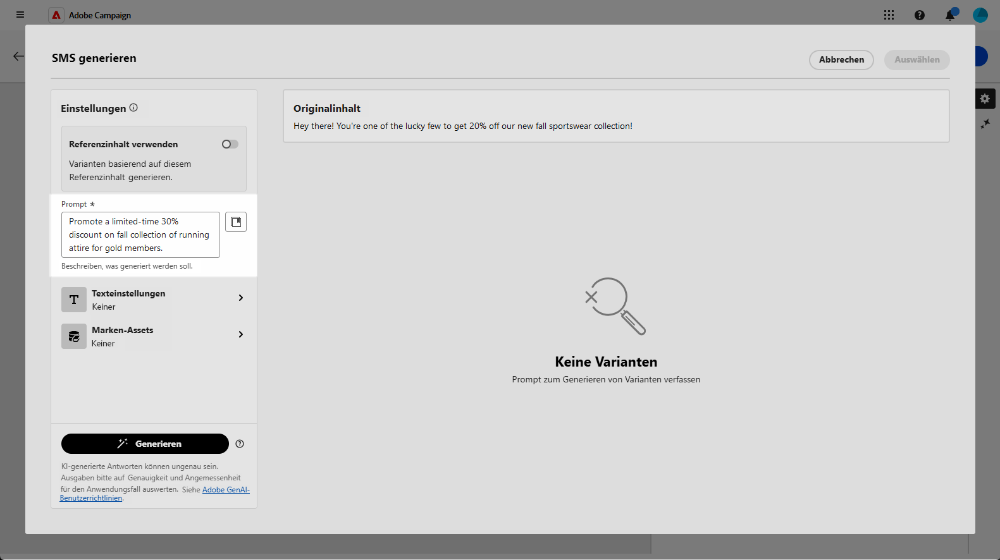
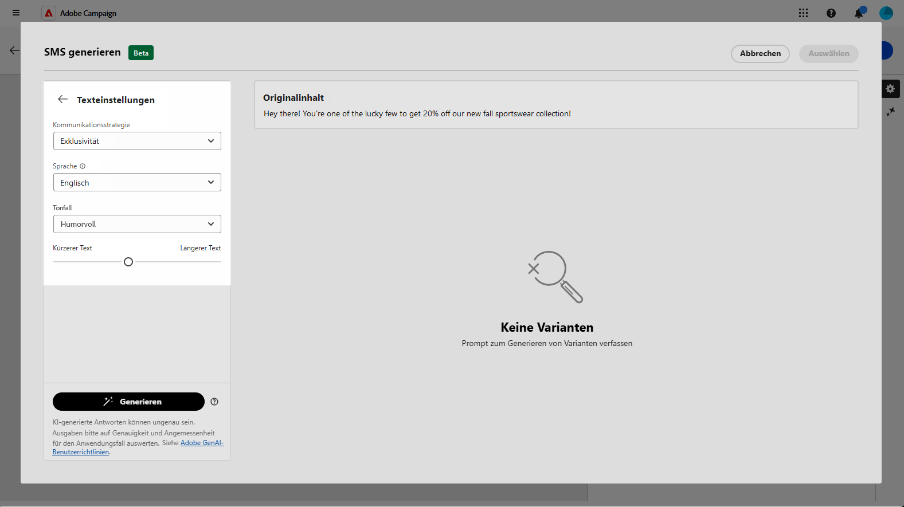
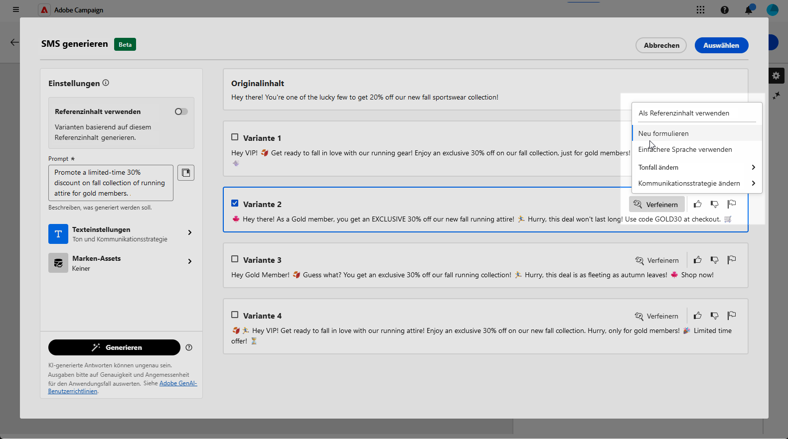
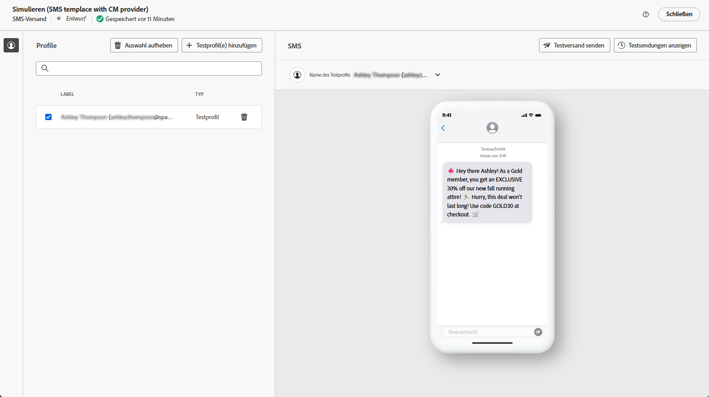

# SMS-Generierung mit dem AI-Assistenten - Content Accelerator {#generative-sms}

>[!IMPORTANT]
>
>Bevor Sie mit der Verwendung dieser Funktion beginnen, lesen Sie die entsprechenden Informationen zu [Schutzmechanismen und Begrenzungen](generative-gs.md#generative-guardrails).
> 
>
>Sie müssen einer [Benutzervereinbarung](https://www.adobe.com/legal/licenses-terms/adobe-dx-gen-ai-user-guidelines.html) zustimmen, bevor Sie den AI-Assistenten in Adobe Campaign Web for Content Acceleration verwenden können. Weitere Informationen erhalten Sie von Ihrer Adobe-Kontaktperson.

Nachdem Sie Ihre SMS-Nachrichten erstellt und personalisiert haben, um sie an Ihre Zielgruppe anzupassen, stellen Sie mithilfe des KI-Assistenten in Adobe Campaign Web for Content Acceleration in Campaign mit innovativer KI-Technologie die nächste Stufe Ihrer Kommunikation dar.

Dieses praktische Tool liefert intelligente Vorschläge für die Verfeinerung Ihrer Inhalte und stellt sicher, dass Ihre Botschaften effektiv ankommen und die Interaktion maximiert wird.

>[!BEGINTABS]

>[!TAB Vollständige SMS-Generierung]

1. Nachdem Sie Ihren SMS-Versand erstellt und konfiguriert haben, klicken Sie auf **[!UICONTROL Inhalt bearbeiten]**.

   Weitere Informationen zur Konfiguration Ihres SMS-Versands finden Sie auf [dieser Seite](../sms/create-sms.md).

1. Geben Sie die **[!UICONTROL grundlegenden Details]** zu Ihrem Versand an. Klicken Sie abschließend auf **[!UICONTROL Inhalt bearbeiten]**.

1. Rufen Sie das Menü **[!UICONTROL KI-Assistenten anzeigen]** auf.

   {zoomable="yes"}

1. Passen Sie den Inhalt an, indem Sie im Feld **[!UICONTROL Prompt]** beschreiben, was Sie generieren möchten.

   Wenn Sie Hilfe bei der Erstellung Ihres Prompts benötigen, finden Sie in der **[!UICONTROL Prompt-Bibliothek]** eine Vielzahl von Ideen für Prompts, mit denen Sie Ihre Sendungen verbessern können.

   {zoomable="yes"}

1. Passen Sie Ihre Eingabeaufforderung mit der Option **[!UICONTROL Texteinstellungen]** an:

   * **[!UICONTROL Kommunikationsstrategie]**: Wählen Sie den am besten geeigneten Kommunikationsstil für den generierten Text aus.
   * **[!UICONTROL Ton]**: Der Ton der E-Mail sollte bei Ihrer Zielgruppe ankommen. Je nachdem, ob Sie informativ, humorvoll oder überzeugend klingen möchten, kann der KI-Assistent die Nachricht entsprechend anpassen.
   * **Textlänge**: Wählen Sie mit dem Schieberegler die gewünschte Länge des Textes aus.

   {zoomable="yes"}

1. Klicken Sie im Menü **[!UICONTROL Marken-Assets]** auf **[!UICONTROL Marken-Asset hochladen]** , um ein Marken-Asset hinzuzufügen, das Inhalte enthält, die zusätzlichen Kontext für den AI-Assistenten bieten können, oder wählen Sie ein zuvor hochgeladenes Asset aus.

   Zuvor hochgeladene Dateien sind in der Dropdown-Liste **[!UICONTROL Hochgeladene Marken-Assets]** verfügbar. Schalten Sie einfach die Assets um, die Sie in Ihre Generierung aufnehmen möchten.

1. Wenn das Prompt fertig ist, klicken Sie auf **[!UICONTROL Generieren]**.

1. Durchsuchen Sie die erstellten **[!UICONTROL Varianten]** und klicken Sie auf **[!UICONTROL Vorschau]**, um eine Vollbildversion der ausgewählten Variante anzuzeigen.

   {zoomable="yes"}

1. Navigieren Sie zur Option **[!UICONTROL Verfeinern]** im Fenster **[!UICONTROL Vorschau]**, um auf weitere Anpassungsfunktionen zuzugreifen und Ihre Variante nach Ihren Vorlieben zu gestalten:

   * **[!UICONTROL Als Referenzinhalt verwenden]**: Die gewählte Variante dient hierbei als Referenzinhalt für die Generierung anderer Ergebnisse.

   * **[!UICONTROL Einfachere Sprache verwenden]**: Der KI-Assistent hilft Ihnen, klare, präzise Nachrichten zu schreiben, die jeder versteht.

   * **[!UICONTROL Umformulieren]**: Der KI-Assistent formuliert Ihre Nachricht um, um sie für verschiedene Zielgruppen ansprechend zu gestalten.

   Sie können auch die **[!UICONTROL Tone]** und die **[!UICONTROL Kommunikationsstrategie]** Ihres Textes ändern.

   {zoomable="yes"}

1. Klicken Sie auf **[!UICONTROL Auswählen]**, sobald Sie den passenden Inhalt gefunden haben.

1. Fügen Sie Personalisierungsfelder ein, um Ihre SMS-Inhalte auf der Grundlage von Profildaten anzupassen. [Weitere Informationen über die Personalisierung von Inhalten](../personalization/personalize.md)

   {zoomable="yes"}

1. Klicken Sie nach der Definition des Nachrichteninhalts auf die Schaltfläche **[!UICONTROL Inhalt simulieren]**, um das Rendern zu steuern, und überprüfen Sie die Personalisierungseinstellungen mit Testprofilen. [Weitere Informationen](../preview-test/preview-content.md)

   {zoomable="yes"}

Wenn Sie Inhalt, Zielgruppe und Zeitplan definiert haben, können Sie den SMS-Versand vorbereiten. [Weitere Informationen](../monitor/prepare-send.md)

>[!TAB Nur Texterstellung]

1. Nachdem Sie Ihren SMS-Versand erstellt und konfiguriert haben, klicken Sie auf **[!UICONTROL Inhalt bearbeiten]**.

   Weitere Informationen zur Konfiguration Ihres SMS-Versands finden Sie auf [dieser Seite](../sms/create-sms.md).

1. Geben Sie die **[!UICONTROL grundlegenden Details]** zu Ihrem Versand an. Klicken Sie abschließend auf **[!UICONTROL Inhalt bearbeiten]**.

1. Personalisieren Sie Ihre SMS-Nachricht nach Bedarf. [Weitere Informationen](../sms/content-sms.md)

1. Rufen Sie das Menü **[!UICONTROL KI-Assistent]** neben Ihrem Feld **[!UICONTROL Nachricht]** auf.

   {zoomable="yes"}

1. Aktivieren Sie die Option **[!UICONTROL Referenzinhalt verwenden]** für den AI-Assistenten für Inhaltsbeschleunigung, um neue Inhalte basierend auf dem ausgewählten Inhalt zu personalisieren.

1. Passen Sie den Inhalt an, indem Sie im Feld **[!UICONTROL Prompt]** beschreiben, was Sie generieren möchten.

   Wenn Sie Hilfe bei der Erstellung Ihrer Eingabeaufforderung benötigen, greifen Sie auf die **[!UICONTROL Eingabeaufforderungsbibliothek]** zu, die eine Vielzahl von eindringlichen Ideen zur Verbesserung Ihrer Kampagnen bietet.

   {zoomable="yes"}

1. Passen Sie Ihre Eingabeaufforderung mit der Option **[!UICONTROL Texteinstellungen]** an:

   * **[!UICONTROL Kommunikationsstrategie]**: Wählen Sie den gewünschten Kommunikationsansatz für den erstellten Text.
   * **[!UICONTROL Sprache]**: Wählen Sie die Sprache für den Inhalt der Variante.
   * **[!UICONTROL Ton]**: Stellen Sie sicher, dass der Text für Ihre Zielgruppe und Ihren Zweck geeignet ist.
   * **[!UICONTROL Länge]**: Legen Sie die Länge Ihres Inhalts mit dem Schieberegler fest.

   {zoomable="yes"}

1. Klicken Sie im Menü **[!UICONTROL Marken-Assets]** auf **[!UICONTROL Marken-Asset hochladen]** , um ein Marken-Asset hinzuzufügen, das Inhalte enthält, die zusätzlichen Kontext für den AI-Assistenten bieten können, oder wählen Sie ein zuvor hochgeladenes Asset aus.

   Zuvor hochgeladene Dateien sind in der Dropdown-Liste **[!UICONTROL Hochgeladene Marken-Assets]** verfügbar. Schalten Sie einfach die Assets um, die Sie in Ihre Generierung aufnehmen möchten.

1. Wenn das Prompt fertig ist, klicken Sie auf **[!UICONTROL Generieren]**.

1. Durchsuchen Sie die erstellten **[!UICONTROL Varianten]** und klicken Sie auf **[!UICONTROL Vorschau]**, um eine Vollbildversion der ausgewählten Variante anzuzeigen.

1. Navigieren Sie zur Option **[!UICONTROL Verfeinern]** im Fenster **[!UICONTROL Vorschau]**, um auf weitere Anpassungsfunktionen zuzugreifen und Ihre Variante nach Ihren Vorlieben zu gestalten:

   * **[!UICONTROL Als Referenzinhalt verwenden]**: Die gewählte Variante dient hierbei als Referenzinhalt für die Generierung anderer Ergebnisse.

   * **[!UICONTROL Umformulieren]**: Der KI-Assistent kann Ihre Nachricht auf verschiedene Arten umformulieren, sodass Ihr Text frisch und für verschiedene Zielgruppen ansprechend bleibt.

   * **[!UICONTROL Einfachere Sprache verwenden]**: Nutzen Sie den KI-Assistenten, um Ihren Text zu vereinfachen, damit er für eine breitere Zielgruppe verständlich und zugänglich ist.

   Sie können auch die **[!UICONTROL Tone]** und die **[!UICONTROL Kommunikationsstrategie]** Ihres Textes ändern.

   {zoomable="yes"}

1. Klicken Sie auf **[!UICONTROL Auswählen]**, sobald Sie den passenden Inhalt gefunden haben.

1. Fügen Sie Personalisierungsfelder ein, um Ihre SMS-Inhalte auf der Grundlage von Profildaten anzupassen. [Weitere Informationen über die Personalisierung von Inhalten](../personalization/personalize.md)

1. Klicken Sie nach der Definition des Nachrichteninhalts auf die Schaltfläche **[!UICONTROL Inhalt simulieren]**, um das Rendern zu steuern, und überprüfen Sie die Personalisierungseinstellungen mit Testprofilen. [Weitere Informationen](../preview-test/preview-content.md)

   {zoomable="yes"}

Wenn Sie Inhalt, Zielgruppe und Zeitplan definiert haben, können Sie den SMS-Versand vorbereiten. [Weitere Informationen](../monitor/prepare-send.md)

>[!ENDTABS]
