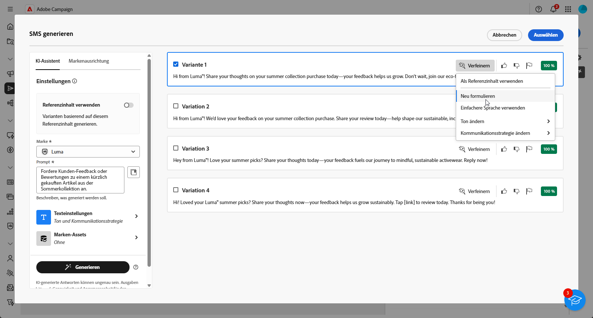

# Generierung von SMS mit dem KI-Assistenten {#generative-sms}

>[!IMPORTANT]
>
>Bevor Sie mit der Verwendung dieser Funktion beginnen, lesen Sie die entsprechenden [Leitplanken und Einschränkungen](generative-gs.md#generative-guardrails).
> 
>
>Sie müssen einer [Benutzervereinbarung“ zustimmen](https://www.adobe.com/de/legal/licenses-terms/adobe-dx-gen-ai-user-guidelines.html) bevor Sie den KI-Assistenten in Adobe Campaign Web verwenden. Weitere Informationen erhalten Sie vom Adobe-Support.

Sobald Sie Ihre SMS-Nachrichten entsprechend Ihren Zielgruppen gestaltet und personalisiert haben, verbessern Sie Ihre Kommunikation mit dem KI-Assistenten in Adobe Campaign Web, der auf innovativer KI-Technologie basiert.

Dieses Tool bietet intelligente Vorschläge zur Verfeinerung Ihrer Inhalte, um sicherzustellen, dass Ihre Nachrichten effektiv widerhallen und die Interaktion maximieren.

>[!BEGINTABS]

>[!TAB Vollständige SMS-Generierung]

1. Nachdem Sie Ihren SMS-Versand erstellt und konfiguriert haben, klicken Sie auf **[!UICONTROL Inhalt bearbeiten]**.

   Weiterführende Informationen zur Konfiguration Ihres SMS-Versands finden Sie auf [dieser Seite](../sms/create-sms.md).

1. Geben Sie die **[!UICONTROL grundlegenden Details]** zu Ihrem Versand an. Klicken Sie abschließend auf **[!UICONTROL Inhalt bearbeiten]**.

1. Rufen Sie das Menü **[!UICONTROL KI-Assistenten anzeigen]** auf.

   {zoomable="yes"}

1. Passen Sie den Inhalt an, indem Sie beschreiben, was Sie im Feld **[!UICONTROL Eingabeaufforderung]** generieren möchten.

   Wenn Sie Hilfe bei der Erstellung Ihrer Eingabeaufforderung benötigen, rufen Sie die **[!UICONTROL Eingabeaufforderungsbibliothek]** auf, die eine Vielzahl von Ideen für die Eingabeaufforderung bereitstellt, um Ihre Sendungen zu verbessern.

   {zoomable="yes"}

1. Passen Sie die Eingabeaufforderung mit der Option **[!UICONTROL Texteinstellungen]** an:

   * **[!UICONTROL Kommunikationsstrategie]**: Wählen Sie den am besten geeigneten Kommunikationsstil für den generierten Text aus.
   * **[!UICONTROL Tone]**: Stellen Sie sicher, dass der Ton Ihrer E-Mail bei Ihrer Audience Anklang findet. Egal ob informativ, verspielt oder überzeugend klingen soll, der KI-Assistent passt die Nachricht entsprechend an.
   * **Textlänge**: Wählen Sie mit dem Regler die gewünschte Textlänge aus.

   {zoomable="yes"}

1. Klicken Sie im Menü **[!UICONTROL Marken-Assets]** auf **[!UICONTROL Marken-Asset hochladen]**, um jedes Marken-Asset mit Inhalten hinzuzufügen, das zusätzlichen Kontext für den KI-Assistenten bietet, oder wählen Sie ein zuvor hochgeladenes Asset aus.

   Zuvor hochgeladene Dateien sind in der Dropdown-Liste **[!UICONTROL Hochgeladene Marken-Assets]** verfügbar. Schalten Sie die Assets ein, die Sie in Ihre Generation aufnehmen möchten.

1. Wenn das Prompt fertig ist, klicken Sie auf **[!UICONTROL Generieren]**.

1. Durchsuchen Sie die generierten **[!UICONTROL Varianten]** und klicken Sie auf **[!UICONTROL Vorschau]**, um eine Vollbildversion der ausgewählten Variante anzuzeigen.

   {zoomable="yes"}

1. Navigieren Sie zur Option **[!UICONTROL Verfeinern]** im Fenster **[!UICONTROL Vorschau]**, um auf weitere Anpassungsfunktionen zuzugreifen und Ihre Variante nach Ihren Vorlieben zu gestalten:

   * **[!UICONTROL Als Referenzinhalt verwenden]**: Die ausgewählte Variante dient als Referenzinhalt für die Generierung anderer Ergebnisse.
   * **[!UICONTROL Einfachere Sprache verwenden]**: Der KI-Assistent hilft Ihnen, klare, knappe Botschaften zu schreiben, die jeder verstehen kann.
   * **[!UICONTROL Umformulieren]**: Der KI-Assistent formuliert Ihre Nachricht neu, damit sie für verschiedene Zielgruppen interessant bleibt.

   Sie können auch den **[!UICONTROL Ton]** und die **[!UICONTROL Kommunikationsstrategie]** Ihres Textes ändern.

   {zoomable="yes"}

1. Klicken Sie **[!UICONTROL Auswählen]**, sobald Sie den entsprechenden Inhalt gefunden haben.

1. Fügen Sie Personalisierungsfelder ein, um Ihren SMS-Inhalt auf der Grundlage von Profildaten anzupassen. [Weitere Informationen über die Personalisierung von Inhalten](../personalization/personalize.md).

   {zoomable="yes"}

1. Klicken Sie nach der Definition des Nachrichteninhalts auf die Schaltfläche **[!UICONTROL Inhalt simulieren]**, um das Rendering zu steuern und die Personalisierungseinstellungen mit Testprofilen zu überprüfen. [Weitere Informationen](../preview-test/preview-content.md).

   {zoomable="yes"}

Bereiten Sie den SMS-Versand vor, wenn Sie Inhalt, Zielgruppe und Zeitplan definieren. [Weitere Informationen](../monitor/prepare-send.md).

>[!TAB Nur Textgenerierung]

1. Nachdem Sie Ihren SMS-Versand erstellt und konfiguriert haben, klicken Sie auf **[!UICONTROL Inhalt bearbeiten]**.

   Weiterführende Informationen zur Konfiguration Ihres SMS-Versands finden Sie auf [dieser Seite](../sms/create-sms.md).

1. Geben Sie die **[!UICONTROL grundlegenden Details]** zu Ihrem Versand an. Klicken Sie abschließend auf **[!UICONTROL Inhalt bearbeiten]**.

1. Personalisieren Sie Ihre SMS-Nachricht nach Bedarf. [Weitere Informationen](../sms/content-sms.md).

1. Rufen Sie das Menü **[!UICONTROL KI-Assistent]** neben Ihrem Feld **[!UICONTROL Nachricht]** auf.

   {zoomable="yes"}

1. Aktivieren Sie für den KI-Assistenten die Option **[!UICONTROL Als Referenzinhalt verwenden]**, um neue Inhalte basierend auf dem ausgewählten Inhalt zu personalisieren.

1. Passen Sie den Inhalt an, indem Sie beschreiben, was Sie im Feld **[!UICONTROL Eingabeaufforderung]** generieren möchten.

   Wenn Sie Hilfe bei der Erstellung Ihrer Eingabeaufforderung benötigen, rufen Sie die **[!UICONTROL Eingabeaufforderungsbibliothek]** auf, die eine Vielzahl von Ideen für die Eingabeaufforderung zur Verbesserung Ihrer Kampagnen bietet.

   {zoomable="yes"}

1. Passen Sie die Eingabeaufforderung mit der Option **[!UICONTROL Texteinstellungen]** an:

   * **[!UICONTROL Kommunikationsstrategie]**: Wählen Sie den gewünschten Kommunikationsansatz für den erstellten Text.
   * **[!UICONTROL Sprache]**: Wählen Sie die Sprache für den Inhalt der Variante.
   * **[!UICONTROL Ton]**: Stellen Sie sicher, dass der Text für Ihre Zielgruppe und Ihren Zweck geeignet ist.
   * **[!UICONTROL Länge]**: Legen Sie die Länge Ihres Inhalts mit dem Schieberegler fest.

   {zoomable="yes"}

1. Klicken Sie im Menü **[!UICONTROL Marken-Assets]** auf **[!UICONTROL Marken-Asset hochladen]**, um jedes Marken-Asset mit Inhalten hinzuzufügen, das zusätzlichen Kontext für den KI-Assistenten bietet, oder wählen Sie ein zuvor hochgeladenes Asset aus.

   Zuvor hochgeladene Dateien sind in der Dropdown-Liste **[!UICONTROL Hochgeladene Marken-Assets]** verfügbar. Schalten Sie die Assets ein, die Sie in Ihre Generation aufnehmen möchten.

1. Wenn das Prompt fertig ist, klicken Sie auf **[!UICONTROL Generieren]**.

1. Durchsuchen Sie die erstellten **[!UICONTROL Varianten]** und klicken Sie auf **[!UICONTROL Vorschau]**, um eine Vollbildversion der ausgewählten Variante anzuzeigen.

1. Navigieren Sie zur Option **[!UICONTROL Verfeinern]** im Fenster **[!UICONTROL Vorschau]**, um auf weitere Anpassungsfunktionen zuzugreifen und Ihre Variante nach Ihren Vorlieben zu gestalten:

   * **[!UICONTROL Als Referenzinhalt verwenden]**: Die ausgewählte Variante dient als Referenzinhalt für die Generierung anderer Ergebnisse.
   * **[!UICONTROL Umformulieren]**: Der KI-Assistent kann Ihre Nachricht auf verschiedene Arten umformulieren, sodass Ihre Texte für verschiedene Zielgruppen interessant und ansprechend klingen.
   * **[!UICONTROL Einfachere Sprache verwenden]**: Nutzen Sie den KI-Assistenten, um Ihren Text zu vereinfachen, damit er für eine breitere Zielgruppe verständlich und zugänglich ist.

   Sie können auch den **[!UICONTROL Ton]** und die **[!UICONTROL Kommunikationsstrategie]** Ihres Textes ändern.

   {zoomable="yes"}

1. Klicken Sie **[!UICONTROL Auswählen]**, sobald Sie den entsprechenden Inhalt gefunden haben.

1. Fügen Sie Personalisierungsfelder ein, um Ihren SMS-Inhalt auf der Grundlage von Profildaten anzupassen. [Weitere Informationen über die Personalisierung von Inhalten](../personalization/personalize.md).

1. Klicken Sie nach der Definition des Nachrichteninhalts auf die Schaltfläche **[!UICONTROL Inhalt simulieren]**, um das Rendering zu steuern und die Personalisierungseinstellungen mit Testprofilen zu überprüfen. [Weitere Informationen](../preview-test/preview-content.md).

   {zoomable="yes"}

Bereiten Sie den SMS-Versand vor, wenn Sie Inhalt, Zielgruppe und Zeitplan definieren. [Weitere Informationen](../monitor/prepare-send.md).

>[!ENDTABS]