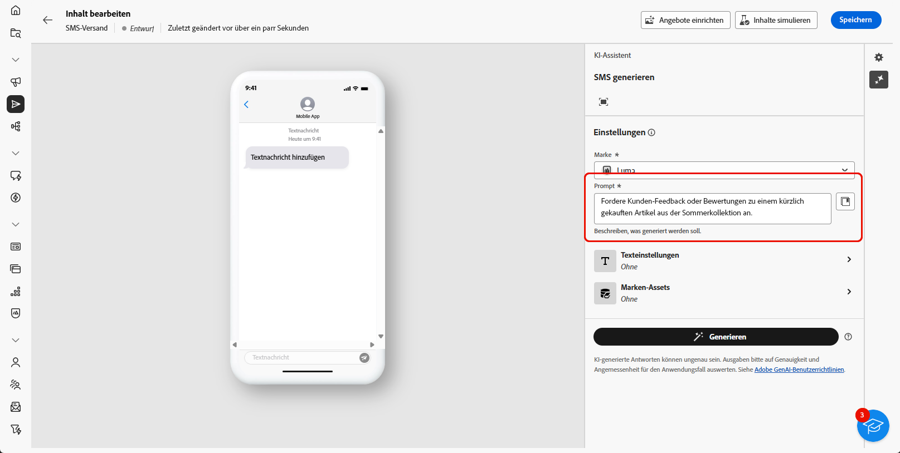

# Generierung von SMS mit dem KI-Assistenten {#generative-sms}

>[!BEGINSHADEBOX]

**Inhaltsverzeichnis**

* [Erste Schritte mit dem KI-Assistenten](generative-gs.md)
* [Generierung von E-Mails mit dem KI-Assistenten](generative-content.md)
* Generierung von SMS mit dem KI-Assistenten
* [Generierung von Push-Benachrichtigungen mit dem KI-Assistenten](generative-push.md)

>[!ENDSHADEBOX]

Sobald Sie Ihre SMS-Nachrichten für Ihre Zielgruppe erstellt und personalisiert haben, können Sie Ihre Kommunikation mithilfe des KI-Assistenten in Campaign, der auf innovativer KI-Technologie basiert, auf die nächste Ebene führen.

Dieses praktische Tool liefert intelligente Vorschläge für die Verfeinerung Ihrer Inhalte und stellt sicher, dass Ihre Botschaften effektiv ankommen und die Interaktion maximiert wird.

>[!NOTE]
>
>Bevor Sie mit der Verwendung dieser Funktion beginnen, lesen Sie die entsprechenden Informationen zu [Schutzmechanismen und Begrenzungen](generative-gs.md#generative-guardrails).

1. Nachdem Sie Ihren SMS-Versand erstellt und konfiguriert haben, klicken Sie auf **[!UICONTROL Inhalt bearbeiten]**.

   Weitere Informationen zur Konfiguration Ihres SMS-Versands finden Sie auf [dieser Seite](../sms/create-sms.md).

1. Geben Sie die **[!UICONTROL grundlegenden Details]** zu Ihrem Versand an. Klicken Sie abschließend auf **[!UICONTROL Inhalt bearbeiten]**.

1. Personalisieren Sie Ihre SMS-Nachricht nach Bedarf. [Weitere Informationen](../sms/content-sms.md)

1. Rufen Sie das Menü **[!UICONTROL KI-Assistenten anzeigen]** auf.

   {zoomable=&quot;yes&quot;}

1. Aktivieren Sie für den KI-Assistenten die Option **[!UICONTROL Originalinhalt verwenden]**, um neue Inhalte basierend auf Ihrem Versand, dem Versandnamen und der ausgewählten Zielgruppe zu personalisieren.

   >[!IMPORTANT]
   >
   > Ihre Eingabeaufforderung muss immer an Ihren aktuellen Inhalt gebunden sein.

1. Passen Sie den Inhalt an, indem Sie im Feld **[!UICONTROL Prompt]** beschreiben, was Sie generieren möchten.

   Wenn Sie Hilfe bei der Erstellung Ihres Prompts benötigen, finden Sie in der **[!UICONTROL Prompt-Bibliothek]** eine Vielzahl von Ideen für Prompts, mit denen Sie Ihre Sendungen verbessern können.

   {zoomable=&quot;yes&quot;}

1. Wählen Sie **[!UICONTROL Marken-Asset hochladen]** aus, um ein beliebiges Marken-Asset hinzuzufügen, das Inhalte enthält, die zusätzlichen Kontext für den KI-Assistenten bieten können.

1. Passen Sie Ihr Prompt mit den verschiedenen Optionen an:

   * **[!UICONTROL Kommunikationsstrategie]**: Wählen Sie den gewünschten Kommunikationsansatz für den erstellten Text.
   * **[!UICONTROL Sprache]**: Wählen Sie die Sprache für den Inhalt der Variante.
   * **[!UICONTROL Ton]**: Stellen Sie sicher, dass der Text für Ihre Zielgruppe und Ihren Zweck geeignet ist.
   * **[!UICONTROL Länge]**: Legen Sie die Länge Ihres Inhalts mit dem Schieberegler fest.

   {zoomable=&quot;yes&quot;}

1. Wenn das Prompt fertig ist, klicken Sie auf **[!UICONTROL Generieren]**.

1. Durchsuchen Sie die erstellten **[!UICONTROL Varianten]** und klicken Sie auf **[!UICONTROL Vorschau]**, um eine Vollbildversion der ausgewählten Variante anzuzeigen.

1. Navigieren Sie zur Option **[!UICONTROL Verfeinern]** im Fenster **[!UICONTROL Vorschau]**, um auf weitere Anpassungsfunktionen zuzugreifen und Ihre Variante nach Ihren Vorlieben zu gestalten:

   * **[!UICONTROL Als Referenzinhalt verwenden]**: Die gewählte Variante dient hierbei als Referenzinhalt für die Generierung anderer Ergebnisse.

   * **[!UICONTROL Einfachere Sprache verwenden]**: Der KI-Assistent hilft Ihnen, klare, knappe Botschaften zu schreiben, die jeder verstehen kann.

   * **[!UICONTROL Umformulieren]**: Der KI-Assistent formuliert Ihre Nachricht um, um sie für verschiedene Zielgruppen ansprechend zu gestalten.

   {zoomable=&quot;yes&quot;}

1. Klicken Sie auf **[!UICONTROL Auswählen]**, sobald Sie den passenden Inhalt gefunden haben.

1. Fügen Sie Personalisierungsfelder ein, um Ihre SMS-Inhalte auf der Grundlage von Profildaten anzupassen. [Weitere Informationen über die Personalisierung von Inhalten](../personalization/personalize.md)

   {zoomable=&quot;yes&quot;}

1. Klicken Sie nach der Definition des Nachrichteninhalts auf die Schaltfläche **[!UICONTROL Inhalt simulieren]**, um das Rendern zu steuern, und überprüfen Sie die Personalisierungseinstellungen mit Testprofilen. [Weitere Informationen](../preview-test/preview-content.md)

   {zoomable=&quot;yes&quot;}

Wenn Sie Inhalt, Zielgruppe und Zeitplan definiert haben, können Sie den SMS-Versand vorbereiten. [Weitere Informationen](../monitor/prepare-send.md)
