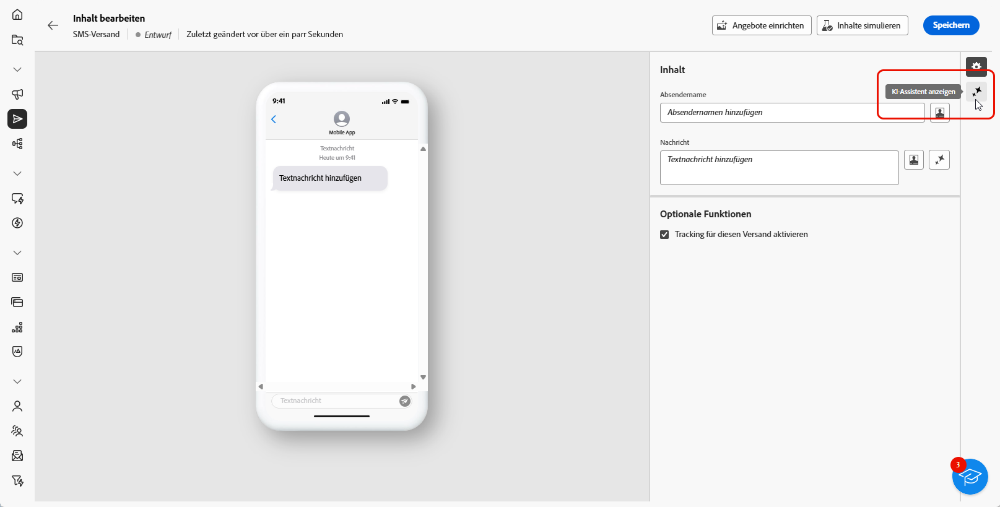
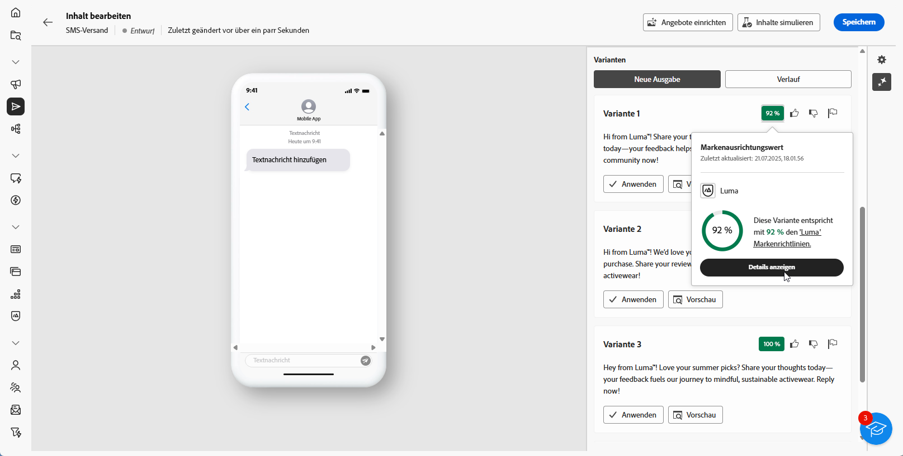

# Generierung von SMS mit dem KI-Assistenten {#generative-sms}

>[!BEGINSHADEBOX]

**Inhaltsverzeichnis**

* [Erste Schritte mit dem KI-Assistenten](generative-gs.md)
* [Generierung von E-Mails mit dem KI-Assistenten](generative-content.md)
* **[Generierung von SMS mit dem KI-Assistenten](generative-sms.md)**
* [Generierung von Push-Benachrichtigungen mit dem KI-Assistenten](generative-push.md)

>[!ENDSHADEBOX]

Sobald Sie Ihre SMS-Nachrichten für Ihre Zielgruppe erstellt und personalisiert haben, können Sie Ihre Kommunikation mithilfe des KI-Assistenten in Campaign, der auf innovativer KI-Technologie basiert, auf die nächste Ebene führen.

Dieses praktische Tool liefert intelligente Vorschläge für die Verfeinerung Ihrer Inhalte und stellt sicher, dass Ihre Botschaften effektiv ankommen und die Interaktion maximiert wird.

>[!NOTE]
>
>Bevor Sie mit der Verwendung dieser Funktion beginnen, lesen Sie die entsprechenden Informationen zu [Schutzmechanismen und Begrenzungen](generative-gs.md#guardrails-and-limitations).

1. Nachdem Sie Ihren SMS-Versand erstellt und konfiguriert haben, klicken Sie auf **[!UICONTROL Inhalt bearbeiten]**.

   Weitere Informationen zur Konfiguration Ihres SMS-Versands finden Sie auf [dieser Seite](../sms/create-sms.md).

1. Geben Sie die **[!UICONTROL grundlegenden Details]** zu Ihrem Versand an. Klicken Sie abschließend auf **[!UICONTROL Inhalt bearbeiten]**.

1. Personalisieren Sie Ihre SMS-Nachricht nach Bedarf. [Weitere Informationen](../sms/content-sms.md)

1. Rufen Sie das Menü **[!UICONTROL KI-Assistenten anzeigen]** auf.

   {zoomable=&quot;yes&quot;}

1. Passen Sie den Inhalt an, indem Sie im Feld **[!UICONTROL Prompt]** beschreiben, was Sie generieren möchten.

   Wenn Sie Hilfe bei der Erstellung Ihres Prompts benötigen, rufen Sie die **[!UICONTROL Prompt-Bibliothek]** auf, die eine Vielzahl von Ideen für Prompts enthält, um Ihre Sendungen zu verbessern.

   {zoomable=&quot;yes&quot;}

1. Aktivieren Sie die Option **[!UICONTROL Mit aktuellem Kontext verbessern]** für den KI-Assistenten, um neue Inhalte basierend auf Ihrem Versand, dem Versandnamen und der ausgewählten Zielgruppe zu personalisieren.

   >[!IMPORTANT]
   >
   > Ihr Prompt muss immer an einen bestimmten Kontext gebunden sein. Laden Sie hierzu ein Marken-Asset hoch oder aktivieren Sie die Option **[!UICONTROL Aktuellen Inhalt verbessern]**.

1. Wählen Sie **[!UICONTROL Marken-Asset hochladen]** aus, um ein beliebiges Marken-Asset hinzuzufügen, das Inhalte enthält, die zusätzlichen Kontext für den KI-Assistenten bieten können.

1. Wählen Sie die **[!UICONTROL Kommunikationsstrategie]** aus, die am besten Ihren Anforderungen entspricht. Dies wirkt sich auf den Ton und den Stil des generierten Textes aus.

1. Wählen Sie die **[!UICONTROL Sprache]** und den **[!UICONTROL Ton]** aus. die der generierte Text haben soll. Dadurch wird sichergestellt, dass der Text für Ihre Zielgruppe und Ihren Zweck geeignet ist.

   {zoomable=&quot;yes&quot;}

1. Verwenden Sie den Schieberegler, um die Länge des generierten Textes festzulegen.

1. Wenn die Eingabeaufforderung fertig ist, klicken Sie auf **[!UICONTROL Generieren]**.

1. Durchsuchen Sie die generierten **[!UICONTROL Varianten]** und klicken Sie auf **[!UICONTROL Anwenden]**, wenn Sie den richtigen Inhalt gefunden haben.

   Klicken Sie auf **[!UICONTROL Vorschau]**, um eine Vollbildversion der ausgewählten Variante anzuzeigen.

   {zoomable=&quot;yes&quot;}

1. Fügen Sie Personalisierungsfelder ein, um Ihre SMS-Inhalte auf der Grundlage von Profildaten anzupassen. [Weitere Informationen über die Personalisierung von Inhalten](../personalization/personalize.md)

   {zoomable=&quot;yes&quot;}

1. Klicken Sie nach der Definition des Nachrichteninhalts auf die Schaltfläche **[!UICONTROL Inhalt simulieren]**, um das Rendern zu steuern, und überprüfen Sie die Personalisierungseinstellungen mit Testprofilen. [Weitere Informationen](../preview-test/preview-content.md)

   {zoomable=&quot;yes&quot;}

1. Wenn Sie Inhalt, Zielgruppe und Zeitplan definiert haben, können Sie den SMS-Versand vorbereiten. [Weitere Informationen](../monitor/prepare-send.md)
