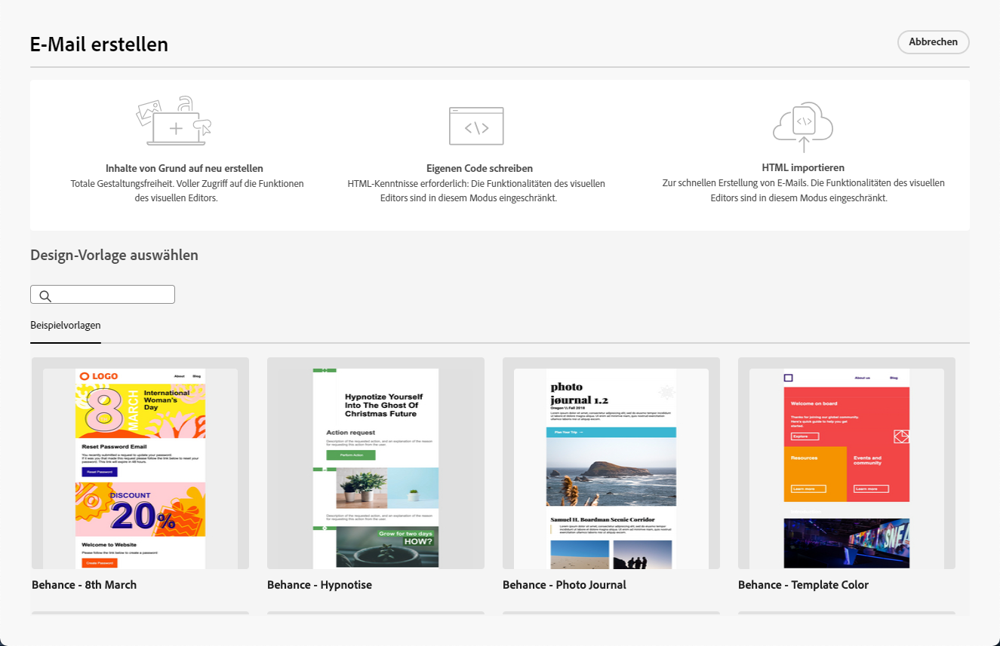

# Erste Schritte mit dem E-Mail-Designer {#get-started-email-designer}

Nach der Erstellung einer E-Mail in Adobe Campaign müssen Sie deren Inhalt definieren.

Mit dem E-Mail-Designer können Sie über eine intuitive Drag-and-Drop-Oberfläche überzeugende, individuell zugeschnittene E-Mails erstellen. Egal ob Sie bei null anfangen, vorhandene Inhalte importieren oder Vorlagen nutzen, können Sie für jede E-Mail alle Inhalte gestalten und präzisieren, sowohl für Werbeaktionen als auch für Transaktionen.

<!--Built to deliver HTML optimized for responsive design, the Email Designer allows you to easily define and apply visibility conditions and dynamic content to an email, template, or fragment directly through the user interface. You can seamlessly switch between the drag and drop interface and HTML code at the click of a button.

The Email Designer allows you to create email content and email content templates. It is compatible with simple emails, transactional emails, A/B test emails, multilingual emails, and recurring emails.-->

* Verwenden Sie die Fähigkeiten zur E-Mail-Gestaltung von [!DNL Campaign], um auf einfache Weise responsive E-Mails zu erstellen. [Weitere Informationen](create-email-content.md)

* Verbessern Sie das Kundenerlebnis, indem Sie personalisierte Inhalte basierend auf den Profilattributen von Kundinnen und Kunden erstellen. [Weitere Informationen](../personalization/personalize.md)

* Konfigurieren Sie bedingte Inhaltsfelder, um eine dynamische Personalisierung basierend auf dem Empfängerprofil zu erstellen. [Weitere Informationen](../personalization/conditions.md)

## Best Practices für die E-Mail-Gestaltung {#best-practices}

Beim Senden von E-Mails ist es wichtig zu beachten, dass die Empfängerinnen und Empfänger sie weiterleiten könnten, was manchmal zu Problemen mit dem Rendering der E-Mail führen kann. Dies gilt insbesondere bei der Verwendung von CSS-Klassen, die vom E-Mail-Anbieter, der für die Weiterleitung verwendet wird, möglicherweise nicht unterstützt werden, z. B. wenn Sie die CSS-Klasse „is-desktop-hidden“ verwenden, um ein Bild auf Mobilgeräten auszublenden.

Um diese Rendering-Probleme zu minimieren, empfehlen wir, die Struktur des E-Mail-Designs so einfach wie möglich zu halten. Versuchen Sie, ein einziges Design zu verwenden, das sowohl für Desktop- als auch für Mobilgeräte gut funktioniert, und vermeiden Sie die Verwendung komplexer CSS-Klassen oder anderer Design-Elemente, die möglicherweise nicht von allen E-Mail-Clients vollständig unterstützt werden. Mithilfe dieser Best Practices können Sie sicherstellen, dass Ihre E-Mails konsistent gerendert werden, unabhängig davon, wie sie von Empfängerinnen und Empfängern angezeigt oder weitergeleitet werden.

## Beginnen mit der Inhaltserstellung {#start-authoring}

Gehen Sie im Dashboard des E-Mail-Versands durch den Bildschirm [Inhalt bearbeiten](edit-content.md), um die Startseite des E-Mail-Designers zu öffnen. Wählen Sie dort aus den folgenden Optionen aus, wie Sie Ihre E-Mail gestalten möchten:

* **E-Mail von Grund auf neu erstellen** über die Benutzeroberfläche des E-Mail-Designers. Erfahren Sie in [diesem Abschnitt](create-email-content.md), wie Sie E-Mail-Inhalte gestalten.

* **Codieren und Einfügen von rohen HTML-Zeilen** direkt in den E-Mail-Designer. Erfahren Sie in [diesem Abschnitt](code-content.md), wie Sie Ihre eigenen Inhalte codieren. 

* **Importieren von vorhandenen HTML-Inhalten** aus einer Datei oder einem ZIP-Ordner. In diesem [Abschnitt](existing-content.md) erfahren Sie, wie Sie E-Mail-Inhalte importieren können.

* **Auswählen eines vorhandenen Inhalts** aus einer Liste integrierter oder benutzerdefinierter Vorlagen. Erfahren Sie in [diesem Abschnitt](create-email-templates.md), wie Sie mit E-Mail-Vorlagen arbeiten.

  {zoomable=&quot;yes&quot;}
