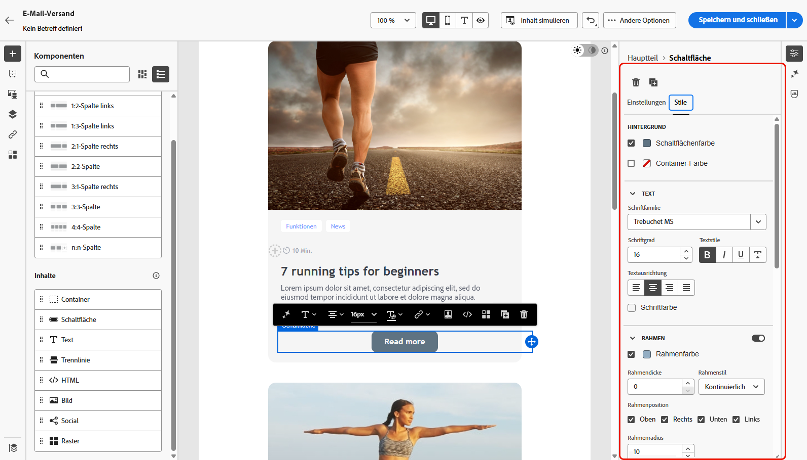

# Erste Schritte mit E-Mail-Stil {#get-started-email-style}

Nachdem Sie mit der Erstellung Ihres E-Mail-Inhalts in [!DNL Adobe Campaign] begonnen haben, können Sie eine Reihe von Stilparametern und Attributen im Einstellungsbereich des E-Mail-Designers anpassen.

Sie können Ihre Änderungen entweder auf den E-Mail-Hauptteil, auf eine Strukturkomponente oder auf eine Inhaltskomponente anwenden.

{zoomable="yes"}

Folgen Sie den unten stehenden Links, um zu erfahren, wie Sie bestimmte Stileinstellungen in Ihrer E-Mail anpassen können:

* Erfahren Sie, wie Sie Ihren [E-Mail-Hintergrund personalisieren](backgrounds.md)
* Erfahren Sie, wie Sie [senkrechte Ausrichtung und Abstand verwalten](alignment-and-padding.md)
* Erfahren Sie, wie Sie [einen Stil für die Links in Ihrer E-Mail definieren](styling-links.md)
* Erfahren Sie, wie Sie [Inline-Styling-Attribute anpassen](inline-styling.md)
