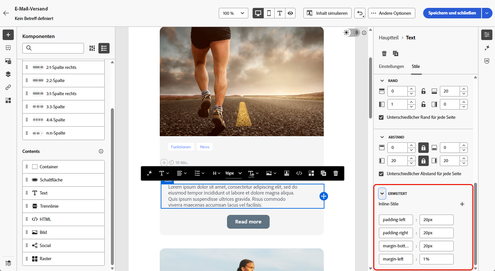
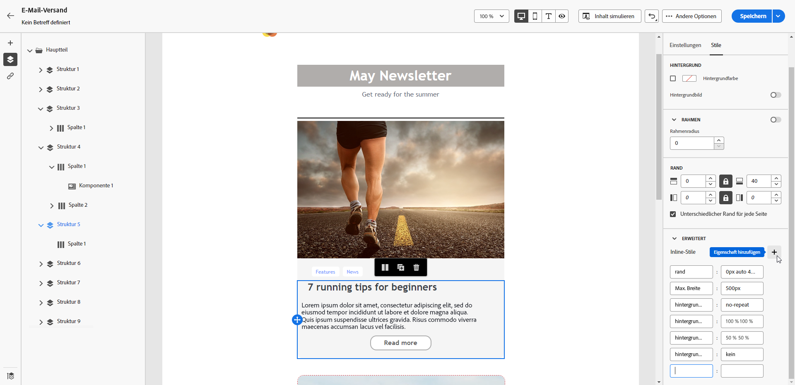

# Hinzufügen von Inline-Styling-Attributen {#adding-inline-styling-attributes}

Wenn Sie in der Benutzeroberfläche des E-Mail-Designers ein Element auswählen und im rechten Bereich die zugehörigen Einstellungen anzeigen, können Sie für dieses Element die Inline-Attribute und deren Werte ändern.

1. Wählen Sie eine Komponente direkt in Ihrem Inhalt aus oder verwenden Sie den **[!UICONTROL Navigationsbaum]** im linken Bereich.

1. Klicken Sie auf der Registerkarte **[!UICONTROL Stile]** auf die Dropdown-Liste **[!UICONTROL Erweitert]**.

   {zoomable="yes"}

1. Ändern Sie die Werte der vorhandenen Attribute.

1. Fügen Sie neue Eigenschaften mithilfe der Schaltfläche **+** hinzu. Fügen Sie beliebige Attribute und Werte hinzu, die CSS-konform sind.

   {zoomable="yes"}

Der Stil wird auf das ausgewählte Element angewendet.

>[!NOTE]
>
>Wenn für die untergeordneten Elemente keine speziellen Stilattribute definiert sind, wird der Stil des übergeordneten Elements verwendet.