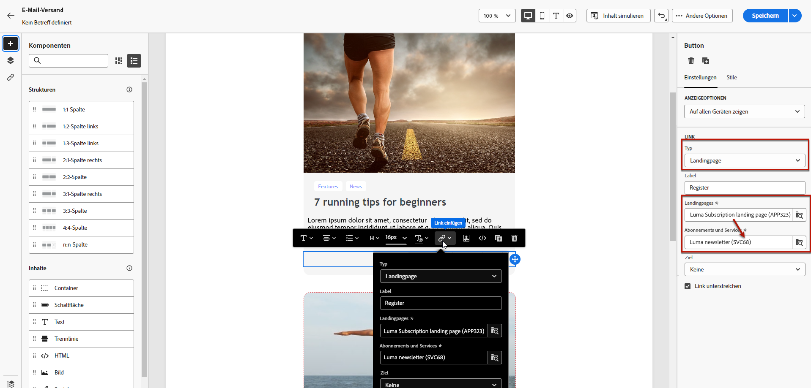
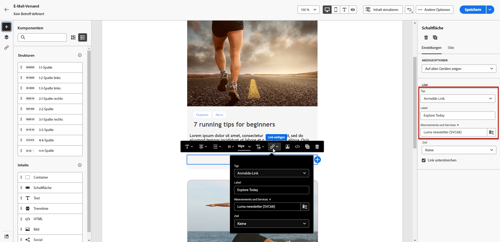
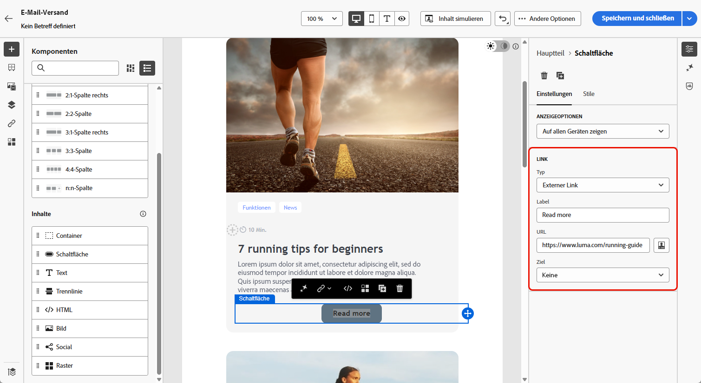
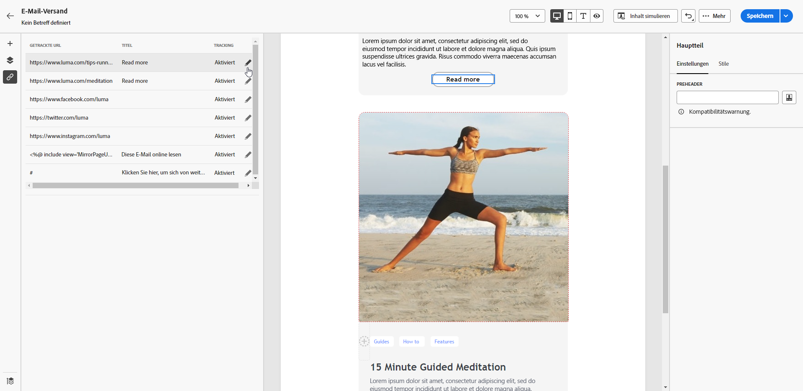
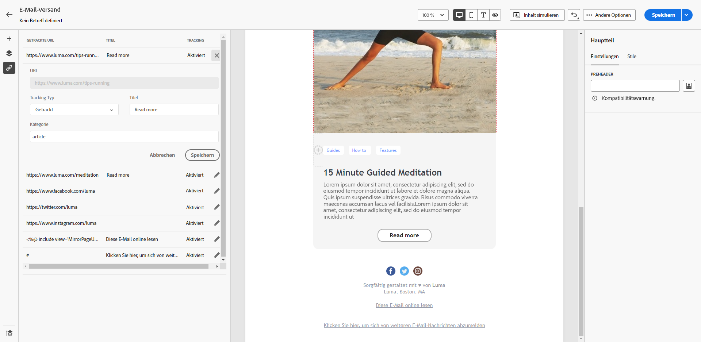

# Hinzufügen von Links und Verfolgen von Nachrichten {#tracking}

Verwenden Sie E-Mail-Designer, um Links zu Ihrem Inhalt hinzuzufügen und die gesendeten Nachrichten zu verfolgen, um das Verhalten Ihrer Empfänger zu überwachen.

## Einfügen von Links {#insert-links}

Beim Erstellen einer Nachricht können Sie Links zu Ihrem Inhalt hinzufügen.

>[!NOTE]
>
>Wenn das Tracking aktiviert ist, werden alle im Nachrichteninhalt enthaltenen Links verfolgt.

Gehen Sie wie folgt vor, um Links in Ihren E-Mail-Inhalt einzufügen:

1. Wählen Sie ein Element aus und klicken Sie in der kontextuellen Symbolleiste auf **[!UICONTROL Link einfügen]**.

1. Wählen Sie den gewünschten Linktyp aus.

   {zoomable=&quot;yes&quot;}

   * **[!UICONTROL Externer Link]**: Fügen Sie einen Link zu einer externen URL ein.

     >[!AVAILABILITY]
     >
     >Die folgenden Funktionen (Link zu **[!UICONTROL Landingpage]**, **[!UICONTROL Anmelde-Link]** und **[!UICONTROL Abmelde-Link]**) sind in begrenzter Verfügbarkeit verfügbar (LA). Sie sind auf Kunden beschränkt, die migrieren **von Adobe Campaign Standard nach Adobe Campaign v8** und können nicht in einer anderen Umgebung bereitgestellt werden.

   * **[!UICONTROL Landingpage]**: Fügen Sie einen Link zu einer Landingpage ein. Wenn Sie eine dynamische Landingpage auswählen (mit der **[!UICONTROL Dienst von URL]** ausgewählt ist), können Sie einen beliebigen Dienst aus der Liste auswählen. [Weitere Informationen](../landing-pages/create-lp.md#define-actions-on-form-submission)

     {zoomable=&quot;yes&quot;}

   * **[!UICONTROL Anmelde-Link]**: Fügen Sie einen Link zu einem Anmeldedienst ein. Wenn Benutzer auf den Link klicken, werden sie zur Anmelde-Landingpage weitergeleitet, auf die im ausgewählten Dienst verwiesen wird. [Weitere Informationen](../audience/manage-services.md#create-service)

     {zoomable=&quot;yes&quot;}

   * **[!UICONTROL Abmelde-Link]**: Fügen Sie einen Link zu einem Abmeldedienst ein. Wenn Abonnenten auf den Link klicken, werden sie zur Abmelde-Landingpage weitergeleitet, auf die im ausgewählten Dienst verwiesen wird. [Weitere Informationen](../audience/manage-services.md#create-service)

   <!--* **[!UICONTROL Mirror page]**: Add a link to display the email content in a web browser. [Learn more]-->

1. Geben Sie die gewünschte URL in das entsprechende Feld ein oder wählen Sie eine Landingpage oder einen Dienst aus und definieren Sie die Link-Einstellungen und -Stile.

1. Fügen Sie eine **[!UICONTROL Bezeichnung]** und einen **[!UICONTROL Link]** hinzu.

1. Speichern Sie Ihre Änderungen.

1. Sobald er erstellt wurde, können Sie den Link immer noch über die Registerkarte **[!UICONTROL Einstellungen]** ändern.

   * Sie können den Link bearbeiten und seine **[!UICONTROL Zielgruppe]** ändern.
   * Sie können den Link unterstreichen oder nicht, indem Sie die entsprechende Option auswählen.

   {zoomable=&quot;yes&quot;}

>[!NOTE]
>
>E-Mail-Nachrichten vom Typ Marketing müssen einen Ausschluss-Link enthalten, der für Transaktionsnachrichten nicht erforderlich ist. Die Kategorie der Nachricht (**[!UICONTROL Marketing]** oder **[!UICONTROL Transactional]**) wird auf der Kanaloberfläche und beim Erstellen der Nachricht definiert.

In allen Ihren E-Mail-Nachrichten sollte ein spezifischer Link zur Mirrorseite hinzugefügt werden. Weitere Informationen zur Mirrorseite finden Sie in [diesem Abschnitt](mirror-page.md).

## Verwalten von Tracking {#manage-tracking}

Der [E-Mail-Designer](create-email-content.md) ermöglicht Ihnen die Verwaltung der getrackten URLs, z. B. die Bearbeitung des Tracking-Typs für jeden Link.

1. Klicken Sie auf das Symbol **[!UICONTROL Links]** im linken Fensterbereich, um die Liste aller URLs Ihrer zu trackenden Inhalte anzuzeigen.

   Diese Liste bietet einen guten Überblick und ermöglicht das Auffinden aller im E-Mail-Inhalt vorhandenen URLs.

1. Um einen Link zu bearbeiten, wählen Sie das entsprechende Stiftsymbol aus.

   {zoomable=&quot;yes&quot;}

1. Sie können den **[!UICONTROL Tracking-Typ]** bei Bedarf ändern:

   {zoomable=&quot;yes&quot;}

   Für jede getrackte URL können Sie einen der folgenden Werte für den Tracking-Modi auswählen:

   * **[!UICONTROL Getrackt]**: aktiviert das Tracking dieser URL.
   * **[!UICONTROL Opt-out]** Diese URL wird als Opt-out- oder Abmeldungs-URL behandelt.
   * **[!UICONTROL Mirrorseite]**: Diese URL wird als URL der Mirrorseite behandelt.
   * **[!UICONTROL Nie]**: Das Tracking dieser URL wird nie aktiviert. <!--This information is saved: if the URL appears again in a future message, its tracking is automatically deactivated.-->

1. Fügen Sie eine **[!UICONTROL Kategorie]** zu Ihrem Link hinzu, um getrackte Links zu gruppieren, und klicken Sie dann auf **[!UICONTROL Speichern]**.

   {zoomable=&quot;yes&quot;}

1. Öffnen Sie nach dem Versand den Versandbericht. Unter dem Menü **[!UICONTROL Tracking]** zeigt der Bericht **[!UICONTROL URLs und Clickstreams]** an, welche URLs aus Ihrem Versand am häufigsten besucht werden. [Weitere Informationen](../reporting/gs-reports.md)
