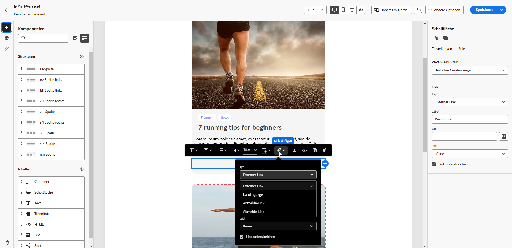
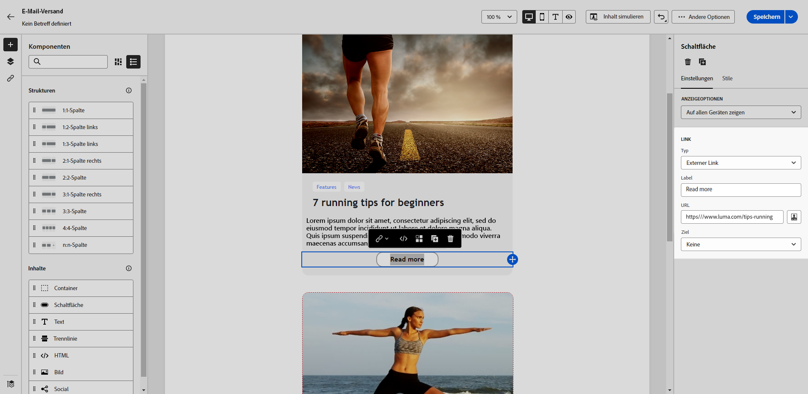

# Hinzufügen von Links und Verfolgen von Nachrichten {#tracking}

Verwenden Sie die E-Mail-Designer, um Links zu Ihrem Inhalt hinzuzufügen und die gesendeten Nachrichten zu verfolgen, sodass Sie das Verhalten Ihrer Empfängerinnen und Empfänger überwachen können.

## Einfügen von Links {#insert-links}

Beim Erstellen einer Nachricht können Sie Links zu Ihrem Inhalt hinzufügen.

>[!NOTE]
>
>Wenn das Tracking aktiviert ist, werden alle im Nachrichteninhalt enthaltenen Links verfolgt.

Gehen Sie wie folgt vor, um Links in Ihren E-Mail-Inhalt einzufügen:

1. Wählen Sie ein Element aus und klicken Sie in **[!UICONTROL kontextuellen Symbolleiste auf]** Link einfügen“.

1. Wählen Sie den gewünschten Link-Typ aus.

   {zoomable="yes"}

   * **[!UICONTROL Externer Link]**: Fügen Sie einen Link zu einer externen URL ein.

     >[!AVAILABILITY]
     >
     >Die folgenden Funktionen (Link zu **[!UICONTROL Landingpage]**, **[!UICONTROL Abonnement-Link]** und **[!UICONTROL Abmelde-Link]**) sind nur eingeschränkt verfügbar. Sie sind Kundinnen und Kunden vorbehalten, die **von Adobe Campaign Standard zu Adobe Campaign v8** migrieren, und können nicht in anderen Umgebungen bereitgestellt werden.

   * **[!UICONTROL Landingpage]**: Fügen Sie einen Link zu einer Landingpage ein. Wenn Sie eine dynamische Landingpage auswählen (und die Option **[!UICONTROL Dienst über URL]** ausgewählt ist), können Sie einen beliebigen Dienst aus der Liste auswählen. [Weitere Informationen](../landing-pages/create-lp.md#define-actions-on-form-submission)

     {zoomable="yes"}

   * **[!UICONTROL Anmelde-Link]**: Fügen Sie einen Link zu einem Anmelde-Dienst ein.  Wenn Benutzer auf den Link klicken, werden sie zur Landingpage des Abonnements weitergeleitet, auf die im ausgewählten Service verwiesen wird. [Weitere Informationen](../audience/manage-services.md#create-service)

     {zoomable="yes"}

   * **[!UICONTROL Abmelde-Link]**: Fügen Sie einen Link zu einem Abmelde-Dienst ein.  Wenn Abonnenten auf den Link klicken, werden sie zur Landingpage zur Abmeldung weitergeleitet, auf die im ausgewählten Service verwiesen wird. [Weitere Informationen](../audience/manage-services.md#create-service)

   <!--* **[!UICONTROL Mirror page]**: Add a link to display the email content in a web browser. [Learn more]-->

1. Geben Sie die gewünschte URL in das entsprechende Feld ein oder wählen Sie eine Landingpage oder einen Dienst aus und definieren Sie die Link-Einstellungen und -Stile.

1. Fügen Sie eine **[!UICONTROL Bezeichnung]** und einen **[!UICONTROL Link]** hinzu.

1. Speichern Sie Ihre Änderungen.

1. Nachdem Sie den Link erstellt haben, ändern Sie ihn bei **[!UICONTROL auf der Registerkarte]** Einstellungen“.

   * Bearbeiten Sie den Link und ändern Sie seine **[!UICONTROL Target]**.
   * Wählen Sie, ob der Link unterstrichen werden soll, indem Sie die entsprechende Option markieren.

   {zoomable="yes"}

>[!NOTE]
>
>E-Mail-Nachrichten vom Typ Marketing müssen einen Ausschluss-Link enthalten, was für Transaktionsnachrichten nicht erforderlich ist. Die Kategorie der Nachricht (**[!UICONTROL Marketing]** oder **[!UICONTROL Transaktion]**) wird auf Ebene der Kanaloberfläche und beim Erstellen der Nachricht definiert.

Fügen Sie in alle E-Mail-Nachrichten einen spezifischen Link zur Mirrorseite ein. Weitere Informationen zur Mirrorseite finden Sie in [diesem Abschnitt](mirror-page.md).

## Verwalten von Tracking {#manage-tracking}

Mit [E-Mail-Designer](create-email-content.md) können Sie getrackte URLs verwalten, z. B. den Tracking-Typ für jeden Link bearbeiten.

1. Klicken Sie auf **[!UICONTROL Links]** im linken Bereich, um die Liste aller URLs in Ihrem zu trackenden Inhalt anzuzeigen.

   Diese Liste bietet eine zentrale Ansicht und hilft beim Auffinden jeder URL im E-Mail-Inhalt.

1. Um einen Link zu bearbeiten, wählen Sie das entsprechende Stiftsymbol aus.

   {zoomable="yes"}

1. Ändern Sie bei **[!UICONTROL den]** Tracking-Typ:

   {zoomable="yes"}

   Legen Sie für jede getrackte URL den Tracking-Modus auf einen der folgenden Werte fest:

   * **[!UICONTROL Verfolgt]**: Aktiviert das Tracking für diese URL.
   * **[!UICONTROL Opt-out]**: Markiert diese URL als Opt-out- oder Abmelde-URL.
   * **[!UICONTROL Mirrorseite]**: Markiert diese URL als URL der Mirrorseite.
   * **[!UICONTROL Nie]**: Verhindert das Tracking dieser URL. <!--This information is saved: if the URL appears again in a future message, its tracking is automatically deactivated.-->

1. Fügen Sie **[!UICONTROL Link]** Kategorie“ hinzu, um getrackte Links zu gruppieren, und klicken Sie auf **[!UICONTROL Speichern]**.

   {zoomable="yes"}

1. Öffnen Sie nach dem Versand den Versandbericht. Unter dem Menü **[!UICONTROL Tracking]** zeigt der Bericht **[!UICONTROL URLs und Clickstreams]** an, welche URLs aus Ihrem Versand am häufigsten besucht werden. [Weitere Informationen](../reporting/gs-reports.md)