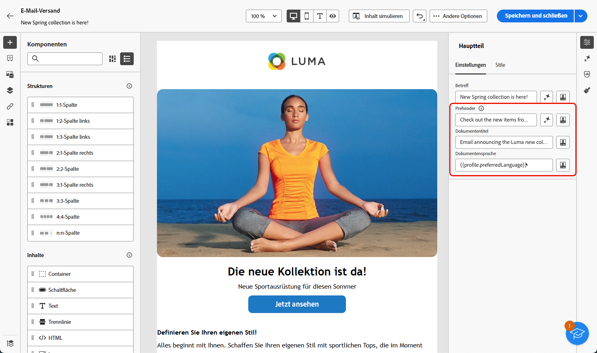
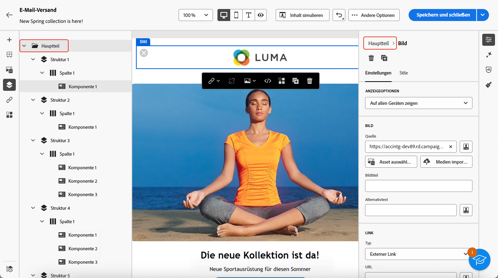
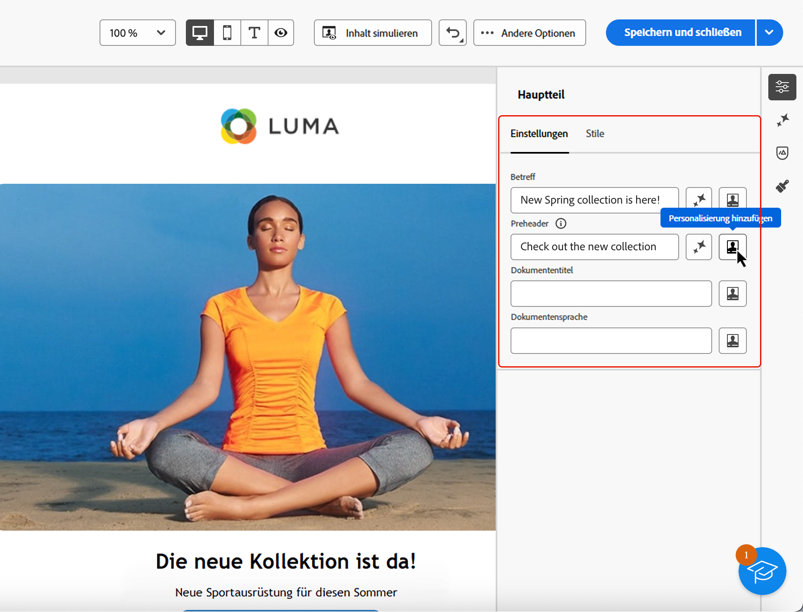

# Hinzufügen von Metadaten zu Ihrem E-Mail-Inhalt {#email-metadata}

>[!CONTEXTUALHELP]
>id="ac_edition_preheader"
>title="Definieren eines Preheaders"
>abstract="Ein Preheader ist ein kurzer Zusammenfassungstext, der beim Anzeigen einer E-Mail über einen E-Mail-Client der Betreffzeile folgt. In vielen Fällen handelt es sich um eine kurze Zusammenfassung der E-Mail, die in der Regel einen Satz lang ist."

Beim Entwerfen Ihrer E-Mails können Sie zur besseren Lesbarkeit und Barrierefreiheit zusätzliche Metaattribute für Ihre Inhalte definieren. Mit [!DNL Journey Optimizer] [E-Mail-Designer](get-started-email-designer.md) können Sie die folgenden Elemente angeben:

* **[!UICONTROL Preheader]**: Ein Preheader ist ein kurzer zusammenfassender Text, der unter der Betreffzeile zu sehen ist, wenn Sie eine E-Mail in Ihrem E-Mail-Programm öffnen. In vielen Fällen handelt es sich um eine kurze Zusammenfassung der E-Mail, die in der Regel einen Satz lang ist.

  >[!NOTE]
  >
  >Preheader werden nicht von allen E-Mail-Clients unterstützt. Wenn der Preheader nicht unterstützt wird, wird er nicht angezeigt.

* **[!UICONTROL Dokumenttitel]**: Dieses Feld, das dem `<title>`-Element entspricht, enthält beschreibende Informationen zu Ihrem E-Mail-Inhalt, die normalerweise als QuickInfo beim Zeigen mit der Maus angezeigt werden. Es kann Benutzenden mit Behinderungen helfen, indem es zusätzlichen Kontext bietet, und kann zu einem besseren Verständnis Ihrer Inhalte durch Suchmaschinen beitragen.

* **[!UICONTROL Dokumentsprache]**: Um die Barrierefreiheit zu gewährleisten, können Sie die Sprache angeben, die Bildschirmlesehilfen verwenden werden, um Text und Bilder in Sprache oder Braille zu konvertieren - für Menschen mit Sehbehinderung oder Lernbehinderung. Diese Einstellung entspricht dem `lang` im `<html>`.

Gehen Sie wie folgt vor, um diese Einstellungen zu konfigurieren.

1. Designer Fügen Sie in [E-Mail-](create-email-content.md)) mindestens eine **[!UICONTROL Strukturkomponente]** hinzu, um Ihre E-Mail zu entwerfen.

1. Klicken Sie **[!UICONTROL Textkörper]** entweder über den **[!UICONTROL Navigationsbaum]** links oder oben im rechten Bereich.

   {width="90%"}

1. Geben Sie auf **[!UICONTROL Registerkarte]** Text in die Felder **[!UICONTROL Preheader]**, **[!UICONTROL Dokumenttitel]** und/oder **[!UICONTROL Dokumentsprache]** ein.

1. Sie können auch auf das Personalisierungssymbol neben jedem Feld klicken, um Ihren Inhalt anhand von Profilattributen, Zielgruppen, kontextuellen Attributen und mehr anzupassen. [Erfahren Sie mehr über Personalisierung](../personalization/gs-personalization.md)

   {width="70%"}

1. Klicken Sie **[!UICONTROL Speichern]**, um Ihre Änderungen zu bestätigen.