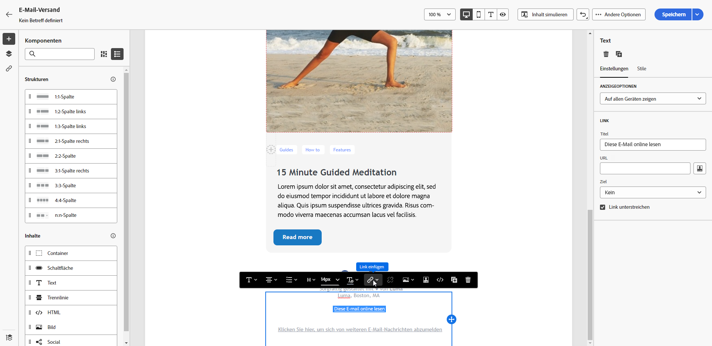
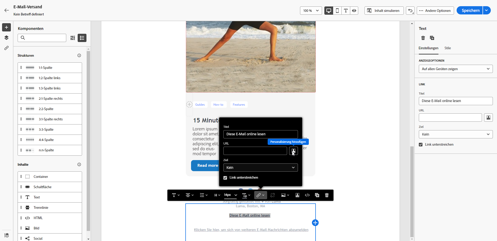
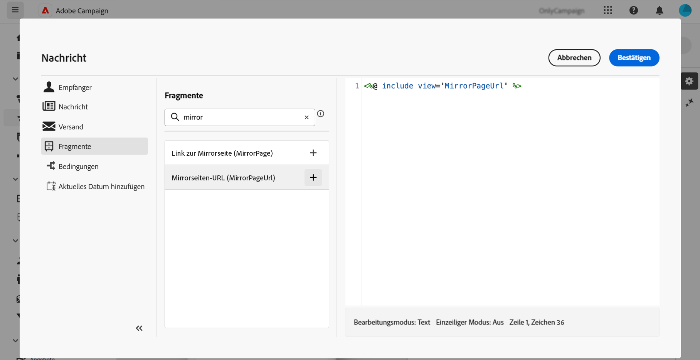

# Hinzufügen eines Links zur Mirrorseite{#mirror-page}

Die Mirrorseite ist eine Online-Version Ihrer E-Mail.

Während die meisten E-Mail-Clients Bilder ohne Probleme rendern, können einige Voreinstellungen aus Sicherheitsgründen verhindern, dass Bilder angezeigt werden. Benutzerinnen und Benutzer können die Mirrorseite einer E-Mail aufrufen, etwa wenn bei der Anzeige in ihrem Posteingang Rendering-Probleme auftreten oder Bilder beschädigt sind. Es wird außerdem empfohlen, aus Gründen der Barrierefreiheit oder um zum Social Sharing zu ermutigen, eine Online-Version bereitzustellen.

Die von Adobe Campaign erzeugte Mirrorseite enthält alle Personalisierungsdaten.

{width="600" align="left"}

## Hinzufügen eines Links zur Mirrorseite{#link-to-mirror-page}

Es empfiehlt sich, einen Link zur Mirrorseite einzufügen. Dieser Link kann beispielsweise lauten: „Diese E-Mail in Ihrem Browser anzeigen“ oder „Online lesen“. Er befindet sich häufig in der Kopf- oder Fußzeile der E-Mail.

In Adobe Campaign können Sie einen Link zur Mirrorseite in den E-Mail-Inhalt einfügen, indem Sie den dedizierten **Gestaltungsbaustein** verwenden. Der integrierte Gestaltungsbaustein **Link zur Mirrorseite** fügt den folgenden Code in Ihren E-Mail-Inhalt ein: `<%@ include view='MirrorPage' %>`.

So fügen Sie in Ihrer E-Mail einen Link zu einer Mirrorseite hinzu:

1. Wählen Sie ein Element aus und klicken Sie in der kontextuellen Symbolleiste auf **[!UICONTROL Link einfügen]** from the contextual toolbar..

   {zoomable="yes"}

1. Wählen Sie das Symbol **[!UICONTROL Personalisierung hinzufügen]** aus, um auf das Personalisierungsmenü zuzugreifen.

   {zoomable="yes"}

1. Wählen Sie im Menü **[!UICONTROL Fragmente]** die Option **[!UICONTROL URL der Mirrorseite]** und klicken Sie auf **[!UICONTROL Hinzufügen]**. [Erfahren Sie, wie Sie Ausdrucksfragmente verwenden](../content/use-expression-fragments.md)

   {zoomable="yes"}

Die Mirrorseite wird automatisch erstellt.

>[!IMPORTANT]
>
>Links zu Mirrorseiten werden automatisch generiert und können nicht bearbeitet werden. Sie enthalten alle verschlüsselten personalisierten Daten, die zum Rendern der ursprünglichen E-Mail erforderlich sind. Daher kann die Verwendung personalisierter Attribute mit großen Werten zu langen Mirrorseiten-URLs führen, wodurch der Link in Webbrowsern mit einer maximalen URL-Länge eventuell nicht funktioniert.

Wenn die Empfänger nach dem Versand der E-Mail auf den Link zur Mirrorseite klicken, wird der Inhalt der E-Mail in ihrem Standard-Webbrowser angezeigt.

>[!NOTE]
>
>Im Testversand an die Testprofile ist der Link zur Mirrorseite nicht aktiv. Er wird nur in den endgültigen Nachrichten aktiviert.

Standardmäßig beträgt die Beibehaltungsdauer für eine Mirrorseite 60 Tage. Nach dieser Verzögerung ist die Mirrorseite nicht mehr verfügbar.

## Erzeugung der Mirrorseite{#mirror-page-generation}

Standardmäßig wird die Mirrorseite von Adobe Campaign automatisch erzeugt, wenn der E-Mail-Inhalt nicht leer ist und einen Link zur Mirrorseite enthält (auch Mirrorlink genannt).

Sie können den Erzeugungsmodus der E-Mail-Mirrorseite steuern. Optionen sind in den Versandeigenschaften verfügbar. [Weitere Informationen](../advanced-settings/delivery-settings.md#mirror)
