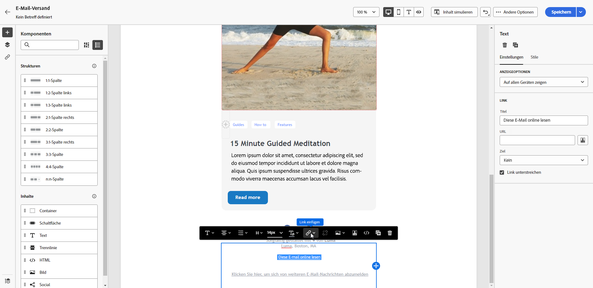
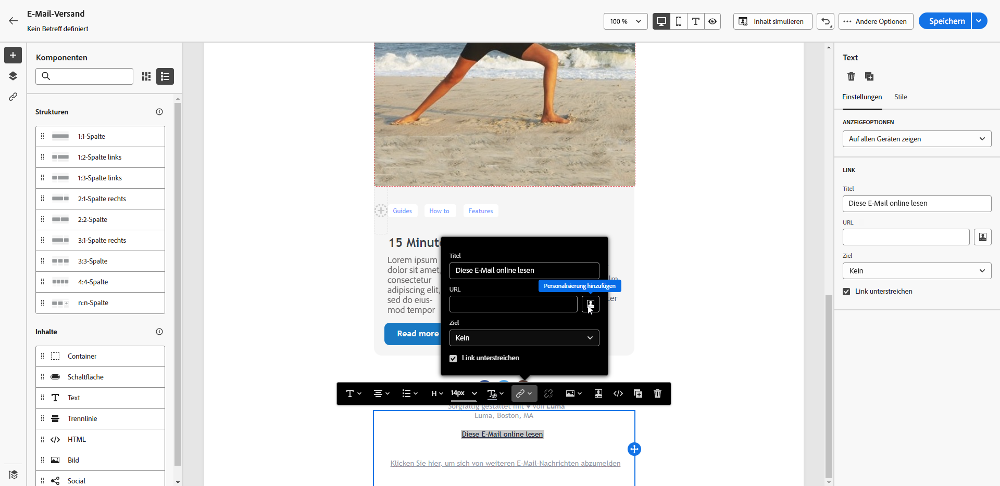
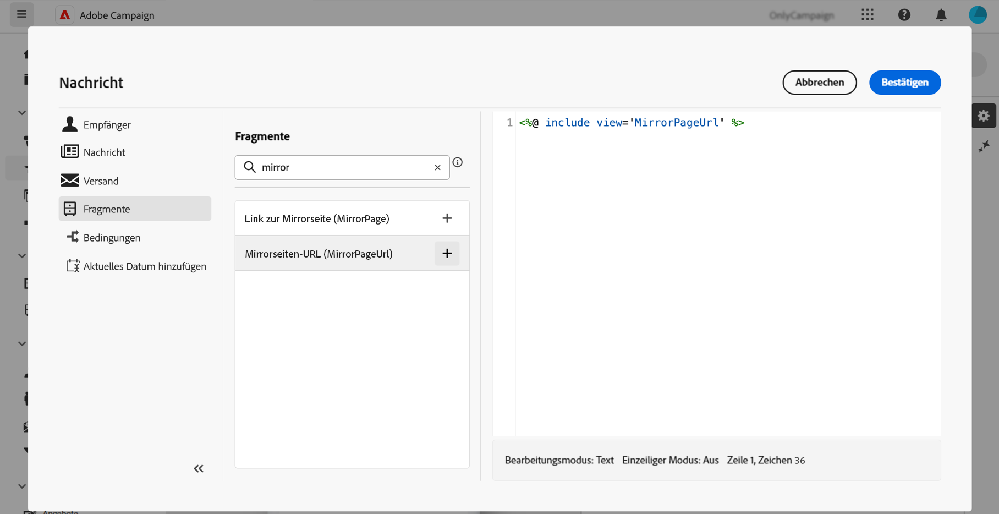

# Mirrorseite {#mirror-page}

Die Mirrorseite ist eine Online-Version Ihrer E-Mail. Beim E-Mail-Marketing empfiehlt es sich, einen Link zur Mirrorseite hinzuzufügen. Benutzerinnen und Benutzer können auf die Mirrorseite einer E-Mail zugreifen, etwa wenn bei der Anzeige in ihrem Posteingang Rendering-Probleme auftreten oder Bilder beschädigt sind. Es wird außerdem empfohlen, aus Gründen der Barrierefreiheit oder um zum Social Sharing zu ermutigen, eine Online-Version bereitzustellen.

Die von Adobe Campaign generierte Mirrorseite enthält alle Personalisierungsdaten.

{width="600"}

## Hinzufügen eines Links zur Mirrorseite {#link-to-mirror-page}

Fügen Sie in Adobe Campaign einen Link zur Mirrorseite in den E-Mail-Inhalt ein, indem Sie den dedizierten **Gestaltungsbaustein** verwenden. Der integrierte Gestaltungsbaustein **Link zur Mirrorseite** fügt den folgenden Code in Ihren E-Mail-Inhalt ein: `<%@ include view='MirrorPage' %>`.

Gehen Sie wie folgt vor, um Ihrer E-Mail einen Link zu einer Mirrorseite hinzuzufügen:

1. Wählen Sie zuerst ein Element aus (Text oder Bild) und klicken Sie danach in der kontextuellen Symbolleiste auf **[!UICONTROL Link einfügen]**.

   {zoomable="yes"}

1. Wählen Sie das Symbol **[!UICONTROL Personalisierung hinzufügen]** aus, um auf das Personalisierungsmenü zuzugreifen.

   {zoomable="yes"}

1. Wählen Sie im Menü **[!UICONTROL Fragmente]** die Option **[!UICONTROL Mirrorseiten-URL]** und klicken Sie auf **[!UICONTROL Hinzufügen]**. [Erfahren Sie, wie Sie Ausdrucksfragmente verwenden](../content/use-expression-fragments.md)

   {zoomable="yes"}

Die Mirrorseite wird automatisch erstellt.

Nach dem Versand der E-Mail wird den Empfangenden, die auf den Link zur Mirrorseite klicken, der Inhalt der E-Mail in ihrem Standard-Webbrowser angezeigt.

Standardmäßig beträgt die Beibehaltungsdauer für eine Mirrorseite **60 Tage**. Nach diesem Zeitraum ist die Mirrorseite nicht mehr verfügbar.

>[!CAUTION]
>
>* Links zu Mirrorseiten werden automatisch generiert und können nicht bearbeitet werden. Sie enthalten alle verschlüsselten personalisierten Daten, die zum Rendern der ursprünglichen E-Mail erforderlich sind. Die Verwendung personalisierter Attribute mit großen Werten kann zu langen Mirrorseiten-URLs führen, wodurch der Link in Webbrowsern mit einer maximalen URL-Länge eventuell nicht funktioniert.
>
>* Im Testversand an die Testprofile ist der Link zur Mirrorseite nicht aktiv. Er wird erst in den endgültigen Nachrichten aktiv.

## Erzeugung der Mirrorseite {#mirror-page-generation}

Standardmäßig generiert Adobe Campaign automatisch die Mirrorseite, wenn der E-Mail-Inhalt nicht leer ist und einen Link zur Mirrorseite enthält (auch als Mirror-Link bezeichnet).

Der Erzeugungsmodus der E-Mail-Mirrorseite kann über die in den Versandeigenschaften verfügbaren Optionen gesteuert werden. [Weitere Informationen](../advanced-settings/delivery-settings.md#mirror)