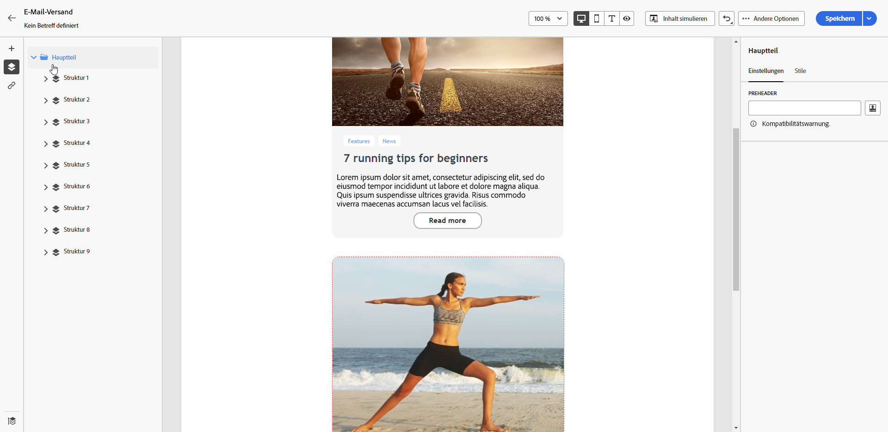
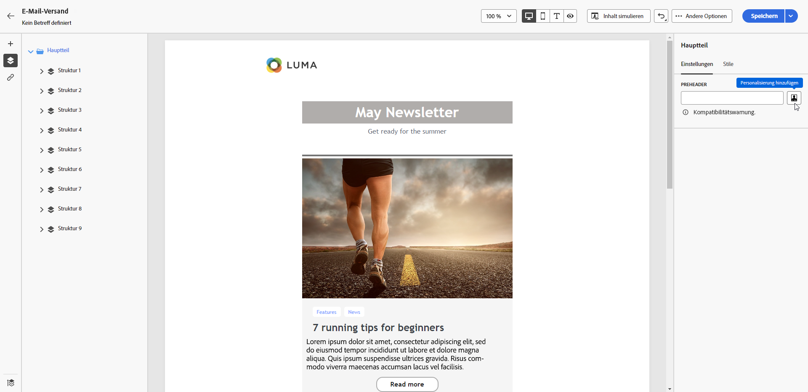
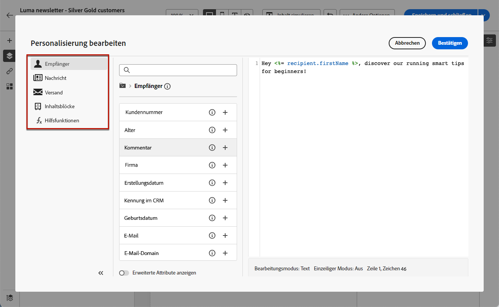

# Hinzufügen eines Preheaders zu einer E-Mail {#preheader}

>[!CONTEXTUALHELP]
>id="ac_edition_preheader"
>title="Hinzufügen eines Preheaders"
>abstract="Ein Preheader ist ein kurzer Zusammenfassungstext, der beim Anzeigen einer E-Mail über einen E-Mail-Client der Betreffzeile folgt. In vielen Fällen handelt es sich um eine kurze Zusammenfassung der E-Mail, die in der Regel einen Satz lang ist."

Ein Preheader ist ein kurzer Text, der unter der Betreffzeile zu sehen ist, wenn Sie eine E-Mail in einem beliebigen E-Mail-Client öffnen.

In vielen Fällen handelt es sich um eine kurze Zusammenfassung des Inhalts, die in der Regel einen Satz lang ist.

>[!NOTE]
>
>Preheader werden nicht von allen E-Mail-Clients unterstützt. Wenn der Preheader nicht unterstützt wird, wird er nicht angezeigt.

Gehen Sie wie folgt vor, um den Preheader einer E-Mail zu definieren.

1. Fügen Sie im [E-Mail-Designer](create-email-content.md) mindestens eine **[!UICONTROL Struktur]**-Komponente hinzu, um mit der Gestaltung Ihrer E-Mail zu beginnen.

1. Klicken Sie auf **[!UICONTROL Symbol &quot;]**&quot; im linken Bereich und wählen Sie **[!UICONTROL Hauptteil]**.

   {zoomable="yes"}

1. Geben Sie auf der Registerkarte **[!UICONTROL Einstellungen]** Text für Ihren Preheader ein.

1. Klicken Sie links neben dem Feld **[!UICONTROL Preheader]** auf das Symbol **[!UICONTROL Personalisierung hinzufügen]**, um eine weitere Personalisierung vorzunehmen.

   {zoomable="yes"}

1. Fügen Sie im Fenster **[!UICONTROL Personalization bearbeiten]** &quot;[-Felder](../personalization/personalize.md), [Ausdrucksfragmente](../content/use-expression-fragments.md) und [bedingte Inhalte](../personalization/conditions.md) mithilfe der entsprechenden Einträge auf der linken Seite hinzu.

   {zoomable="yes"}

1. Klicken Sie auf **[!UICONTROL Bestätigen]**.

Ihr Preheader für Ihre E-Mail ist jetzt konfiguriert.