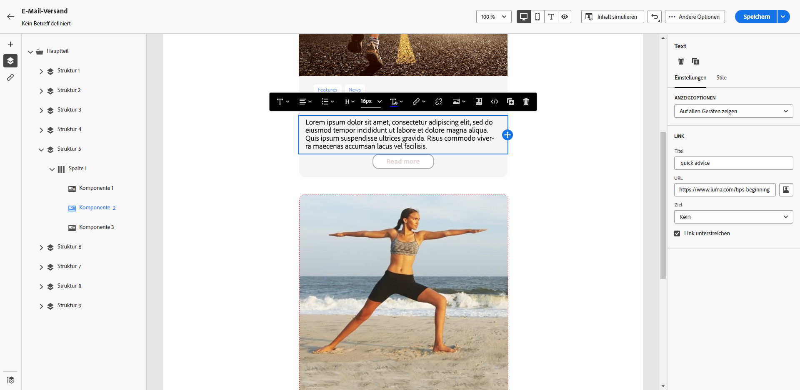
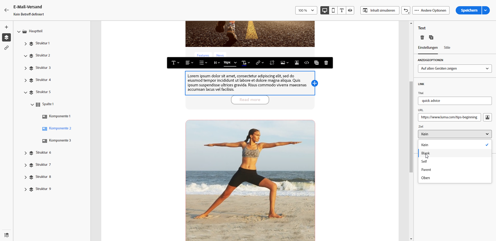
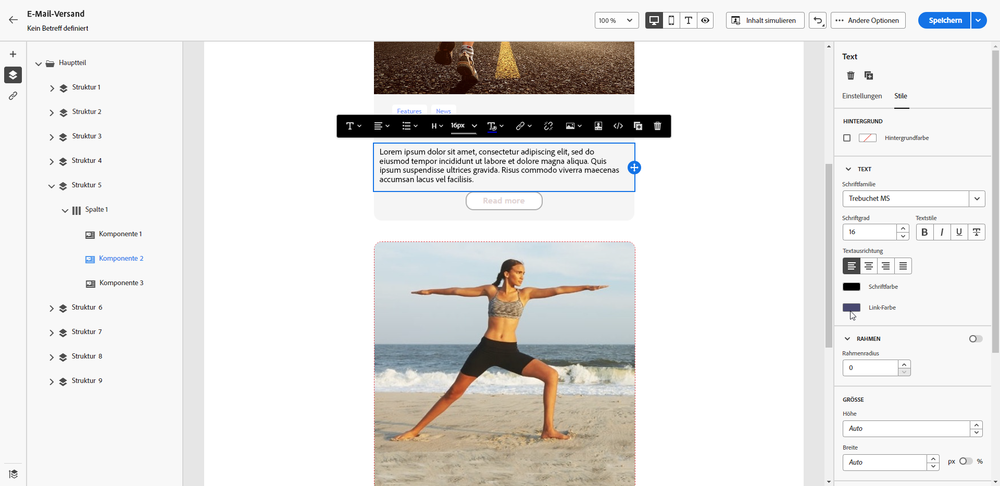

# Definieren eines Stils für Links {#styling-links}

Sie können in E-Mail-Designer einen Link unterstreichen und dessen Farbe und Zielgruppe auswählen.

1. Wählen Sie in einer **[!UICONTROL Text]**-Komponente, in die ein Link eingefügt ist, Ihren Link aus.

1. Aktivieren Sie auf der Registerkarte **[!UICONTROL Einstellungen]** das Kontrollkästchen **[!UICONTROL Link unterstreichen]**, um das Label zu unterstreichen.

   {zoomable="yes"}

1. Wählen Sie im Dropdown-Menü **[!UICONTROL Zielgruppe]** aus, wie Ihre Audience weitergeleitet werden soll:

   * **[!UICONTROL None]**: Öffnet den Link im selben Fenster, in dem er angeklickt wurde (Standard).
   * **[!UICONTROL Blank]**: Öffnet den Link in einem neuen Fenster oder einer neuen Registerkarte.
   * **[!UICONTROL Self]**: Öffnet den Link im selben Fenster, in dem er angeklickt wurde.
   * **[!UICONTROL Übergeordnetes Element]**: Öffnet den Link im übergeordneten Fenster.
   * **[!UICONTROL Oben]**: Öffnet den Link im Textkörper des Fensters.

   {zoomable="yes"}

1. Um die Farbe Ihres Links zu ändern, klicken Sie auf der Registerkarte **[!UICONTROL Stile]** auf **[!UICONTROL Link-Farbe]**.

   {zoomable="yes"}

1. Speichern Sie Ihre Änderungen.