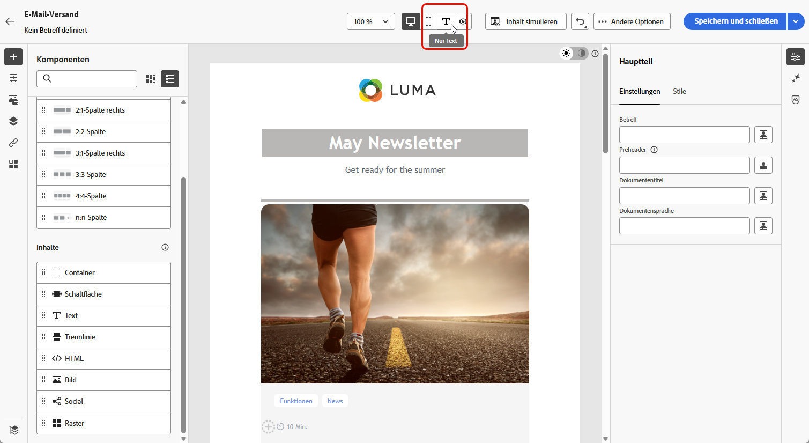
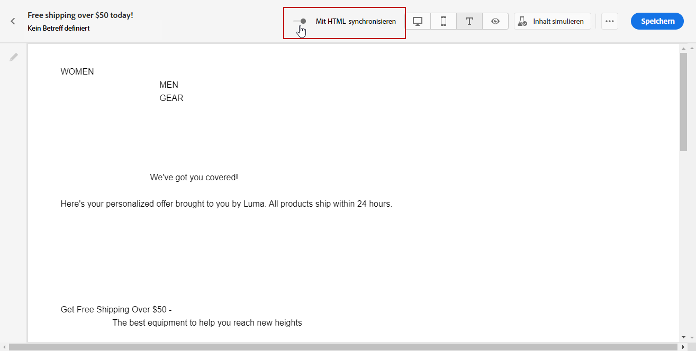
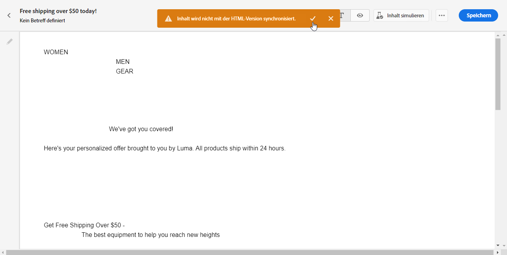

# Erstellen der Textversion einer E-Mail {#text-version-email}

Es wird empfohlen, eine Textversion Ihres E-Mail-Textkörpers zu erstellen, die verwendet wird, wenn keine HTML-Inhalte angezeigt werden können.

E-Mail-Designer erstellt standardmäßig eine **[!UICONTROL Text]**-Version Ihrer E-Mail, einschließlich Personalisierungsfeldern. Diese Version wird automatisch erzeugt und mit der HTML-Version Ihres Inhalts synchronisiert.

Wenn Sie lieber einen anderen Inhalt für die Textversion verwenden möchten, führen Sie die folgenden Schritte aus:

1. Wählen Sie in Ihrer E-Mail die Registerkarte **[!UICONTROL Text]**.

   

1. Verwenden Sie den Umschalter **[!UICONTROL Mit HTML synchronisieren]**, um die Synchronisierung zu deaktivieren.

   

1. Klicken Sie auf das Häkchen, um Ihre Auswahl zu bestätigen.

   

1. Sie können die Textversion dann nach Belieben bearbeiten.

>[!CAUTION]
>
>* Die Änderungen, die Sie in der **[!UICONTROL Text]**-Ansicht vorgenommen haben, werden in der HTML-Ansicht nicht dargestellt.
>
>* Wenn Sie die Option **[!UICONTROL Mit HTML synchronisieren]** nach der Aktualisierung Ihres Plain-Text-Inhalts wieder aktivieren, gehen Ihre Änderungen verloren und werden durch Textinhalte ersetzt, die von der HTML-Version generiert wurden.
