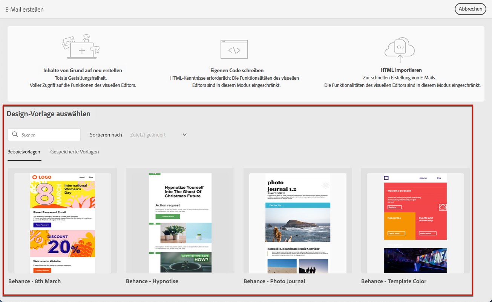
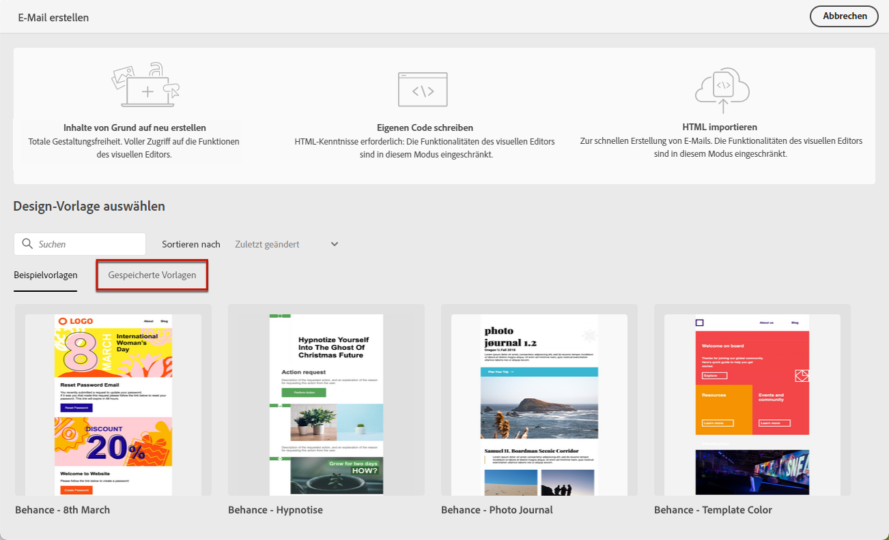
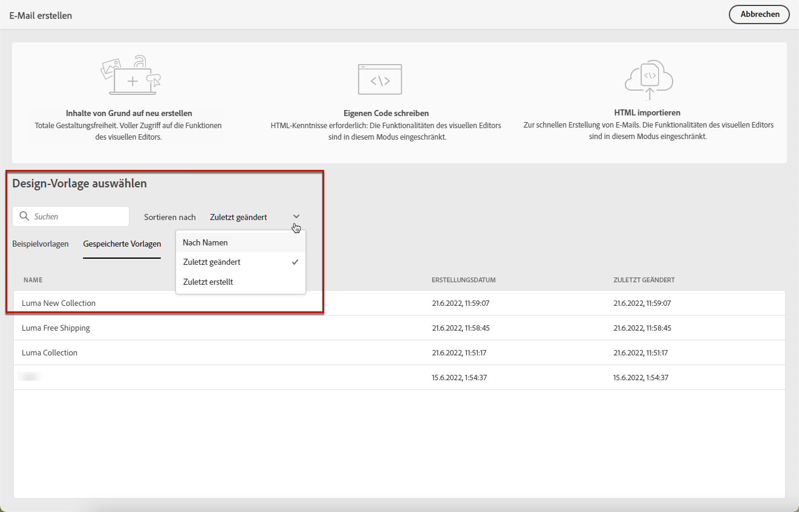
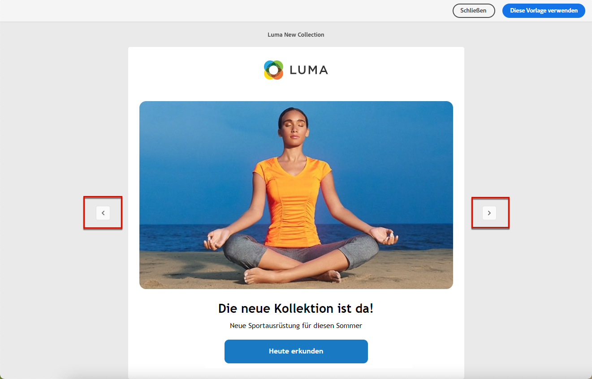

# Verwenden von E-Mail-Inhaltsvorlagen {#use-email-templates}

Wenn Sie [eine E-Mail erstellen](../email/create-email.md), verwenden Sie den Abschnitt **[!UICONTROL Design-Vorlage auswählen]** der Schnittstelle **[!UICONTROL E-Mail erstellen]**, um Ihren Inhalt anhand einer Vorlage zu erstellen.

{zoomable="yes"}

Sie können aus folgenden Optionen wählen:

* **Beispielvorlagen**. Campaign verfügt über eine Reihe integrierter Vorlagen, aus denen Sie auswählen können.

* **Gespeicherte Vorlagen**. Sie können auch eine benutzerdefinierte Vorlage verwenden, die Sie von einem vorhandenen Inhalt aus als Vorlage gespeichert haben.

In den folgenden Abschnitten erfahren Sie, wie Sie Vorlagen verwenden und E-Mail-Inhalte als Vorlage speichern können.

>[!NOTE]
>
>E-Mail-Inhaltsvorlagen unterscheiden sich von [Versandvorlagen](../msg/delivery-template.md). Sie ermöglichen ausschließlich die Wiederverwendung von E-Mail-Inhalten, während Versandvorlagen die Wiederverwendung von Versandinhalten, aber auch von allen Versandeinstellungen und Eigenschaften wie Typologien, Absenderadressen und Zielgruppen ermöglichen.

Gehen Sie wie folgt vor, um mit der Erstellung Ihres Inhalts mit einer der Beispielvorlagen oder gespeicherten Vorlagen zu beginnen.

1. Öffnen Sie den [E-Mail-Designer](create-email-content.md).

1. Auf dem Bildschirm **[!UICONTROL E-Mail erstellen]** ist die Registerkarte **[!UICONTROL Beispielvorlagen]** standardmäßig ausgewählt.

1. Um eine vorhandene benutzerdefinierte Vorlage zu verwenden, navigieren Sie zur Registerkarte **[!UICONTROL Gespeicherte Vorlagen]**.

   {zoomable="yes"}

1. Die Liste aller [gespeicherten Vorlagen](#save-as-template) wird angezeigt. Sie können sie **[!UICONTROL Nach Name]**, nach **[!UICONTROL Zuletzt geändert]** und nach **[!UICONTROL Zuletzt erstellt]** sortieren.

   {zoomable="yes"}

1. Wählen Sie eine Vorlage aus der Liste aus, um den Inhalt anzuzeigen.

1. Verwenden Sie die Rechts- und Linkspfeile, um zwischen den Vorlagen (Beispiel oder gespeichert, abhängig von Ihrer Auswahl) zu navigieren.

   {zoomable="yes"}

1. Klicken Sie oben rechts auf dem Bildschirm auf **[!UICONTROL Diese Vorlage verwenden]**.

1. Bearbeiten Sie Ihren Inhalt wie gewünscht mit dem E-Mail-Designer. [Weitere Informationen](create-email-content.md)