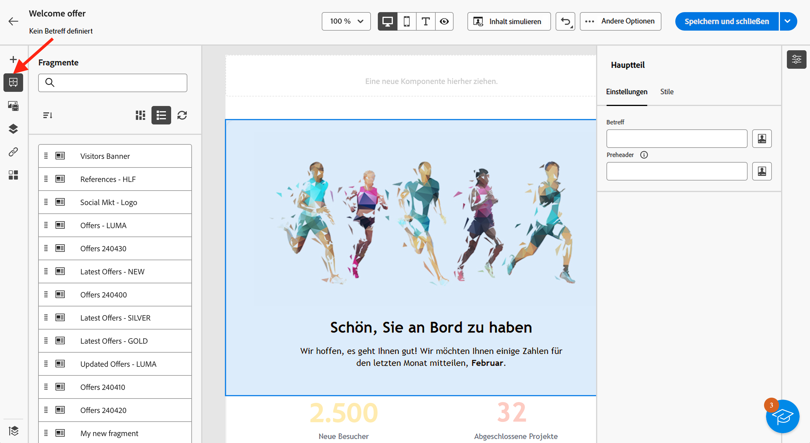
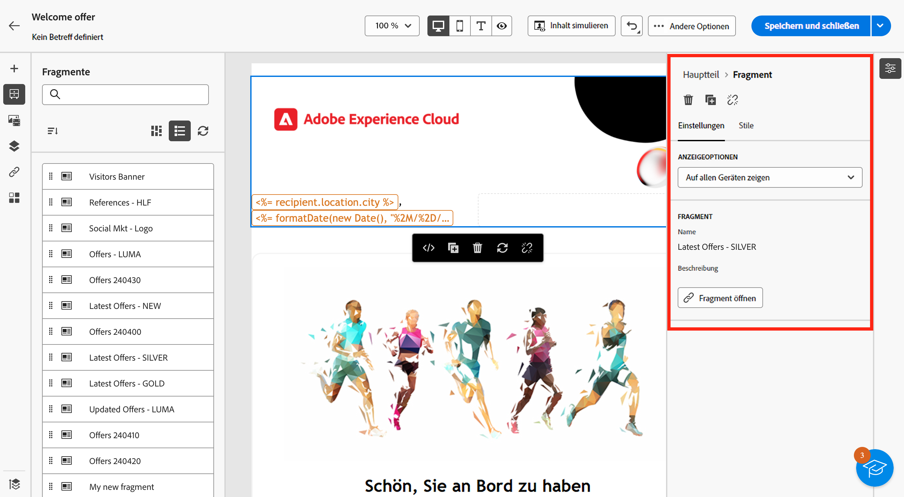
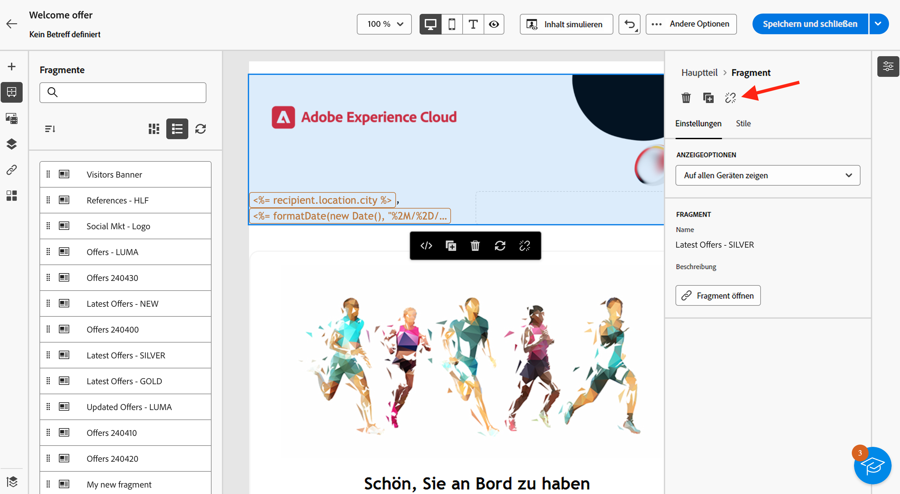

# Hinzufügen visueller Fragmente zu E-Mails {#use-visual-fragments}

Sie können ein visuelles Fragment in einem [E-Mail-Versand](get-started-email-designer.md) oder in einer [Inhaltsvorlage](use-email-templates.md) verwenden. Die einzelnen Schritte werden nachfolgend beschrieben. Weitere Informationen zur Erstellung und Verwaltung von Fragmenten finden Sie in [diesem Abschnitt](fragments.md).

>[!AVAILABILITY]
>
>Diese Funktion ist nur eingeschränkt verfügbar. Sie ist Kundinnen und Kunden vorbehalten, die **von Adobe Campaign Standard zu Adobe Campaign v8** migrieren, und kann nicht in anderen Umgebungen bereitgestellt werden.

## Verwenden eines Fragments {#use-fragment}

Gehen Sie wie folgt vor, um ein Fragment in einen E-Mail-Inhalt einzufügen:

1. Öffnen Sie eine E-Mail oder eine Inhaltsvorlage mit [E-Mail-Designer](get-started-email-designer.md).

1. Wählen Sie in der linken Leiste das Symbol **[!UICONTROL Fragmente]** aus.

   

1. Es wird eine Liste mit allen in der aktuellen Sandbox erstellten visuellen Fragmente angezeigt. Sie haben folgende Möglichkeiten:

   * Suchen Sie nach einem bestimmten Fragment, indem Sie mit der Eingabe seines Titels beginnen.
   * Sortieren Sie Fragmente in auf- oder absteigender Reihenfolge.
   * Ändern Sie die Anzeige der Fragmente (Karten- oder Listenansicht).

   >[!NOTE]
   >
   >Fragmente werden nach ihrem Erstellungsdatum sortiert: Zuletzt hinzugefügte visuelle Fragmente werden in der Liste zuerst aufgeführt.

   Wenn einige Fragmente geändert oder hinzugefügt wurden, während Sie Ihre Inhalte bearbeiten, klicken Sie auf das Symbol **Aktualisieren**, um die Liste mit den neuesten Änderungen zu aktualisieren.

1. Ziehen Sie ein beliebiges Fragment aus der Liste in den Bereich, in den es eingefügt werden soll. Wie jede andere Komponente können Sie das Fragment innerhalb Ihres Inhalts verschieben.

1. Wählen Sie das Fragment aus, um die zugehörigen Optionen im rechten Bereich anzuzeigen.

   

   Auf der Registerkarten **[!UICONTROL Einstellungen]** haben Sie folgende Möglichkeiten:

   * Wählen Sie die Geräte aus, auf denen das Fragment angezeigt werden soll.
   * Klicken Sie auf die Schaltfläche **Inhalt bearbeiten**, um den Inhalt dieses Fragments zu öffnen. [Weitere Informationen](../email/fragments.md#edit-fragments)

     Sie können Ihr Fragment mit der Registerkarte **[!UICONTROL Stile]** weiter anpassen.

1. Bei Bedarf können Sie die Vererbung mit dem ursprünglichen Fragment unterbrechen. [Weitere Informationen](#break-inheritance)
Sie können das Fragment auch aus dem Inhalt löschen oder duplizieren. Diese Aktionen können direkt über das Kontextmenü ausgeführt werden, das über dem Fragment angezeigt wird.

1. Fügen Sie beliebig viele Fragmente hinzu und **[!UICONTROL speichern]** Sie Ihre Änderungen.

## Unterbrechen der Vererbung {#break-inheritance}

Wenn Sie ein visuelles Fragment bearbeiten, werden die Änderungen synchronisiert. Sie werden automatisch in alle E-Mail-Sendungen und Inhaltsvorlagen übernommen, die dieses Fragment enthalten.

Wenn Fragmente zu einer E-Mail oder einer Inhaltsvorlage hinzugefügt werden, werden sie standardmäßig synchronisiert.

Sie können jedoch die Vererbung vom ursprünglichen Fragment unterbrechen. In diesem Fall wird der Inhalt des Fragments in den aktuellen Entwurf kopiert und die Änderungen werden nicht mehr synchronisiert.

Gehen Sie wie folgt vor, um die Vererbung zu unterbrechen:

1. Wählen Sie das Fragment aus.

1. Klicken Sie in der kontextbezogene Symbolleiste auf das Entsperrsymbol.

   

1. Dieses Fragment wird dann zu einem eigenständigen Element, die nicht mehr mit dem ursprünglichen Fragment verknüpft ist. Bearbeiten Sie es wie jede andere Inhaltskomponente in Ihrem Inhalt. [Weitere Informationen](content-components.md)
