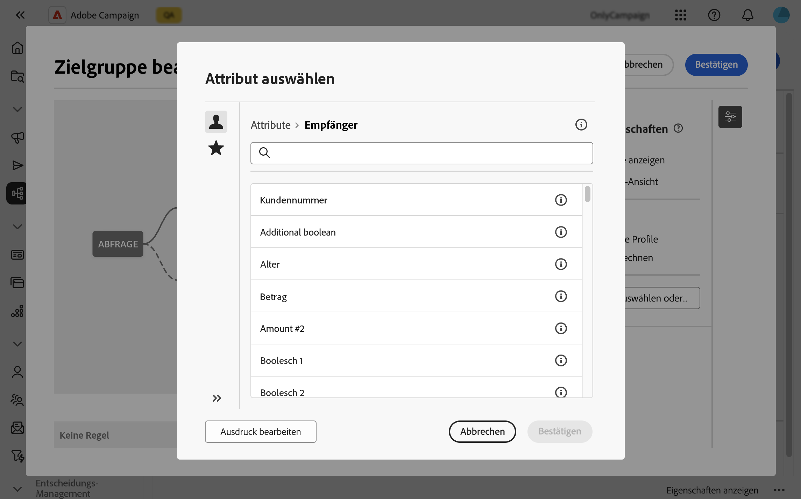
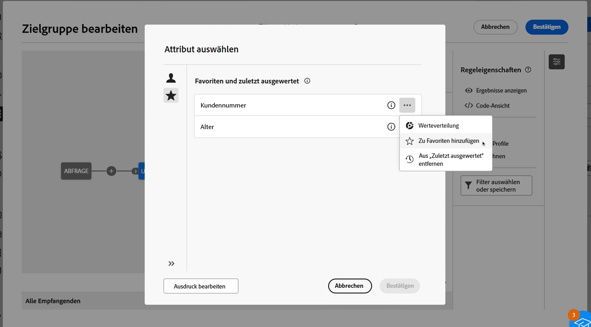
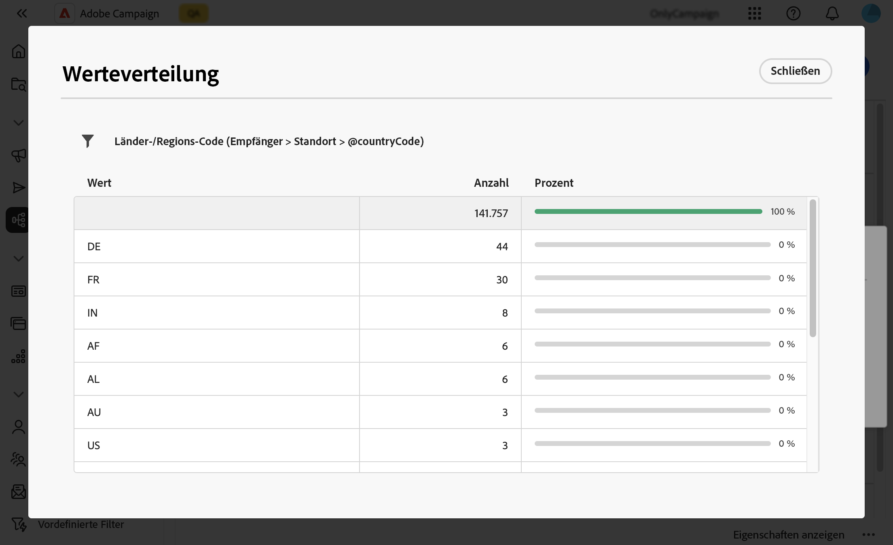

# Auswählen von Attributen und Hinzufügen dieser Auswahl zu Favoriten {#folders}

In der Campaign Web-Benutzeroberfläche können Benutzende abhängig von der durchgeführten Aktion Attribute aus der Datenbank an verschiedenen Stellen auswählen. Beispielsweise können Attribute ausgewählt werden, wenn Ausgabespalten für einen Direkt-Mail-Versand oder eine zu extrahierende Datei definiert werden. Ebenso können Attribute ausgewählt werden, wenn der Abfrage-Modeler zum Erstellen von Regeln, Filtern oder Zielgruppen verwendet wird.

Um häufig verwendete Attribute schnell wiederzuverwenden, können Sie sie als Favoriten hinzufügen. Dadurch wird sichergestellt, dass sie für zukünftige Aufgaben problemlos zugänglich sind. Zusätzlich zu den Favoriten können Benutzende auch die zuletzt ausgewählten Attribute anzeigen und verwenden.

Die Oberfläche bietet außerdem das Tool „Werteverteilung“, mit dem Sie die Verteilung der Attributwerte in einer Tabelle visualisieren können. Mit diesem Tool können der Bereich und die Häufigkeit von Werten bestimmt und so Datenkonsistenz beim Erstellen von Abfragen oder Ausdrücken sichergestellt werden.

## Favoriten und zuletzt verwendete Attribute {#favorites}

>[!CONTEXTUALHELP]
>id="acw_attribute_picker_favorites_recents"
>title="Favoriten und zuletzt ausgewertet"
>abstract="Das Menü **[!UICONTROL Favoriten und zuletzt ausgewertet]** in der Attributauswahl bietet eine organisierte Ansicht von Attributen, die Sie den Favoriten hinzugefügt haben, sowie eine Liste der zuletzt verwendeten Attribute. Bevorzugte Attribute werden zuerst angezeigt, gefolgt von den zuletzt verwendeten Attributen, sodass Sie die benötigten Attribute leicht finden können."

Das Menü **[!UICONTROL Favoriten und zuletzt ausgewertet]** in der Attributauswahl bietet eine organisierte Ansicht der Attribute, die den Favoriten hinzugefügt wurden, sowie eine Liste der zuletzt verwendeten Attribute. Bevorzugte Attribute werden zuerst angezeigt, gefolgt von den zuletzt verwendeten Attributen, sodass die benötigten Attribute leicht gefunden werden können.

Um ein Attribut zu den Favoriten hinzuzufügen, klicken Sie auf die Schaltfläche „Erweitern“ und wählen Sie **[!UICONTROL Zu Favoriten hinzufügen]** aus. Das Attribut wird dann automatisch zur Favoritenliste hinzugefügt. Um ein Attribut aus den Favoriten zu entfernen, klicken Sie erneut auf das Sternsymbol.

Benutzende können bis zu 20 Attribute zu den Favoriten hinzufügen. Allen Benutzenden in einer Organisation werden bevorzugte und zuletzt verwendete Attribute zugeordnet, um die Zugänglichkeit auf verschiedenen Computern und ein nahtloses Erlebnis auf allen Geräten sicherzustellen.

## Bestimmen der Werteverteilung in einer Tabelle {#distribution}

Mit der Schaltfläche **Werteverteilung**, die durch Klicken auf die Schaltfläche „Erweitern“ neben dem Attribut aufgerufen werden kann, können Benutzende die Werteverteilung für dieses Attribut innerhalb der Tabelle analysieren. Diese Funktion ist nützlich, um die verfügbaren Werte, ihre Anzahl und Prozentsätze zu verstehen. Außerdem lassen sich Probleme wie inkonsistente Groß- und Kleinschreibung oder Schreibweisen beim Erstellen von Abfragen oder Ausdrücken vermeiden.

Bei Attributen mit einer großen Anzahl von Werten zeigt das Tool nur die ersten zwanzig an. In solchen Fällen wird die Benachrichtigung **[!UICONTROL Teilweise geladen]** angezeigt, um auf diese Einschränkung hinzuweisen. Wenden Sie erweiterte Filter an, um die angezeigten Ergebnisse einzugrenzen und sich auf bestimmte Werte oder Teilmengen von Daten zu konzentrieren. Ausführliche Anleitungen zur Verwendung von Filtern finden Sie [hier](../get-started/work-with-folders.md#filter-the-values).

Weitere Informationen zur Verwendung des Tools „Werteverteilung“ in verschiedenen Kontexten finden Sie in den folgenden Abschnitten:

* [Werteverteilung in einem Ordner](../get-started/work-with-folders.md##distribution-values-folder)
* [Werteverteilung in einer Abfrage](../query/build-query.md#distribution-values-query)