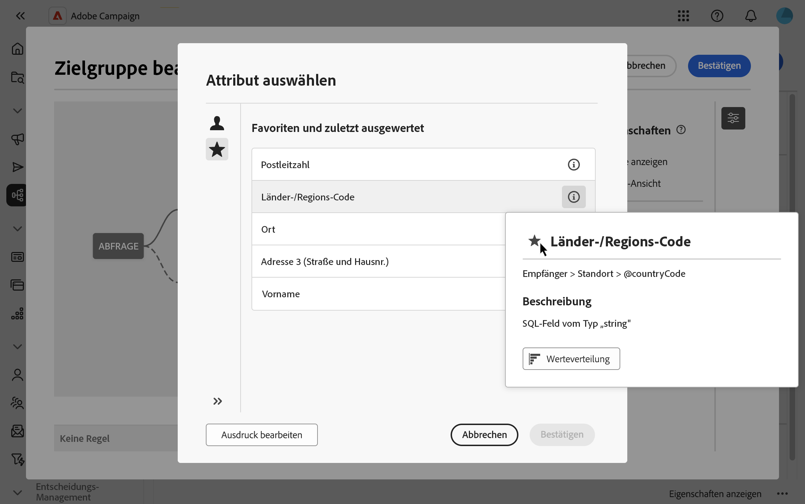

# Attribute auswählen und zu Favoriten hinzufügen {#folders}

In der Web-Benutzeroberfläche von Campaign können Sie je nach der gewünschten Aktion Attribute aus der Datenbank an verschiedenen Stellen auswählen. Sie können beispielsweise Attribute auswählen, wenn Sie Ausgabespalten für einen Briefpost-Versand oder eine zu extrahierende Datei definieren. Ebenso können Attribute ausgewählt werden, wenn der Abfrage-Modellierer zum Erstellen von Regeln, Filtern oder Audiences verwendet wird.

Um häufig verwendete Attribute schnell wiederzuverwenden, können Sie sie zu Favoriten hinzufügen. Dadurch wird sichergestellt, dass sie für zukünftige Aufgaben problemlos zugänglich sind. Zusätzlich zu den Favoriten können Sie auch die zuletzt ausgewählten Attribute anzeigen und verwenden.

Die Schnittstelle bietet außerdem ein Tool für die Werteverteilung , mit dem Sie die Verteilung der Attributwerte in einer Tabelle visualisieren können. Mit diesem Tool können Sie den Bereich und die Häufigkeit von Werten identifizieren und so die Datenkonsistenz beim Erstellen von Abfragen oder Ausdrücken sicherstellen.

## Favoriten und aktuelle Attribute {#favorites}

>[!CONTEXTUALHELP]
>id="acw_attribute_picker_favorites_recents"
>title="Favoriten und zuletzt ausgewertet"
>abstract="Das Menü **[!UICONTROL Favoriten und Zuletzt verwendet]** in der Attributauswahl bietet eine organisierte Ansicht von Attributen, die Sie den Favoriten hinzugefügt haben, sowie eine Liste der zuletzt verwendeten Attribute. Favoritenattribute werden zuerst angezeigt, gefolgt von kürzlich verwendeten Attributen, sodass Sie die benötigten Attribute leicht finden können."

Das Menü **[!UICONTROL Favoriten und Zuletzt verwendet]** in der Attributauswahl bietet eine organisierte Ansicht von Attributen, die Sie den Favoriten hinzugefügt haben, sowie eine Liste der zuletzt verwendeten Attribute. Favoritenattribute werden zuerst angezeigt, gefolgt von kürzlich verwendeten Attributen, sodass Sie die benötigten Attribute leicht finden können.

Um ein Attribut zu den Favoriten hinzuzufügen, bewegen Sie den Mauszeiger über die Informationsschaltfläche und wählen Sie das Sternsymbol aus. Das Attribut wird dann automatisch zu Ihrer Favoritenliste hinzugefügt. Wenn Sie ein Attribut nicht mehr als Favorit beibehalten möchten, können Sie es entfernen, indem Sie erneut auf das Sternsymbol klicken.

Sie können bis zu 20 Attribute zu Favoriten hinzufügen. Jedem Benutzer in einer Organisation sind die Attribute „Favorit“ und „Zuletzt verwendet“ zugeordnet. Das bedeutet, dass sie von verschiedenen Computern aus zugänglich sind, was ein nahtloses Erlebnis auf allen Geräten gewährleistet.

## Identifizieren der Werteverteilung in einer Tabelle {#distribution}

Mit **Schaltfläche „Werteverteilung** im Informationsbereich eines Attributs können Sie die Werteverteilung für dieses Attribut innerhalb der Tabelle analysieren. Diese Funktion ist besonders hilfreich, um die verfügbaren Werte, ihre Anzahl und Prozentsätze zu verstehen. Außerdem lassen sich Probleme wie inkonsistente Groß- und Kleinschreibung beim Erstellen von Abfragen oder Ausdrücken vermeiden.

Bei Attributen mit einer großen Anzahl von Werten zeigt das Tool nur die ersten zwanzig an. In solchen Fällen wird eine **[!UICONTROL Partial Load]**-Benachrichtigung angezeigt, die auf diese Einschränkung hinweist. Sie können erweiterte Filter anwenden, um die angezeigten Ergebnisse zu verfeinern und sich auf bestimmte Werte oder Teilmengen von Daten zu konzentrieren. Ausführliche Anleitungen zur Verwendung von Filtern finden Sie [hier](../get-started/work-with-folders.md#filter-the-values).

Weitere Informationen zur Verwendung des Tools Werteverteilung in verschiedenen Kontexten finden Sie in den folgenden Abschnitten:

- [Werteverteilung in einem Ordner](../get-started/work-with-folders.md##distribution-values-folder)
- [Werteverteilung in einer Abfrage](../query/build-query.md#distribution-values-query)
