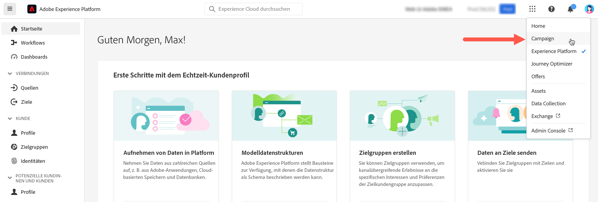

# Herstellen einer Verbindung zu Adobe Campaign {#connect-to-campaign}

Experience Cloud ist die integrierte Familie von Anwendungen, Produkten und Diensten von Adobe für das digitale Marketing. Über die intuitive Benutzeroberfläche können Sie schnell auf Ihre Cloud-Anwendungen, Produktfunktionen und Dienste zugreifen. Auf dieser Seite erfahren Sie, wie Sie eine Verbindung mit Adobe Experience Cloud herstellen und auf die Benutzeroberfläche von Adobe Campaign Web zugreifen.

## Anmeldung bei Adobe Experience Cloud {#sign-in-to-exc}

Sie können nur Single Sign-on (SSO) verwenden, um eine Verbindung zu Campaign herzustellen. Normalerweise gewähren die Admins von Experience Cloud Zugriff auf Anwendungen und Dienste. Führen Sie die Schritte in der per E-Mail gesendeten Einladung zur Experience Cloud aus.

Die Anmeldung bei Adobe Experience Cloud erfolgt anhand der folgenden einfachen Schritte:

1. Navigieren Sie zu [Adobe Experience Cloud](https://experience.adobe.com/){target="_blank"}.

1. Melden Sie sich mit Ihrer Adobe ID oder Enterprise ID an. Weitere Informationen zu Identitätstypen bei Adobe finden Sie in [diesem Artikel](https://helpx.adobe.com/de/enterprise/using/identity.html){target="_blank"}.

   Nach der Anmeldung bei Experience Cloud können Sie schnell auf alle Ihre Lösungen und Apps zugreifen.

   {zoomable="yes"}

1. Stellen Sie sicher, dass Sie sich in der richtigen Organisation befinden.

   {zoomable="yes"}{width="50%" align="left"}

   Erfahren Sie mehr über Organisationen in Adobe Experience Cloud in [diesem Artikel](https://experienceleague.adobe.com/docs/core-services/interface/administration/organizations.html?lang=de){target="_blank"}.

## Zugriff auf Adobe Campaign {#access-to-campaign}

Um auf Ihre Campaign-Umgebung zuzugreifen, wählen Sie **Campaign** aus dem Bereich **Schnellzugriff** auf der Adobe Experience Cloud-Startseite aus.

Wenn Sie bereits mit einer anderen Adobe Experience Cloud-Lösung verbunden sind, können Sie über den Lösungsumschalter oben rechts auf Ihrem Bildschirm zu Ihrer Campaign-Umgebung navigieren.

{zoomable="yes"}

Wenn Sie Zugriff auf mehrere Umgebungen haben, einschließlich des Control Panels für Campaign, klicken Sie auf den **Launch**-Button für die richtige Instanz.

{zoomable="yes"}

Sie sind jetzt mit Campaign verbunden. Auf [dieser Seite](user-interface.md) erfahren Sie, wie Sie die Benutzeroberfläche verwenden.

### Zugriffskontrolle {#access-control}

>[!CONTEXTUALHELP]
>id="acw_explorer_permissions_create"
>title="Berechtigung erforderlich"
>abstract="Ihre Admins müssen Ihnen die Berechtigung erteilen, bevor Sie ein Segment erstellen können."

>[!CONTEXTUALHELP]
>id="acw_audiences_read_only"
>title="Diese Zielgruppe ist schreibgeschützt"
>abstract="Sie haben keine Berechtigungen, diese Zielgruppe zu bearbeiten. Bei Bedarf Admin kontaktieren, um Zugriff zu erhalten."

>[!CONTEXTUALHELP]
>id="acw_subscription_services_read_only"
>title="Dieser Service ist schreibgeschützt"
>abstract="Keine Berechtigung, diesen Service zu bearbeiten. Bei Bedarf Admin kontaktieren, um Zugriff zu erhalten."

>[!CONTEXTUALHELP]
>id="acw_recipients_readonlyprofile"
>title="Empfangende – Schreibgeschütztes Profil"
>abstract="Keine Berechtigung, dieses Profil zu bearbeiten. Bei Bedarf Admin kontaktieren, um Zugriff zu erhalten."

>[!CONTEXTUALHELP]
>id="acw_campaign_read_only"
>title="Diese Kampagne ist schreibgeschützt"
>abstract="Keine Berechtigung, diese Kampagne zu bearbeiten. Bei Bedarf Admin kontaktieren, um Zugriff zu erhalten."

>[!CONTEXTUALHELP]
>id="acw_deliveries_read_only"
>title="Dieser Versand ist schreibgeschützt"
>abstract="Keine Berechtigung, diesen Versand zu bearbeiten. Bei Bedarf Admin kontaktieren, um Zugriff zu erhalten."

>[!CONTEXTUALHELP]
>id="acw_wf_read_only"
>title="Dieser Workflow ist schreibgeschützt"
>abstract="Keine Berechtigung, diesen Workflow zu bearbeiten. Bei Bedarf Admin kontaktieren, um Zugriff zu erhalten."

Die Zugriffskontrolle kann den Zugriff auf Objekte und Daten aus Hauptlisten, wie Sendungen, Empfängerinnen bzw. Empfänger oder Workflows, einschränken. Diese Einschränkungen gelten auch für die Navigationsstruktur des Explorers. Darüber hinaus benötigen Sie Berechtigungen zum Erstellen, Löschen, Duplizieren und Bearbeiten von Objekten über die Benutzeroberfläche.

Alle Berechtigungen in Campaign Web werden mit den Berechtigungen der Campaign-Client-Konsole synchronisiert. Nur Campaign-Administratoren können Benutzerberechtigungen definieren und ändern.

Wenn Sie die Benutzeroberfläche von Campaign Web durchsuchen, können Sie abhängig von Ihren Berechtigungen auf Daten, Objekte und Funktionen zugreifen. Wenn Sie beispielsweise keine Zugriffsberechtigungen für einen Ordner haben, können Sie ihn nicht sehen. Ihre Berechtigungen wirken sich auch auf die Objekte- und Datenverwaltung aus. Ohne Schreibberechtigungen für einen bestimmten Ordner können Sie einen Versand nicht in diesem Ordner erstellen, selbst wenn er in der Benutzeroberfläche angezeigt wird.

Sie können erfahren, wie Sie hier ](permissions.md) Berechtigungen anzeigen und verwalten.[

## Obere Navigationsleiste in Adobe Experience Cloud {#top-bar}

Verwenden Sie die obere Leiste der Benutzeroberfläche, um folgende Aktionen durchzuführen:

* Geben von Feedback zur Campaign Web-Benutzeroberfläche
* Wechseln zwischen Ihren Organisationen
* Wechseln zwischen Ihren Adobe Experience Cloud-Lösungen und -Apps
* nach Hilfe zu [Adobe Experience League](https://experienceleague.adobe.com/docs/?lang=de){target="_blank"} suchen
* Produktbenachrichtigungen überprüfen
* Ihr Adobe-Profil bearbeiten und Einstellungen verwalten wie [Ihre Lieblingssprache aktualisieren](#language-pref) oder [Umschalten zwischen hellem/dunklem Design](#dark-theme)

{zoomable="yes"}{width="50%" align="left"}

## Unterstützte Browser {#browsers}

Adobe Campaign Web ist so konzipiert, dass es mit den neuesten Versionen von Google Chrome, Safari und Microsoft Edge optimal funktioniert. Bei der Verwendung bestimmter Funktionen in älteren Versionen oder anderen Browsern können Probleme auftreten.

## Sprachvoreinstellungen {#language-pref}

Adobe Campaign Web ist derzeit in den folgenden Sprachen verfügbar:

* Englisch (US) – EN-US
* Französisch – FR
* Deutsch – DE
* Italienisch – IT
* Spanisch – ES
* Portugiesisch (Brasilianisch) – PTBR
* Japanisch – JP
* Koreanisch – KR
* Vereinfachtes Chinesisch – CHS
* Traditionelles Chinesisch – CHT

Die Standardsprache von Campaign Web wird durch die in Ihrem Benutzerprofil angegebene bevorzugte Sprache bestimmt. Sie ist unabhängig von der Sprache Ihres Campaign-Servers und Ihrer Client-Konsole.

So ändern Sie Ihre Sprache:

1. Klicken Sie auf das Profilsymbol oben rechts und wählen Sie dann **Voreinstellungen**.
1. Klicken Sie dann auf den Sprach-Link, der unter Ihrer E-Mail-Adresse angezeigt wird.
1. Wählen Sie Ihre bevorzugte Sprache aus und klicken Sie auf **Speichern**. Sie können eine zweite Sprache auswählen, falls die von Ihnen verwendete Komponente nicht in Ihrer gewählten Sprache lokalisiert ist.

<!--
>[!CAUTION]
>
>If you plan to use [AI-powered contextual help](using-ai.md) capabilities, you must set your prefered language to English. Other languages are not supported.
>
-->

## Dunkles und helles Design {#dark-theme}

Adobe Campaign ist in hellem und dunklem Design verfügbar. Standardmäßig ist die Benutzeroberfläche im hellen Design aktiviert. Um zum dunklen Design zu wechseln, klicken Sie auf das Profilsymbol und verwenden Sie die Option **Dunkles Design**, um es zu aktivieren/deaktivieren.

Benutzerprofileinstellungen und Kontovoreinstellungen werden in [diesem Abschnitt](https://experienceleague.adobe.com/docs/core-services/interface/experience-cloud.html?lang=de#preferences){target="_blank"} genauer beschrieben.

Weitere Informationen zu den zentralen Benutzeroberflächen-Komponenten in Experience Cloud finden Sie in [dieser Dokumentation](https://experienceleague.adobe.com/docs/core-services/interface/experience-cloud.html?lang=de){target="_blank"}.
