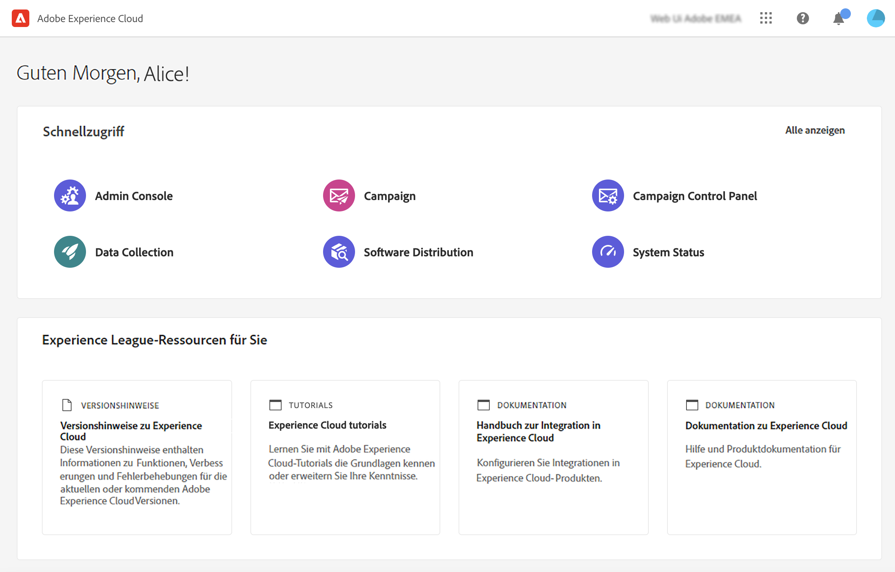

# Erste Schritte mit Campaign v8 Web {#get-started}

<!--
V8 web overview
context, scope (targets cross-channel practitioners), limitations
only existing customers
-->
>[!CONTEXTUALHELP]
>id="acw_homepage_card1"
>title="Erste Schritte"
>abstract="Entdecken Sie wichtige Funktionen, die Benutzeroberfläche und globale Richtlinien."

>[!NOTE]
>
>Campaign v8 Web befindet sich derzeit in der Alpha-Version. Der Zugriff ist auf eine kleine Gruppe von Alpha-Kunden beschränkt. Beachten Sie, dass sich die Produktoberfläche, die Funktionen und die Nutzungsabläufe ohne Vorankündigung ändern können.

Adobe Campaign bietet eine Plattform für die Gestaltung kanalübergreifender Kundenerlebnisse und eine Umgebung für die visuelle Kampagnenorchestrierung, die Verwaltung von Interaktionen in Echtzeit und die kanalübergreifende Ausführung.

Ursprünglich nur über einen Rich verfügbar [Clientkonsole](#ac-client)bietet Campaign jetzt eine neue Web-Benutzeroberfläche mit verbesserter Benutzerfreundlichkeit, Barrierefreiheit und einem neuen Design, um Ihr Benutzererlebnis erheblich zu verbessern. Diese neue, moderne Benutzeroberfläche vereinfacht das Design und die Bereitstellung von Marketingkampagnen und sorgt für Konsistenz mit anderen Adobe-Lösungen, einschließlich Adobe Experience Platform.

Diese neue Benutzeroberfläche erfüllt zunächst die Anforderungen des **Geschäftspraktiker** - Alle typischen Verwaltungsaufgaben sind in dieser ersten Version nicht verfügbar, werden aber in nachfolgenden Versionen behandelt. Beachten Sie, dass in der neuen Benutzeroberfläche derzeit nicht alle in der Clientkonsole verfügbaren Funktionen und Optionen verfügbar sind. In zukünftigen Versionen werden neue Anwendungsfälle, Optionen und Funktionen verfügbar sein.

Wenn Sie auf die Campaign v8-Funktionen zugreifen müssen, die nicht in der Web-Benutzeroberfläche verfügbar sind, können Sie die [Clientkonsole](#ac-client).

## Über die Campaign-Clientkonsole{#ac-client}

Die Campaign-Clientkonsole ist eine browserbasierte Anwendung, die auf Ihrem System installiert ist. Es verwendet die Web-Services-API, um eine Verbindung zu Ihrem Campaign-Anwendungsserver herzustellen.

Erfahren Sie, wie Sie die Clientkonsole herunterladen und installieren in [diesem Abschnitt](https://experienceleague.adobe.com/docs/campaign/campaign-v8/new/connect.html){target="_blank"}.

Weitere Informationen zur Verwendung von Campaign v8 finden Sie in der [Dokumentation](https://experienceleague.adobe.com/docs/campaign/campaign-v8/campaign-home.html?lang=de){target="_blank"}.

Kampagnendaten werden auf dem Anwendungsserver gespeichert. Daten sind sowohl in der Client-Konsole als auch in der Web-Benutzeroberfläche verfügbar. Wenn Sie beispielsweise eine Versandvorlage mit der Clientkonsole erstellen, ist sie auch in der Web-Benutzeroberfläche verfügbar. Wenn Sie einen E-Mail-Versand in der Web-Benutzeroberfläche erstellen, kann dieser Versand auch über die Client-Konsole aufgerufen werden.

## Herstellen einer Verbindung zu Campaign

1. Verbinden mit [Adobe Experience Cloud](http://experience.adobe.com){target="_blank"}.
1. Melden Sie sich mit Ihren Adobe-Anmeldedaten an.
1. Klicken Sie im Abschnitt **Schnellzugriff** auf **Campaign**.
   

1. Klicken Sie auf der nächsten Seite auf die **Launch** Schaltfläche Ihrer Campaign-Instanz.
Sie sind jetzt mit Campaign verbunden. Erfahren Sie, wie Sie mit der Verwendung der Benutzeroberfläche in [diese Seite](user-interface.md).

<!--
-> experience cloud home: "Campaign" -> home campaign v8
-> or Campaign v8 web if direct URL
-->

