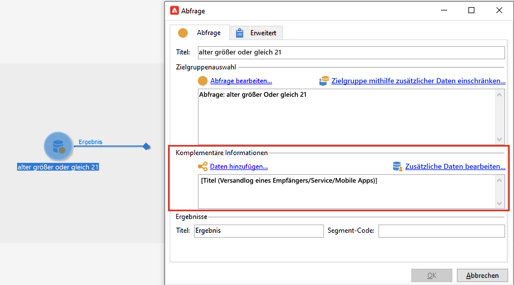

# Limits und Einschränkungen {#guardrails-limitations}

Bei der Arbeit mit in der Campaign-Webbenutzeroberfläche erstellten oder geänderten Komponenten in der Campaign-Clientkonsole gelten die unten aufgeführten Limits und Einschränkungen.

## Workflows {#wf-guardrails-limitations}

### Aktivitäten

Workflow-Aktivitäten, die noch nicht in der Web-Benutzeroberfläche unterstützt werden, sind schreibgeschützt und werden als inkompatible Aktivitäten angezeigt. Sie können weiterhin den Workflow ausführen, Nachrichten senden, die Protokolle überprüfen usw. Workflow-Aktivitäten, die sowohl in der Web-Benutzeroberfläche als auch in der Client-Konsole verfügbar sind, können bearbeitet werden.

| Konsole | Web-Benutzeroberfläche |
| --- | --- |
| {width="800px" align="left" zoomable="yes"} | {width="800px" align="left" zoomable="yes"} |

Workflow-Aktivitätseinstellungen, die noch nicht in der Web-Benutzeroberfläche unterstützt werden, werden nicht angezeigt. Wenn der Workflow jedoch ausgeführt wird, gelten diese Einstellungen.

| Konsole | Web-Benutzeroberfläche |
| --- | --- |
| {width="800px" align="left" zoomable="yes"} | {width="800px" align="left" zoomable="yes"} |

In der Konsole wird die **Anreicherung** -Aktivität kann sowohl Abstimmung als auch Anreicherung durchführen. In der Web-Benutzeroberfläche sind die Abstimmungsfunktionen noch nicht verfügbar. Wenn Sie in der Konsole Abstimmeinstellungen im **Anreicherung** -Aktivität, wird sie in der Web-Benutzeroberfläche als nicht kompatible schreibgeschützte Aktivität angezeigt.

| Konsole | Web-Benutzeroberfläche |
| --- | --- |
| {width="800px" align="left" zoomable="yes"} | {width="800px" align="left" zoomable="yes"} |

### Arbeitsfläche

Beim Erstellen eines neuen Workflows in der Web-Benutzeroberfläche unterstützt die Arbeitsfläche nur einen Einstiegspunkt. Wenn Sie jedoch einen Workflow in der Konsole mit mehreren Einstiegspunkten erstellt haben, können Sie ihn in der Web-Benutzeroberfläche öffnen und bearbeiten.

| Konsole | Web-Benutzeroberfläche |
| --- | --- |
| {width="800px" align="left" zoomable="yes"} | {width="800px" align="left" zoomable="yes"} |

Schleifen sind in der Web-Benutzeroberfläche noch nicht verfügbar. Wenn Sie einen Workflow mit einer Schleife mithilfe der Konsole erstellt haben, können Sie nicht über die Web-Benutzeroberfläche darauf zugreifen. Eine Fehlermeldung wird angezeigt.

| Konsole | Web-Benutzeroberfläche |
| --- | --- |
| {width="800px" align="left" zoomable="yes"} | {width="800px" align="left" zoomable="yes"} |

Die Positionierung der Knoten wird bei jedem Hinzufügen oder Entfernen einer Aktivität aktualisiert. Wenn Sie einen Workflow in der Konsole erstellen, ihn über die Web-Benutzeroberfläche ändern und in der Konsole erneut öffnen, treten möglicherweise kleinere Positionierungsfehler auf. Dies hat keine Auswirkungen auf die Prozesse und Aufgaben des Workflows.

| Anfänglicher Workflow | Positionsänderung |
| --- | --- |
| {width="800px" align="left" zoomable="yes"} | {width="800px" align="left" zoomable="yes"} |

## Vordefinierte Filter {#filters-guardrails-limitations}

Bei der Auswahl der Zielgruppe eines Versands oder beim Erstellen einer Zielgruppe in einem Workflow stehen in dieser Produktversion einige vordefinierte Filter nicht in der Benutzeroberfläche zur Verfügung.

Eine spezifische Fehlermeldung wird angezeigt.

{width="70%" align="left"}

Selbst wenn Sie die grafische Darstellung der Abfrage im Rule Builder nicht anzeigen und den Filter nicht bearbeiten können, können Sie ihn dennoch verwenden und die Filterbedingungen im **Attribute** des Bildschirms.

{width="70%" align="left"}

Sie können auch auf die SQL-Abfrage zugreifen, um die genauen Einstellungen zu überprüfen. Klicken Sie dazu auf die Schaltfläche **Codeansicht** Schaltfläche.

{width="70%" align="left"}

Klicken Sie auf **berechnen** -Schaltfläche, um zu überprüfen, wie viele Elemente den Kriterien des Filters entsprechen.

{width="70%" align="left"}

Verwenden Sie die **Ergebnisse anzeigen** -Schaltfläche, um diese Elemente anzuzeigen.

{width="70%" align="left"}

Beachten Sie, dass beim Erstellen eines Filters in der Web-Oberfläche und dessen Änderung in der Konsole mit nicht unterstützten Attributen die grafische Darstellung nicht mehr in der Web-Oberfläche verfügbar sein kann. In jedem Fall können Sie den Filter weiterhin verwenden.

Ununterstützte Attribute sind unten aufgeführt.

### Nicht unterstützte Datentypen {#unsupported-data-type}

Die folgenden in der Clientkonsole verfügbaren Datentypen werden beim Anzeigen eines Filters oder einer Regel in der Webschnittstelle nicht unterstützt:

* datetime
* Zeit
* timespan
* double
* float

### Nicht unterstützte Filterfunktionen {#unsupported-filtering-capabilities}

Wenn ein Filter mit komplexen Ausdrücken und Funktionen in der Clientkonsole erstellt wurde, kann er nicht in der Webschnittstelle bearbeitet werden.

Darüber hinaus werden die folgenden Operatoren nicht unterstützt:

* Numerischer Typ
   * ist enthalten in
   * nein

* String type
   * größer als
   * kleiner als
   * größer als oder gleich
   * kleiner oder gleich
   * ist wie
   * ist nicht wie

* Datum Typ
   * später als
   * früher als
   * ist nicht gleich
   * ist leer
   * ist nicht leer
   * ist enthalten in
   * ist nicht enthalten in
   * letzten

* 1:N-Links
   * COUNT, SUM, AVG, MIN, MAX