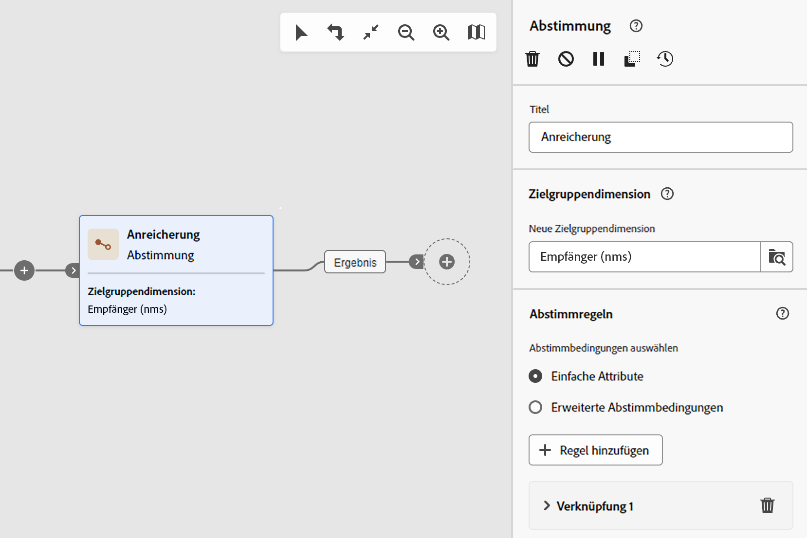

# Schutzmechanismen und Begrenzungen für Workflows {#guardrails-limitations}

Wenn Sie in der Campaign Web-Benutzeroberfläche mit Workflows arbeiten, die in der Campaign-Client-Konsole erstellt oder geändert wurden, gelten die unten aufgeführten Schutzmechanismen und Begrenzungen.

Beachten Sie, dass auf dieser Seite zwar wichtige Aspekte bei der Arbeit mit Workflows in der Konsole und der Web-Benutzeroberfläche aufgeführt werden, jedoch nicht alle möglichen Inkompatibilitäten zwischen den beiden Oberflächen abgedeckt werden.

## Workflow-Aktivitäten {#wkf-activities}

>[!CONTEXTUALHELP]
>id="acw_orchestration_query_enrichment_noneditable"
>title="Aktivität nicht bearbeitbar"
>abstract="Wenn eine **Abfrageaktivität** oder eine **Anreicherungsaktivität** mit zusätzlichen Daten in der Konsole konfiguriert ist, werden die Anreicherungsdaten in Campaign Web berücksichtigt und an die ausgehende Transition übergeben. Sie können jedoch nicht bearbeitet werden."

Workflow-Aktivitäten, die noch nicht in der Campaign Web-Benutzeroberfläche unterstützt werden, sind schreibgeschützt und werden als inkompatible Aktivitäten angezeigt. Sie können weiterhin den Workflow ausführen, Nachrichten senden, die Protokolle überprüfen usw. Workflow-Aktivitäten, die sowohl in der Campaign Web-Benutzeroberfläche als auch in der Campaign-Client-Konsole verfügbar sind, können bearbeitet werden.

| Konsole | Web |
| --- | --- |
| {zoomable=&quot;yes&quot;}{width="800px" align="left" zoomable="yes"} | {zoomable=&quot;yes&quot;}{width="800px" align="left" zoomable="yes"} |

Wenn eine **Abfrageaktivität** oder **Anreicherungsaktivität** mit zusätzlichen Daten in der Konsole konfiguriert ist, werden die Anreicherungsdaten im Campaign Web berücksichtigt und an die ausgehende Transition übergeben. Sie können jedoch nicht bearbeitet werden.

| Konsole | Web |
| --- | --- |
| {zoomable=&quot;yes&quot;}{width="800px" align="left" zoomable="yes"} | {zoomable=&quot;yes&quot;}{width="800px" align="left" zoomable="yes"} |

In der Konsole kann die **Anreicherungsaktivität** sowohl Abstimmungen als auch Anreicherungen durchführen. Wenn Sie in der Konsole Abstimmungseinstellungen in der **Anreicherungsaktivität** definiert haben, wird sie in der Campaign Web-Benutzeroberfläche als **Abstimmungsaktivität** angezeigt.

| Konsole | Web |
| --- | --- |
| {zoomable=&quot;yes&quot;}{width="800px" align="left" zoomable="yes"} | {zoomable=&quot;yes&quot;}{width="800px" align="left" zoomable="yes"} |

## Workflow-Arbeitsfläche {#wkf-canvas}

Beim Erstellen eines neuen Workflows in der Campaign Web-Benutzeroberfläche unterstützt die Arbeitsfläche nur einen Einstiegspunkt. Wenn Sie jedoch in der Konsole einen Workflow mit mehreren Einstiegspunkten erstellt haben, können Sie ihn in der Campaign Web-Benutzeroberfläche öffnen und bearbeiten.

| Konsole | Web |
| --- | --- |
| {zoomable=&quot;yes&quot;}{width="800px" align="left" zoomable="yes"} | {zoomable=&quot;yes&quot;}{width="800px" align="left" zoomable="yes"} |

Die Positionierung der Knoten wird bei jedem Hinzufügen oder Entfernen einer Aktivität aktualisiert. Wenn Sie einen Workflow in der Konsole erstellen, ihn über die Campaign Web-Benutzeroberfläche ändern und dann in der Konsole erneut öffnen, treten möglicherweise kleinere Ungenauigkeiten bei der Positionierung auf. Dies hat keine Auswirkungen auf die Prozesse und Aufgaben des Workflows.

| Anfangs-Workflow | Positionsänderung |
| --- | --- |
| {zoomable=&quot;yes&quot;}{width="800px" align="left" zoomable="yes"} | {zoomable=&quot;yes&quot;}{width="800px" align="left" zoomable="yes"} |
