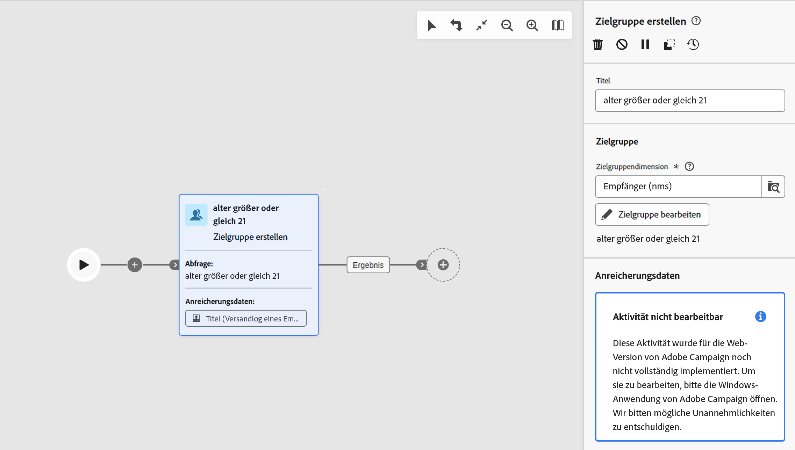

# Schutzmechanismen und Einschränkungen {#guardrails-limitations}

Wenn Sie in der Campaign-Web-Benutzeroberfläche mit Komponenten arbeiten, die in der Campaign-Client-Konsole erstellt oder geändert wurden, gelten die unten aufgeführten Schutzmechanismen und Einschränkungen.

## Workflows {#wf-guardrails-limitations}

### Aktivitäten

Workflow-Aktivitäten, die noch nicht in der Web-Benutzeroberfläche unterstützt werden, sind schreibgeschützt und werden als inkompatible Aktivitäten angezeigt. Sie können weiterhin den Workflow ausführen, Nachrichten senden, die Protokolle überprüfen usw. Workflow-Aktivitäten, die sowohl in der Web-Benutzeroberfläche als auch in der Client-Konsole verfügbar sind, können bearbeitet werden.

| Konsole | Web-Benutzeroberfläche |
| --- | --- |
| {width="800px" align="left" zoomable="yes"} | {width="800px" align="left" zoomable="yes"} |

Workflow-Aktivitätseinstellungen, die noch nicht in der Web-Benutzeroberfläche unterstützt werden, werden nicht angezeigt. Wenn der Workflow jedoch ausgeführt wird, finden diese Einstellungen Anwendung.

| Konsole | Web-Benutzeroberfläche |
| --- | --- |
| {width="800px" align="left" zoomable="yes"} | {width="800px" align="left" zoomable="yes"} |

In der Konsole kann die **Anreicherungsaktivität** sowohl Abstimmungen als auch Anreicherungen durchführen. In der Web-Benutzeroberfläche sind die Abstimmungsfunktionen noch nicht verfügbar. Wenn Sie in der Konsole Abstimmeinstellungen in der **Anreicherungsaktivität** definiert haben, wird sie in der Web-Benutzeroberfläche als nicht kompatible, schreibgeschützte Aktivität angezeigt.

| Konsole | Web-Benutzeroberfläche |
| --- | --- |
| {width="800px" align="left" zoomable="yes"} | {width="800px" align="left" zoomable="yes"} |

### Arbeitsfläche

Beim Erstellen eines neuen Workflows in der Web-Benutzeroberfläche unterstützt die Arbeitsfläche nur einen Einstiegspunkt. Wenn Sie jedoch in der Konsole einen Workflow mit mehreren Einstiegspunkten erstellt haben, können Sie ihn in der Web-Benutzeroberfläche öffnen und bearbeiten.

| Konsole | Web-Benutzeroberfläche |
| --- | --- |
| {width="800px" align="left" zoomable="yes"} | {width="800px" align="left" zoomable="yes"} |

Schleifen sind in der Web-Benutzeroberfläche noch nicht verfügbar. Wenn Sie mithilfe der Konsole einen Workflow mit einer Schleife erstellt haben, können Sie darauf nicht über die Web-Benutzeroberfläche zugreifen. Es wird eine Fehlermeldung angezeigt.

| Konsole | Web-Benutzeroberfläche |
| --- | --- |
| {width="800px" align="left" zoomable="yes"} | {width="800px" align="left" zoomable="yes"} |

Die Positionierung der Knoten wird bei jedem Hinzufügen oder Entfernen einer Aktivität aktualisiert. Wenn Sie einen Workflow in der Konsole erstellen, ihn über die Web-Benutzeroberfläche ändern und in der Konsole erneut öffnen, treten möglicherweise kleinere Ungenauigkeiten bei der Positionierung auf. Dies hat keine Auswirkungen auf die Prozesse und Aufgaben des Workflows.

| Anfangs-Workflow | Positionsänderung |
| --- | --- |
| {width="800px" align="left" zoomable="yes"} | {width="800px" align="left" zoomable="yes"} |

## Vordefinierte Filter {#filters-guardrails-limitations}

>[!CONTEXTUALHELP]
>id="acw_predefined_filter_read_only"
>title="Dieser Filter ist schreibgeschützt"
>abstract="Einige vordefinierte Filter sind in dieser Produktversion nicht in der Benutzeroberfläche verfügbar. Diese Filter sind als schreibgeschützt markiert. Selbst wenn Sie die grafische Darstellung der Abfrage im Regel-Builder nicht anzeigen und den Filter nicht bearbeiten können, können Sie ihn dennoch verwenden und die Filterbedingungen im Abschnitt **Attribute** des Bildschirms sehen."

Bei der Auswahl der Zielgruppe eines Versands oder beim Erstellen einer Zielgruppe in einem Workflow stehen in dieser Produktversion einige vordefinierte Filter nicht in der Benutzeroberfläche zur Verfügung. Diese Filter sind als schreibgeschützt markiert.

Es wird ggf. eine spezifische Fehlermeldung angezeigt.

{width="70%" align="left"}

Selbst wenn Sie die grafische Darstellung der Abfrage im Regel-Builder nicht anzeigen und den Filter nicht bearbeiten können, können Sie ihn dennoch verwenden und die Filterbedingungen im Abschnitt **Attribute** des Bildschirms sehen.

{width="70%" align="left"}

Sie können auch auf die SQL-Abfrage zugreifen, um die genauen Einstellungen zu überprüfen. Klicken Sie dazu auf die Schaltfläche **Code-Ansicht**.

{width="70%" align="left"}

Klicken Sie auf die Schaltfläche **berechnen**, um zu überprüfen, wie viele Elemente den Kriterien des Filters entsprechen.

{width="70%" align="left"}

Verwenden Sie die Schaltfläche **Ergebnisse anzeigen**, um diese Elemente anzuzeigen.

{width="70%" align="left"}

Beachten Sie, dass beim Erstellen eines Filters in der Web-Oberfläche und bei dessen Änderung in der Konsole mit nicht unterstützten Attributen die grafische Darstellung nicht mehr in der Web-Benutzeroberfläche verfügbar ist. In jedem Fall können Sie den Filter weiterhin verwenden.

Nicht unterstützte Attribute sind unten aufgeführt.

### Nicht unterstützte Datentypen {#unsupported-data-type}

Die folgenden in der Client-Konsole verfügbaren Datentypen werden beim Anzeigen eines Filters oder einer Regel in der Web-Benutzeroberfläche nicht unterstützt:

* datetime
* time
* timespan
* double
* float

### Nicht unterstützte Filterfunktionen {#unsupported-filtering-capabilities}

Wenn ein Filter mit komplexen Ausdrücken und Funktionen in der Client-Konsole erstellt wurde, kann er nicht in der Web-Benutzeroberfläche bearbeitet werden.

Darüber hinaus werden die folgenden Operatoren nicht unterstützt:

* Numerischer Typ
   * ist enthalten in
   * nicht in

* Zeichenfolgetyp
   * größer als
   * kleiner als
   * größer oder gleich
   * kleiner oder gleich
   * ist wie
   * ist nicht wie

* Datentyp
   * später als
   * früher als
   * nicht gleich
   * ist leer
   * ist nicht leer
   * ist enthalten in
   * ist nicht enthalten in
   * letzte

* 1:n-Links
   * COUNT, SUM, AVG, MIN, MAX
